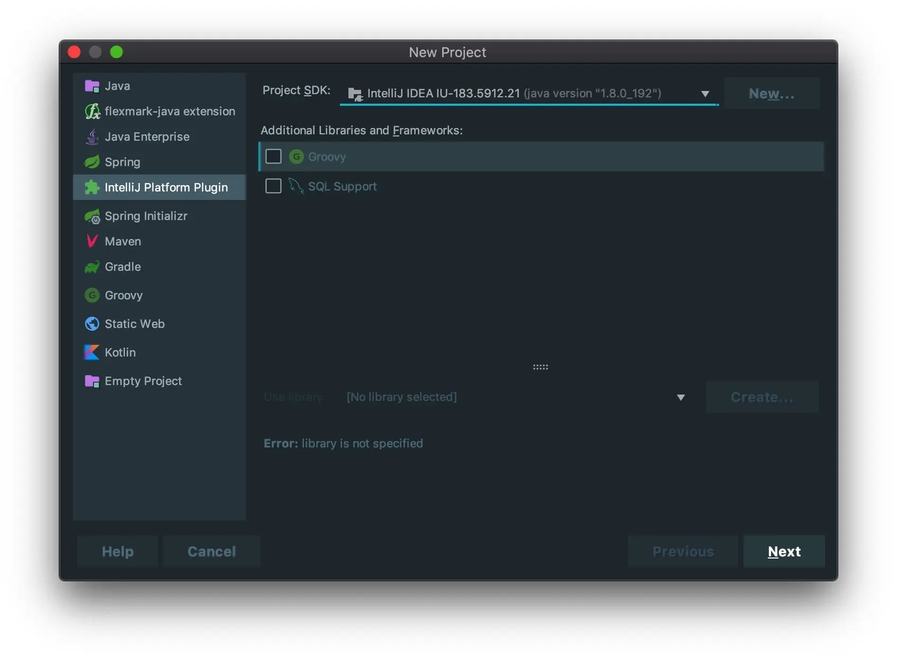
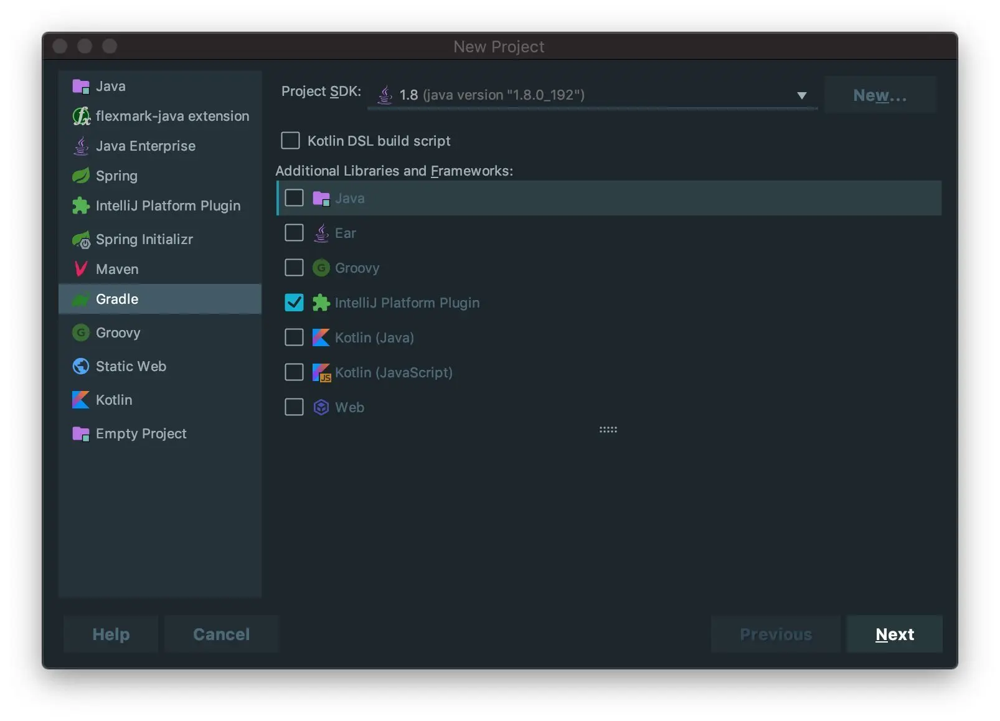
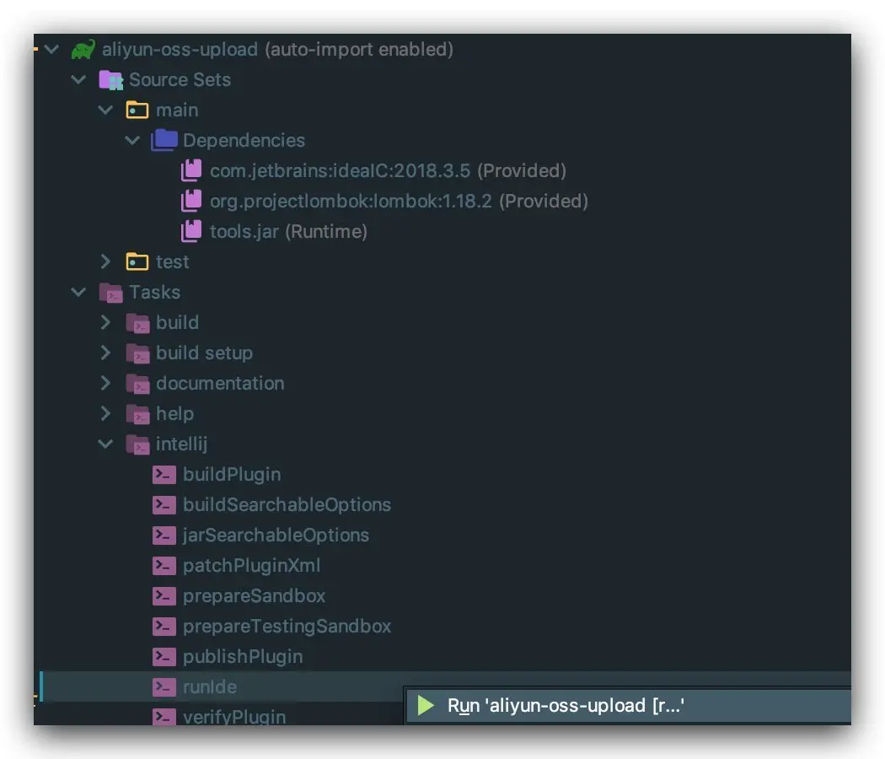
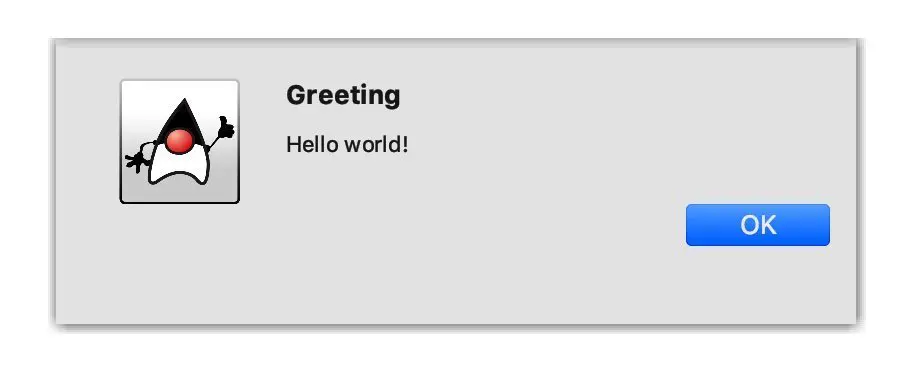

使用官方推荐的 Gradle 插件开发

这是 IDEA 插件开发第一篇, 整个系列记录了开发 `aliyun-oss-upload` 的整个细节, 将会把遇到的问题整理成文, 最终发布在 `idea-plugin-dev` 中.

## 前言

IDEA 插件开发分为 2 种方式:

1. 直接使用 IDEA 提供的 `IntelliJ Platform Plugin`

2. 使用 Gradle



官方推荐使用 Gradle 方式, 因此选用第二种方式.

因为未使用过 Gradle, 肯定会遇到很多坑, 为了减少大家爬坑的时间, 我会尽量把注释写详细点, 如果发现错误的地方, 请告知我.

## 配置

使用 Gradle 创建好插件项目后, 直接拷贝以下配置到 `build.gradle`

```java
// mavenCentral() 是一个插件仓库, 导入的插件将会在仓库中寻找并下载
buildscript {
    repositories {
        mavenCentral()
        maven { url "http://maven.aliyun.com/nexus/content/groups/public/" }
        maven { url "https://oss.sonatype.org/content/repositories/snapshots/" }
        maven { url 'http://dl.bintray.com/jetbrains/intellij-plugin-service' }
    }
}

plugins {
    id 'org.jetbrains.intellij' version '0.4.4'
}

repositories {
    mavenCentral()
}

tasks.withType(JavaCompile) {
    options.encoding = "UTF-8"
}

// 导入插件
// 1. 编译, 测试插件 (Java, Groovy,Scala, War 等)
// 2. 代码分析插件 (Checkstyle, FindBugs, Sonar 等)
// 3. IDE 插件 (Eclipse, IDEA 等)
// Java 是 Gradle 的核心插件, 是内置的, 内置插件不需要配置依赖路径
apply plugin: 'java'
apply plugin: 'idea'
apply plugin: 'org.jetbrains.intellij'

sourceCompatibility = 1.8

intellij {
    version '2018.3.5'
    sandboxDirectory = project.rootDir.canonicalPath + "/.sandbox" // 插件生成的临时文件的地址，可以省略
}

// 声明依赖使用下面的闭包
dependencies {
    // 解决 gradle 使用 lombok 的问题
    annotationProcessor 'org.projectlombok:lombok:1.18.2'
    compileOnly 'org.projectlombok:lombok:1.18.2'
    testAnnotationProcessor 'org.projectlombok:lombok:1.18.2'
    testCompileOnly 'org.projectlombok:lombok:1.18.2'
    // 单元测试
    testCompile group: 'junit', name: 'junit' , version: '4.12'
}
```

**坑 1:**

`lombok` 用习惯了, 因此这里也使用了.
但是有个坑, 必须按照上面的方式依赖 `lombok`, 不然会报找不到符号的错误, 还有第二种配置方式:

```java
repositories {
    mavenCentral()
}

plugins {
    id 'net.ltgt.apt' version '0.10'
}

dependencies {
    compileOnly 'org.projectlombok:lombok:1.18.2'
    apt "org.projectlombok:lombok:1.18.2"
}
```

选择其中一种即可.

**坑 2:**

习惯在项目中使用日志代替 `System.out.println();` 打印日志, 因此考虑在此项目使用 `slf4j2 + log4j2` 日志框架, 但是却失败了.

添加 `slf4j2 + log4j2` 依赖

```java
compile group: 'org.apache.logging.log4j', name: 'log4j-slf4j-impl', version: '2.11.0'
compile group: 'org.apache.logging.log4j', name: 'log4j-core', version: '2.11.0'
compile group: 'com.lmax', name: 'disruptor', version: '3.4.2'
```

错误信息:

```txt
SLF4J: No SLF4J providers were found.
SLF4J: Defaulting to no-operation (NOP) logger implementation
SLF4J: See http://www.slf4j.org/codes.html#noProviders for further details.
SLF4J: Class path contains SLF4J bindings targeting slf4j-api versions prior to 1.8.
```

这是由于 `slf4j-api` 1.8.x 的绑定机制的变化导致, 意思就是版本太高了, 这里修改为 1.7.x 版本可以消除这个错误. 联系一下 gradle 怎么排除依赖

```java
compile (group: 'org.apache.logging.log4j', name: 'log4j-slf4j-impl', version: '2.11.0') {
    // 排除高版本依赖
    exclude group: 'org.slf4j', module: 'slf4j-api'
}
// 使用低版本
compile group: 'org.slf4j', name: 'slf4j-api', version: '1.7.25'
```

还没解决完:

```
SLF4J: Class path contains multiple SLF4J bindings.
SLF4J: Found binding in [jar:file:/Users/dong4j/Develop/codes/idea-plugin/aliyun-oss-upload/.sandbox/plugins/aliyun-oss-upload/lib/log4j-slf4j-impl-2.11.0.jar!/org/slf4j/impl/StaticLoggerBinder.class]
SLF4J: Found binding in [jar:file:/Users/dong4j/.gradle/caches/modules-2/files-2.1/com.jetbrains.intellij.idea/ideaIC/2018.3.5/2465ddbc4af3619128cada78e216ffbb93e8b173/ideaIC-2018.3.5/lib/slf4j-log4j12-1.7.25.jar!/org/slf4j/impl/StaticLoggerBinder.class]
SLF4J: See http://www.slf4j.org/codes.html#multiple_bindings for an explanation.
```

原来 IntelliJ IDEA SDK 已经有了 `slf4j-log4j12`, 因此我们可以不用配置了....😂 (搞半天, 是自己给自己挖坑).

因此最终的配置就是最上面给出的那种, 如果对 gradle 不熟, 又想快速上手的, 直接复制就可以了, 先不去折腾 gradle 的配置了, 不然开发 idea
插件的热情就会在不断的填坑过程中慢慢散去....

**下载 intellij SDK 很慢, 准备好梯子吧**

## Hello world

```
人之初, 性本善;
写代码, hello world.
```

### AnAction

`AnAction` 是什么先不管, 不就把它理解成 JavaScript 里面的 `onclick` 事件处理吧

```java
@Slf4j
public class HelloAction extends AnAction {
    public HelloAction() {
        super("Hello");
    }

    /**
     * 响应用户的点击事件
     *
     * @param event the event
     */
    @Override
    public void actionPerformed(@NotNull AnActionEvent event) {
        log.info(event.toString());
        Project project = event.getProject();
        Messages.showMessageDialog(project,
                                   "Hello world!",
                                   "Greeting",
                                   Messages.getInformationIcon());
    }
}
```

再来一个

```java
public class AliyunOssUpload extends AnAction {

    @Override
    public void actionPerformed(@NotNull AnActionEvent actionEvent) {
        // 获取当前在操作的工程上下文
        Project project1 = actionEvent.getProject();
        // 获取当前操作的类文件
        PsiFile psiFile = actionEvent.getData(CommonDataKeys.PSI_FILE);
        // 获取当前类文件路径
        String classPath = "";
        if (psiFile != null) {
            classPath = psiFile.getVirtualFile().getPath();
        }
        String title = "hello world";

        // 显示对话框
        Messages.showMessageDialog(project1, classPath, title, Messages.getInformationIcon());
    }
}
```

### 注册

在 `plugin.xml` 中注册上面的类, 启动后会通过反射来调用我们的处理逻辑.

```xml
<idea-plugin>
    <!-- 插件基本信息 -->
    <id>info.dong4j.aliyun-oss-upload</id>
    <name>Aliyun OSS upload</name>
    <version>0.0.1</version>
    <vendor email="dong4j@gmail.com" url="http://www.dong4j.info">dong4j</vendor>

    <depends>com.intellij.modules.lang</depends>
    <description>
        Aliyun OSS upload, xxxxxxxxxxxxxxxxxxxxxxxxxxxxxxxxxxxxxxxxxxxxxxxxxx
    </description>

    <!-- please see http://www.jetbrains.org/intellij/sdk/docs/basics/getting_started/plugin_compatibility.html
         on how to target different products -->
    <!-- uncomment to enable plugin in all products
    <depends>com.intellij.modules.lang</depends>
    -->

    <!-- 插件扩展标签 -->
    <extensions defaultExtensionNs="com.intellij">
        <!-- Add your extensions here -->
        <applicationService serviceInterface="info.dong4j.test.HelloApplicationText"
                            serviceImplementation="info.dong4j.test.impl.HelloApplicationTextImpl"/>
    </extensions>

    <!-- action 注册标签 -->
    <actions>
        <!-- 创建一个新的 group, 也可以添加到已有的 group 上 -->
        <group id="MyPlugin.SampleMenu" text="Greeting" description="Greeting menu">
            <!-- 添加到 MainMenu group 下, 位置为 `last` -->
            <add-to-group group-id="MainMenu" anchor="last"/>
            <!-- id 唯一, class 就是我们的处理类 -->
            <action id="Myplugin.Textboxes" class="info.dong4j.test.HelloAction" text="Hello"  description="Says hello" />
        </group>
        <!-- 另一个 action -->
        <action id="info.dong4j.aliyun-oss-upload" class="info.dong4j.test.AliyunOssUpload" text="upload aliyun oss"
                description="上传文件到 aliyun OSS">
            <!-- 添加到 GenerateGroup group 下, 位置为 `last` -->
            <add-to-group group-id="GenerateGroup" anchor="last"/>
        </action>
    </actions>
</idea-plugin>
```

### 运行



### 效果


点击 'Hello' 之后:



## 总结

入门很快, 因此写得不是非常详细, 因为入门相关的教程已经非常多了,
可参见 [👉 官方入门教程](https://www.jetbrains.org/intellij/sdk/docs/basics/getting_started.html).

还有很多手把手教的入门教程, 一搜一大把, 因此此系列文章只会记录开发过程中遇到的问题和经验总结.

为了大家快速入手, 这里给出此项目的 [👉 github 地址](), 愿有缘人赶紧入坑, 一起来学习开发 idea 插件.

告诉你一个好消息, Intellij idea 开启了一个插件收费平台, 来让更多的插件开发中从中获利.


详情可见 [👉 Marketplace](https://plugins.jetbrains.com/marketplace)

此篇文档涉及到的全部代码请看 [👉 Github](https://github.com/dong4j/aliyun-oss-upload/tree/1.hello-world). 给个 star 呗.
