介绍 IDEA Plugin 开发入口

接下的文档都会根据前一篇的需求来找到解决方案, 对于不熟悉 IDEA 插件开发的同学 (说的就是我), 可能一时找不到各个公共的入口, 这个是否就要看一些开源的插件,
从中找到功能入口.

## 右键菜单入口

需求中提到 **「在编辑视图中直接右键 --> `upload to Aliyun OSS`」**

因此我们需要扩展右键菜单, 来添加我们自己的功能入口.

现在介绍一种新的添加 AnAction 的方式:

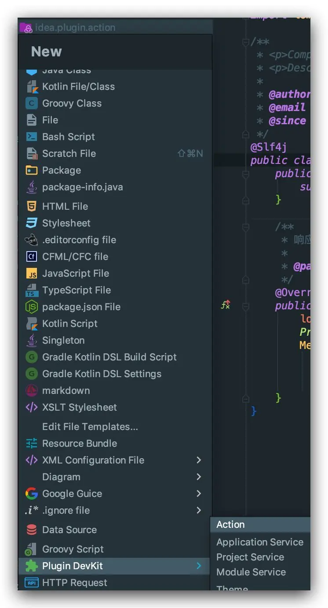
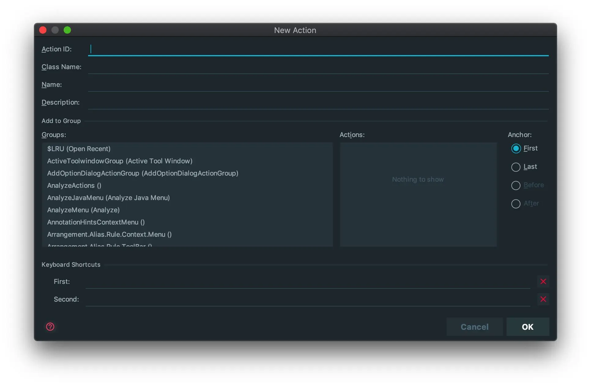
这么多 Group. 好了, 懵逼了....

那么我们怎么来找我们需要的 Group 呢?
我这里用个笨办法, 看别人的插件配置呗, 这里通过看 `Alibaba Java Coding Guidelines` 这个插件的配置, 可以确定的有:

**MainToolBar**

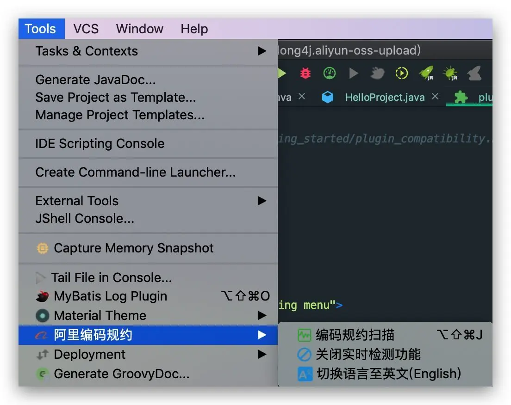

**ProjectViewPopupMenu**

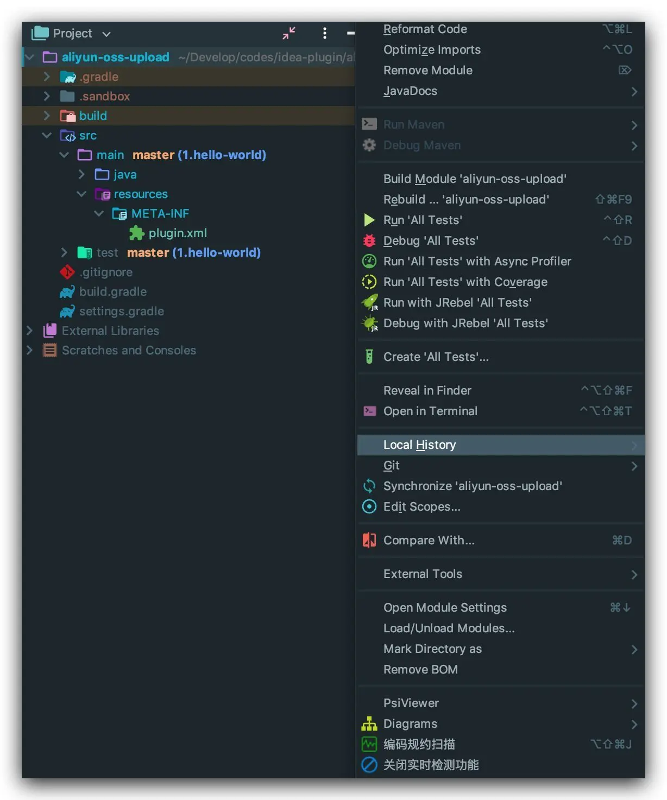

**ChangesViewPopupMenu**

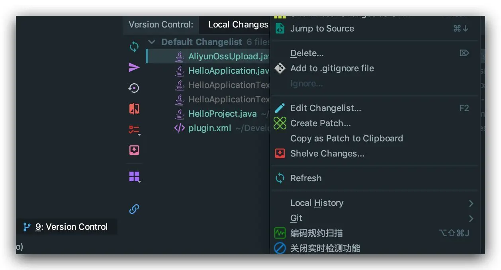

**EditorPopupMenu**

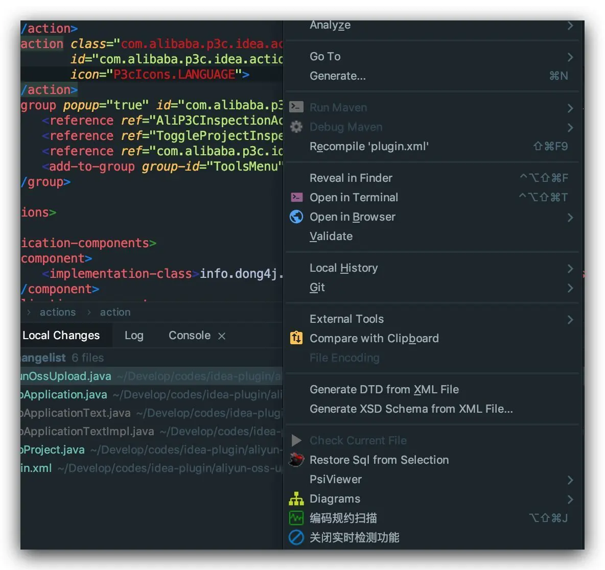

先来第一个, 在编辑器右键菜单中添加我们的 action, 很明显是用 `EditorPopupMenu`

```xml
<action id="info.dong4j.aliyun-oss-upload" class="info.dong4j.test.AliyunOssUpload" text="upload aliyun oss"
        description="上传文件到 aliyun OSS">
    <add-to-group group-id="GenerateGroup" anchor="last"/>
</action>

<action id="AliObjectStorageServiceAction" class="info.dong4j.idea.plugin.action.AliObjectStorageServiceAction"
        popup="true" text="upload to Aliyun OSS">
    <add-to-group group-id="MainToolBar" anchor="last"/>
    <add-to-group group-id="ProjectViewPopupMenu" anchor="last"/>
    <add-to-group group-id="ChangesViewPopupMenu" anchor="last"/>
    <add-to-group group-id="EditorPopupMenu" anchor="last"/>
</action>

<group popup="true" id="com.alibaba.p3c.analytics.action_group" text="Aliyun OSS">
    <reference ref="AliObjectStorageServiceAction"/>
    <add-to-group group-id="ToolsMenu" anchor="last"/>
</group>
```

不出意外的话:

**MainToolBar**

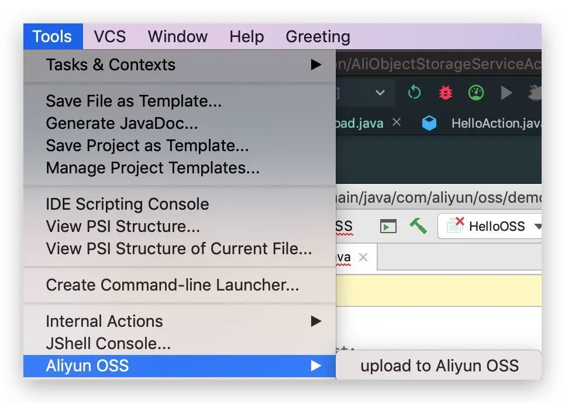

**ProjectViewPopupMenu**

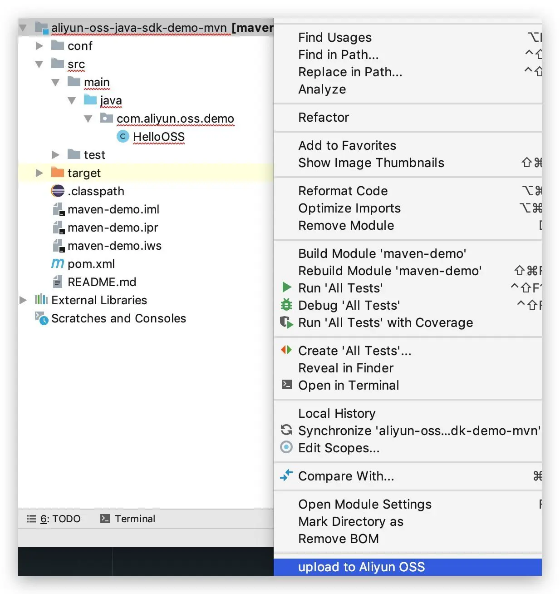
**ChangesViewPopupMenu**

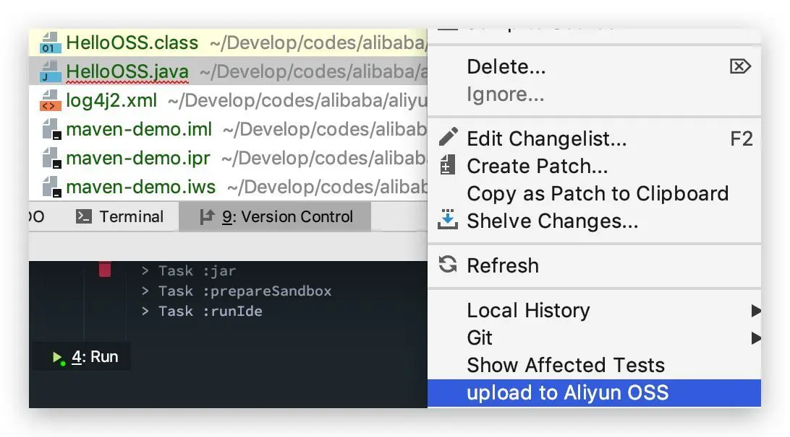

**EditorPopupMenu**

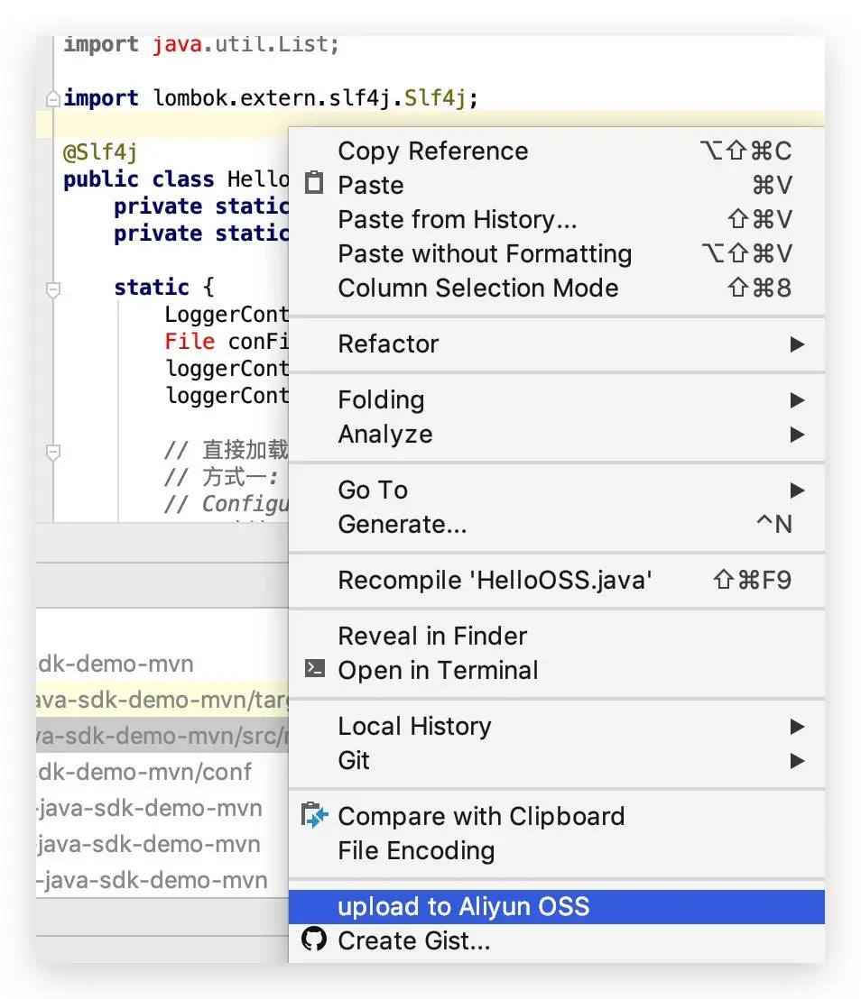

## 功能实现

由于需求实现不是本教程的重点, 所以会选取插件开发有关的问题作出说明.

### 怎么判断选中的对象是 Markdown 文件

首先我们得知道当前光标选中的是什么东西

```java
// 获取当前操作的文件
PsiFile psiFile = anActionEvent.getData(CommonDataKeys.PSI_FILE);
if (psiFile != null) {
    log.info("language = {}", psiFile.getOriginalFile().getLanguage());
    log.info("name = {}", psiFile.getOriginalFile().getName());
    Messages.showMessageDialog(project, psiFile.getFileType().getName(), "File Type", null);
}
// 获取当前事件触发时，光标所在的元素
PsiElement psiElement = anActionEvent.getData(LangDataKeys.PSI_ELEMENT);
// 如果光标选择的不是类，弹出对话框提醒
if (psiElement == null || !(psiElement instanceof PsiClass)) {
    Messages.showMessageDialog(project, "Please focus on a class", "Generate Failed", null);
    return;
}
```

```
2019-03-12 18:16:00,899 [44799]   INFO - .AliObjectStorageServiceAction - language = Language: JAVA
2019-03-12 18:16:00,899 [44799]   INFO - .AliObjectStorageServiceAction - name = HelloOSS.java
2019-03-12 18:16:10,423 [54323]   INFO - .AliObjectStorageServiceAction - project's base path = /Users/dong4j/Develop/codes/alibaba/aliyun-oss-java-sdk-demo-mvn
2019-03-12 18:16:14,372 [58272]   INFO - .AliObjectStorageServiceAction - language = Language: TEXT
2019-03-12 18:16:14,372 [58272]   INFO - .AliObjectStorageServiceAction - name = maven-demo.iml
2019-03-12 18:18:06,392 [170292]   INFO - .AliObjectStorageServiceAction - language = Language: TEXT
2019-03-12 18:18:06,392 [170292]   INFO - .AliObjectStorageServiceAction - name = 3-2-data-grip.md
2019-03-12 18:18:08,586 [172486]   INFO - .AliObjectStorageServiceAction - project's base path = /Users/dong4j/Develop/knowledge
```

psiFile 还有其他的一些属性, 这个就 debug 看吧.

从上面我们知道了, 如果是 `Markdown` 文件, Language 为 TEXT, name 是文件名.
如果是类文件, 则是 JAVA. 可以使用 `PsiJavaFile` 来操作.

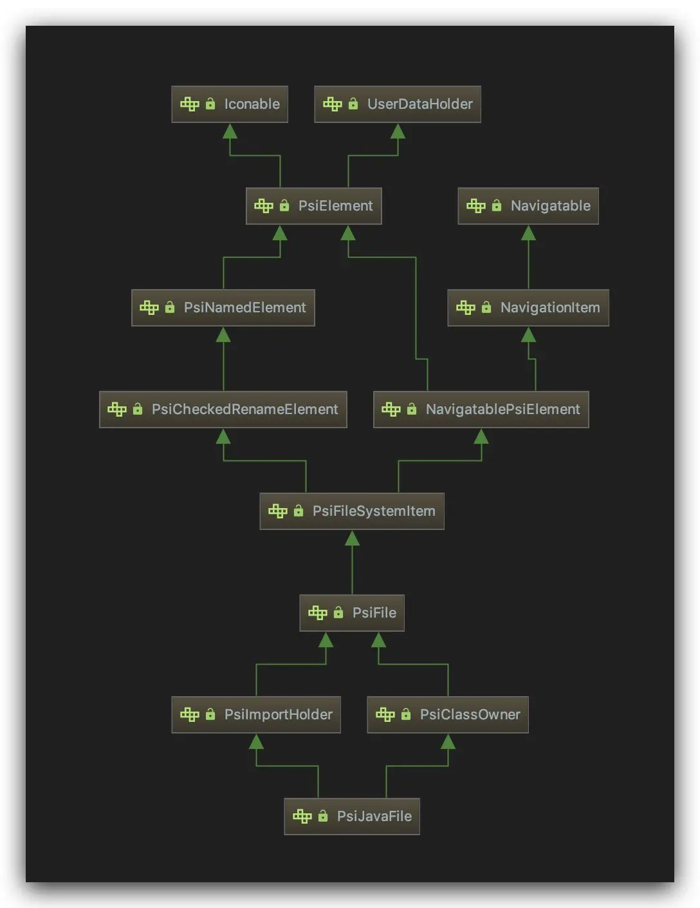

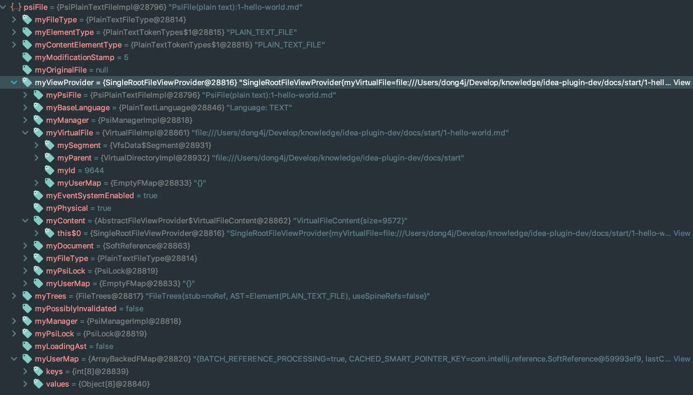

### 获取 Markdown 文件的所有内容

```java
String text = Objects.requireNonNull(psiFile.getViewProvider().getDocument()).getText();
```

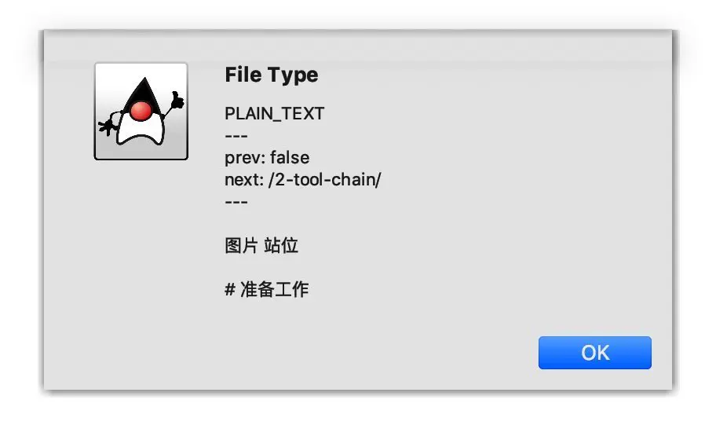

## update

[👉 判断按钮什么时候可用](https://github.com/dong4j/aliyun-oss-upload/tree/2.update)
