看到群里有朋友出现了下面的错误, 我也出现了

```
com.alibaba.dubbo.rpc.RpcException: Forbid consumer 192.168.1.89 access service com.alibaba.dubbo.monitor.MonitorService from registry zkserver:2181 use dubbo version 2.5.3, Please check registry access list (whitelist/blacklist).
```

在出现上面的错误时, 都会打印下面一段信息

```
INFO  [com.alibaba.dubbo.monitor.dubbo.DubboMonitor] -  [DUBBO] Send statistics to monitor zookeeper://zkserver:2181/com.alibaba.dubbo.monitor.MonitorService?dubbo=2.5.3&interface=com.alibaba.dubbo.monitor.MonitorService&pid=43821&timestamp=1504769453531, dubbo version: 2.5.3, current host: 192.168.1.89
```

消费者向提供者发送统计数据时, 由于注册中心里面找不到那个提供者的信息, 抛出了最上面的错误.

`MonitorService`, 一看就知道是跟 dubbo monitor 有关.

查看 `dubb-admin`, 也可以看到, `MonitorService` 没有提供者

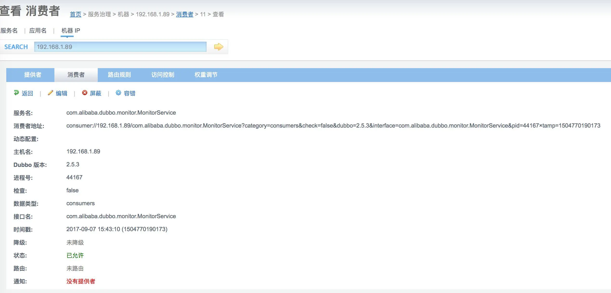

最后查看 readme.md, 看见 zheng 使用了 `Dubbo-monitor`
`dubbo-monitor` 跟 `dubbo-admin` 一样, 需要我们自己部属

## dubbo-monitor 部属

这里使用 [韩都衣舍](http://git.oschina.net/handu/dubbo-monitor) 的 `Dubbo Monitor for Relational Database`

不为别的, 就因为 `dubbo-monitor-simple` 太丑了 😂

官方的 readme.md 说得已经很清楚了, 照着来就是了

部属成功后 访问 `http://127.0.0.1:9527/dubbo-monitor/`

最后的效果如下:

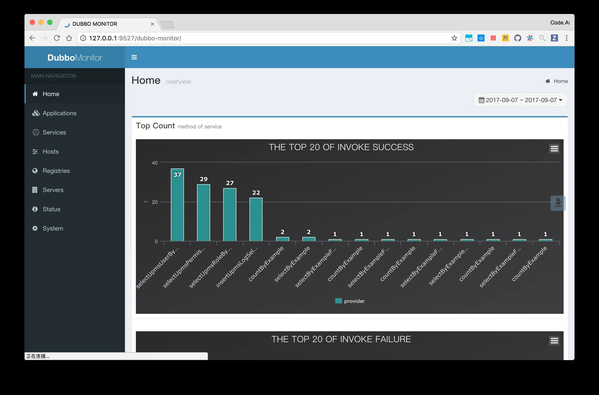
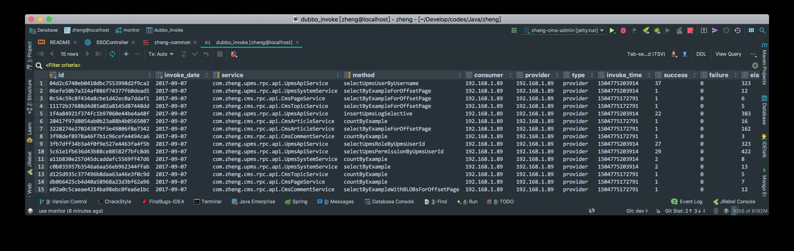
然后就不会报错了

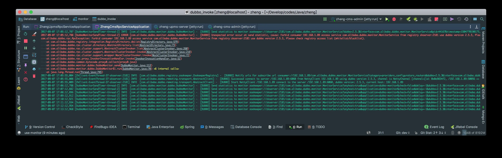
红色部分不未部署之前, 后面可以看到, 发送统计数据后没有报错了

**另一种解决方案**

在 dubbo.xml 中配置了 monitor 才会发送统计数据

所以删除所有 `<dubbo:monitor protocol="registry"/>` 不使用 monitor 即可

## dubbo-admin 部署

和 dubbo-monitor 一样 😄

## 项目部署

本人工作中使用的 Maven 环境跟 zheng 不一样, 为了方便, 这里写了个脚本, 可以切换不同的 Maven 配置

```bash
change(){
  file_name='settings.xml.'$1
  is_exist="$(find ~/.m2 -name $file_name)"
  if [$is_exist]
  then
    mv ~/.m2/settings.xml ~/.m2/settings.xml.$2;
    mv ~/.m2/$file_name ~/.m2/settings.xml
  fi
  echo "change " $1 'to ' $2
}
```

### 环境搭建

这里使用 Vagrant 来搭建环境, 一是不想把自己本地的环境搞乱, 二是方便, 环境搭建好之后, 打包一个 package, 到哪儿都能用.

Vagrant 里面的依赖都已经安装好了, 配置一下就 ok 了.

Vagrant 的 ip 地址为 `2.2.2.2`

**zheng 是需要修改 hosts 的, 很多朋友没有看完文档就开始搞, 导致项目运行不起来.**

#### Redis

1. 允许远程访问
   这里为了方便查看 redis , 这里设置为允许远程访问

   ```
   # 修改以下配置:
   # 1. 注释 bind 127.0.0.1
   # 2. protected-mode 由 yes --> no
   ```

2. 修改密码
   我这里修改了 Redis 的密码, 默认是为空的

   ```
   requirepass 123456
   ```

Redis 远程连接成功

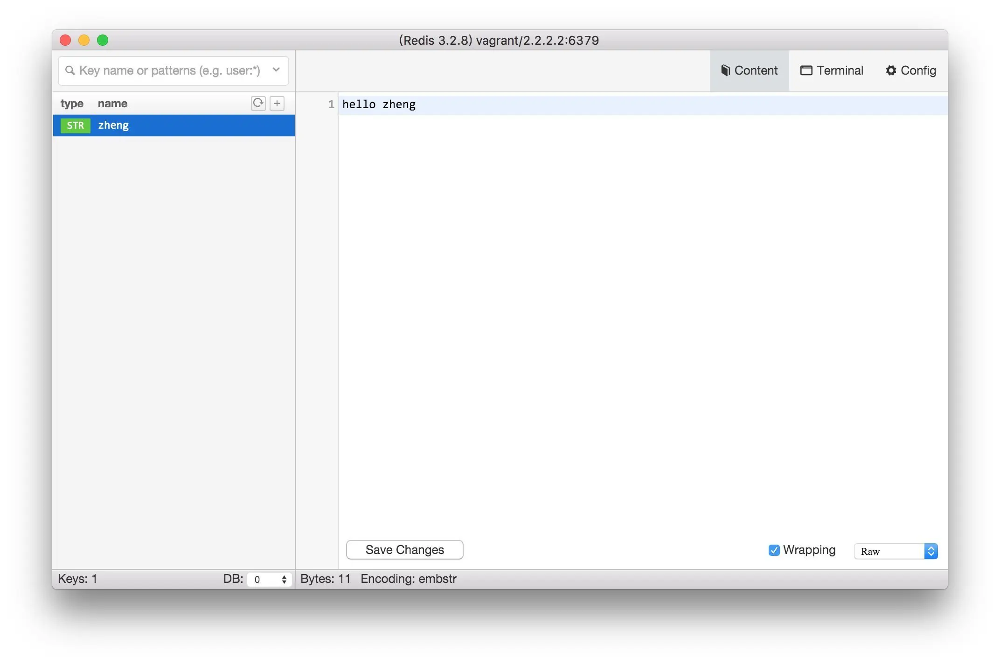

#### Nginx

来一份简单实用的 nginx.conf 配置

```nginx
worker_processes  1;
events {
    worker_connections  1024;
}
http {
    include       mime.types;
    default_type  application/octet-stream;
    sendfile        on;
    keepalive_timeout  65;

    server {
        listen  80;
        server_name  localhost;
        location / {
            root   /zheng/zheng-cms-web/;
            index  index.html index.htm;
            add_header Access-Control-Allow-Origin *;
        }
    }
}
```

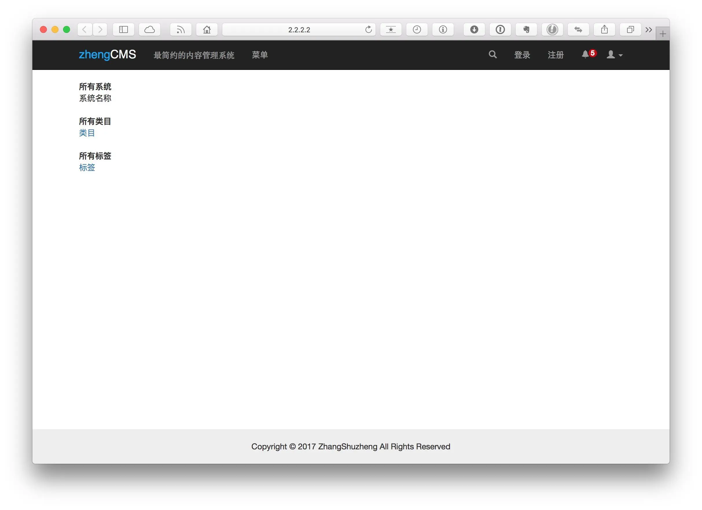

```
# 修改了 nginx.conf 后, 重新加载配置文件
nginx -s reload
# 停止 nginx
nginx -s stop
# 检查配置文件
nginx -t
```

##### IDEA 配置服务器, 直接上传文件

让你体会一下什么是 **沉浸式 IDE**

配置 Deployment

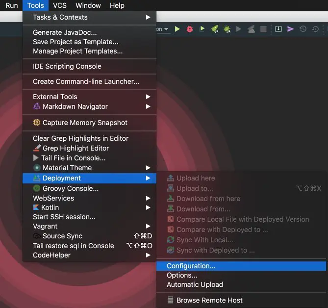

1. 配置服务器
   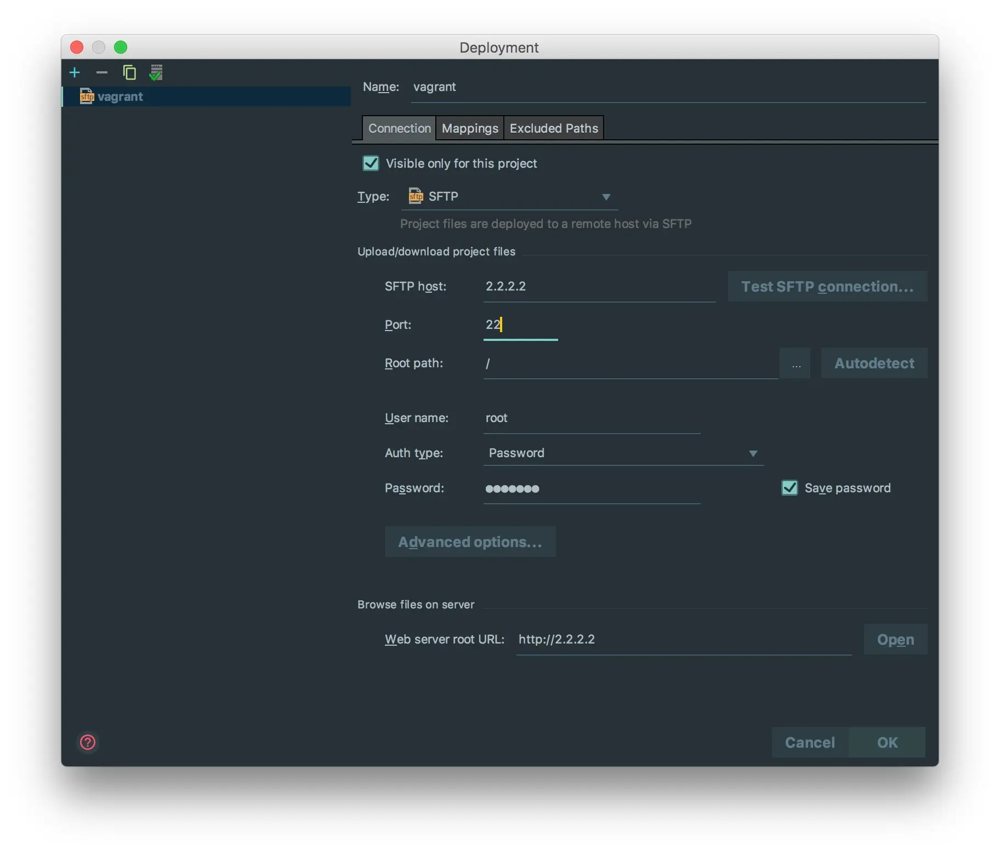

2. 配置本地目录与服务器目录映射关系
   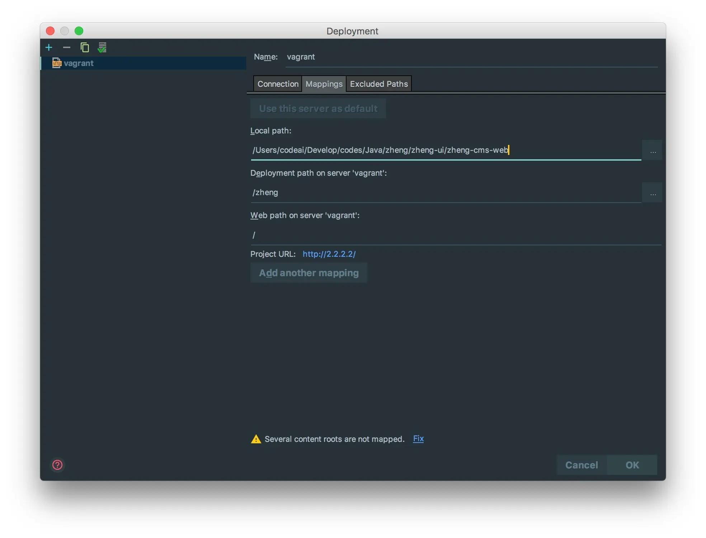

3. 完成配置
   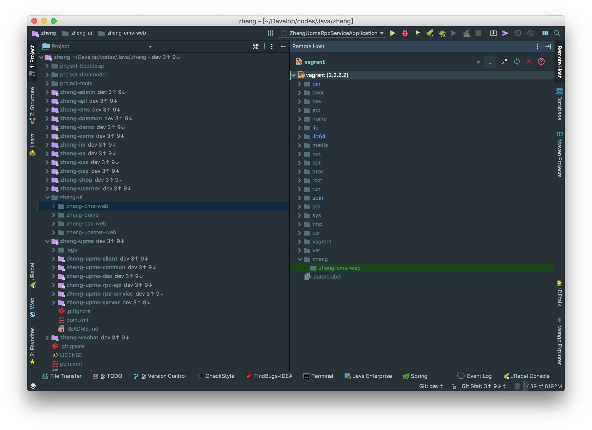

4. 上传本地文件到服务器

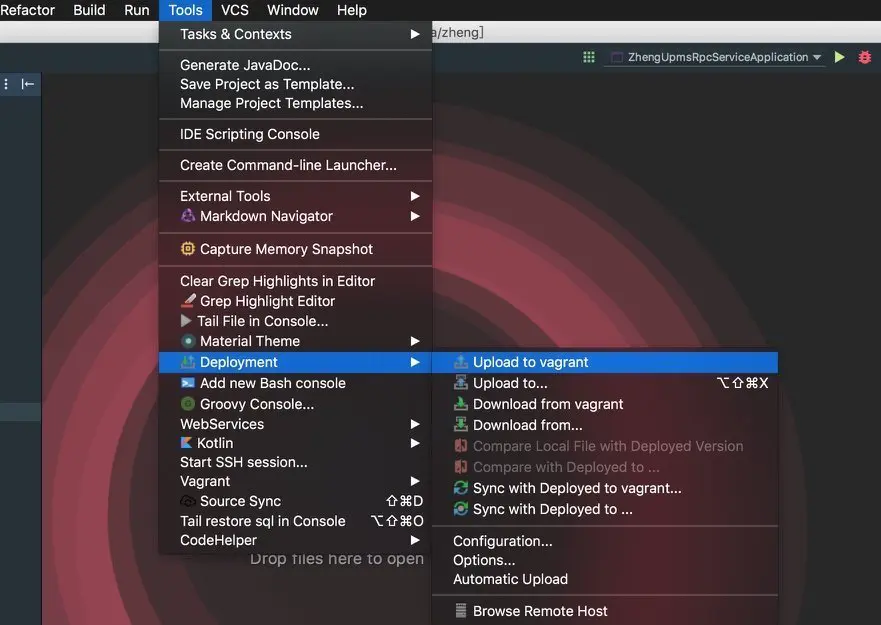

5. 哦了
   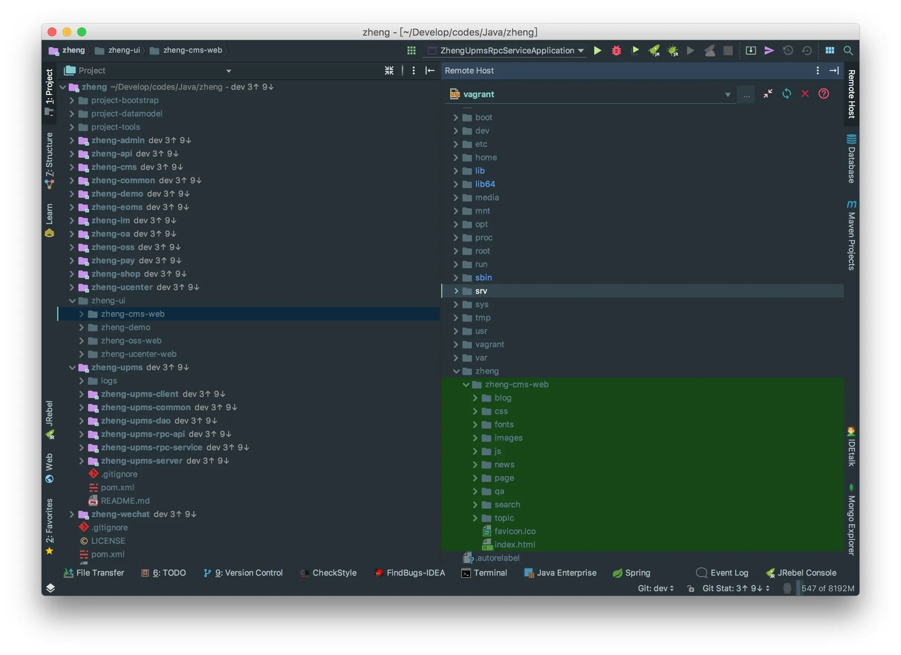

修改了 html, upload, 刷新, so easy
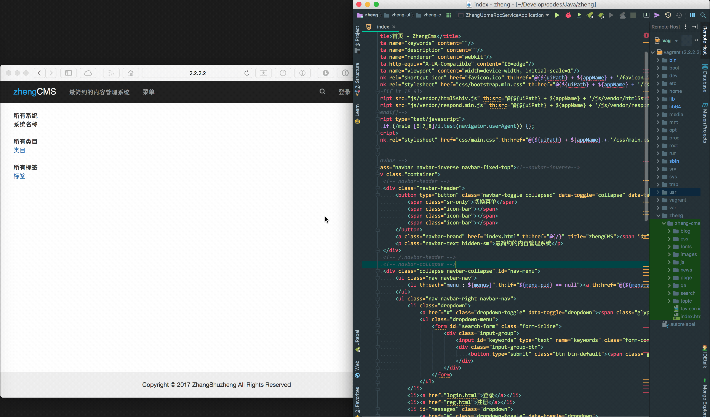

#### Zookeeper

Zookeeper 使用默认配置就可以了, 三种配置方式

1. 单机
2. 伪集群
3. 真集群

这里就不说了, 我使用单机配置, 简单

```
# 心跳检测毫秒数
tickTime=2000
# follower 初始化连接最长忍受的心跳数时间间隔 2000*10=20 秒
initLimit=10
# leader 和 follower 之间发送消息请求和应答时间长度 5*2000=10 秒
syncLimit=5
# 数据持久化的目录
dataDir=~/Develop/logs/zookeeper/data
# 日志
dataLogDir=~/Develop/logs/zookeeper/log
# 向 client 暴露的端口
clientPort=2181

# 最大客户端连接数
# maxClientCnxns=60
# 快照个数
# autopurge.snapRetainCount=3
# 快照保存时间间隔小时
#autopurge.purgeInterval=1
```

下个插件 zookeeper, 能看到 zookeeper 的节点信息

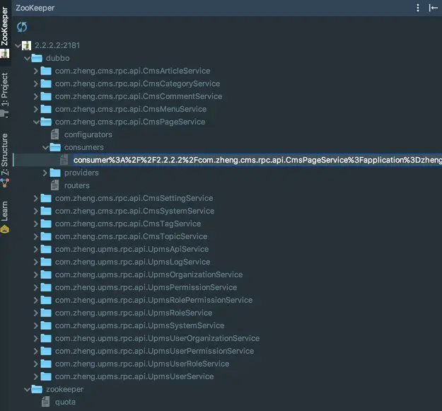

#### ActiveMQ

默认配置

略... 😂😂

#### Tomcat

这里只要一台服务器, 所有就搞个单机多实例的配置, 这里要修改 Tomcat 配置,
让一台服务器上跑 2 个 Tomcat, 不为别的, 以为我就一台虚拟机, 意思一下就可以了 😂😂

将解压后的 Tomcat 复制一份
修改 **每个 tomcat 实例中 server.xml 中的端口**

```
<?xml version="1.0" encoding="UTF-8"?>
<Server port="9005" shutdown="SHUTDOWN">
  ....
  <Service name="Catalina">
    <Connector port="1111" protocol="HTTP/1.1"
               connectionTimeout="20000"
               redirectPort="9443" />
    <Connector port="9009" protocol="AJP/1.3" redirectPort="9443" />
    ...
  </Service>
</Server>
```

2 个 server.xml 只要不一样就行了, 只要确保修改的端口没有被其他程序占用就可以了.

然后一个一个启动吧, 如果嫌麻烦, 也可以写脚本一键启动

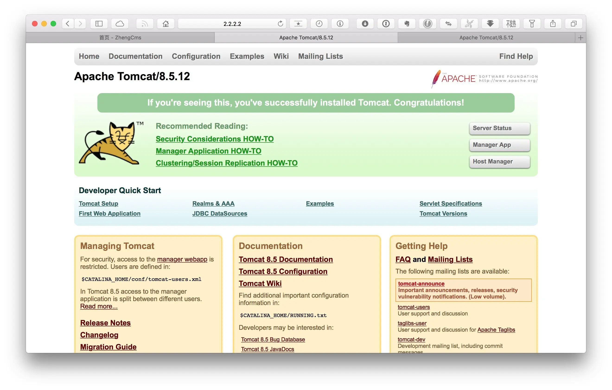

一个 1111, 另一个 2222

一般都是先把 war 上传到临时目录下, 然后再移动到 webapp 下, 不要在 tomcat 正在运行的时候把 war 直接上传到 webapp 下, 因为一旦上传开始, webapp
下就会有出现 war, 然后 tomcat 就开始解压了, 但是这个 war 并不完整, 会出错的

也可以使用上面的方式, 同步本地文件到服务器, 只限于开发, 生产环境你不一定有账号, 二是谁让你没事一直连着生产服务器的?

#### 启动依赖软件

写一个简单的脚本, 一键启动所有依赖

```bash
#!/bin/bash
export JAVA_HOME=/usr/local/java
export PATH=$JAVA_HOME/bin:$PATH
# zookeeper
nohup /usr/local/kafka/bin/zookeeper-server-start.sh /usr/local/kafka/config/zookeeper.properties &
echo "zookeeper 启动完成"
# redis
nohup /usr/local/redis/src/redis-server /usr/local/redis/redis.conf &
echo "redis 启动完成"
# nginx
/usr/local/nginx/sbin/nginx
echo "nginx 启动完成"
# ActiveMQ
/usr/local/activemq/bin/activemq start
echo "activemq 启动完成"
```

tomcat 就手动启动吧, 敲敲命名也是好的

😂😂

### 打包

先修改配置文件

由于 Vagrant 里面没有安装 MySQL, 我就连接本地的了, 一般数据库都是单独的服务器, 正好模拟一下

**2017-09-14 11:59 dong4j 更新**

这里吐槽一下, 很多配置是写死的, 比如说 dubbo 里面的 zookeeper 注册地址, 没有写到配置文件中去,
所以这里还是改回使用 hosts 的方式.

只修改了 mysql 的地址, 其他的按照原文档修改 hosts

使用 Maven 打包

```
mvn clean package -Pprod
```

### 上传

将 4 个包上传到服务器

```
scp zheng-cms-rpc-service-assembly.tar.gz root@2.2.2.2:/zheng/upload/
```

```
# 内容管理系统, 通过 ZhengUpmsRpcServiceApplication.main 方法启动服务提供者
zheng-upms-rpc-service-assembly.tar.gz
# 内容管理系统, 使用 jar 包的方式启动, 通过 ZhengCmsRpcServiceApplication 方法启动服务提供者
zheng-cms-rpc-service-assembly.tar.gz
# 用户权限系统及 SSO 服务端 [端口:1111] 消费端 部属到 tomcat1 1111
zheng-upms-server.war
# 后台管理 [端口:2222] 消费端 部属到 tomcat2 2222
zheng-cms-admin.war
```

### 启动

#### 提供者

先解压 2 个包

```
zheng-cms-rpc-service-assembly.tar.gz
zheng-upms-rpc-service-assembly.tar.gz
```

```
tar -zxvf *.tar.gz
```

分别启动 `zheng-upms-rpc-service` 和 `zheng-cms-rpc-service`

使用对应目录下的 `bin/start.sh` 脚本

#### 消费者

删除 tomcat1[2]/webapps/ROOT 里的所有文件, 将 war 包分别拷入到 tomcat1 和 tomcat2 下的 webapps/ROOT,

然后使用 unzip 解压

```
unzip *war
```

如果直接放入 webapps 下, 启动 tomcat 后会自动解压 war 包, 但是请求应用时, 就必须通过 `http://ip:port/ 应用名 / 资源路径 ` 的方式访问

这里直接解压到 ROOT 目录下, 就不需要知道应用名.

### 完成

由于是虚拟机, 地址为 2.2.2.2, 所以需要修改我 **本地** 的 hosts, 把 域名指向 2.2.2.2

```
2.2.2.2 ui.zhangshuzheng.cn
2.2.2.2 upms.zhangshuzheng.cn
2.2.2.2 cms.zhangshuzheng.cn
2.2.2.2 pay.zhangshuzheng.cn
2.2.2.2 ucenter.zhangshuzheng.cn
2.2.2.2 wechat.zhangshuzheng.cn
2.2.2.2 api.zhangshuzheng.cn
2.2.2.2 oss.zhangshuzheng.cn
2.2.2.2 config.zhangshuzheng.cn
```

系统管理

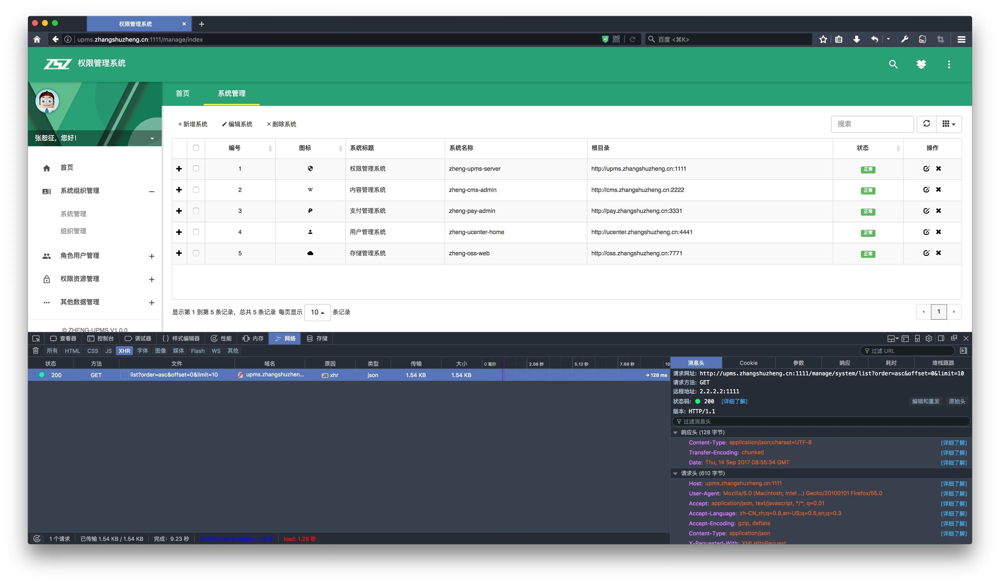

组织管理

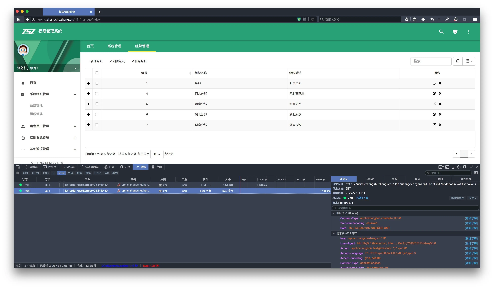

权限管理

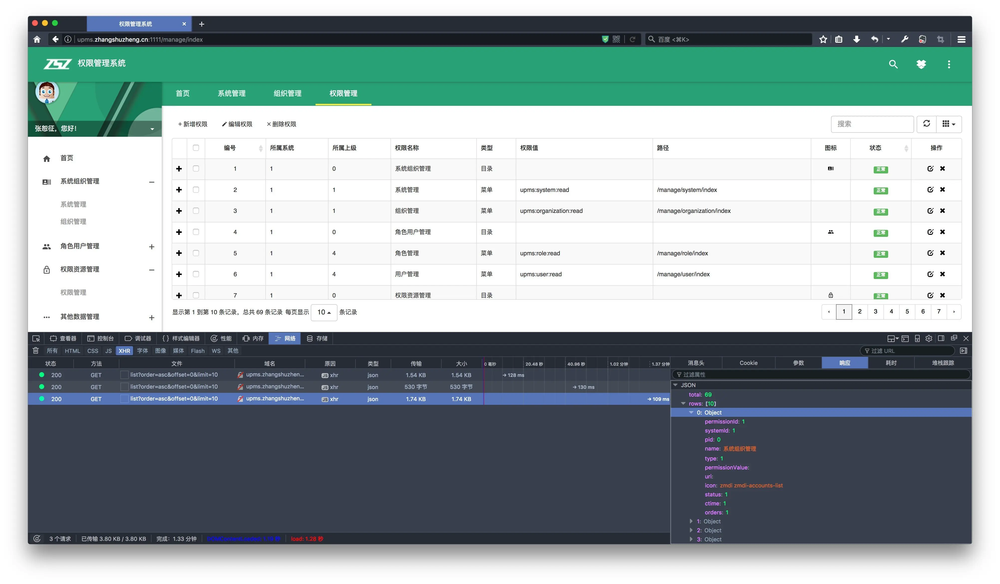

Redis

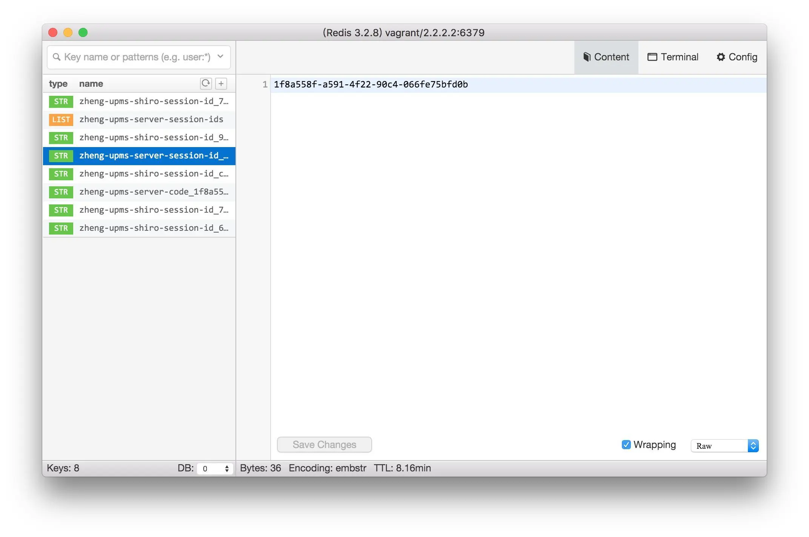

Zookeeper

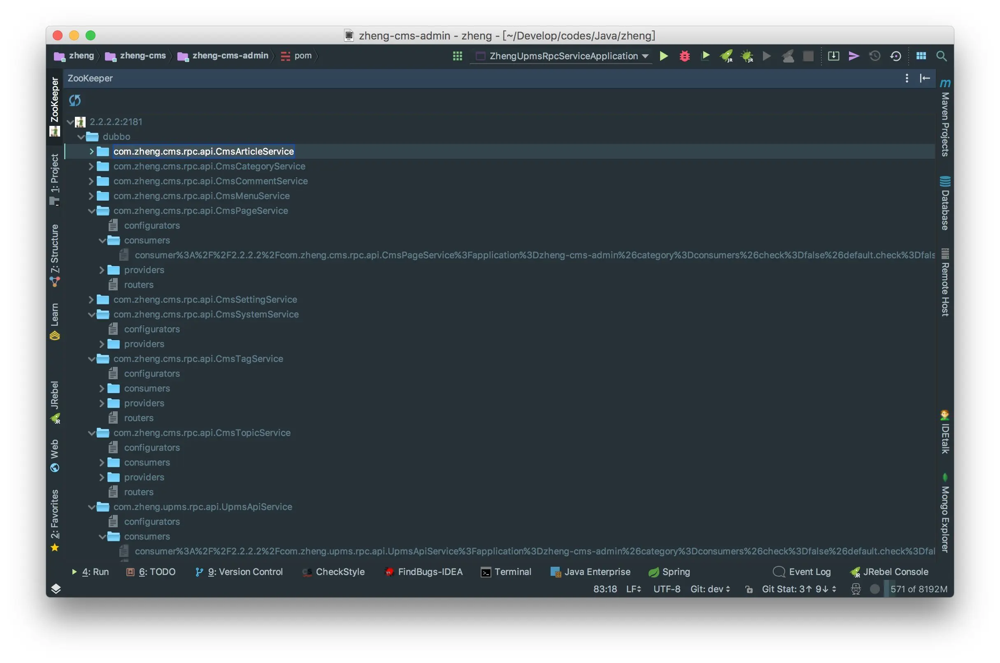

ActiveMQ

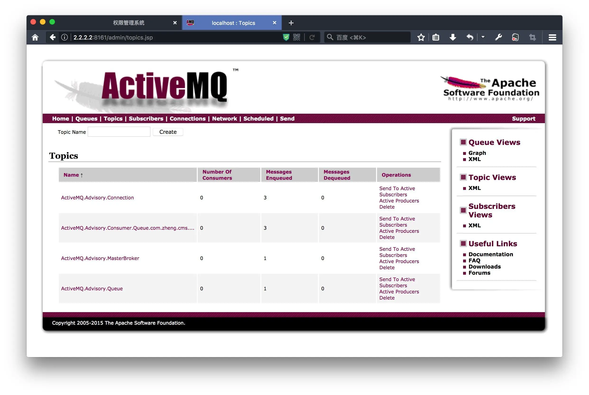

## 遇到的问题

### hosts

本来是想不修改 hosts 来部署 zheng 的, 但是大概看了下代码, 发现很多域名和配置都是写死的, 还需要修改数据库, 改动会很大, 就没有心情修改了.

但是 hosts 还是需要修改一下才能在服务器上使用.

1. 修改 hosts , 将域名指向服务器 ip
   **这部分是在本地修改**

   ```
   2.2.2.2 ui.zhangshuzheng.cn
   2.2.2.2 upms.zhangshuzheng.cn
   2.2.2.2 cms.zhangshuzheng.cn
   2.2.2.2 pay.zhangshuzheng.cn
   2.2.2.2 ucenter.zhangshuzheng.cn
   2.2.2.2 wechat.zhangshuzheng.cn
   2.2.2.2 api.zhangshuzheng.cn
   2.2.2.2 oss.zhangshuzheng.cn
   2.2.2.2 config.zhangshuzheng.cn

   ```

2. 将服务器依赖软件的 ip 指向服务器

**这部份是修改服务器的 hosts**

zookeeper, redis, activemq 都安装在 2.2.2.2 这台服务器上的

    ```
    127.0.0.1 zkserver
    127.0.0.1 rdserver
    # 127.0.0.1 dbserver mysql 的 地址修改为了我本地的 mysql 局域网地址是 192.168.31.28
    127.0.0.1 mqserver
    ```

### dubbo-monitor

[韩都衣舍](http://git.oschina.net/handu/dubbo-monitor) 的 dubbo-monitor 编译后不能直接用于 dubbo 2.5.3

需要修改 pom.xml

```
# 由 2.8.4 修改为 2.5.3
<dubbo.version>2.5.3</dubbo.version>

# 排除 dubbo 依赖的 旧版本的 spring
<dependency>
    <groupId>com.alibaba</groupId>
    <artifactId>dubbo</artifactId>
    <version>${dubbo.version}</version>
    <exclusions>
        ...
        <exclusion>
            <artifactId>spring</artifactId>
            <groupId>org.springframework</groupId>
        </exclusion>
    </exclusions>
</dependency>
```
