## 简介

在数字化时代，一张吸引人的封面图片对于博客来说至关重要。它不仅能够提升文章的视觉效果，还能在第一时间吸引读者的注意力。制作封面的方法多种多样，从自行设计到基于现有模板进行修改，每种方式都有其独特之处。然而，如果你希望以最快捷的方式输入标题或基本信息，直接生成封面，那么在线封面生成器无疑是你的最佳选择。今天，就让我带你一起探索几款优秀的在线封面生成工具，为你的技术博客增添一抹亮色。

## CoverView：开发者的首选

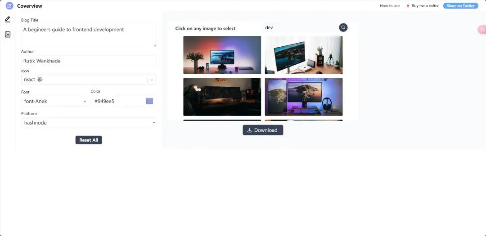

**链接：** [CoverView](https://coverview.vercel.app/) | [GitHub 仓库](https://github.com/rutikwankhade/CoverView)

CoverView 以其丰富的内置模板和图标而著称，尤其是针对编程语言的图标，这使得它成为开发者制作技术博客封面的理想工具。无论是 Java、Python 还是 React，你都能在这里找到合适的图标和模板，快速打造出专业且符合技术氛围的封面。

## Cover-Image-Generator：灵活调整，创意无限

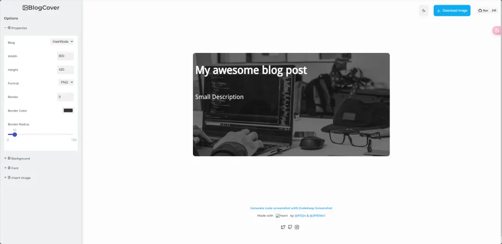

**链接：** [Cover-Image-Generator](https://blogcover.vercel.app/) | [GitHub 仓库](https://github.com/PJijin/Cover-Image-Generator)

虽然没有内置模板，但 Cover-Image-Generator 的灵活性却为其赢得了众多粉丝。你可以自由移动标题和副标题的位置，调整字体、颜色和大小，直至达到满意的效果。这种自由度让创意无限延伸，为你的博客封面增添个性色彩。

## PicProse：简洁而不简单

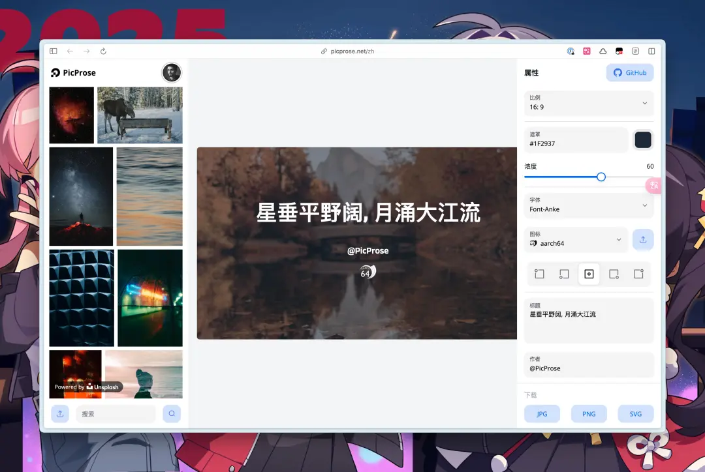

**链接：** [PicProse](https://picprose.net/zh) | [GitHub 仓库](https://github.com/jaaronkot/picprose)

PicProse 以其简洁的界面和实用的功能著称。它提供了基本的封面设计元素，让你能够快速上手，同时又不失专业感。无论是简单的文字封面还是需要添加图片的复杂设计，PicProse 都能轻松应对。

## imgsrc：个性化定制，彰显特色

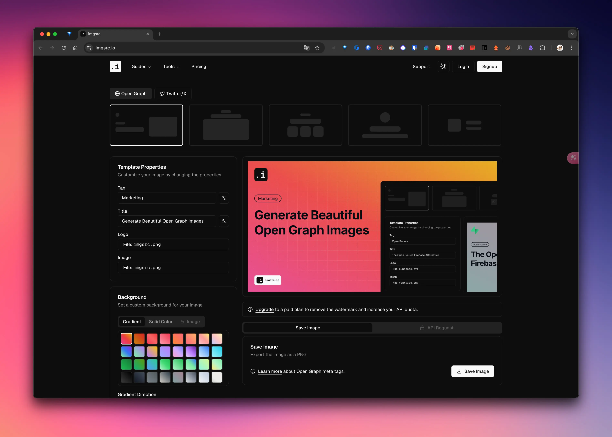

**链接：** [imgsrc](https://imgsrc.io/) | [GitHub 仓库](https://github.com/FadyMak/imgsrc-app)

imgsrc 允许你上传自定义图标和图片，为封面增添个性化元素。此外，它还提供了多种背景和布局选择，让你能够根据博客内容定制专属封面。无论是展示网站还是横向图片，imgsrc 都能帮你实现。

## Free Open Graph Generator：无水印，更专业

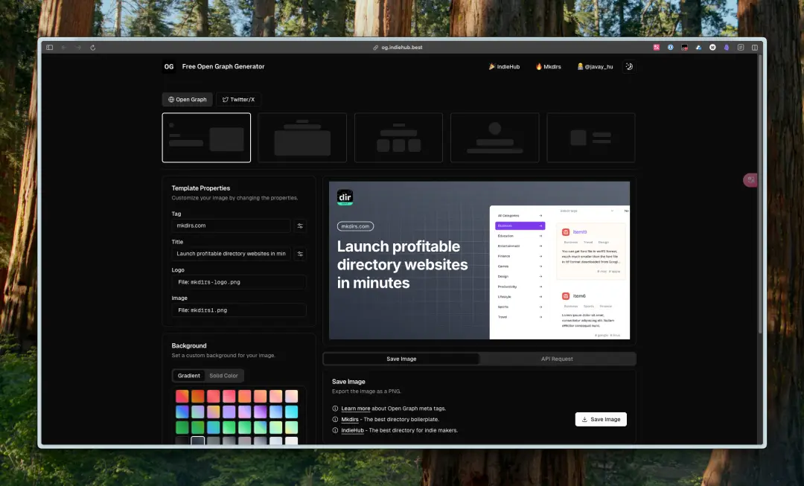

**链接：** [Free Open Graph Generator](https://og.indiehub.best/)

基于 imgsrc 修改而来的 Free Open Graph Generator 去掉了水印功能，让你的封面看起来更加专业。它保留了 imgsrc 的实用功能，同时提升了封面的整体美感。

## OG Image Maker：模板丰富，自定义度高

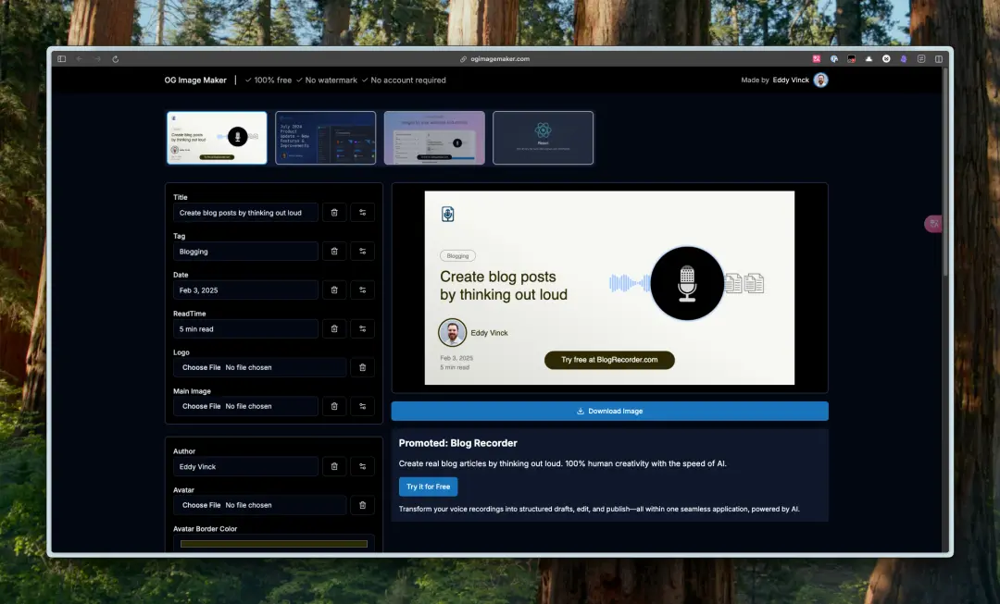

**链接：** [OG Image Maker](https://ogimagemaker.com/)

OG Image Maker 内置了多种模板供你选择，同时支持修改颜色、背景图片和底部的按钮等元素。这种高度的自定义性让你能够打造出独具特色的博客封面。

## Open Graph Image Generator：专注网站展示

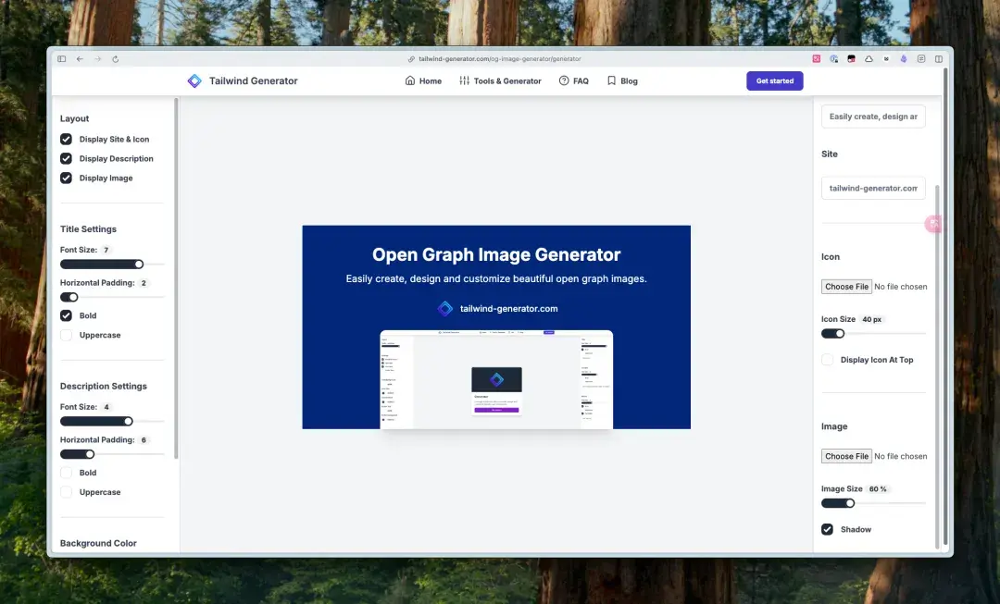

**链接：** [Open Graph Image Generator](https://tailwind-generator.com/og-image-generator/generator)

这款生成器特别适合用来展示网站或横向图片。虽然上传的图标大小固定，但其专业的设计感使得它成为展示网站内容的理想选择。

## Free Open Graph Image Generator - Placid.app：简洁实用

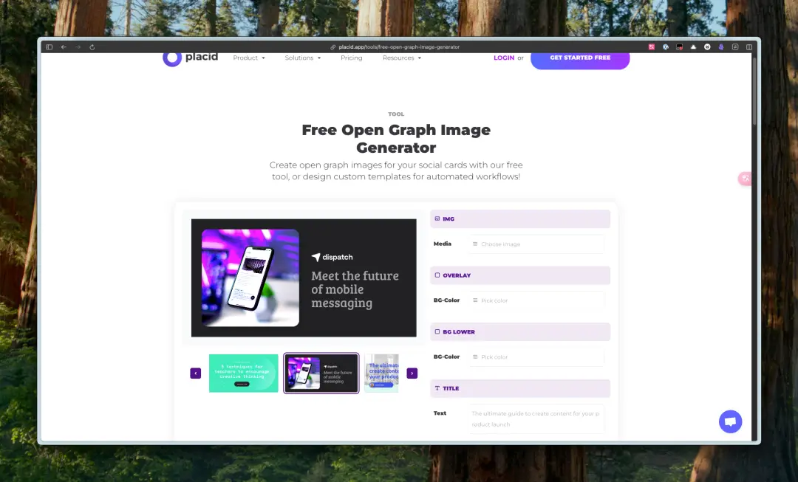

**链接：** [Free Open Graph Image Generator - Placid.app](https://placid.app/tools/free-open-graph-image-generator)

Placid.app 提供的这款生成器界面简洁明了，操作简便。你只需输入标题和副标题，选择合适的布局即可生成满意的封面图片。

## Open Graph Image Generator | BoilerplateHub：快速生成，简单高效

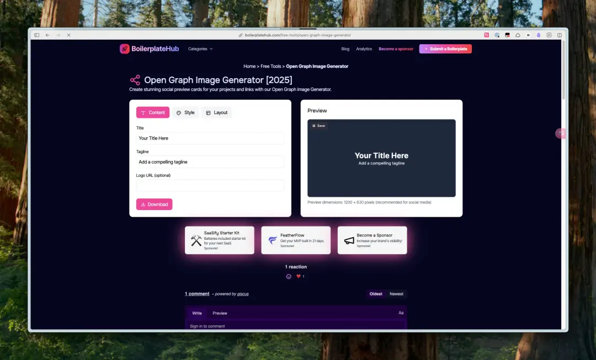

**链接：** [Open Graph Image Generator | BoilerplateHub](https://boilerplatehub.com/free-tools/open-graph-image-generator)

BoilerplateHub 的这款生成器以其快速和简单著称。它提供了两种布局选择，让你只需输入标题和副标题即可生成封面。对于追求效率的博主来说，这是一个不可多得的工具。

## Vercel OG Image Playground：官方出品，品质保证

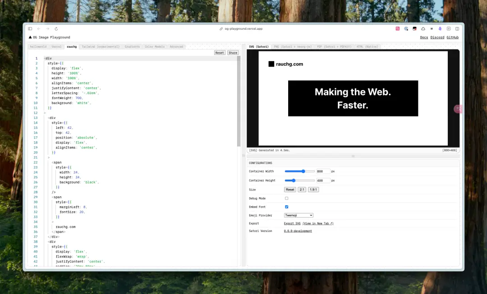

**链接：** [Vercel OG Image Playground](https://og-playground.vercel.app/)

作为 Vercel 官方推出的 OG 图像生成器，这款工具提供了高质量的设计体验。你可以在右下角导出 svg 格式的图片，如果需要 png 格式，只需在右上角的 tab 栏中切换到 png（satori + resvg-js）模式。无论是设计感还是实用性，Vercel OG Image Playground 都堪称一流。

## cover-paint：自部署，灵活使用

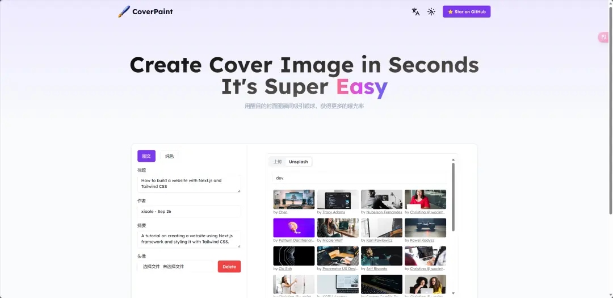

**链接：** [cover-paint](https://coverpaint.xiaole.site/) | [GitHub 仓库](https://github.com/youngle316/cover-paint)

虽然目前官网可能无法访问，但你可以通过 GitHub 仓库在 Vercel 或 Netlify 等平台自行部署使用。cover-paint 提供了丰富的自定义选项，让你能够根据个人需求打造独特的封面设计。

## 落地方案

前面这一圈工具选型之后，我最后采用的是自建 `cover-generator`（GitHub: [https://github.com/dong4j/cover-generator](https://github.com/dong4j/cover-generator)）。它本质上是一个极简 Node.js HTTP 服务，输入标题、作者、头像这些字段，直接返回 SVG 或 PNG。对我来说，价值不在“生成一张图”，而在“把每篇都手动做图这件事从流程里删掉”。

### 快速使用

这个项目上手很快，`Node.js >= 18` 即可：

```bash
npm install
npm start
# http://localhost:4321
```

服务起来以后，可以直接请求：

- `GET /cover/svg/v1` 到 `GET /cover/svg/v7`：按模板版本生成 SVG
- `GET /cover/png/v1` 到 `GET /cover/png/v7`：按模板版本生成 PNG
- `GET /cover/random`、`GET /cover/random/png`：随机模式
- `GET /health`：健康检查

最常用参数就是 `title`、`author`、`avatarUrl`，再加一个 `randomize=1` 就能快速得到不同风格的封面图。日常博客场景我现在主要走 `png` 路由，直接给主题使用。

### 实现细节

`cover-generator` 这套实现有几个点我很喜欢：

1. **模板版本化**：`v1` 到 `v7` 明确区分了布局风格，后续新增模板不会影响历史文章。
2. **参数可控**：`background`、`texture`、`color`、`accent`、`width`、`height` 都可以按需覆盖，默认值也够用。
3. **输出可复用**：支持 SVG 和 PNG 两种输出，PNG 有磁盘缓存，重复请求成本低。
4. **头像缓存**：远程头像会落盘缓存，批量生成时不会反复拉源站。

我现在在博客里采用的策略是“固定 + 动态”：

- 固定：`author=@dong4j`、`avatarUrl=https://cdn.dong4j.site/source/image/avatar.webp`
- 动态：`title` 来自文章标题，模板按标题长度规则选择（短标题偏 `v3/v6`，中等偏 `v4/v5`，长标题偏 `v2/v7`）
- 随机：`randomize=1`，并且不传 `seed/color/accent/texture`，`background` 留空或 `auto`

这样既能保持整体风格统一，又不会每篇都长一个样子。

### 结合 skill 自动化

真正让流程变轻的是和预发布 skill 的组合。现在我在预发布阶段会自动处理 front matter，直接写入 `cover` 字段，封面 URL 由 skill 按规则拼接完成。规则也比较明确：只生成线上 `png` 链接、必须 URL 编码、默认带 `randomize=1`、不传副标题和宽高。也就是说，写完文章后不需要再手动打开封面网站、下载图片、移动文件，发布前走一次预发布流程就可以了。

这套改造的核心目标很明确：**用 `cover-generator` 自动化封面生成，降低博客发布的操作复杂度**。对于高频写作场景，这个收益非常直接。
