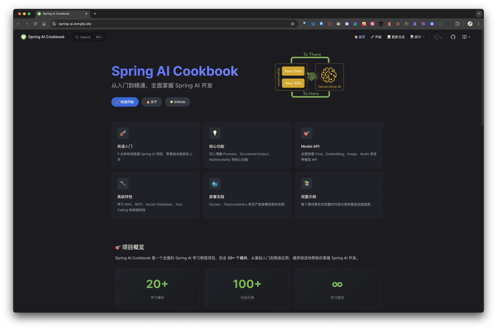
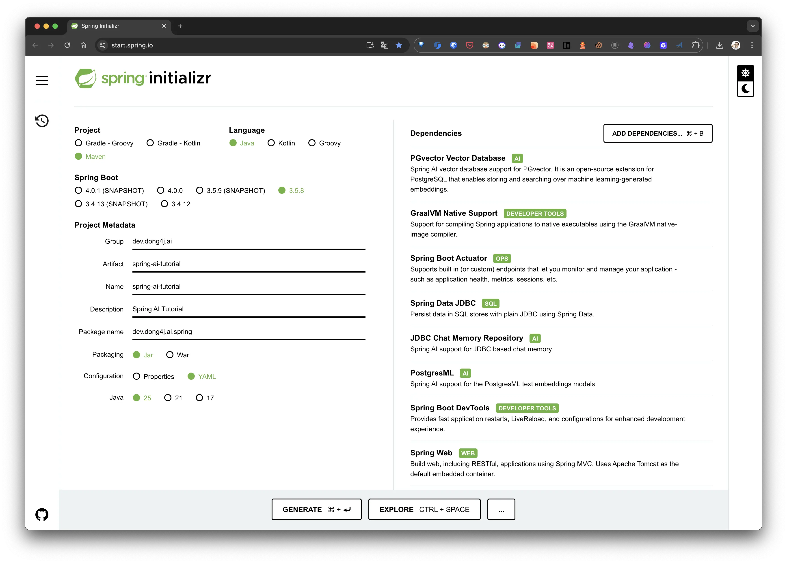

## 简介

本文是 Spring AI 入门教程的第一部分，将带你从零开始搭建一个 Spring AI 应用，集成 OpenAI（通义千问兼容模式）和 Anthropic（Claude）两个聊天模型，并解决实际开发中可能遇到的各种问题。

参考文档：[Your First Spring AI 1.0 Application](https://spring.io/blog/2025/05/20/your-first-spring-ai-1#header)

> 刚刚新开了一个 Spring AI 的 [教程项目](https://spring-ai.dong4j.site), 欢迎大家 star 和 fork！
> 

## 准备工作

在上一篇 [在 Docker 中部署 PostgresML 实现数据库内机器学习](/posts/postgresql-with-postgresml/) 中，已经成功在 PostgresML 中创建了数据库，并成功进行了 PostgresML 的相关测试。现在我们将以 PostgresML 为底层数据库，基于 Spring AI 来完成一个示例项目，学习 Spring AI 的相关概念以及 API 的使用。

### 项目初始化

打开 [Spring Initializr](https://start.spring.io/)，在你的项目里添加以下依赖：

- **PgVector** (PostgreSQL 的向量扩展)
- **GraalVM Native Support** (GraalVM 原生镜像支持)
- **Actuator** (应用监控)
- **Data JDBC** (Spring Data JDBC，用于数据库操作)
- **JDBC Chat Memory** (用 JDBC 存储聊天记忆)
- **PostgresML** (在 PostgreSQL 中运行机器学习模型，这里主要用它的 Embedding 功能)
- **Devtools** (开发工具，热重载)
- **Web** (构建 Web 应用，比如 Spring MVC)

此外，还需要在 `pom.xml` 中手动添加以下依赖：

```xml
<dependency>
    <groupId>org.springframework.ai</groupId>
    <artifactId>spring-ai-advisors-vector-store</artifactId>
</dependency>
<dependency>
    <groupId>org.springframework.ai</groupId>
    <artifactId>spring-ai-starter-model-openai</artifactId>
</dependency>
<dependency>
    <groupId>org.springframework.ai</groupId>
    <artifactId>spring-ai-starter-model-anthropic</artifactId>
</dependency>
```



### 数据库设置

在 `application.yml` 中配置数据库连接和 Spring AI 相关设置：

```yaml
spring:
  application:
    name: spring-ai-tutorial

  # 总是执行数据库初始化脚本
  sql:
    init:
      mode: always

  # 数据库连接信息
  datasource:
    url: jdbc:postgresql://localhost:5434/postgresml
    username: postgres
    password: password

  # PostgresML Embedding 相关配置
  ai:
    model:
      # ⚠️ 重要：因为引入了 openai, 也会带一个 openAiEmbeddingModel, 会与 postgresMlEmbeddingModel 冲突
      # 这里强制指定为 postgresml
      embedding: postgresml
    postgresml:
      embedding:
        create-extension: true # 自动创建扩展
        options:
          vector-type: pg_vector # 向量类型
    
    # OpenAI 配置（通义千问兼容模式）
    openai:
      base-url: https://dashscope.aliyuncs.com/compatible-mode
      api-key: ${QIANWEN_API_KEY}
    
    # Anthropic 配置（Claude Code Router 转发）
    anthropic:
      api-key: ${ANTHROPIC_AUTH_TOKEN}
      base-url: http://127.0.0.1:3456

    # PgVector 向量存储相关配置
    vectorstore:
      pgvector:
        dimensions: 768 # 向量维度
        initialize-schema: true # 自动初始化 Schema

    # JDBC 聊天记忆相关配置
    chat:
      memory:
        repository:
          jdbc:
            initialize-schema: always # 自动初始化 Schema
```

### 获取 API Key

#### 通义千问 API Key

通义千问提供了多种获取 API Key 的方式：

1. **官方渠道**：访问 [阿里云 DashScope](https://dashscope.console.aliyun.com/) 注册并获取 API Key
2. **免费测试**：可以使用一些第三方平台提供的免费 API Key 进行测试，例如：
   - 访问 [ModelScope](https://www.modelscope.cn/) 注册账号
   - 在控制台中申请免费的 API Key
   - 将 API Key 配置到环境变量 `QIANWEN_API_KEY` 中

#### Anthropic API Key

如果你使用 Claude Code Router (CCR) 进行代理，API Key 可以在 CCR 的 UI 界面中设置。关于 CCR 的配置，我们会在下一节详细说明。

## 配置聊天客户端

### 创建配置类

创建一个配置类 `ChatClientConfig.java` 来配置不同的聊天客户端：

```java
package dev.dong4j.ai.spring.config;

import org.springframework.ai.anthropic.AnthropicChatModel;
import org.springframework.ai.chat.client.ChatClient;
import org.springframework.ai.openai.OpenAiChatModel;
import org.springframework.ai.openai.OpenAiChatOptions;
import org.springframework.context.annotation.Bean;
import org.springframework.context.annotation.Configuration;

@Configuration
public class ChatClientConfig {

    @Bean
    public ChatClient openAiChatClient(OpenAiChatModel chatModel) {
        final OpenAiChatModel build = chatModel.mutate().defaultOptions(OpenAiChatOptions.builder()
                                                                            .model("qwen2.5-14b-instruct")
                                                                            .temperature(0.7)
                                                                            .build()).build();
        return ChatClient.create(build);
    }

    @Bean
    public ChatClient anthropicChatClient(AnthropicChatModel chatModel) {
        return ChatClient.create(chatModel);
    }
}
```

### 重要注意事项

#### ⚠️ 通义千问 API 兼容性限制

通义千问虽然提供了 OpenAI 兼容模式的 API，但在某些方面存在兼容性限制：

1. **思考模型（Think Model）的问题**：
   - `chatModel` 默认使用**非流式响应**
   - 如果使用思考模型（think model），会报错
   - 原因：通义千问的 `enable_thinking` 参数必须设置为 `false`，且该参数需要直接在请求体顶层，而不是嵌套在 `extra_body` 中
   - Spring AI 的 `extraBody` 方法会创建嵌套的 `extra_body` 对象，这是 OpenAI API 的结构，但通义千问 API 不支持这种嵌套结构

**问题示例**：
```json
// Spring AI 的 extraBody 会生成这样的结构（不符合通义千问 API）
{
  "extra_body": {
    "enable_thinking": false
  }
}

// 通义千问 API 需要这样的结构
{
  "enable_thinking": false
}
```

**当前解决方案**：
- 暂时不使用思考模型

2. **模型选择**：
   - 推荐使用 `qwen2.5-14b-instruct` 等非思考模型
   - 避免使用带有 `think` 标识的模型

#### ⚠️ Embedding Bean 冲突问题

引入 `spring-ai-starter-model-openai` 后，Spring AI 会自动装配一个 `openAiEmbeddingModel` Bean，这会与 `postgresMlEmbeddingModel` Bean 产生冲突。

**解决方案**：在 `application.yml` 中显式指定使用 PostgresML 的 Embedding：

```yaml
spring:
  ai:
    model:
      embedding: postgresml
```

如果不设置，启动时会报错：
```
Parameter 0 of constructor in ... required a single bean, but 2 were found:
  - openAiEmbeddingModel
  - postgresMlEmbeddingModel
```

## 使用 Claude Code Router 代理 Anthropic API

Claude Code Router (CCR) 是一个开源工具，允许你在本地代理 Anthropic 的 API 请求。这对于在国内无法直接访问 Anthropic API 的开发者来说非常有用。

### 安装步骤

1. **安装 Node.js**：确保你的系统已安装 Node.js（推荐使用 LTS 版本）

2. **安装 Claude Code Router**：
   ```bash
   npm install -g @musistudio/claude-code-router
   ```

3. **启动服务**：
   ```bash
   ccr start
   ```
   默认会在 `http://127.0.0.1:3456` 启动服务

4. **配置 API Key**：
   - 访问 CCR 的 Web UI（通常是 `http://127.0.0.1:3456` 或相关端口）
   - 在界面中配置你的 Anthropic API Key
   - 或者编辑配置文件 `~/.claude-code-router/config.json`：
   ```json
   {
     "providers": {
       "anthropic": {
         "apiKey": "your-anthropic-api-key",
         "baseURL": "https://api.anthropic.com"
       }
     },
     "router": {
       "default": "anthropic"
     }
   }
   ```

5. **在 Spring AI 中使用**：
   在 `application.yml` 中配置：
   ```yaml
   spring:
     ai:
       anthropic:
         api-key: ${ANTHROPIC_AUTH_TOKEN}  # 可以在 CCR UI 中设置
         base-url: http://127.0.0.1:3456
   ```

## 创建测试控制器

创建一个简单的控制器来测试聊天功能：

```java
package dev.dong4j.ai.spring.controller;

import org.springframework.ai.chat.client.ChatClient;
import org.springframework.stereotype.Controller;
import org.springframework.web.bind.annotation.GetMapping;
import org.springframework.web.bind.annotation.PathVariable;
import org.springframework.web.bind.annotation.RequestParam;
import org.springframework.web.bind.annotation.ResponseBody;

import jakarta.annotation.Resource;

@Controller
@ResponseBody
class AdoptionsController {

    @Resource
    private ChatClient openAiChatClient;
    
    @Resource
    private ChatClient anthropicChatClient;

    @GetMapping("/anthropic/{user}/assistant")
    String anthropic(@PathVariable String user, @RequestParam String question) {
        return anthropicChatClient
            .prompt()
            .user(question)
            .call()
            .content();
    }

    @GetMapping("/openAiChatClient/{user}/assistant")
    String openAiChatClient(@PathVariable String user, @RequestParam String question) {
        return openAiChatClient
            .prompt()
            .user(question)
            .call()
            .content();
    }
}
```

## 测试应用

启动应用后，可以通过以下接口进行测试：

### 测试 OpenAI（通义千问）接口

```bash
curl "http://localhost:8080/openAiChatClient/test/assistant?question=你好，请介绍一下你自己"
```

### 测试 Anthropic（Claude）接口

```bash
curl "http://localhost:8080/anthropic/test/assistant?question=你好，请介绍一下你自己"
```

## 总结

通过本文，我们完成了以下工作：

1. ✅ 搭建 Spring AI 项目基础结构
2. ✅ 配置 PostgresML 作为向量数据库和 Embedding 模型
3. ✅ 配置 OpenAI（通义千问兼容模式）聊天客户端
4. ✅ 配置 Anthropic（Claude Code Router）聊天客户端
5. ✅ 解决 Embedding Bean 冲突问题
6. ✅ 了解通义千问 API 的兼容性限制
7. ✅ 创建测试接口验证功能

**下一步计划**：
- 集成 RAG（检索增强生成）功能
- 实现 Tool Calling 功能
- 集成 MCP（Model Context Protocol）
- 构建 AI Agent 应用

## 参考资料

- [Spring AI 官方文档](https://docs.spring.io/spring-ai/reference/)
- [ChatClient API 文档](https://docs.spring.io/spring-ai/reference/api/chatclient.html)
- [OpenAI Chat API 文档](https://docs.spring.io/spring-ai/reference/api/chat/openai-chat.html)
- [Anthropic Chat API 文档](https://docs.spring.io/spring-ai/reference/api/chat/anthropic-chat.html)
- [通义千问 API 文档](https://help.aliyun.com/zh/model-studio/qwen-api-reference)
- [Claude Code Router GitHub](https://github.com/anthropics/claude-code-router)
- [Your First Spring AI 1.0 Application](https://spring.io/blog/2025/05/20/your-first-spring-ai-1#header)


