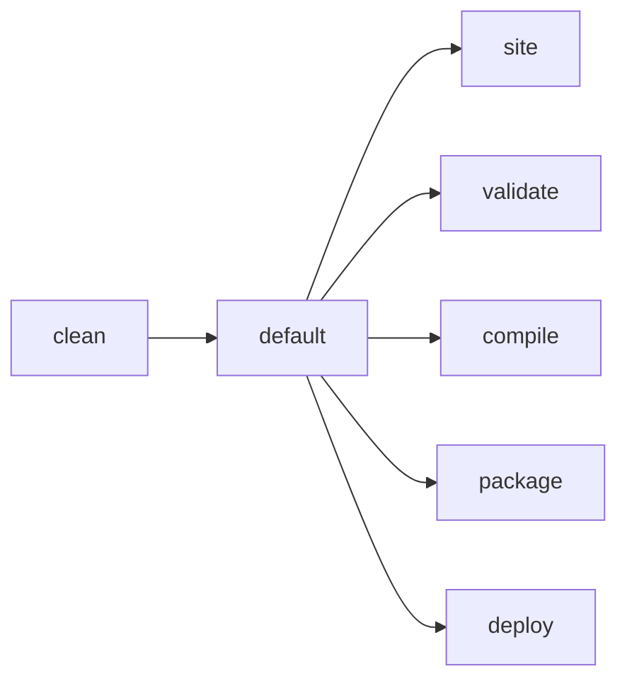

## 前言：为什么要自定义 Maven 插件

在 Zeka Stack 框架的开发过程中，我们遇到了很多重复性的构建操作和人为干预的环节。传统的 Maven 插件虽然功能强大，但在特定场景下往往需要大量配置，或者根本无法满足我们的定制化需求。

> **核心理念**: "If something – anything – requires more than 90 seconds of his time, he writes a script to automate that." —— 如果任何任务超过 90 秒，就写脚本自动化它！

基于这个理念，我们开发了一套完整的 Maven 插件体系，解决了以下痛点：

- 🏗️ **重复构建流程**: 每个项目都需要手动配置相同的 assembly.xml、启动脚本等
- 🔁 **构建生命周期缺失**: 缺少动态类加载、热补丁、一键部署等关键环节
- 🚀 **开发效率提升**: 通过插件实现"约定大于配置"，大幅减少配置工作量
- 🤔 **工程一致性**: 统一团队的开发规范和部署流程
- ⚡ **自动化优先**: 将任何超过 90 秒的重复性任务都自动化

**实践证明**: 写插件其实没有想象中复杂，关键是要有清晰的自动化思维和合理的架构设计。

---

## 🔧 Maven 插件开发基础速通

### 📦 Maven 插件的本质：Mojo 是什么？

Maven 插件的核心是 **Mojo**（Maven plain Old Java Object），每个插件由多个 Mojo 组成：

```java
@Mojo(name = "generate-build-info", 
      defaultPhase = LifecyclePhase.GENERATE_RESOURCES, 
      threadSafe = true)
public class GenerateProjectBuildInfoMojo extends ZekaMavenPluginAbstractMojo {
    
    @Parameter(defaultValue = "${project.build.outputDirectory}/META-INF/build-info.properties")
    private File outputFile;
    
    @Override
    public void execute() throws MojoExecutionException, MojoFailureException {
        // 插件执行逻辑
    }
}
```

**关键点**：
- 🔨 每个 Mojo 对应一个 Java 类 + `@Mojo` 注解
- 🧬 `@Mojo` 注解定义插件目标名称和执行阶段
- 🧷 `defaultPhase` 指定在哪个生命周期阶段执行

### 🌀 生命周期机制和插件执行流程

Maven 有三大生命周期，每个生命周期包含多个阶段：



**实际应用**：
- 🔄 **生命周期**：定义构建的整体流程
- 🎯 **插件目标**：具体的执行任务
- ⛓️ **绑定机制**：通过 `defaultPhase` 将插件绑定到特定阶段

### 🗂️ 插件的结构、依赖与构建方式

**标准目录结构**：
```
arco-maven-plugin/
├── src/main/java/          # Java 源码
├── src/main/resources/     # 资源文件
│   └── META-INF/
│       └── m2e/           # Eclipse 集成配置
├── pom.xml                # 插件 POM 配置
└── README.md              # 插件文档
```

**POM 配置要点**：
```xml
<packaging>maven-plugin</packaging>

<dependencies>
    <dependency>
        <groupId>org.apache.maven</groupId>
        <artifactId>maven-plugin-api</artifactId>
        <version>3.8.6</version>
    </dependency>
    <dependency>
        <groupId>org.apache.maven.plugin-tools</groupId>
        <artifactId>maven-plugin-annotations</artifactId>
        <version>3.6.4</version>
    </dependency>
</dependencies>

<build>
    <plugins>
        <plugin>
            <groupId>org.apache.maven.plugins</groupId>
            <artifactId>maven-plugin-plugin</artifactId>
            <version>3.6.4</version>
        </plugin>
    </plugins>
</build>
```

### ⚙️ 注解配置与参数传递方式

**参数注入方式**：

```java
public class ExampleMojo extends AbstractMojo {
    
    // 1. 基础参数注入
    @Parameter(property = "project", readonly = true, required = true)
    private MavenProject project;
    
    // 2. 带默认值的参数
    @Parameter(defaultValue = "${project.build.directory}/output")
    private File outputDirectory;
    
    // 3. 系统属性参数
    @Parameter(property = "skip", defaultValue = "false")
    private boolean skip;
    
    // 4. 复杂对象参数
    @Parameter
    private List<String> includes;
    
    // 5. Maven 核心组件注入
    @Component
    private BuildContext buildContext;
}
```

**配置传递方式**：
- 📡 **POM 配置**: `<configuration><outputDirectory>target/custom</outputDirectory></configuration>`
- 🔧 **系统属性**: `-Dskip=true`
- 📋 **POM 属性**: `${project.build.directory}`

### 🐞 插件调试技巧

**本地开发调试**：
```bash
# 1. 安装到本地仓库
mvn clean install

# 2. 在测试项目中调用
mvn dev.dong4j:arco-assist-maven-plugin:generate-build-info

# 3. 远程调试
mvnDebug dev.dong4j:arco-assist-maven-plugin:generate-build-info
# 然后在 IDE 中连接到 8000 端口
```

**日志调试**：
```java
public void execute() throws MojoExecutionException, MojoFailureException {
    getLog().info("开始执行插件...");
    getLog().warn("这是一个警告信息");
    getLog().error("这是一个错误信息");
}
```

**常见调试场景**：
- 🧪 **SNAPSHOT 版本**: 开发时使用 SNAPSHOT 版本便于快速迭代
- 🐛 **参数传递**: 检查 `@Parameter` 注解配置是否正确
- 🧭 **生命周期**: 确认插件在正确的阶段执行

---

## 🛠️ 我的几个小插件与背后的动机

基于 Zeka Stack 框架的实际开发经验，我们开发了 9 个核心插件，每个都解决了特定的痛点。让我分享几个典型的案例：

### 📘 插件一：arco-assist-maven-plugin - 构建信息生成

**🧩 背景**：在微服务架构中，每个服务都需要包含构建信息（版本、时间戳、Git 提交等），用于问题排查和版本管理。传统方式需要手动维护，容易遗漏。

**🎯 功能**：自动生成 `build-info.properties` 文件，包含：
- 项目版本和构建时间
- Git 提交信息和分支
- JDK 版本和系统信息
- 自定义属性

**🛠 实现**：
```java
@Mojo(name = "generate-build-info", defaultPhase = LifecyclePhase.GENERATE_RESOURCES)
public class GenerateProjectBuildInfoMojo extends ZekaMavenPluginAbstractMojo {
    
    @Parameter(defaultValue = "${project.build.outputDirectory}/META-INF/build-info.properties")
    private File outputFile;
    
    @Override
    public void execute() {
        Properties buildInfo = new Properties();
        buildInfo.setProperty("build.version", project.getVersion());
        buildInfo.setProperty("build.time", new SimpleDateFormat("yyyy-MM-dd HH:mm:ss").format(new Date()));
        buildInfo.setProperty("build.java.version", System.getProperty("java.version"));
        // ... 更多信息
        
        new FileWriter(outputFile).write(buildInfo);
    }
}
```

**✨ 效果**：每个 JAR 包都自动包含完整的构建信息，问题排查时一目了然。

### 🔄 插件二：arco-script-maven-plugin - 启动脚本生成

**🧩 背景**：每个 Java 应用都需要启动脚本，但传统方式存在以下问题：
- 脚本质量参差不齐，缺乏统一规范
- 缺乏通用性，迁移到其他项目需要大幅修改
- 可配置性不足，JVM 参数、日志路径等写死在脚本里
- 维护成本高，修改通用选项需要在多个地方重复操作

**🎯 功能**：自动生成标准化的 Java 应用启动脚本，支持：
- 完整的生命周期管理（启动、停止、重启、状态查看）
- 多环境支持（dev、test、prod）
- 监控集成（JMX、APM、Debug 模式）
- JVM 参数优化和日志管理

**🛠 实现**：
```java
@Mojo(name = "generate-server-script", defaultPhase = LifecyclePhase.PACKAGE)
public class GenerateServerScriptMojo extends ZekaMavenPluginAbstractMojo {
    
    @Parameter(defaultValue = "${project.build.directory}/arco-maven-plugin/bin/launcher")
    private File outputFile;
    
    @Parameter(property = "jvmOptions", defaultValue = "-Xms128M -Xmx256M")
    private String jvmOptions;
    
    @Override
    public void execute() {
        // 从插件资源中提取 launcher 脚本模板
        String scriptTemplate = loadScriptTemplate();
        
        // 替换 JVM 参数等变量
        Map<String, String> replaceMap = new HashMap<>();
        replaceMap.put("#{jvmOptions}", jvmOptions);
        
        // 生成最终脚本
        new FileWriter(outputFile, replaceMap).write(scriptTemplate);
    }
}
```

**✨ 效果**：所有项目都拥有相同的启动方式，支持丰富的参数配置，大大降低了维护成本。

### 🧭 插件三：arco-container-maven-plugin - Docker 容器化

**🧩 背景**：Spring Boot 应用的容器化部署需要：
- 手动编写 Dockerfile
- 配置分层构建策略
- 处理端口暴露和健康检查
- 优化镜像大小和构建速度

**🎯 功能**：自动化生成 Docker 配置，包括：
- 智能 Dockerfile 生成（基础镜像、单层构建、多层构建）
- 自动端口检测（从 application.yml 读取）
- 分层构建优化（最大化 Docker 层缓存）
- Docker Compose 集成

**🛠 实现**：
```java
@Mojo(name = "generate-dockerfile", defaultPhase = LifecyclePhase.PACKAGE)
public class GenerateDockerfileScriptMojo extends ZekaMavenPluginAbstractMojo {
    
    @Parameter(defaultValue = "${project.basedir}/src/main/resources/application.yml")
    private File mainConfigFile;
    
    @Override
    public void execute() {
        // 读取应用配置，解析端口信息
        List<String> ports = parsePortsFromConfig(mainConfigFile);
        
        // 生成 Dockerfile 模板
        String dockerfileTemplate = loadTemplate("Dockerfile-M");
        
        // 替换变量
        Map<String, String> replaceMap = new HashMap<>();
        replaceMap.put("${EXPORT.PORT}", generateExposeInstructions(ports));
        replaceMap.put("${HEALTHCHECK}", generateHealthCheck(ports));
        
        // 写入文件
        new FileWriter(outputFile, replaceMap).write(dockerfileTemplate);
    }
}
```

**✨ 效果**：一键生成生产级的 Docker 配置，支持多种构建策略，大幅简化容器化部署。

### 🚀 插件四：arco-publish-maven-plugin - 一键部署

**🧩 背景**：传统部署方式效率低下：
- 需要手动打包、上传、解压、配置、启动
- 容易出错，缺乏统一的部署流程
- 多环境部署配置复杂

**🎯 功能**：提供一键部署能力：
- 支持后端、前端、文档项目部署
- 多环境配置（dev、test、prod）
- SSH 安全传输和远程执行
- 并行部署提升效率

**🛠 实现**：
```java
@Mojo(name = "publish-single", defaultPhase = LifecyclePhase.DEPLOY)
public class ServicePublishSingleMojo extends ServicePublishMojo {
    
    @Override
    protected void publish(List<Group> groups) {
        groups.parallelStream().forEach(group -> {
            group.getServers().parallelStream().forEach(server -> {
                SSHAgent sshAgent = new SSHAgent(server.getHost());
                // 上传部署包
                sshAgent.uploadFile(deployPackage, remotePath);
                // 远程执行部署脚本
                sshAgent.executeCommand("cd " + remotePath + " && ./deploy.sh");
            });
        });
    }
}
```

**✨ 效果**：从原来的 10 分钟手动部署缩短到 1 分钟自动化部署，大大提升了开发效率。

---

## 🕳️ 开发插件时踩过的那些坑

在开发过程中，我们遇到了不少坑，这里分享一些典型的踩坑经历：

### ❌ Mojo 类缺少 public 修饰或无参构造方法

**问题**：插件执行时报错 `NoSuchMethodException` 或 `InstantiationException`

**原因**：Maven 使用反射创建 Mojo 实例，需要无参构造方法

**解决方案**：
```java
// ❌ 错误示例
class MyMojo extends AbstractMojo {
    public MyMojo(String param) { // 有参构造方法
        // ...
    }
}

// ✅ 正确示例
public class MyMojo extends AbstractMojo {
    @Parameter
    private String param;
    
    public MyMojo() { // 无参构造方法
        // 可选：提供默认构造方法
    }
}
```

### ❌ `@Parameter` 注入失败的常见原因分析

**问题 1**：参数值为 null 或默认值

**原因**：属性名不匹配或类型转换失败

```java
// ❌ 错误：属性名不匹配
@Parameter(property = "myParam")  // 系统属性名
private String myParam;

// 命令行：-DmyParam=value  ✅
// 命令行：-Dmy-param=value ❌

// ✅ 正确：使用 defaultValue
@Parameter(property = "my-param", defaultValue = "defaultValue")
private String myParam;
```

**问题 2**：复杂对象注入失败

```java
// ❌ 错误：直接注入复杂对象
@Parameter
private List<CustomObject> items;

// ✅ 正确：使用简单类型或提供转换器
@Parameter
private List<String> items;

// 或者使用 @Component 注入
@Component
private CustomService customService;
```

### ❌ 生命周期绑定错误导致插件不生效

**问题**：插件在错误的阶段执行，导致依赖的文件不存在

```java
// ❌ 错误：在 compile 阶段使用 target 目录下的文件
@Mojo(name = "process", defaultPhase = LifecyclePhase.COMPILE)
public class ProcessMojo extends AbstractMojo {
    @Parameter(defaultValue = "${project.build.directory}/generated-classes")
    private File generatedClasses; // 此时目录可能不存在
}

// ✅ 正确：在 package 阶段处理
@Mojo(name = "process", defaultPhase = LifecyclePhase.PACKAGE)
public class ProcessMojo extends AbstractMojo {
    // 此时 target 目录和所有文件都已生成
}
```

### ❌ 插件依赖污染主项目依赖树

**问题**：插件依赖被传递到使用插件的项目中

**解决方案**：
```xml
<!-- 在插件 POM 中设置 scope -->
<dependency>
    <groupId>com.example</groupId>
    <artifactId>some-library</artifactId>
    <version>1.0.0</version>
    <scope>provided</scope> <!-- 不传递依赖 -->
</dependency>

<!-- 或者使用 optional -->
<dependency>
    <groupId>com.example</groupId>
    <artifactId>some-library</artifactId>
    <version>1.0.0</version>
    <optional>true</optional> <!-- 可选依赖 -->
</dependency>
```

### ❌ 多模块项目中的 Mojo 执行顺序问题

**问题**：在多模块项目中，插件的执行顺序不符合预期

**解决方案**：
```java
// 使用 @Execute 注解控制执行顺序
@Mojo(name = "process", defaultPhase = LifecyclePhase.PACKAGE)
@Execute(phase = LifecyclePhase.COMPILE, goal = "compile")
public class ProcessMojo extends AbstractMojo {
    // 确保在 compile 阶段完成后执行
}

// 或者在父 POM 中配置执行顺序
<plugin>
    <groupId>dev.dong4j</groupId>
    <artifactId>arco-assist-maven-plugin</artifactId>
    <executions>
        <execution>
            <id>generate-build-info</id>
            <phase>generate-resources</phase>
            <goals>
                <goal>generate-build-info</goal>
            </goals>
        </execution>
    </executions>
</plugin>
```

### ❌ 资源文件路径问题

**问题**：插件中的资源文件无法正确加载

**解决方案**：
```java
// ❌ 错误：使用相对路径
InputStream is = new FileInputStream("META-INF/templates/script.sh");

// ✅ 正确：使用 ClassLoader 加载资源
InputStream is = getClass().getClassLoader()
    .getResourceAsStream("META-INF/templates/script.sh");

// 或者使用 Maven 的 ResourceLoader
@Component
private ResourceLoader resourceLoader;

public void loadResource() {
    URL resource = resourceLoader.getResource("META-INF/templates/script.sh");
    // 处理资源
}
```

### ❌ 线程安全问题

**问题**：在多线程环境下插件状态被污染

**解决方案**：
```java
// ✅ 正确：使用 threadSafe = true
@Mojo(name = "process", threadSafe = true)
public class ProcessMojo extends AbstractMojo {
    
    // 避免使用实例变量存储状态
    // ❌ private String state;
    
    // ✅ 使用局部变量
    public void execute() {
        String localState = "local"; // 线程安全
        // 处理逻辑
    }
}
```

---

## 🎯 总结：自定义插件，不只是造轮子

经过 Zeka Stack 框架的实践，我们深刻体会到自定义 Maven 插件的价值：

### 🧠 插件是团队工程治理的加速器

通过插件，我们实现了：
- **统一规范**：所有项目都遵循相同的构建、部署、监控标准
- **知识沉淀**：将最佳实践固化到插件中，新成员可以快速上手
- **效率提升**：将原本需要 10 分钟的手动操作缩短到 1 分钟自动化

### 🧰 好的插件让构建更智能、更规范

我们的插件体系实现了：
- **智能检测**：自动识别项目类型（Spring Boot、微服务、前端等）
- **动态配置**：根据项目特征生成相应的配置文件
- **质量保障**：内置代码质量检查和依赖冲突检测

### 🛤️ 插件设计要注意通用性与可配置性

**设计原则**：
- **约定大于配置**：提供合理的默认值，减少配置负担
- **可扩展性**：支持通过参数覆盖默认行为
- **向后兼容**：新版本不能破坏现有配置

**实际案例**：
```java
// 提供灵活的配置选项
@Parameter(property = "jvmOptions", defaultValue = "-Xms128M -Xmx256M")
private String jvmOptions;

@Parameter(property = "skip", defaultValue = "false")
private boolean skip;

// 支持环境变量覆盖
@Parameter(defaultValue = "${env.JVM_OPTIONS:}")
private String envJvmOptions;
```

### ❗ 插件适合做工程自动化、构建增强、文档同步等场景

**推荐场景**：
- ✅ **构建增强**：生成构建信息、打包配置、启动脚本
- ✅ **代码质量**：静态分析、代码规范检查、依赖管理
- ✅ **部署自动化**：一键部署、容器化、环境配置
- ✅ **文档生成**：API 文档、部署文档、配置文档
- ✅ **监控集成**：日志配置、指标收集、健康检查

**不推荐场景**：
- ❌ **业务逻辑**：插件不应该包含具体的业务代码
- ❌ **数据操作**：避免在插件中进行数据库操作
- ❌ **复杂计算**：保持插件的轻量级特性

### 🚀 未来展望

基于"90 秒自动化"的理念，我们计划继续扩展插件体系：

1. **AI 辅助开发**：集成 AI 工具，自动生成代码和配置
2. **云原生支持**：增强 Kubernetes、Service Mesh 等云原生技术集成
3. **性能优化**：提供更智能的 JVM 参数调优和性能分析
4. **安全增强**：集成安全扫描、漏洞检测等安全工具

### 💡 给开发者的建议

如果你也想开发 Maven 插件，建议：

1. **从小做起**：先解决一个具体的小问题，逐步扩展
2. **关注痛点**：找到团队中重复性高、容易出错的操作
3. **保持简单**：插件应该简单易用，避免过度设计
4. **充分测试**：在不同环境和项目类型中测试插件
5. **文档完善**：提供清晰的使用文档和示例

**记住**：好的插件不是炫技，而是真正解决实际问题的工具。正如 [hacker-scripts](https://github.com/NARKOZ/hacker-scripts) 项目所展示的，自动化思维是提升开发效率的关键。

---

> **最后的话**：在 Zeka Stack 的开发过程中，我们深刻体会到"If something – anything – requires more than 90 seconds of his time, he writes a script to automate that"这句话的威力。通过 Maven 插件，我们不仅提升了开发效率，更重要的是培养了团队的自动化思维。这种思维不仅适用于技术开发，也适用于日常工作和生活的方方面面。

**项目地址**：[Zeka Stack](https://github.com/zeka-stack/zeka-stack) | [Arco Maven Plugin](https://github.com/zeka-stack/arco-maven-plugin)

**欢迎交流**：如果你在插件开发过程中遇到问题，或者有好的自动化想法，欢迎在 GitHub 上交流讨论！

