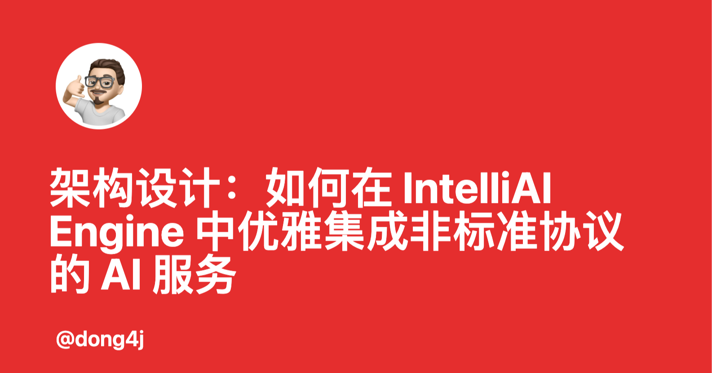
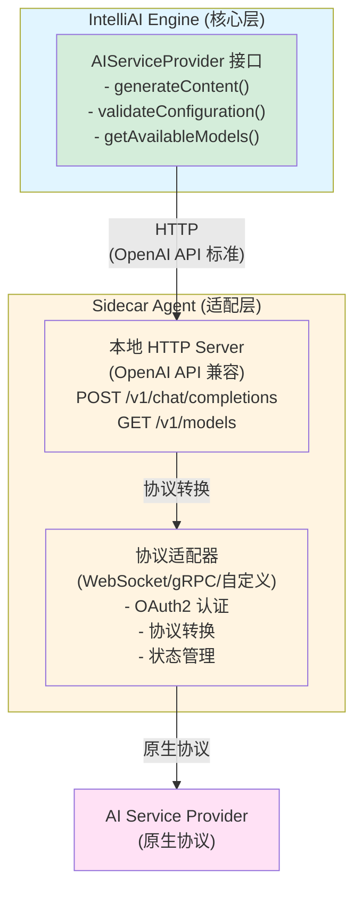

## 📋 背景与挑战

### 业务背景

IntelliAI Engine 是一个**开源项目**，作为 IntelliJ IDEA 插件的统一 AI 服务抽象层，需要对接各种 AI 服务提供商。在实际业务场景中，我们遇到了一个特殊的挑战：

**公司内部使用的星辰大模型接入需求**：

1. **安全管控约束**：
   - 公司内部的星辰大模型无法在外部环境使用
   - 由于插件是开源项目，出于安全管控的原因，**不能将内部对接逻辑直接暴露到开源代码中**
   - 内部模型的认证、连接等敏感信息必须与开源项目隔离

2. **已有工具项目**：
   - 公司内部已经在前端时间通过 Java 实现了一个对接内部星辰大模型的工具类项目
   - 该项目已经完成了 WebSocket 连接、OAuth2 认证、会话管理等核心功能
   - 项目已经能够稳定运行，并通过 Swing 界面为用户提供服务

3. **业务推广需求**：
   - 此次因为公司内部推广，需要将星辰大模型接入到现有的 Engine 插件中
   - 需要让公司内部用户能够通过 IntelliJ IDEA 插件使用星辰大模型

4. **架构设计考量**：
   - **复用性**：希望直接复用已有的工具项目，避免重复开发
   - **安全性**：保持开源项目与内部项目的职责分离，确保敏感代码不泄露
   - **职责分离**：剥离开源项目与内部项目的职责关系，降低耦合度
   - **协议适配**：只需要将已有工具项目改造成适配 OpenAI API 的协议，即实现 OpenAI API 与 WebSocket 的适配层

### 问题场景

基于上述业务背景，我们面临的技术挑战是：

IntelliAI Engine 作为统一 AI 服务抽象层，大多数服务商提供了 OpenAI 兼容的 HTTP API，但存在一些特殊情况：

1. **协议不兼容**：某些服务商（如星辰大模型）使用 WebSocket、gRPC 等非 HTTP 协议
2. **认证机制特殊**：OAuth2、自定义 Token 等非标准认证流程
3. **响应格式差异**：虽然声称兼容 OpenAI，但实际响应结构有细微差异
4. **架构约束**：Engine 已统一使用 HTTP 协议，不希望为特殊协议引入额外依赖
5. **安全隔离**：内部服务商的对接逻辑不能暴露在开源代码中

### 核心挑战

如何在**不修改 Engine 核心架构**、**不暴露内部实现细节**、**复用已有工具项目**的前提下，优雅地集成这些"异类"服务商？

---

## 🏗️ 架构设计原则

### 1. 适配器模式（Adapter Pattern）

**核心思想**：将非标准协议转换为标准 OpenAI API 格式



### 2. Sidecar 模式（Sidecar Pattern）

**核心思想**：将协议适配逻辑从 Engine 中剥离，作为独立的本地 Agent 运行

**优势**：
- ✅ **零侵入**：Engine 核心代码无需修改
- ✅ **隔离性**：协议适配逻辑独立运行，不影响 Engine 稳定性
- ✅ **可扩展**：每个非标准服务商都可以有自己的 Agent
- ✅ **轻量级**：Agent 只负责协议转换，不引入重型框架

### 3. 最小改动原则

**设计目标**：新增服务商时，Engine 核心代码改动 < 50 行

---

## 🎯 架构分层设计

### 第一层：Engine 核心层（不变）

```java
// Engine 核心接口 - 保持不变
public interface AIServiceProvider {
    String generateContent(AIChatRequest request, String apiKey, AIResponseListener listener);
    ValidationResult validateConfiguration(String apiKey);
    List<String> getAvailableModels(String apiKey);
}

// 标准 Provider 实现 - 保持不变
public abstract class AICompatibleProvider implements AIServiceProvider {
    // 统一的 HTTP 请求处理
    // 统一的错误处理
    // 统一的重试机制
}
```

**职责**：
- 提供统一的 AI 服务抽象
- 处理标准的 OpenAI API 请求
- 管理配置、认证、重试等通用逻辑

### 第二层：Provider 实现层（最小改动）

对于非标准协议的服务商，Provider 实现类只需要：

```java
public class CodefreeProvider extends AICompatibleProvider {
    
    public CodefreeProvider(Project project, AIProviderConfig config, 
                           AIModelParameters modelParameters, 
                           AIRuntimeSettings runtimeSettings) {
        super(project, config, modelParameters, runtimeSettings);
        // 关键：将 baseUrl 指向本地 Agent
        this.config.baseUrl = "http://127.0.0.1:10011/v1";
    }
    
    // 无需重写任何方法！
    // AICompatibleProvider 已经处理了所有 HTTP 请求
}
```

**改动量**：仅需 1 个 Provider 类（约 20 行代码）

### 第三层：Sidecar Agent 层（独立实现）

Agent 作为独立的 JAR 包，负责：

1. **协议转换**：WebSocket → HTTP
2. **认证处理**：OAuth2 流程
3. **状态管理**：会话、连接状态
4. **API 兼容**：提供 OpenAI 标准接口

```java
// Agent 内部实现（独立项目）
public class OpenAiApiServer {
    private HttpServer server;
    
    public void start() {
        server = HttpServer.create(new InetSocketAddress(10011), 0);
        
        // 提供 OpenAI 兼容接口
        server.createContext("/v1/chat/completions", this::handleChatCompletions);
        server.createContext("/v1/models", this::handleModels);
        
        server.start();
    }
    
    private void handleChatCompletions(HttpExchange exchange) {
        // 1. 解析 OpenAI 格式请求
        OpenAIRequest request = parseRequest(exchange);
        
        // 2. 转换为服务商协议（WebSocket）
        WebSocketMessage wsMessage = convertToWebSocket(request);
        
        // 3. 调用服务商 API
        String response = callProviderViaWebSocket(wsMessage);
        
        // 4. 转换为 OpenAI 格式响应
        OpenAIResponse openAIResponse = convertToOpenAI(response);
        
        // 5. 返回标准响应
        sendResponse(exchange, openAIResponse);
    }
}
```

---

## 🔧 实现细节：Codefree 案例

### 1. Engine 侧改动（最小化）

#### 步骤 1：添加 Provider 类型枚举

```java
// AIProviderType.java - 添加一行
CODEFREE(
    "codefree",
    "Codefree",
    "http://127.0.0.1:10011/v1",  // 指向本地 Agent
    "codefree-chat",
    false,  // Agent 内部处理认证
    false,  // URL 不可编辑（固定为本地）
    List.of("codefree-chat")
)
```

#### 步骤 2：创建 Provider 实现类

```java
// CodefreeProvider.java - 约 20 行代码
public class CodefreeProvider extends AICompatibleProvider {
    public CodefreeProvider(Project project, AIProviderConfig config,
                           AIModelParameters modelParameters,
                           AIRuntimeSettings runtimeSettings) {
        super(project, config, modelParameters, runtimeSettings);
    }
    // 无需重写任何方法，直接使用父类的 HTTP 处理逻辑
}
```

#### 步骤 3：注册到工厂类

```java
// AIServiceFactory.java - 添加一个 case
return switch (providerType) {
    // ... 其他 case
    case CODEFREE -> new CodefreeProvider(project, config, modelParameters, runtimeSettings);
};
```

**总改动量**：约 30 行代码

### 2. Agent 侧实现（独立项目）

#### 架构设计

```
codefree-agent.jar
├── HTTP Server (JDK HttpServer)
│   ├── /v1/chat/completions
│   ├── /v1/models
│   └── /health
├── WebSocket Client
│   ├── 连接管理
│   ├── 消息收发
│   └── 重连机制
├── OAuth2 Handler
│   ├── 认证流程
│   ├── Token 管理
│   └── 浏览器回调
└── Protocol Adapter
    ├── OpenAI → WebSocket
    └── WebSocket → OpenAI
```

#### 关键技术选型

**为什么不用 Spring Boot？**

| 需求          | Spring Boot | JDK HttpServer |
| ------------- | ----------- | -------------- |
| REST API 数量 | 几十上百个  | 2-3 个 ✅       |
| 启动速度      | 慢（3-5秒） | 快（<100ms）✅  |
| 内存占用      | 150MB+      | <50MB ✅        |
| 依赖复杂度    | 高          | 零依赖 ✅       |
| 生命周期管理  | 重          | 轻量 ✅         |

**结论**：对于本地 Agent，JDK 自带的 `HttpServer` 完全够用。

#### 核心实现示例

```java
// 使用 JDK HttpServer（零依赖）
HttpServer server = HttpServer.create(
    new InetSocketAddress("127.0.0.1", 10011), 0
);

server.createContext("/v1/chat/completions", exchange -> {
    // 1. 解析请求
    String body = new String(exchange.getRequestBody().readAllBytes(), UTF_8);
    JSONObject request = JSON.parseObject(body);
    
    // 2. 协议转换
    WebSocketMessage wsMsg = convertToWebSocket(request);
    
    // 3. 调用 WebSocket 服务
    String response = webSocketClient.send(wsMsg);
    
    // 4. 格式转换
    JSONObject openAIResponse = convertToOpenAIFormat(response);
    
    // 5. 返回响应
    byte[] respBytes = openAIResponse.toJSONString().getBytes(UTF_8);
    exchange.getResponseHeaders().add("Content-Type", "application/json");
    exchange.sendResponseHeaders(200, respBytes.length);
    exchange.getResponseBody().write(respBytes);
    exchange.close();
});

server.start();
```

### 3. 插件侧集成（生命周期管理）

#### Agent 管理职责

```java
// CodefreeAgentManager.java
public class CodefreeAgentManager {
    
    // 1. 下载 Agent JAR
    public Path downloadJar(String version, ProgressIndicator indicator);
    
    // 2. 启动 Agent 进程
    public long startAgent(CodefreeAgentSettings settings);
    
    // 3. 停止 Agent 进程
    public void stopAgent();
    
    // 4. 检查运行状态
    public boolean isRunning();
}
```

#### 生命周期集成

```java
// CodefreeAgentLifecycleListener.java
public class CodefreeAgentLifecycleListener 
    implements ApplicationInitializedListener, Disposable {
    
    @Override
    public void componentsInitialized() {
        // IDE 启动时，如果配置了自动启动，则启动 Agent
        if (settings.autoStart) {
            manager.startAgent(settings);
        }
    }
    
    @Override
    public void dispose() {
        // IDE 关闭时，自动停止 Agent
        if (manager.isRunning()) {
            manager.stopAgent();
        }
    }
}
```

---

## 📊 架构优势分析

### 1. 最小侵入性

| 改动项             | 代码量     | 影响范围       |
| ------------------ | ---------- | -------------- |
| 添加 Provider 类型 | 10 行      | 仅枚举类       |
| 创建 Provider 类   | 20 行      | 仅新增文件     |
| 注册到工厂         | 1 行       | 仅工厂类       |
| **总计**           | **~30 行** | **零核心改动** |

### 2. 高内聚低耦合

```
Engine 核心层
    ↓ (HTTP 协议，标准接口)
Sidecar Agent
    ↓ (原生协议)
AI 服务商
```

- **Engine ↔ Agent**：通过标准 HTTP 协议通信，完全解耦
- **Agent ↔ 服务商**：协议适配逻辑封装在 Agent 内部
- **Engine ↔ 服务商**：无直接依赖

### 3. 可扩展性

**新增非标准服务商的步骤**：

1. 创建 Agent JAR（独立项目）
2. 在 Engine 中添加 Provider 类型（1 行）
3. 创建 Provider 类（20 行）
4. 注册到工厂（1 行）

**无需修改**：
- ❌ Engine 核心接口
- ❌ 其他 Provider 实现
- ❌ 配置管理逻辑
- ❌ UI 组件

### 4. 稳定性保障

- **隔离性**：Agent 崩溃不影响 Engine
- **可观测性**：Agent 独立日志，便于排查
- **可测试性**：Agent 可独立测试，无需启动 IDE

---

## 🎓 设计模式应用

### 1. 适配器模式（Adapter Pattern）

```
非标准协议 ──[适配器]──> 标准 OpenAI API
```

**实现**：Agent 作为适配器，将 WebSocket/gRPC 等协议转换为 HTTP

### 2. 外观模式（Facade Pattern）

```
复杂系统 ──[外观]──> 简单接口
```

**实现**：Agent 封装 OAuth2、WebSocket 等复杂逻辑，对外提供简单的 HTTP 接口

### 3. 策略模式（Strategy Pattern）

```
不同服务商 ──[策略]──> 统一接口
```

**实现**：每个服务商有自己的 Provider 实现，但都实现 `AIServiceProvider` 接口

### 4. Sidecar 模式（Sidecar Pattern）

```
主应用 ──[Sidecar]──> 辅助功能
```

**实现**：Engine 作为主应用，Agent 作为 Sidecar 提供协议适配能力

---

## 📈 性能与资源考量

### 1. 启动性能

| 方案                 | 启动时间 | 内存占用           |
| -------------------- | -------- | ------------------ |
| Spring Boot Agent    | 3-5 秒   | 150MB+             |
| JDK HttpServer Agent | <100ms   | <50MB ✅            |
| 直接集成到 Engine    | N/A      | 增加 Engine 复杂度 |

### 2. 运行时开销

- **网络延迟**：localhost 通信，延迟 <1ms（可忽略）
- **进程开销**：Agent 作为独立进程，不影响 IDE 主进程
- **资源占用**：Agent 仅处理协议转换，资源占用极小

### 3. 可扩展性

- **多 Agent 支持**：每个非标准服务商可独立运行 Agent
- **版本管理**：Agent 可独立升级，无需更新 Engine
- **故障隔离**：单个 Agent 故障不影响其他服务商

---

## 🔍 最佳实践

### 1. Agent 设计原则

✅ **轻量级**：使用 JDK 自带组件，避免引入重型框架  
✅ **单一职责**：只负责协议转换，不处理业务逻辑  
✅ **标准化**：严格遵循 OpenAI API 规范  
✅ **可观测**：提供健康检查、日志等可观测性接口  

### 2. Engine 集成原则

✅ **零侵入**：不修改核心接口和抽象类  
✅ **最小改动**：新增服务商改动 <50 行代码  
✅ **向后兼容**：新功能不影响现有服务商  
✅ **配置驱动**：通过配置而非代码控制行为  

### 3. 错误处理

```java
// Agent 侧：优雅降级
try {
    return callProviderViaWebSocket(request);
} catch (WebSocketException e) {
    // 返回标准错误格式
    return createOpenAIErrorResponse(e);
}

// Engine 侧：统一处理
// AICompatibleProvider 已处理所有 HTTP 错误
// 无需 Provider 实现类额外处理
```

---

## 🚀 未来扩展方向

### 1. 多协议支持

当前架构已支持：
- ✅ HTTP (标准)
- ✅ WebSocket (通过 Agent)
- 🔄 gRPC (可扩展)
- 🔄 自定义协议 (可扩展)

### 2. 智能路由

```java
// 未来可支持：根据请求类型自动选择协议
if (request.requiresStreaming()) {
    return useWebSocketProvider();
} else {
    return useHttpProvider();
}
```

### 3. Agent 集群

```java
// 未来可支持：多个 Agent 实例负载均衡
List<AgentInstance> agents = discoverAgents();
AgentInstance selected = loadBalancer.select(agents);
```


