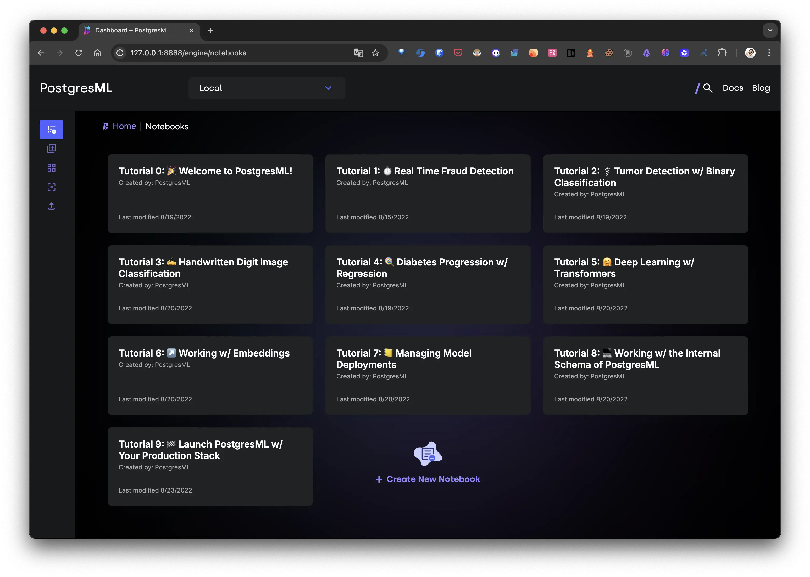
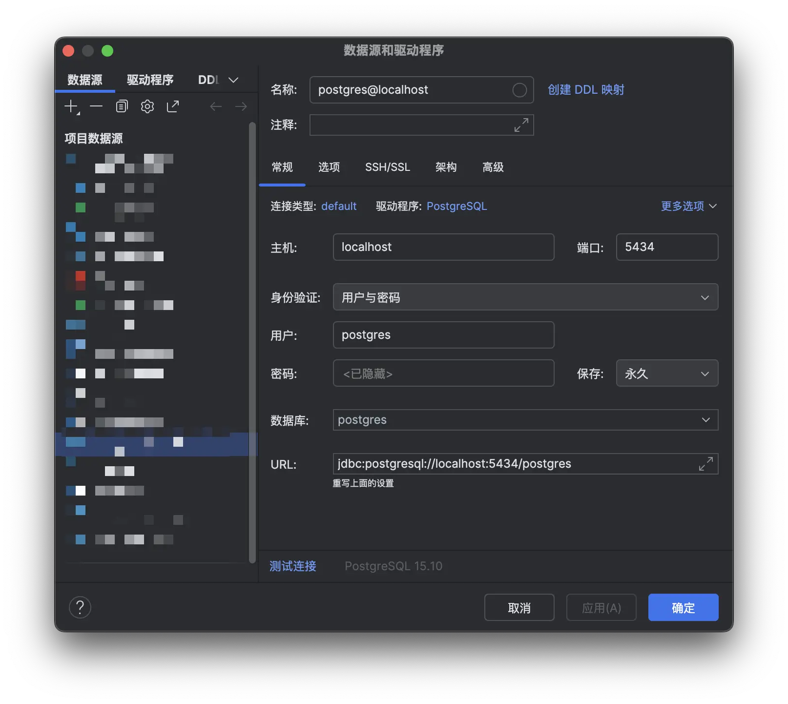
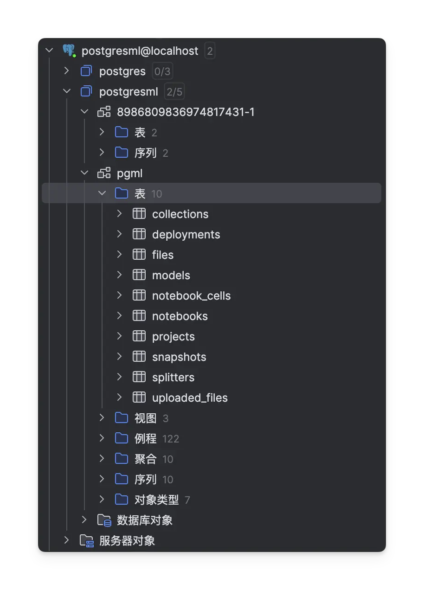
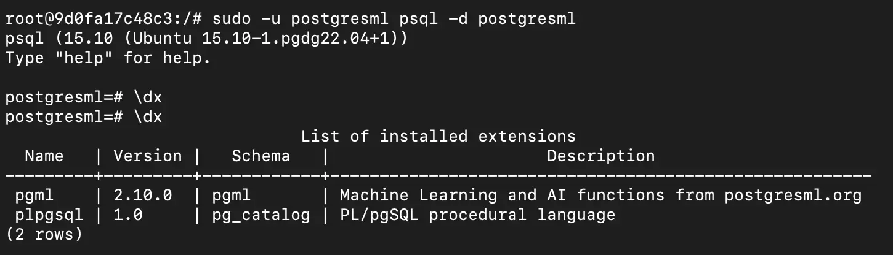
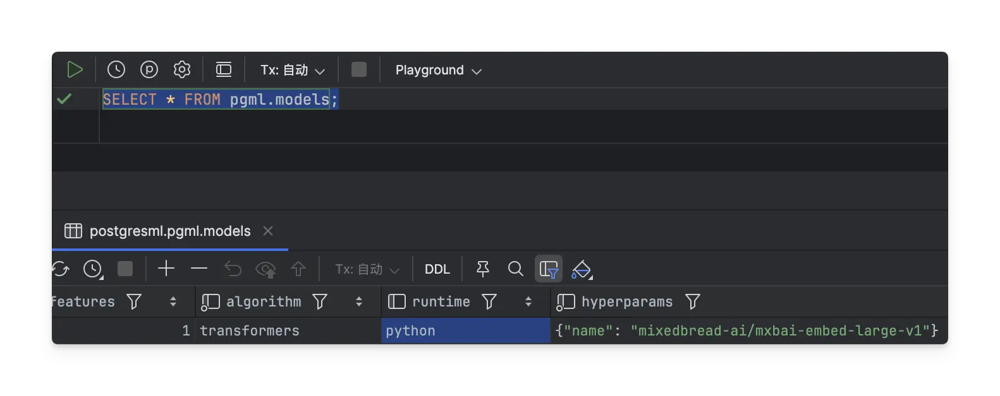
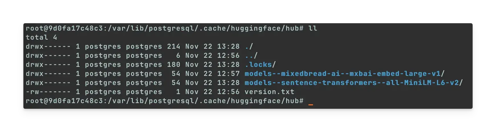
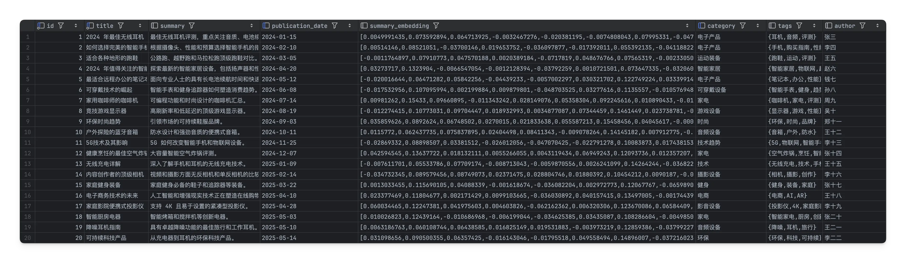

## 背景

随着人工智能技术的快速发展，Java 开发者也在积极探索如何将 AI 能力集成到企业级应用中。Spring 团队发布的 Spring AI 项目为 Java 生态带来了强大的 AI 集成能力。特别是 [Spring AI 1.1.0](https://docs.spring.io/spring-ai/reference/) 版本的正式发布，使得使用 Java 开发 AI 应用变得更加便捷。

在 AI 应用开发中，向量数据库扮演着重要角色，特别是在处理文本嵌入和语义搜索场景下。PostgresML 作为一个强大的 PostgreSQL 扩展，能够直接在数据库内部实现机器学习功能，为 AI 应用提供了高效的向量存储和检索能力。

本文将详细介绍如何在 Docker 环境中部署和配置 PostgresML，为后续的 AI 应用开发打下坚实基础。

## 简介

PostgresML 是一个强大的 PostgreSQL 扩展，它将机器学习功能直接集成到数据库内部。通过 pgml 扩展，开发者可以在数据库层面实现文本嵌入、语义搜索等 AI 功能，无需额外的外部服务依赖。

在 Docker 容器中部署 PostgresML 具有以下优势：
- 环境一致性：确保开发、测试和生产环境的一致性
- 快速部署：通过预构建镜像快速启动服务
- 资源隔离：容器化部署便于资源管理和隔离
- 易于维护：简化的升级和备份流程

本指南将详细介绍如何在 Docker 环境中部署 PostgresML，包括镜像拉取、容器配置、扩展启用以及实际应用示例，帮助读者快速掌握这一强大的数据库内 AI 解决方案。

## **PostgresML 核心功能**

PostgresML 为 PostgreSQL 数据库带来了强大的机器学习能力，让开发者能够通过标准 SQL 语法直接在数据库内部执行 AI 相关操作。以下是其核心功能特性：

### **内置机器学习模型**
PostgresML 集成了多种预训练模型，包括：
- **文本嵌入模型**：如 `sentence-transformers/all-MiniLM-L6-v2`，用于生成语义向量
- **多语言支持**：支持中文、英文等多种语言的文本处理
- **分类模型**：支持文本分类、情感分析、垃圾邮件检测等任务
- **回归模型**：用于数值预测、评分等场景
- **自定义模型**：支持导入和训练自定义的机器学习模型

### **向量存储与检索**
通过集成 pgvector 扩展，PostgresML 提供了高效的向量存储和相似性搜索功能：
- **高维向量支持**：支持最高 2000 维的向量数据存储
- **多种相似性度量算法**：
  - 余弦距离（Cosine Distance）：适合文本相似度计算
  - 欧氏距离（Euclidean Distance）：适合数值型向量比较
  - 曼哈顿距离（Manhattan Distance）：适合特定场景的向量比较
- **索引优化**：
  - IVFFlat（Inverted File Flat）：适合大规模数据集的近似搜索
  - HNSW（Hierarchical Navigable Small World）：适合高精度搜索
  - 支持并行索引创建，提升构建效率

### **简化的工作流程**
- **一站式解决方案**：无需外部服务依赖，所有操作都在数据库内完成
- **标准 SQL 接口**：降低学习成本，开发者可以使用熟悉的 SQL 语法
- **自动模型管理**：自动下载和缓存所需的机器学习模型
- **事务安全**：所有机器学习操作都在数据库事务中执行，确保数据一致性
- **权限控制**：基于 PostgreSQL 的角色权限系统，确保数据安全

### **高性能处理**
- **CPU/GPU 加速支持**：充分利用硬件资源提升处理速度
- **批量处理优化**：支持大规模数据的高效处理
- **内存优化**：智能内存管理确保稳定运行
- **并行计算**：支持多线程并行处理，提升计算效率
- **缓存机制**：模型和计算结果缓存，减少重复计算开销

### **企业级特性**
- **高可用性支持**：支持 PostgreSQL 的高可用部署方案
- **备份恢复**：与 PostgreSQL 备份机制完全兼容
- **监控集成**：支持 PostgreSQL 的监控工具和指标
- **扩展性**：支持水平扩展和垂直扩展
- **安全合规**：符合企业数据安全要求

这些功能使 PostgresML 成为企业级 AI 应用的理想选择，特别适用于需要高性能向量检索和文本分析的场景。

### **步骤 1：拉取 PostgresML Docker 镜像**

首先从 GitHub Container Registry 拉取官方的 PostgresML Docker 镜像。2.10.0 版本是一个稳定的发行版，预装了 PostgreSQL 15 和 pgml 扩展。

#### **镜像版本说明**
PostgresML 提供多个版本，每个版本都有其特定的功能和兼容性：
- **2.10.0**：稳定版本，包含 PostgreSQL 15 和完整的机器学习功能
- **2.8.x**：最新版本，可能包含新功能和性能优化
- **2.6.x**：旧版本，适用于需要向后兼容的场景

#### **拉取镜像**
```shell
docker pull ghcr.io/postgresml/postgresml:2.10.0
```

#### **镜像组成**
PostgresML 镜像包含以下组件：
- **PostgreSQL 15**：作为数据库引擎
- **pgml 扩展**：核心机器学习功能
- **pgvector 扩展**：向量数据类型和相似性搜索
- **Python 环境**：用于运行机器学习模型
- **预训练模型**：常用的文本嵌入和分类模型
- **控制面板**：Web 界面用于管理和监控

#### **验证镜像**
拉取完成后，可以通过以下命令验证镜像是否成功下载：

```shell
docker images | grep postgresml
```

预期输出：

```
REPOSITORY                           TAG       IMAGE ID       CREATED        SIZE
ghcr.io/postgresml/postgresml       2.10.0    xxxxxxxxxxxx   X days ago     1.2GB
```

#### **镜像详细信息**
查看镜像的详细信息：
```shell
docker inspect ghcr.io/postgresml/postgresml:2.10.0
```

这个命令会显示镜像的配置信息，包括：
- 环境变量
- 端口配置
- 数据卷挂载点
- 启动命令
- 健康检查配置

#### **镜像大小考虑**
PostgresML 镜像相对较大（约 1.2GB），主要因为：
- 包含完整的 PostgreSQL 数据库
- 预装了多个机器学习模型
- 包含 Python 运行时环境
- 集成了各种依赖库

在生产环境中，建议：
- 使用镜像仓库进行本地缓存
- 考虑使用多阶段构建优化镜像大小
- 定期更新镜像以获取安全补丁

### **步骤 2：创建 Docker 卷**

为了确保 PostgreSQL 数据在容器重启或删除后仍然得以保留，我们需要创建一个 Docker 卷来持久化存储数据。

#### **Docker 卷的优势**
使用 Docker 卷进行数据持久化具有以下优势：
- **数据持久性**：容器删除后数据仍然保留
- **性能优化**：直接绑定到主机文件系统，性能优于容器内存储
- **备份便利**：可以轻松备份和恢复数据
- **跨容器共享**：多个容器可以共享同一个数据卷
- **管理简单**：Docker 提供了完整的卷管理命令

#### **创建数据卷**
```shell
docker volume create pgml_data
```

#### **验证卷创建**
创建完成后，可以通过以下命令验证卷是否创建成功：

```shell
docker volume ls | grep pgml_data
```

预期输出：

```
DRIVER    VOLUME NAME
local     pgml_data
```

#### **查看卷详细信息**
```shell
docker volume inspect pgml_data
```

输出示例：
```json
[
    {
        "CreatedAt": "2025-11-22T19:45:45+08:00",
        "Driver": "local",
        "Labels": null,
        "Mountpoint": "/var/lib/docker/volumes/pgml_data/_data",
        "Name": "pgml_data",
        "Options": null,
        "Scope": "local"
    }
]
```

#### **卷的存储位置**
- **Linux**：`/var/lib/docker/volumes/pgml_data/_data`
- **macOS**：`~/Library/Containers/com.docker.docker/Data/volumes/pgml_data/_data`
- **Windows**：`C:\Users\[username]\AppData\Local\Docker\volumes\pgml_data\_data`

#### **卷管理最佳实践**
1. **命名规范**：使用有意义的名称，如 `pgml_data`、`pgml_backup` 等
2. **定期清理**：删除不再使用的卷以释放磁盘空间
3. **备份策略**：定期备份卷数据到外部存储
4. **权限管理**：确保容器有正确的读写权限

#### **清理未使用的卷**
```shell
# 查看所有卷
docker volume ls

# 删除未使用的卷
docker volume prune

# 删除特定卷
docker volume rm pgml_data
```

#### **高级配置**
对于生产环境，可以考虑以下高级配置：

```shell
# 创建具有特定驱动程序的卷
docker volume create \
  --driver local \
  --opt type=tmpfs \
  --opt device=tmpfs \
  --opt o=size=100m,uid=1000 \
  pgml_data_tmp

# 创建具有标签的卷
docker volume create \
  --label environment=production \
  --label application=postgresml \
  pgml_data_prod
```

这个卷将在后续步骤中挂载到容器的 `/var/lib/postgresql` 目录，确保数据库文件得到持久化存储。在生产环境中，建议定期备份这个卷以防止数据丢失。

### **步骤 3：运行 PostgresML 容器**

现在我们可以启动 PostgresML 容器了。在运行命令中，我们将：
- 将之前创建的 `pgml_data` 卷挂载到容器的 `/var/lib/postgresql` 目录以持久化数据
- 将容器的 5432 端口映射到主机的 5434 端口，避免与本地 PostgreSQL 实例冲突
- 将容器的 8000 端口映射到主机的 8888 端口，用于访问 PostgresML 控制面板
- 设置 PostgreSQL 的 `postgres` 用户密码

#### **基础运行命令**
```shell
docker run -d \
  --name pgml_postgres \
  -v pgml_data:/var/lib/postgresql \
  -p 5434:5432 \
  -p 8888:8000 \
  -e POSTGRES_PASSWORD=secure_password_here \
  ghcr.io/postgresml/postgresml:2.10.0 \
  tail -f /dev/null
```

> **注意**：请将 `secure_password_here` 替换为你自己的强密码。
>
> 启动成功后访问 [控制台: http://127.0.0.1:8888/engine/notebooks](http://127.0.0.1:8888/engine/notebooks)
>
> 

> Docker-compose:
> ```yml
> services:
>   pgml_postgres:
>     image: ghcr.io/postgresml/postgresml:2.10.0
>     container_name: pgml_postgres
>     environment:
>       POSTGRES_PASSWORD: secure_password_here
>     ports:
>       - "5434:5432"
>       - "8888:8000"
>     volumes:
>       - pgml_data:/var/lib/postgresql
>     command: tail -f /dev/null
>     restart: unless-stopped
> 
> volumes:
>   pgml_data:
> ```

#### **参数详解**

- `-d`：后台运行容器
- `--name pgml_postgres`：为容器指定名称
- `-v pgml_data:/var/lib/postgresql`：挂载数据卷
- `-p 5434:5432`：端口映射（主机:容器）
- `-p 8888:8000`：控制面板端口映射
- `-e POSTGRES_PASSWORD`：设置数据库密码

#### **生产环境增强配置**
对于生产环境，建议使用以下增强配置：

```shell
docker run -d \
  --name pgml_postgres \
  -v pgml_data:/var/lib/postgresql \
  -p 5434:5432 \
  -p 8888:8000 \
  -e POSTGRES_PASSWORD=secure_password_here \
  -e POSTGRES_DB=postgresml \
  -e POSTGRES_USER=postgresml_user \
  -e PGDATA=/var/lib/postgresql/data/pgdata \
  --memory=4g \
  --cpus=2.0 \
  --restart=unless-stopped \
  --health-cmd="pg_isready -U postgresml_user -d postgresml" \
  --health-interval=30s \
  --health-timeout=10s \
  --health-retries=3 \
  ghcr.io/postgresml/postgresml:2.10.0 \
  tail -f /dev/null
```

#### **资源限制说明**
- `--memory=4g`：限制容器内存使用为 4GB
- `--cpus=2.0`：限制容器使用 2 个 CPU 核心
- `--restart=unless-stopped`：容器停止时自动重启
- `--health-*`：健康检查配置

#### **验证容器状态**
启动容器后，等待片刻让服务完全启动，然后通过以下命令确认容器正在运行：

```shell
docker ps | grep pgml_postgres
```

预期输出：

```
CONTAINER ID   IMAGE                                                                     COMMAND                  CREATED          STATUS                       PORTS                                                                                      NAMES
9d0fa17c48c3   ghcr.io/postgresml/postgresml:2.10.0                                      "bash /app/entrypoin…"   18 seconds ago   Up 17 seconds                0.0.0.0:5434->5432/tcp, [::]:5434->5432/tcp, 0.0.0.0:8888->8000/tcp, [::]:8888->8000/tcp   pgml_postgres
```

#### **查看容器日志**
你也可以通过查看容器日志来确认服务启动情况：

```shell
docker logs pgml_postgres
```

在日志中应该能看到类似以下的成功启动信息：

```
Starting PostgresML
 * Starting PostgreSQL 15 database server
   ...done.
Starting dashboard
```

#### **健康检查**
查看容器健康状态：
```shell
docker inspect pgml_postgres --format='{{.State.Health.Status}}'
```

#### **调试模式**
如果遇到容器启动问题，可以尝试以下命令来保持容器运行以便调试：

```shell
docker rm -f pgml_postgres
docker run -d \
  --name pgml_postgres \
  -v pgml_data:/var/lib/postgresql \
  -p 5434:5432 \
  -p 8888:8000 \
  -e POSTGRES_PASSWORD=secure_password_here \
  ghcr.io/postgresml/postgresml:2.10.0 \
  tail -f /dev/null
```

使用 `tail -f /dev/null` 命令可以让容器保持运行状态，方便后续进入容器进行故障排查。

#### **进入容器调试**
```shell
docker exec -it pgml_postgres bash
```

在容器内，你可以：
- 检查 PostgreSQL 配置文件
- 查看日志文件
- 执行数据库命令
- 检查扩展安装状态

#### **容器管理命令**
```shell
# 停止容器
docker stop pgml_postgres

# 启动容器
docker start pgml_postgres

# 重启容器
docker restart pgml_postgres

# 删除容器
docker rm -f pgml_postgres

# 查看容器资源使用
docker stats pgml_postgres
```

### **步骤 4：连接到数据库**

现在我们可以通过 `psql` 客户端连接到 PostgreSQL 数据库。首先连接到默认的 `postgres` 数据库：

```shell
psql -h localhost -p 5434 -U postgres -d postgres
```

系统会提示输入密码，请输入在步骤3中设置的密码。

> 或者直接使用 DataGrip
>
> 

连接成功后，默认已经为机器学习任务创建一个专门的数据库：



然后连接到新创建的数据库：

```shell
psql -h localhost -p 5434 -U postgres -d postgresml
```

#### **故障排除**

如果遇到身份验证失败的问题，可能需要检查容器中的 `pg_hba.conf` 配置文件：

```shell
docker exec -it pgml_postgres bash
cat /var/lib/postgresql/data/pg_hba.conf
```

确保配置文件中包含以下行以允许网络连接：

```
host all all 0.0.0.0/0 md5
```

如果缺少此配置，需要添加并重新加载 PostgreSQL 配置：

```shell
# 在容器内执行
echo "host all all 0.0.0.0/0 md5" >> /var/lib/postgresql/data/pg_hba.conf
su - postgres
psql -c "SELECT pg_reload_conf();"
exit
exit
```

然后重新尝试连接数据库。

### **步骤 5：启用 pgml 和 vector 扩展**

连接到 `postgresml` 数据库后，我们需要启用 PostgresML 和 pgvector 扩展：

> 首先查看一下默认的扩展信息:
> ```
> \dx
> ```
>
> 

```sql
# 已经存在了不需要创建了
# CREATE EXTENSION IF NOT EXISTS pgml;
CREATE EXTENSION IF NOT EXISTS vector;
```

可以通过以下命令验证扩展是否成功安装：

```sql
\dx
```

预期输出：

```
                              List of installed extensions
  Name   | Version |   Schema   |                      Description
---------+---------+------------+-------------------------------------------------------
 pgml    | 2.10.0  | pgml       | Machine Learning and AI functions from postgresml.org
 plpgsql | 1.0     | pg_catalog | PL/pgSQL procedural language
 vector  | 0.5.0   | public     | vector data type and ivfflat access method
```

这两个扩展各自承担不同的功能：
- `pgml` 扩展提供了机器学习功能，包括文本嵌入、模型推理等, 比如:

  ```sql
  # 用 SQL 调用 LLM
  SELECT pgml.chat('gpt-4', '写一段 SQL 连接示例');
  # 文本 embedding
  SELECT pgml.embed('voyage-2-lite', 'hello world');
  # 模型列表
  SELECT * FROM pgml.models;
  ```

  默认自带一个 embedding 模型:

  

  模型下载位置: `/var/lib/postgresql/.cache/huggingface` (`models--sentence-transformers--all-MiniLM-L6-v2` 是后续步骤下载的, 这里是补录的图片, 默认只有 `models--mixedbread-ai--mxbai-embed-large-v1`)

  
- `plpgsql` 是 PostgreSQL 默认安装的内置扩展，用于写**存储过程、触发器、函数**
- `vector` 扩展提供了向量数据类型和相似性搜索功能

启用这些扩展后，我们就可以开始使用 PostgresML 的机器学习功能了。

### **步骤 6：示例：创建文章表**

创建一个用于存储文章的表，其中包含一个用于嵌入的 VECTOR(384) 列，适用于像 sentence-transformers/all-MiniLM-L6-v2 这样的模型：

#### **表结构设计**
```sql
CREATE TABLE articles (
    id SERIAL PRIMARY KEY,
    title VARCHAR(255) NOT NULL,
    summary TEXT,
    publication_date DATE,
    summary_embedding VECTOR(384),
    category VARCHAR(100),
    tags TEXT[],
    author VARCHAR(100),
    view_count INTEGER DEFAULT 0,
    created_at TIMESTAMP DEFAULT CURRENT_TIMESTAMP,
    updated_at TIMESTAMP DEFAULT CURRENT_TIMESTAMP
);
```

#### **创建索引优化查询**
```sql
-- 为常用查询字段创建索引
CREATE INDEX idx_articles_title ON articles(title);
CREATE INDEX idx_articles_category ON articles(category);
CREATE INDEX idx_articles_publication_date ON articles(publication_date);
CREATE INDEX idx_articles_created_at ON articles(created_at);

-- 为向量字段创建索引（后续步骤中会详细说明）
-- CREATE INDEX idx_articles_embedding ON articles USING ivfflat (summary_embedding vector_cosine_ops) WITH (lists = 100);
```

#### **表结构说明**
- **id**：主键，自增序列
- **title**：文章标题，必填字段
- **summary**：文章摘要，用于生成嵌入向量
- **publication_date**：发布日期，便于时间范围查询
- **summary_embedding**：384维向量，存储文本嵌入
- **category**：文章分类，便于分类查询
- **tags**：标签数组，支持多标签分类
- **author**：作者信息
- **view_count**：浏览量统计
- **created_at/updated_at**：时间戳记录

#### **插入示例数据**
请插入 20 篇与电子商务相关的文章示例：

```sql
INSERT INTO articles (title, summary, publication_date, category, tags, author) VALUES
('2024 年最佳无线耳机', '最佳无线耳机评测，重点关注音质、电池续航时间和降噪效果。', '2024-01-15', '电子产品', ARRAY['耳机', '音频', '评测'], '张三'),
('如何选择完美的智能手机', '根据摄像头、性能和预算选择智能手机的指南。', '2024-02-10', '电子产品', ARRAY['手机', '购买指南', '性能'], '李四'),
('适合各种地形的跑鞋', '公路跑、越野跑和马拉松跑顶级跑鞋对比。', '2024-03-05', '运动装备', ARRAY['跑鞋', '运动', '评测'], '王五'),
('2024 年值得关注的智能家居设备', '探索最新的智能家居设备，包括扬声器和恒温器。', '2024-04-20', '智能家居', ARRAY['智能家居', '物联网', '趋势'], '赵六'),
('最适合远程办公的笔记本电脑', '面向专业人士的具有长电池续航时间和快速处理器的笔记本电脑评测。', '2024-05-12', '电子产品', ARRAY['笔记本', '办公', '性能'], '钱七'),
('可穿戴技术的崛起', '智能手表和健身追踪器如何塑造消费趋势。', '2024-06-08', '可穿戴设备', ARRAY['智能手表', '健身', '趋势'], '孙八'),
('家用咖啡师的咖啡机', '可编程功能和时尚设计的咖啡机汇总。', '2024-07-14', '家电', ARRAY['咖啡机', '家电', '评测'], '周九'),
('竞技游戏显示器', '高刷新率和低延迟的顶级游戏显示器。', '2024-08-19', '游戏设备', ARRAY['显示器', '游戏', '性能'], '吴十'),
('环保时尚趋势', '引领市场的可持续鞋服品牌。', '2024-09-03', '时尚', ARRAY['环保', '时尚', '品牌'], '郑十一'),
('户外探险的蓝牙音箱', '防水设计和强劲音质的便携式音箱。', '2024-10-11', '音频设备', ARRAY['音箱', '户外', '防水'], '王十二'),
('5G技术及其影响', '5G 如何改变智能手机和物联网设备。', '2024-11-25', '技术趋势', ARRAY['5G', '物联网', '智能手机'], '李十三'),
('健康烹饪的最佳空气炸锅', '大容量智能空气炸锅评测。', '2024-12-07', '家电', ARRAY['空气炸锅', '烹饪', '智能'], '张十四'),
('无线充电详解', '深入了解手机和耳机的无线充电技术。', '2025-01-09', '技术', ARRAY['无线充电', '技术', '手机'], '王十五'),
('内容创作者的顶级相机', '视频和摄影方面无反相机和单反相机的比较。', '2025-02-14', '摄影设备', ARRAY['相机', '摄影', '创作'], '李十六'),
('家庭健身装备', '家庭健身必备的鞋子和追踪器等装备。', '2025-03-22', '健身', ARRAY['健身', '装备', '家庭'], '张十七'),
('电子商务技术的未来', '人工智能和增强现实技术正在塑造在线购物体验。', '2025-04-10', '电商', ARRAY['电商', 'AI', 'AR'], '王十八'),
('家庭影院便携式投影仪', '支持 4K 且易于设置的紧凑型投影仪。', '2025-04-28', '影音设备', ARRAY['投影仪', '4K', '家庭影院'], '李十九'),
('智能厨房电器', '智能烤箱和搅拌机等创新电器。', '2025-05-03', '家电', ARRAY['智能家电', '厨房', '创新'], '张二十'),
('降噪耳机指南', '具有卓越降噪功能的最佳旅行和工作耳机。', '2025-05-10', '音频设备', ARRAY['降噪', '耳机', '旅行'], '王二一'),
('可持续科技产品', '从充电器到耳机的环保科技产品。', '2025-05-14', '环保', ARRAY['环保', '科技', '可持续'], '李二二');
```

#### **验证数据插入**
```sql
-- 查看所有文章
SELECT * FROM articles;

-- 按分类统计文章数量
SELECT category, COUNT(*) as article_count
FROM articles
GROUP BY category
ORDER BY article_count DESC;

-- 查看标签分布
SELECT unnest(tags) as tag, COUNT(*) as count
FROM articles
GROUP BY tag
ORDER BY count DESC;

-- 查看作者贡献
SELECT author, COUNT(*) as article_count
FROM articles
GROUP BY author
ORDER BY article_count DESC;
```

#### **数据质量检查**
```sql
-- 检查是否有缺失的摘要
SELECT id, title
FROM articles
WHERE summary IS NULL OR summary = '';

-- 检查日期范围
SELECT MIN(publication_date) as earliest_date,
       MAX(publication_date) as latest_date
FROM articles;

-- 检查标题长度
SELECT id, title, LENGTH(title) as title_length
FROM articles
ORDER BY title_length DESC
LIMIT 5;
```

### **步骤 7：使用 pgml.embed 生成嵌入**

使用 pgml.embed 函数为摘要列生成词嵌入。sentence-transformers/all-MiniLM-L6-v2 模型速度快，可生成 384 维词嵌入，并且对于小型数据集来说可靠：

#### **嵌入生成基础操作**
```sql
UPDATE articles
SET summary_embedding = pgml.embed('sentence-transformers/all-MiniLM-L6-v2', summary);
```

> 操作完成后, `summary_embedding` 字段存储向量化数据:
>
> 

#### **模型选择说明**

PostgresML 支持多种文本嵌入模型，每种模型都有其特点：

| 模型名称 | 维度 | 大小 | 特点 | 适用场景 |
|---------|------|------|------|---------|
| `sentence-transformers/all-MiniLM-L6-v2` | 384 | 23MB | 速度快，轻量级 | 通用文本嵌入 |
| `BAAI/bge-small-en-v1.5` | 512 | 33MB | 质量高，支持中文 | 中英文混合文本 |
| `sentence-transformers/all-mpnet-base-v2` | 768 | 110MB | 高质量，较大 | 高精度语义搜索 |
| `intfloat/multilingual-e5-small` | 384 | 24MB | 多语言支持 | 多语言环境 |

#### **批量生成嵌入**
对于大量数据，建议使用批量处理以提高效率：

```sql
-- 分批处理，避免内存问题
WITH batch AS (
  SELECT id, summary
  FROM articles
  WHERE summary_embedding IS NULL
  LIMIT 10
)
UPDATE articles a
SET summary_embedding = pgml.embed('sentence-transformers/all-MiniLM-L6-v2', b.summary)
FROM batch b
WHERE a.id = b.id;
```

#### **监控嵌入生成进度**
首次使用时，由于模型（约 23MB）需要从 Hugging Face 下载，因此处理 20 行数据可能需要几秒到几分钟。请检查进度：

```sql
-- 检查已生成嵌入的文章数量
SELECT count(*) FROM articles WHERE summary_embedding IS NOT NULL;

-- 查看处理进度
SELECT
  COUNT(*) as total_articles,
  COUNT(CASE WHEN summary_embedding IS NOT NULL THEN 1 END) as embedded_articles,
  COUNT(CASE WHEN summary_embedding IS NULL THEN 1 END) as pending_articles,
  ROUND(COUNT(CASE WHEN summary_embedding IS NOT NULL THEN 1 END) * 100.0 / COUNT(*), 2) as progress_percentage
FROM articles;
```

#### **验证嵌入质量**
```sql
-- 验证嵌入是否成功生成
SELECT id, title, summary_embedding IS NOT NULL AS has_embedding
FROM articles
LIMIT 5;

-- 检查嵌入向量维度
SELECT
    id,
    title,
    vector_dims(summary_embedding) AS embedding_dimension,
    summary_embedding IS NOT NULL AS has_embedding
FROM articles
WHERE summary_embedding IS NOT NULL
LIMIT 5;
```

预期输出：

```
 id |                   title                   | embedding_dimension | has_embedding
----+-------------------------------------------+---------------------+---------------
  1 | 2024 年最佳无线耳机                |                 384 | t
  2 | 如何选择完美的智能手机         |                 384 | t
  3 | 适合各种地形的跑鞋               |                 384 | t
  4 | 2024 年值得关注的智能家居设备 |                 384 | t
  5 | 最适合远程办公的笔记本电脑   |                 384 | t
```

#### **嵌入向量分析**
```sql
-- 计算嵌入向量的统计信息
SELECT
    COUNT(*) AS vector_count,
    MIN(vector_dims(summary_embedding)) AS min_dimension,
    MAX(vector_dims(summary_embedding)) AS max_dimension,
    AVG(vector_dims(summary_embedding)) AS avg_dimension
FROM articles
WHERE summary_embedding IS NOT NULL;

-- 检查是否有异常向量
SELECT
    id,
    title,
    vector_dims(summary_embedding) AS dimension
FROM articles
WHERE summary_embedding IS NOT NULL
  AND vector_dims(summary_embedding) != 384;
```

#### **错误处理和重试机制**
如果嵌入生成失败，可以使用以下方法处理：

```sql
-- 创建错误记录表
CREATE TABLE embedding_errors (
  id SERIAL PRIMARY KEY,
  article_id INTEGER,
  error_message TEXT,
  created_at TIMESTAMP DEFAULT CURRENT_TIMESTAMP
);

-- 重新生成失败的嵌入
UPDATE articles
SET summary_embedding = pgml.embed('sentence-transformers/all-MiniLM-L6-v2', summary)
WHERE summary_embedding IS NULL
  AND id IN (
    SELECT article_id FROM embedding_errors
  );

-- 记录成功情况
DELETE FROM embedding_errors
WHERE article_id IN (
  SELECT id FROM articles WHERE summary_embedding IS NOT NULL
);
```

#### **模型切换和对比**
如果嵌入速度慢或失败（例如，由于网络问题），请尝试使用替代模型：

```sql
-- 使用 BAAI/bge-small-en-v1.5 模型（支持中文）
UPDATE articles
SET summary_embedding = pgml.embed('BAAI/bge-small-en-v1.5', summary)
WHERE summary_embedding IS NULL;

-- 或者使用更高质量的模型
UPDATE articles
SET summary_embedding = pgml.embed('sentence-transformers/all-mpnet-base-v2', summary)
WHERE summary_embedding IS NULL;
```

#### **嵌入缓存管理**
PostgresML 会自动缓存下载的模型，但你可以手动管理缓存：

```sql
-- 查看已缓存的模型
$ docker exec -it pgml_postgres ls -lh /var/lib/postgresql/.cache/huggingface/hub
total 4.0K
drwx------ 1 postgres postgres 54 Nov 22 12:57 models--mixedbread-ai--mxbai-embed-large-v1
drwx------ 1 postgres postgres 54 Nov 22 13:28 models--sentence-transformers--all-MiniLM-L6-v2
-rw------- 1 postgres postgres  1 Nov 22 12:56 version.txt

-- 清理缓存（谨慎使用）
$ docker exec -it pgml_postgres rm -rf /var/lib/postgresql/.cache/huggingface/*
```

现在我们已经为列摘要设置了嵌入，可以进入下一步的语义搜索操作。

### **步骤 8：使用 pgvector 执行语义搜索**

使用 pgvector 的余弦距离运算符 (<=>) 进行语义搜索。例如，使用同一模型查找与"无线技术趋势"相关的文章：

#### **基础语义搜索**
```sql
-- 查找与"无线技术趋势"相关的文章
SELECT id, title, summary, publication_date
FROM articles
ORDER BY summary_embedding <=> pgml.embed('sentence-transformers/all-MiniLM-L6-v2', 'wireless technology trends')::vector
LIMIT 3;
```

预期输出：

```
id | title | summary | publication_date
----+------------------------------+-----------------------------------------------------+------------------
 11 | 5G 技术及其影响 | 5G 如何改变智能手机和物联网设备 | 2024-11-25
 13 | 无线充电详解 | 深入了解无线充电技术…… | 2025-01-09
  1 | 2024 年最佳无线耳机 | 最佳无线耳机评测…… | 2024-01-15
```

#### **语义搜索原理**
语义搜索基于向量相似度计算，主要使用以下运算符：

| 运算符 | 描述 | 适用场景 |
|--------|------|----------|
| `<=>` | 余弦距离 | 文本相似度，方向向量比较 |
| `<->` | 欧氏距离 | 数值向量，几何距离 |
| `<+>` | 曼哈顿距离 | 网格路径，特征差异 |

#### **带相似度分数的搜索**
```sql
-- 查找相似文章并显示相似度分数
SELECT
  id,
  title,
  summary,
  publication_date,
  1 - (summary_embedding <=> pgml.embed('sentence-transformers/all-MiniLM-L6-v2', '智能家电技术')::vector) as similarity_score
FROM articles
WHERE summary_embedding IS NOT NULL
ORDER BY similarity_score DESC
LIMIT 5;
```

#### **多条件语义搜索**
```sql
-- 结合分类和语义搜索
SELECT
  id,
  title,
  summary,
  category,
  publication_date,
  1 - (summary_embedding <=> pgml.embed('sentence-transformers/all-MiniLM-L6-v2', '智能家居')::vector) as similarity_score
FROM articles
WHERE category IN ('智能家居', '家电')
  AND summary_embedding IS NOT NULL
ORDER BY similarity_score DESC
LIMIT 10;
```

#### **时间范围语义搜索**
```sql
-- 在特定时间范围内进行语义搜索
SELECT
  id,
  title,
  summary,
  publication_date,
  1 - (summary_embedding <=> pgml.embed('sentence-transformers/all-MiniLM-L6-v2', '最新科技趋势')::vector) as similarity_score
FROM articles
WHERE publication_date BETWEEN '2024-06-01' AND '2025-05-31'
  AND summary_embedding IS NOT NULL
ORDER BY similarity_score DESC
LIMIT 8;
```

#### **标签相关的语义搜索**
```sql
-- 查找包含特定标签的相似文章
SELECT
  a.id,
  a.title,
  a.summary,
  a.tags,
  1 - (a.summary_embedding <=> pgml.embed('sentence-transformers/all-MiniLM-L6-v2', '游戏设备')::vector) as similarity_score
FROM articles a
WHERE a.summary_embedding IS NOT NULL
  AND EXISTS (
    SELECT 1 FROM unnest(a.tags) tag WHERE tag IN ('游戏', '性能', '显示器')
  )
ORDER BY similarity_score DESC
LIMIT 5;
```

#### **搜索结果分页**
```sql
-- 实现搜索结果分页
WITH search_results AS (
  SELECT
    id,
    title,
    summary,
    1 - (summary_embedding <=> pgml.embed('sentence-transformers/all-MiniLM-L6-v2', '环保科技')::vector) as similarity_score,
    ROW_NUMBER() OVER (ORDER BY 1 - (summary_embedding <=> pgml.embed('sentence-transformers/all-MiniLM-L6-v2', '环保科技')::vector) DESC) as row_num
  FROM articles
  WHERE summary_embedding IS NOT NULL
)
SELECT id, title, similarity_score
FROM search_results
WHERE row_num BETWEEN 6 AND 10;  -- 第二页，每页5条结果
```

#### **搜索结果过滤**
```sql
-- 过滤低相似度的结果
SELECT
  id,
  title,
  summary,
  1 - (summary_embedding <=> pgml.embed('sentence-transformers/all-MiniLM-L6-v2', '人工智能技术')::vector) as similarity_score
FROM articles
WHERE summary_embedding IS NOT NULL
  AND 1 - (summary_embedding <=> pgml.embed('sentence-transformers/all-MiniLM-L6-v2', '人工智能技术')::vector) > 0.3  -- 只显示相似度大于30%的结果
ORDER BY similarity_score DESC
LIMIT 10;
```

#### **多关键词语义搜索**
```sql
-- 使用多个关键词进行综合语义搜索
WITH keyword_embeddings AS (
    SELECT
        pgml.embed('sentence-transformers/all-MiniLM-L6-v2', '智能手机')::vector AS embedding1,
        pgml.embed('sentence-transformers/all-MiniLM-L6-v2', '高性能')::vector AS embedding2
)
SELECT
    a.id,
    a.title,
    a.summary,
    (1 - (a.summary_embedding <=> k.embedding1)) +
    (1 - (a.summary_embedding <=> k.embedding2)) AS combined_score
FROM articles a, keyword_embeddings k
WHERE a.summary_embedding IS NOT NULL
ORDER BY combined_score DESC
LIMIT 10;
```

#### **搜索统计和分析**
```sql
-- 分析搜索结果分布
WITH search_results AS (
  SELECT
    category,
    1 - (summary_embedding <=> pgml.embed('sentence-transformers/all-MiniLM-L6-v2', '科技创新')::vector) as similarity_score
  FROM articles
  WHERE summary_embedding IS NOT NULL
)
SELECT
  category,
  COUNT(*) as result_count,
  AVG(similarity_score) as avg_similarity,
  MAX(similarity_score) as max_similarity,
  MIN(similarity_score) as min_similarity
FROM search_results
GROUP BY category
ORDER BY result_count DESC;
```

#### **搜索性能优化**
```sql
-- 使用 CTE 优化复杂搜索
WITH query_embedding AS (
  SELECT pgml.embed('sentence-transformers/all-MiniLM-L6-v2', '人工智能和机器学习')::vector as query_vec
)
SELECT
  a.id,
  a.title,
  a.summary,
  1 - (a.summary_embedding <=> q.query_vec) as similarity_score
FROM articles a, query_embedding q
WHERE a.summary_embedding IS NOT NULL
ORDER BY similarity_score DESC
LIMIT 20;
```

这些搜索技术可以应用于各种实际场景，如：
- **内容推荐系统**：基于用户查询推荐相关文章
- **智能搜索**：理解用户意图，返回语义相关的结果
- **知识库检索**：在海量文档中快速找到相关内容
- **问答系统**：为用户问题找到最相关的答案候选

### **步骤 9：优化和扩展**

对于较大的数据集，创建索引可以加快搜索速度：

#### **向量索引创建**
```sql
-- 创建 IVFFlat 索引（适合大规模数据集）
CREATE INDEX idx_articles_embedding_ivfflat ON articles
USING ivfflat (summary_embedding vector_cosine_ops)
WITH (lists = 100);

-- 创建 HNSW 索引（适合高精度搜索）
CREATE INDEX idx_articles_embedding_hnsw ON articles
USING hnsw (summary_embedding vector_cosine_ops)
WITH (m = 16, ef_construction = 64);
```

#### **索引类型对比**
| 索引类型 | 优点 | 缺点 | 适用场景 |
|---------|------|------|----------|
| **IVFFlat** | 构建快，内存占用少 | 查询精度较低 | 大规模数据集，近似搜索 |
| **HNSW** | 查询精度高，速度快 | 构建慢，内存占用大 | 高精度要求，中小规模数据集 |

#### **索引参数优化**
```sql
-- IVFFlat 索引参数说明
-- lists: 聚类数量，通常为数据集大小的平方根
-- 对于 10,000 条记录，lists = 100 是合理的选择

-- HNSW 索引参数说明
-- m: 每个节点的最大连接数，通常 16-64
-- ef_construction: 构建时的搜索范围，通常 32-128
CREATE INDEX idx_articles_embedding_hnsw_optimized ON articles
USING hnsw (summary_embedding vector_cosine_ops)
WITH (m = 32, ef_construction = 128);
```

#### **索引维护**
```sql
-- 查看索引信息
SELECT indexname, indexdef
FROM pg_indexes
WHERE tablename = 'articles';

-- 重建索引
REINDEX INDEX idx_articles_embedding_ivfflat;

-- 删除索引
DROP INDEX idx_articles_embedding_ivfflat;
```

#### **数据库性能优化**
```sql
-- 配置 PostgreSQL 参数
ALTER SYSTEM SET shared_preload_libraries = 'vector';
ALTER SYSTEM SET max_parallel_workers = 4;
ALTER SYSTEM SET max_parallel_workers_per_gather = 2;

-- 重启 PostgreSQL 使配置生效
-- 在容器内执行：pg_ctl restart

-- 查看当前配置
SHOW shared_preload_libraries;
SHOW max_parallel_workers;
```

#### **查询性能监控**
```sql
-- 启用查询分析
EXPLAIN (ANALYZE, BUFFERS, FORMAT JSON)
SELECT id, title
FROM articles
ORDER BY summary_embedding <=> pgml.embed('sentence-transformers/all-MiniLM-L6-v2', '测试查询')::vector
LIMIT 10;

-- 查看查询执行计划
EXPLAIN
SELECT id, title
FROM articles
WHERE category = '电子产品'
ORDER BY summary_embedding <=> pgml.embed('sentence-transformers/all-MiniLM-L6-v2', '智能手机')::vector
LIMIT 5;
```

#### **内存和缓存优化**
```sql
-- 调整 PostgreSQL 内存参数
ALTER SYSTEM SET shared_buffers = '256MB';
ALTER SYSTEM SET work_mem = '16MB';
ALTER SYSTEM SET maintenance_work_mem = '64MB';
ALTER SYSTEM SET effective_cache_size = '1GB';

-- 查看内存使用情况
SELECT name, setting, unit
FROM pg_settings
WHERE name IN ('shared_buffers', 'work_mem', 'maintenance_work_mem', 'effective_cache_size');
```

#### **数据分区策略**
```sql
-- 按时间分区（适用于时间序列数据）
CREATE TABLE articles_partitioned (
    id SERIAL,
    title VARCHAR(255) NOT NULL,
    summary TEXT,
    publication_date DATE,
    summary_embedding VECTOR(384),
    category VARCHAR(100),
    tags TEXT[],
    author VARCHAR(100),
    view_count INTEGER DEFAULT 0,
    created_at TIMESTAMP DEFAULT CURRENT_TIMESTAMP,
    updated_at TIMESTAMP DEFAULT CURRENT_TIMESTAMP
) PARTITION BY RANGE (publication_date);

-- 创建分区
CREATE TABLE articles_2024 PARTITION OF articles_partitioned
    FOR VALUES FROM ('2024-01-01') TO ('2025-01-01');

CREATE TABLE articles_2025 PARTITION OF articles_partitioned
    FOR VALUES FROM ('2025-01-01') TO ('2026-01-01');

-- 为分区表创建索引
CREATE INDEX idx_articles_2024_embedding ON articles_2024
USING ivfflat (summary_embedding vector_cosine_ops)
WITH (lists = 50);
```

#### **PostgresML 控制面板**
访问 http://127.0.0.1:8888 即可查看 PostgresML 控制面板，了解查询和数据可视化效果。

#### **控制面板功能**
- **数据浏览**：查看数据库中的表和数据
- **查询测试**：在线测试 SQL 查询
- **性能监控**：查看查询性能指标
- **模型管理**：管理机器学习模型
- **可视化**：向量搜索结果可视化

#### **控制面板故障排除**
如果无法加载控制面板：

```bash
# 检查容器日志
docker logs pgml_postgres | grep dashboard

# 检查端口是否正常监听
sudo ss -tuln | grep 8888

# 检查容器状态
docker ps | grep pgml_postgres

# 重启容器
docker restart pgml_postgres

# 进入容器调试
docker exec -it pgml_postgres bash
# 在容器内检查：
#   - ps aux | grep dashboard
#   - netstat -tlnp | grep 8000
#   - cat /var/log/postgresml/dashboard.log
```

#### **生产环境部署建议**
1. **高可用性**：使用 PostgreSQL 主从复制
2. **负载均衡**：使用 pgpool 或 HAProxy
3. **监控告警**：配置 Prometheus + Grafana
4. **备份策略**：定期备份数据和配置
5. **安全配置**：使用 SSL/TLS 加密连接
6. **资源限制**：设置合适的 CPU 和内存限制

## **故障排除和最佳实践**

### **常见问题及解决方案**

#### **1. 容器启动问题**
**问题**：容器启动失败或立即退出
```bash
# 检查容器日志
docker logs pgml_postgres

# 检查容器状态
docker ps -a | grep pgml_postgres

# 常见原因和解决方案
# 1. 端口冲突
docker run -d --name pgml_postgres -p 5435:5432 -p 8001:8000 ...

# 2. 权限问题
docker run -d --name pgml_postgres -e POSTGRES_PASSWORD=your_password ...

# 3. 资源不足
docker run -d --name pgml_postgres --memory=2g --cpus=1.0 ...
```

#### **2. 数据库连接问题**
**问题**：无法连接到 PostgreSQL 数据库
```bash
# 检查数据库连接
psql -h localhost -p 5434 -U postgres -d postgres

# 如果连接失败，检查：
# 1. 容器是否运行
docker ps | grep pgml_postgres

# 2. 端口是否正确映射
docker port pgml_postgres

# 3. 防火墙设置
sudo ufw status

# 4. PostgreSQL 配置
docker exec -it pgml_postgres bash
cat /var/lib/postgresql/data/pg_hba.conf
```

#### **3. 扩展安装问题**
**问题**：无法创建 pgml 或 vector 扩展
```sql
-- 检查 PostgreSQL 版本
SELECT version();

-- 检查已安装的扩展
SELECT * FROM pg_available_extensions WHERE name IN ('pgml', 'vector');

-- 如果扩展不存在，尝试手动安装
-- 在容器内执行：
CREATE EXTENSION pgml;
CREATE EXTENSION vector;
```

#### **4. 模型下载问题**
**问题**：嵌入生成失败或速度很慢
```sql
-- 检查网络连接
-- 在容器内执行：
ping huggingface.co

-- 使用本地模型或镜像
UPDATE articles
SET summary_embedding = pgml.embed('BAAI/bge-small-en-v1.5', summary)
WHERE summary_embedding IS NULL;
```

#### **5. 内存不足问题**
**问题**：容器或数据库因内存不足而崩溃
```bash
# 监控内存使用
docker stats pgml_postgres

# 调整容器内存限制
docker run -d --name pgml_postgres --memory=4g --memory-swap=4g ...

# 调整 PostgreSQL 内存参数
ALTER SYSTEM SET shared_buffers = '128MB';
ALTER SYSTEM SET work_mem = '8MB';
```

### **性能优化最佳实践**

#### **1. 索引优化**
```sql
-- 选择合适的索引类型
-- 小数据集（<10,000）：HNSW
-- 大数据集（>10,000）：IVFFlat

-- 定期维护索引
REINDEX INDEX idx_articles_embedding;
ANALYZE articles;
```

#### **2. 查询优化**
```sql
-- 使用 CTE 减少重复计算
WITH query_embedding AS (
  SELECT pgml.embed('model', 'query')::vector as vec
)
SELECT * FROM articles, query_embedding
WHERE summary_embedding <=> vec < 0.5
LIMIT 10;

-- 限制返回结果数量
SELECT * FROM articles
ORDER BY summary_embedding <=> query_vector
LIMIT 100;
```

#### **3. 数据管理**
```sql
-- 定期清理过期数据
DELETE FROM articles
WHERE created_at < CURRENT_DATE - INTERVAL '1 year';

-- 使用分区表管理大数据
CREATE TABLE articles_2024 PARTITION OF articles_partitioned
FOR VALUES FROM ('2024-01-01') TO ('2025-01-01');
```

### **生产环境部署建议**

#### **1. 安全配置**
```bash
# 使用强密码
docker run -d -e POSTGRES_PASSWORD=$(openssl rand -base64 32) ...

# 使用 SSL/TLS
docker run -d -v /path/to/certs:/certs \
  -e SSL_CERT_FILE=/certs/server.crt \
  -e SSL_KEY_FILE=/certs/server.key ...

# 限制网络访问
docker run -d --network=postgresml-net ...
```

#### **2. 监控和告警**
```bash
# 使用 Prometheus 监控
docker run -d --name prometheus \
  -v /path/to/prometheus.yml:/etc/prometheus/prometheus.yml \
  prom/prometheus

# 使用 Grafana 可视化
docker run -d --name grafana \
  -v /path/to/grafana:/var/lib/grafana \
  grafana/grafana
```

#### **3. 备份策略**
```bash
# 定期备份数据
docker exec pgml_postgres pg_dump -U postgres postgresml > backup.sql

# 备份数据卷
docker run --rm -v pgml_data:/data -v $(pwd):/backup \
  alpine tar czf /backup/pgml_backup_$(date +%Y%m%d).tar.gz -C /data .

# 自动化备份脚本
#!/bin/bash
DATE=$(date +%Y%m%d_%H%M%S)
docker exec pgml_postgres pg_dump -U postgres postgresml > /backup/postgresml_$DATE.sql
docker run --rm -v pgml_data:/data -v /backup:/backup \
  alpine tar czf /backup/pgml_data_$DATE.tar.gz -C /data .
```

### **开发和测试建议**

#### **1. 开发环境**
```bash
# 使用 Docker Compose 管理开发环境
services:
  postgresml:
    image: ghcr.io/postgresml/postgresml:2.10.0
    environment:
      POSTGRES_PASSWORD: dev_password
    ports:
      - "5434:5432"
      - "8000:8000"
    volumes:
      - pgml_dev_data:/var/lib/postgresql
volumes:
  pgml_dev_data:
```

#### **2. 测试策略**
```sql
-- 创建测试数据
CREATE TABLE test_articles (LIKE articles INCLUDING ALL);

-- 编写测试查询
SELECT * FROM test_articles
WHERE summary_embedding IS NOT NULL
LIMIT 5;

-- 性能测试
EXPLAIN ANALYZE
SELECT * FROM test_articles
ORDER BY summary_embedding <=> query_vector
LIMIT 100;
```

### **常见错误代码和解决方案**

| 错误代码 | 描述 | 解决方案 |
|---------|------|----------|
| `28P01` | 认证失败 | 检查密码和 pg_hba.conf |
| `58P01` | 磁盘空间不足 | 清理磁盘空间或增加存储 |
| `53300` | 连接过多 | 增加 max_connections |
| `XX000` | 内部错误 | 重启容器或检查日志 |

### **日志分析**
```bash
# 查看容器日志
docker logs pgml_postgres --tail 100

# 查看特定时间段的日志
docker logs pgml_postgres --since 1h

# 实时查看日志
docker logs -f pgml_postgres

# 过滤错误日志
docker logs pgml_postgres 2>&1 | grep -i error
```

通过遵循这些故障排除和最佳实践指南，你可以确保 PostgresML 在生产环境中稳定运行，并充分发挥其性能潜力。

---

## **故障排除与最佳实践**

### **常见问题诊断**

#### **1. 容器启动失败**

**问题症状**：
```shell
docker ps -a | grep pgml_postgres
# 显示容器处于 exited 状态
```

**诊断步骤**：
```shell
# 查看容器详细状态
docker inspect pgml_postgres --format='{{.State.Status}} {{.State.Error}}'

# 查看完整日志
docker logs pgml_postgres --tail 50

# 检查端口冲突
netstat -tulpn | grep :5434
netstat -tulpn | grep :8000

# 检查磁盘空间
df -h
docker system df
```

**解决方案**：
```shell
# 停止冲突服务
sudo systemctl stop postgresql

# 清理磁盘空间
docker system prune -f

# 重新启动容器
docker rm -f pgml_postgres
docker run -d \
  --name pgml_postgres \
  -v pgml_data:/var/lib/postgresql \
  -p 5434:5432 \
  -p 8000:8000 \
  -e POSTGRES_PASSWORD=secure_password_here \
  ghcr.io/postgresml/postgresml:2.10.0
```

#### **2. 数据库连接失败**

**问题症状**：
```shell
psql: error: connection to server at "localhost" (5434) failed:
Connection refused
```

**诊断步骤**：
```sql
-- 在容器内检查 PostgreSQL 状态
docker exec -it pgml_postgres bash
su - postgres
pg_isready
psql -c "SELECT version();"

-- 检查配置文件
cat /var/lib/postgresql/data/postgresql.conf | grep listen_addresses
cat /var/lib/postgresql/data/pg_hba.conf
```

**解决方案**：
```sql
-- 修改 PostgreSQL 配置
docker exec -it pgml_postgres bash
echo "listen_addresses = '*'" >> /var/lib/postgresql/data/postgresql.conf
echo "host all all 0.0.0.0/0 md5" >> /var/lib/postgresql/data/pg_hba.conf

su - postgres
pg_ctl reload
exit
exit
```

#### **3. 扩展安装失败**

**问题症状**：
```sql
ERROR: could not open extension control file for "pgml": No such file or directory
```

**诊断步骤**：
```sql
-- 检查扩展可用性
SELECT * FROM pg_available_extensions WHERE name IN ('pgml', 'vector');

-- 检查 PostgreSQL 版本兼容性
SELECT version();

-- 检查安装路径
docker exec -it pgml_postgres bash
ls -la /usr/lib/postgresql/15/lib/
ls -la /usr/share/postgresql/15/extension/
```

**解决方案**：
```sql
-- 重新安装扩展（如果支持）
DROP EXTENSION IF EXISTS pgml;
DROP EXTENSION IF EXISTS vector;

-- 确保使用正确的 PostgreSQL 版本
CREATE EXTENSION IF NOT EXISTS pgml VERSION "2.10.0";
CREATE EXTENSION IF NOT EXISTS vector VERSION "0.5.0";
```

### **性能优化建议**

#### **1. 索引优化策略**

```sql
-- 选择合适的索引类型
-- 小数据集（< 10,000 条）：使用精确搜索
CREATE INDEX ON articles USING exact (summary_embedding vector_cosine_ops);

-- 中等数据集（10,000 - 1,000,000 条）：使用 IVFFlat
CREATE INDEX ON articles USING ivfflat (summary_embedding vector_cosine_ops)
WITH (lists = 100);

-- 大数据集（> 1,000,000 条）：使用 HNSW
CREATE INDEX ON articles USING hnsw (summary_embedding vector_cosine_ops)
WITH (m = 16, ef_construction = 64);

-- 部分索引：只为有嵌入的记录创建索引
CREATE INDEX articles_embedding_partial_idx ON articles (summary_embedding vector_cosine_ops)
WHERE summary_embedding IS NOT NULL;
```

#### **2. 查询性能优化**

```sql
-- 使用 EXPLAIN ANALYZE 分析查询
EXPLAIN ANALYZE
SELECT id, title, summary_embedding <=> pgml.embed('sentence-transformers/all-MiniLM-L6-v2', '查询文本')::vector as distance
FROM articles
ORDER BY distance
LIMIT 10;

-- 批量处理嵌入生成
-- 推荐：批量处理（性能好）
WITH batch AS (
    SELECT id, summary
    FROM articles
    WHERE summary_embedding IS NULL
    LIMIT 1000
)
UPDATE articles a
SET summary_embedding = pgml.embed('sentence-transformers/all-MiniLM-L6-v2', b.summary)
FROM batch b
WHERE a.id = b.id;

-- 使用 CTE 优化复杂查询
WITH search_embedding AS (
    SELECT pgml.embed('sentence-transformers/all-MiniLM-L6-v2', '查询文本')::vector as embedding
),
scored_articles AS (
    SELECT
        a.id,
        a.title,
        a.summary,
        1 - (a.summary_embedding <=> se.embedding) as score
    FROM articles a, search_embedding se
    WHERE a.summary_embedding IS NOT NULL
)
SELECT * FROM scored_articles
WHERE score > 0.5
ORDER BY score DESC
LIMIT 10;
```

#### **3. 生产环境部署建议**

```yaml
# docker-compose.yml 示例
version: '3.8'
services:
  postgresml:
    image: ghcr.io/postgresml/postgresml:2.10.0
    environment:
      POSTGRES_PASSWORD: ${POSTGRES_PASSWORD}
      POSTGRES_DB: postgresml
      POSTGRES_USER: postgresml_user
    volumes:
      - pgml_data:/var/lib/postgresql
      - ./custom-config:/etc/postgresql/conf.d
    ports:
      - "5434:5432"
      - "8000:8000"
    deploy:
      resources:
        limits:
          memory: 4G
          cpus: '2.0'
        reservations:
          memory: 2G
          cpus: '1.0'
    healthcheck:
      test: ["CMD-SHELL", "pg_isready -U postgresml_user -d postgresml"]
      interval: 30s
      timeout: 10s
      retries: 3
    restart_policy:
      condition: on-failure
      delay: 5s
      max_attempts: 3

volumes:
  pgml_data:
    driver: local
```

### **安全最佳实践**

#### **1. 访问控制**

```sql
-- 创建只读用户
CREATE USER ml_readonly WITH PASSWORD 'readonly_password';
GRANT CONNECT ON DATABASE postgresml TO ml_readonly;
GRANT USAGE ON SCHEMA public TO ml_readonly;
GRANT SELECT ON articles TO ml_readonly;

-- 创建数据写入用户
CREATE USER ml_writer WITH PASSWORD 'writer_password';
GRANT CONNECT ON DATABASE postgresml TO ml_writer;
GRANT USAGE ON SCHEMA public TO ml_writer;
GRANT SELECT, INSERT, UPDATE ON articles TO ml_writer;

-- 使用行级安全策略
ALTER TABLE articles ENABLE ROW LEVEL SECURITY;

-- 只允许用户看到自己的数据（如果适用）
CREATE POLICY user_articles_policy ON articles
    FOR ALL TO ml_writer
    USING (author = current_user);
```

#### **2. 数据备份与恢复**

```bash
#!/bin/bash
# backup_postgresml.sh

BACKUP_DIR="/backups/postgresml"
DATE=$(date +%Y%m%d_%H%M%S)
BACKUP_FILE="$BACKUP_DIR/postgresml_backup_$DATE.sql"

# 创建备份目录
mkdir -p "$BACKUP_DIR"

# 执行备份
docker exec pgml_postgres pg_dump -U postgresml_user -d postgresml > "$BACKUP_FILE"

# 压缩备份
gzip "$BACKUP_FILE"

# 保留最近7天的备份
find "$BACKUP_DIR" -name "postgresml_backup_*.sql.gz" -mtime +7 -delete

echo "Backup completed: $BACKUP_FILE.gz
```

---

**参考资料**
- [PostgresML 官方文档](https://postgresml.org/)
- [pgvector 扩展文档](https://github.com/pgvector/pgvector)
- [PostgreSQL 官方文档](https://www.postgresql.org/docs/)
- [Docker 官方文档](https://docs.docker.com/)

