## 简介

> 一年前购买了一张 Tesla P40, 花了 700+, 现在已经涨价到 1500+, 显卡真的是理财产品.

年前将装在公司服务器上的的 Tesla P40 带回了家, 想着如何在家将这张卡再次利用起来, 找了一圈了最终选择使用猛兽峡谷 11 代计算卡 + 外置机箱来配合这张卡.

## 硬件配置

我比较喜欢开放型机箱, 相比有大比笨重的传统机箱, 我更喜欢看到内部的元器件, 所以这次还是挑选的一个开放型平台:

1. 1200W CSPS 电源 + CSPS 转接板;
2. 猛兽峡谷 11 代, i7 11700B 计算卡;
3. Tesla P40 显卡;
4. 华为 SP310 双光口万兆网卡;
5. 温控版;
6. 其他小配件;

### CSPS 电源

第一次玩儿 CSPS 电源, 小黄鱼有大量改装配置, 相比于传统的 SFX 电源便宜的多:

> CSPS 是 Common Slot Power Supply 的缩写，如今，随着 CPU 和显卡频率的增加，对于电源的需求也越来越大，而现在的好的电源非常贵，而以往 500 瓦走天下的时代已经一去不复返了，这导致玩家只能一边骂电源厂商一边当韭菜，而这时，CSPS 的优点就显现出来了，第一 CSPS 的体积比 SFX 电源小，而且，功率要比非常贵的 SFX 电源大很多，这时可能有人就说服务器电源太丑了，而且噪音很大不过那已经时候 80plus 黄金时代的老黄历了，随着铂金时代的到来和温控风扇的普及，CSPS 在噪音上也有了和廉价大功率 ATX 电源一战的能力，毕竟你不能要求这个比 SFX 电源的小东西既能有大功率输出也能枕在耳边入眠，不过对于用 N 手风扇和几十块钱的显卡的垃圾佬来说，这东西永远不是噪音的主要贡献者，而且世界市场前二的占有率即使面对矿潮也涨幅不大，而且 1200 瓦的功率也足以应对早晚要变成矿渣的 3090,
>
> CSPS 标准的 4.5mm 脚距也可以兼容便宜的连接器，而且英特尔最新的 12vo 标准是完全 12V 化，表面上高兴的是电源厂商，又可以接着新标准卖一批新电源，而最大的赢家就是 CSPS，毕竟服务器电源早已完全 12v 化，而对于目前的 ATX 标准，可以去看 [@AlphaArea](https://space.bilibili.com/1292029/) 这个视频： [https://www.bilibili.com/video/BV12A411N7AG](https://www.bilibili.com/video/BV12A411N7AG) 里面详细讲解了改造的过程

| 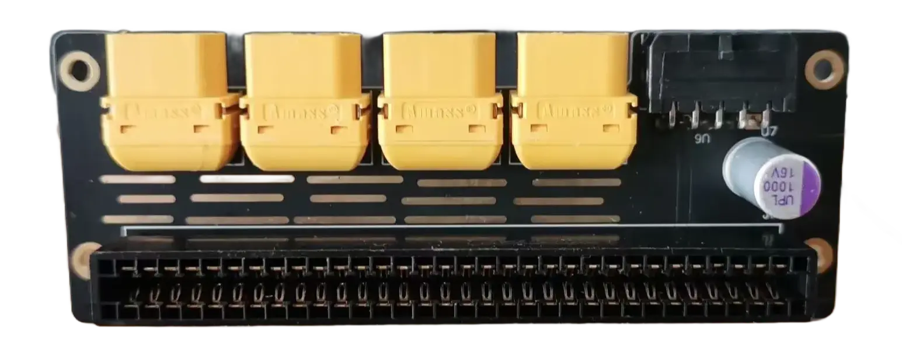 | 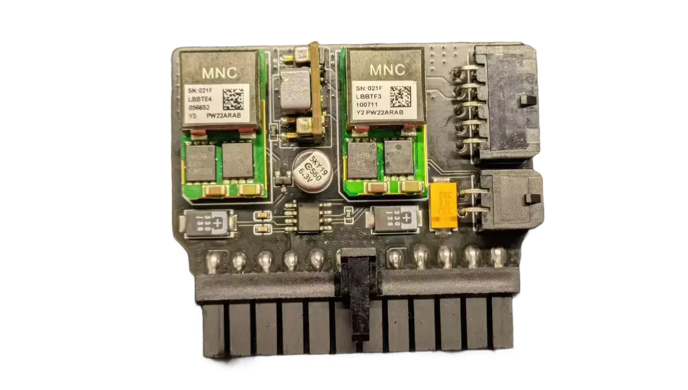 |
| :-------------------------------: | :-------------------------------: |
|              转接板               |              核心板               |

### 猛兽峡谷 11 代

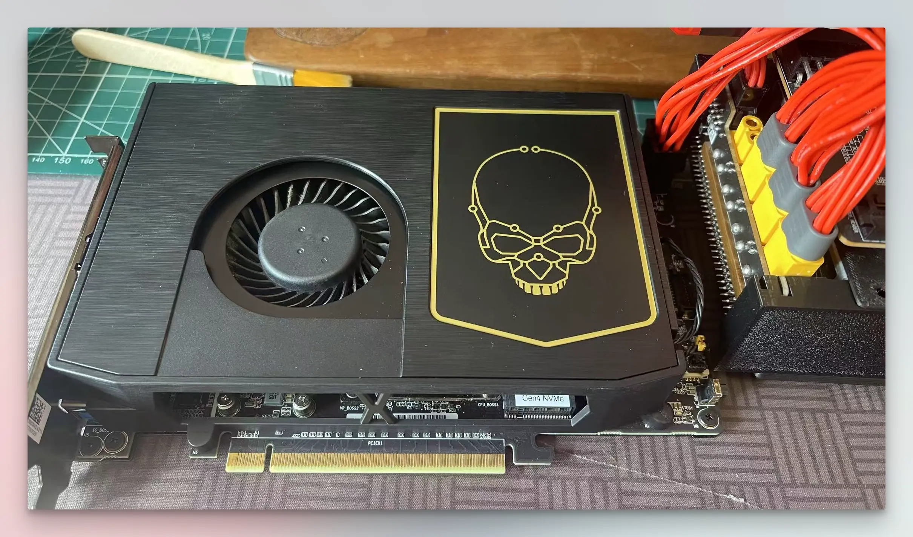

我买的是 Intel® Core™ i7-11700B + 16G 内存 + 500G 硬盘, 这家伙自带 3 个 M.2 插槽, 11 代底板上还有一个, 总共 4 个 M.2 插槽, 比 M920x 多了 2 个.

这里有一份 [规格书](https://dlcdnets.asus.com/pub/ASUS/NUC/NUC_11_Extreme_Kit/NUC_11_Extreme_Kit_NUC11BT_DB_TPS.pdf):



可以了解一下计算卡上的接口, 方便后期扩展.

**11 代底板:**

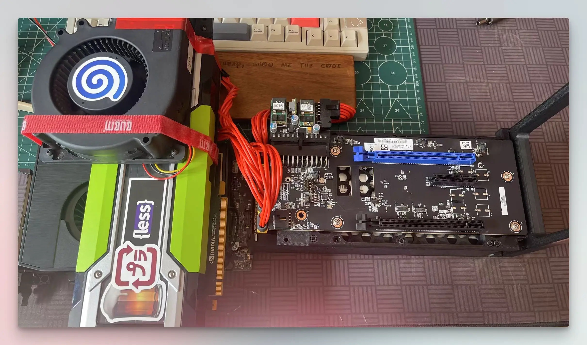

11 代底板有 3 个 PCIe 插槽, 计算卡和显卡各占一个 x16 插槽, 剩下的一个 x4 还能接网卡.

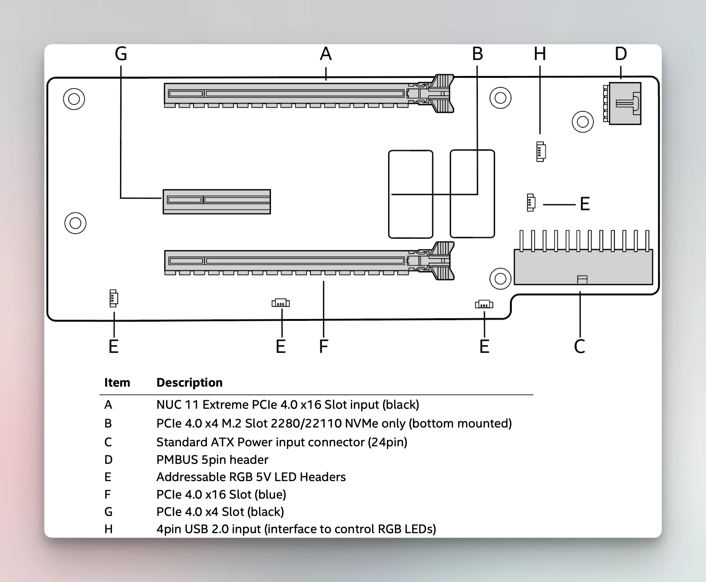

**计算卡的 IO 接口:**

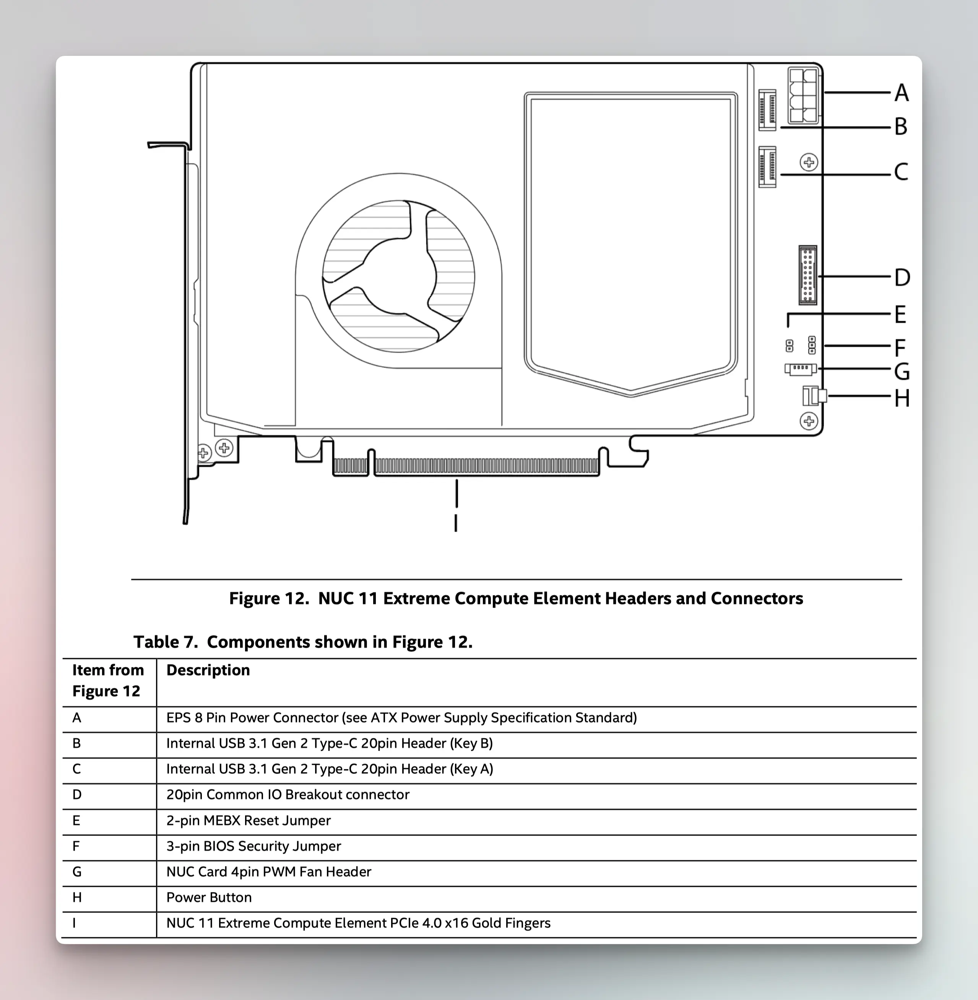

### M.2 固态硬盘

这张计算卡支持 4 个 M.2 固态, 其中 3 个在计算卡上, CPU 左边 2 个是 PCIe 3 x4, 右边是 PCIe 4 x4, 剩下的一个在底板上, 为 PCIe 4 x4.

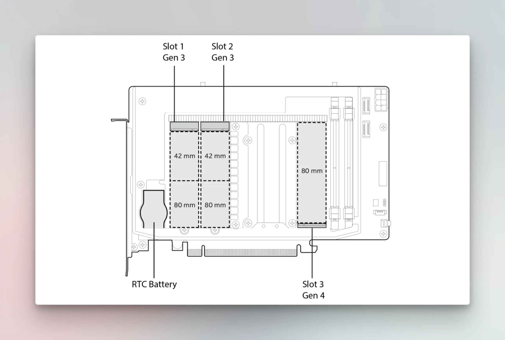

M2 固态当然要支持国产, 所以买了 2 条全新的 **致态 Ti600 1TB** 的 PCIe Gen4 x4 NVMe 固态硬盘, 然后小黄鱼上捡了 2 条 **三星 PM981A 1TB** 的 PCIe Gen3 x4 NVMe 固态硬盘, 打算将 2 条 **三星 PM981A**  组个 RAID1, 另外 2 条 PCIe Gen4 x4 NVMe 独立使用.


todo


> 三星的 M.2 NVMe 固态硬盘命名一直分不清, 查了下资料:
>
> 9 字开头的都是 M.2 支持 NVMe 的 PCIe 固态，前面带 PM 的是 OEM 产品（通俗点讲这是个批发货，批给电脑厂商的）有 PM981、PM961 等；9 后面两个数字可以看成是代数，越大越新，出的时间越晚。针对民用零售版本后面还有后缀如 970 Pro、970 Evo 甚至还会有 Qvo，这三个字母代表等级，主要是颗粒上的区别：Pro 是 MLC 的颗粒，Evo 是 TLC 颗粒，Qvo 是 QLC 的颗粒，价格一般是这个排序，性能也是这个排序。

**需要注意的是**, 当使用底板上的 M.2 插槽时, 底板上的 PCIe x16 会被拆分成 **x8 + 2 x4**:

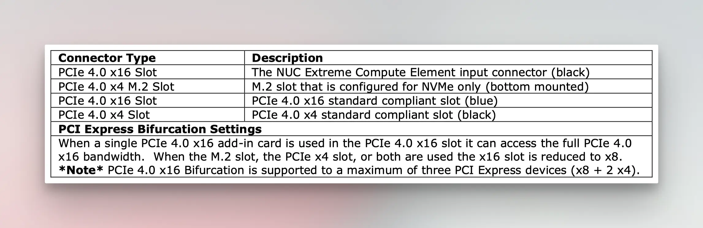

### 内存

内存原装给了 2 张 8G 的, 现在都 2025 年了, 16G 够谁用啊, 所以另购了 2 张 32G DDR4 3200 的海力士笔记本内存, 组成双通道 64G 内存:

todo

### SP310 双光口万兆网卡

小黄鱼挑了张便宜的万兆网卡:

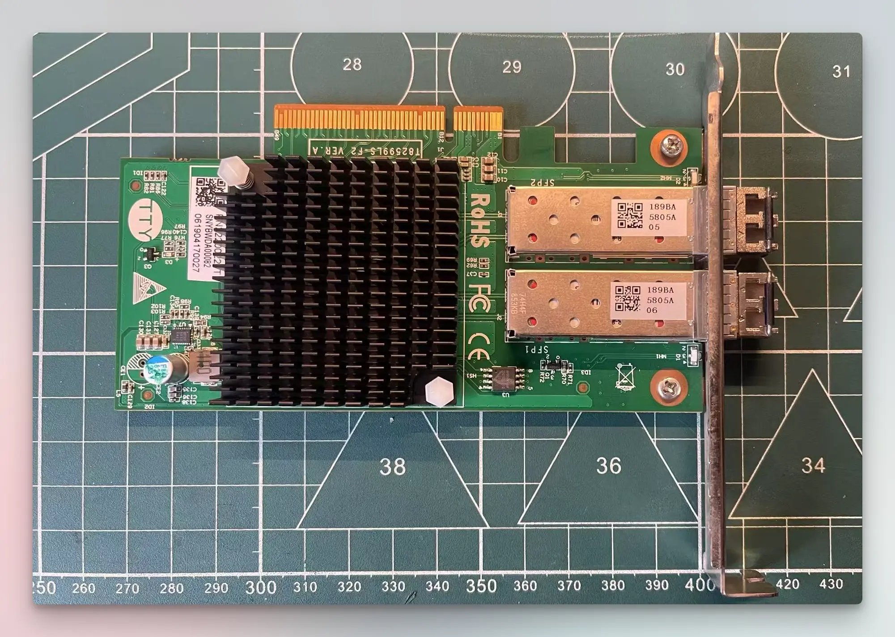

本打算买张 Mellanox CX4121A 的, 不过光模块都快赶上 SP310 了, 而且家里主要还是 10G 的设备居多, 所以还是先买张 10G 的先用着, 等 25G 的价格再腰斩的时候再升级到 25G.

这次购买的是分开的 LC-LC 光纤, 连接的时候需要注意的是 2 个光模块的光纤线要交叉, 比如上面接的是黄色的, 那么接入路由器的那一端上面就要接白色的.

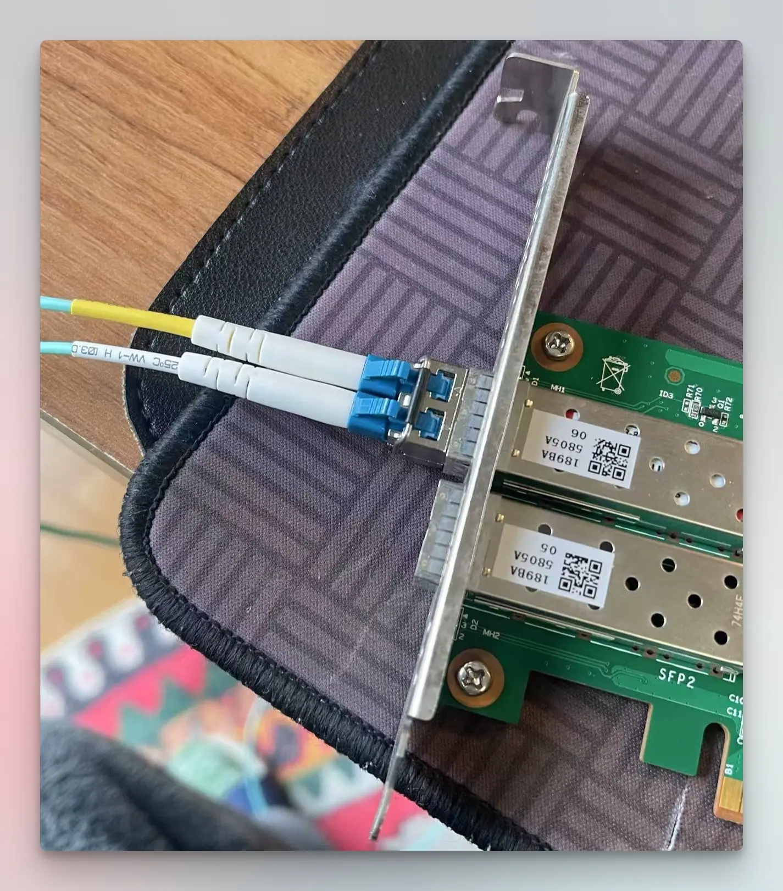

#### 散热

我低估了 SP310 的发热量, 因为是开放型机箱没有风道, 积热严重, 所以不得不加上一个散热风扇.

todo


### 温控版

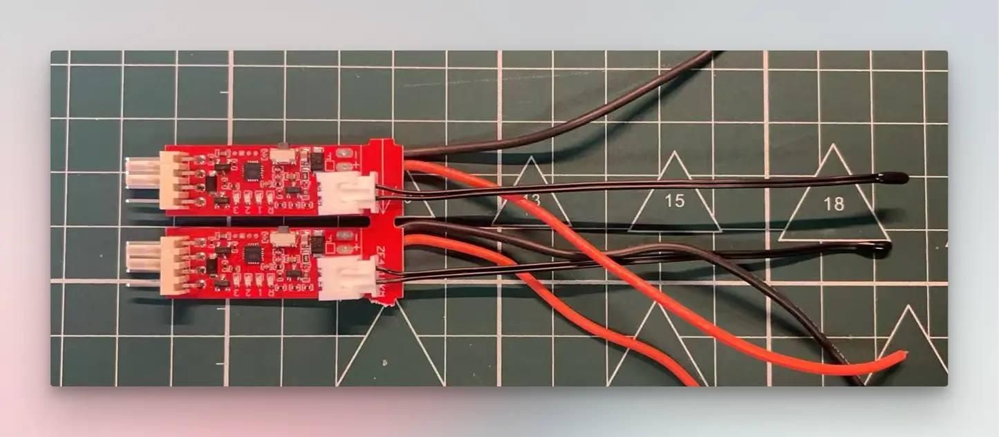

P40 的涡轮风扇噪音太大, 所以加了个温控版来控制启涡轮风扇的启停.

这个温控版非常好用, 所以一次性买了 5 个, 它可以设置开启风扇的温度范围, 这样 P40 的涡轮风扇就不用一直转了, 毕竟噪音还是挺大的.

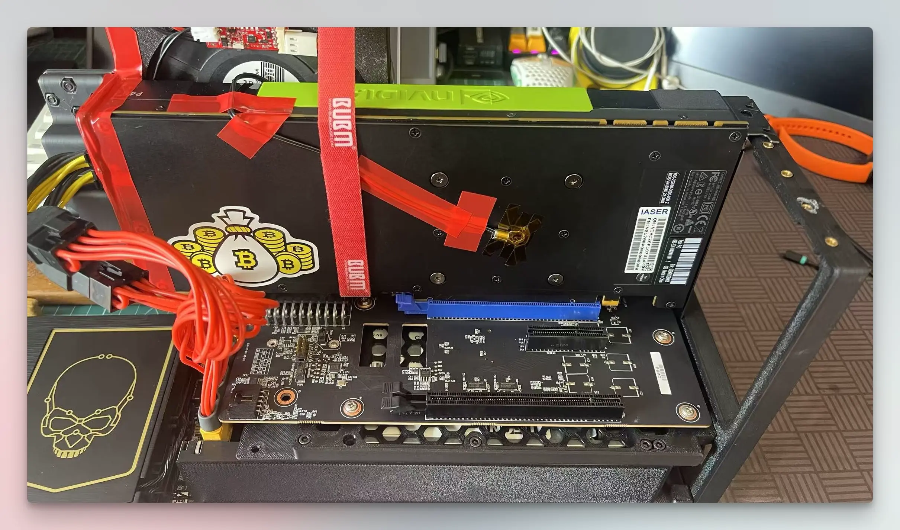

我将温度探头安装到了显卡背板上, 温控版设置为 35 度开,30 度关, 这样显卡温度基本上能够很好控制在理想范围内.

### 最终效果

接了个原来剩下的 LCD, 拿来显示 CPU 和 RAM 的使用情况.

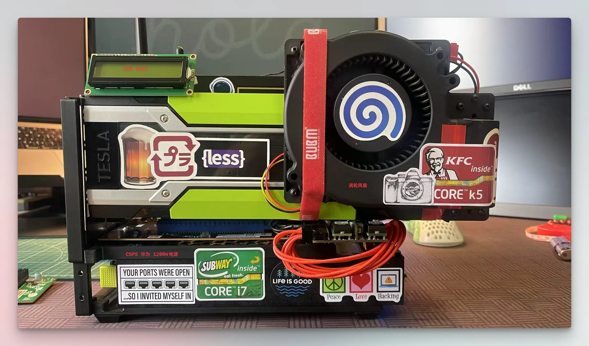

外接了散热风扇, USB 转 2.5G 网卡和一个 4G 模块.

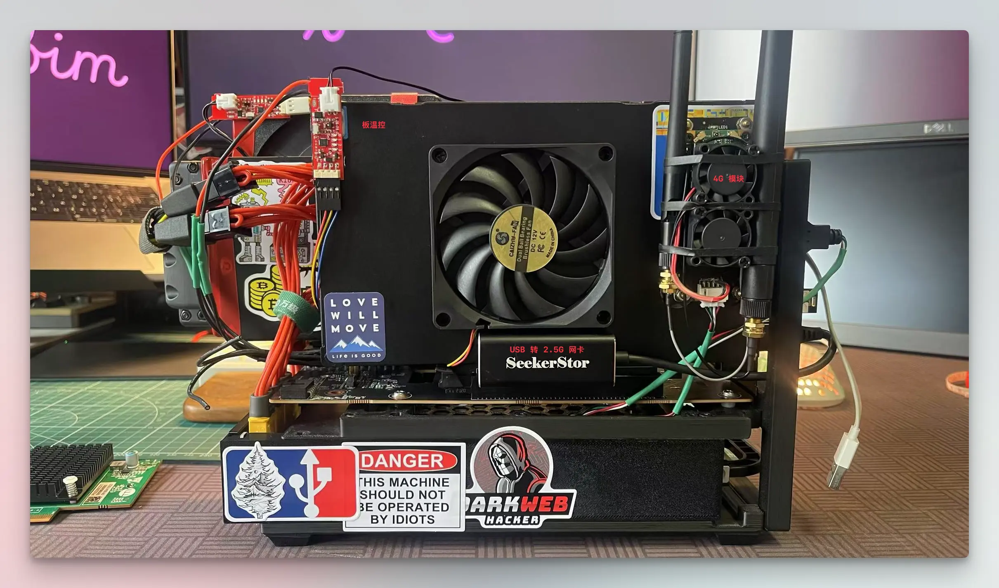

**上电开机**

正面照:

加了个电压显示模块, 不得不说这个 CSPS 转接板输出的电压真稳定, 一直 12.2V 没有跳动过.

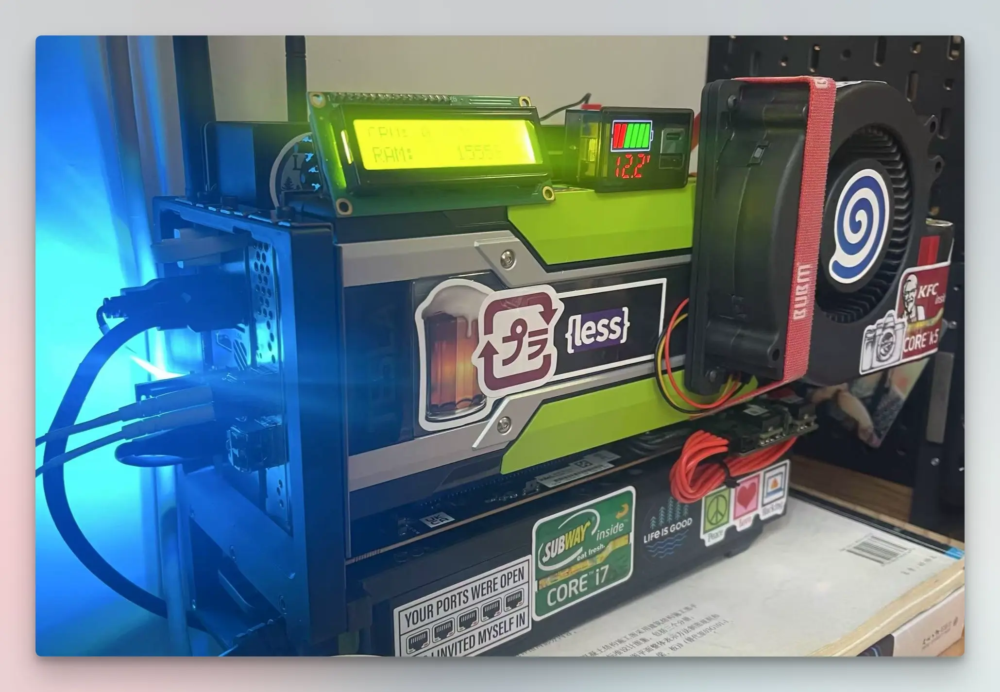

侧面照:

网卡刚好能够塞的下, 所以不要买那种散热片上面带风扇的网卡, 宽度不够.

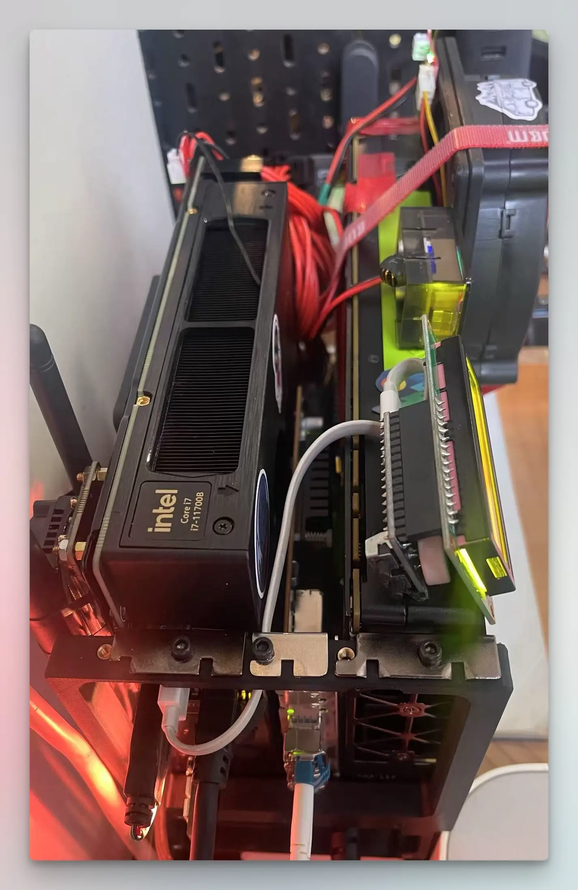

---

## 安装系统

正好手上有一个 Ubuntu Server 22.04 TLS 的启动 U 盘, 所以这里先安装 22.04, 然后再升级到 24.04 TLS.

这里先进 BIOS 修改视频输出, **IGFX** 是集显, **PEG Slot** 是独显, 原来是独显输出, 这里修改为 **IGFX**:

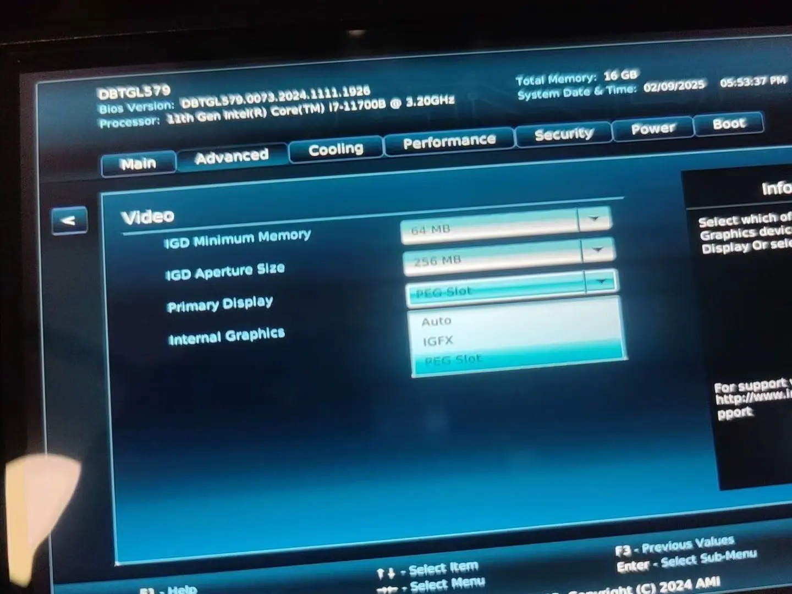

Ubuntu 的安装就不赘述了, 网上一大堆教程.

### 网卡问题

系统安装完成后, 重启插上 Tesla P40, 准备升级系统并安装显卡驱动和 CUDA.

重点来了, 进入系统后发现网卡灯灭了, 无法获取到 IP, 也就无法在线升级了, 所以需要先解决这个问题.

先问了一下 ChatGPT 可能的原因:

1. **PCIe 资源冲突**

   猛兽峡谷（Intel NUC 11 Extreme）可能在插上独立显卡后，主板的 PCIe 资源重新分配，导致某些设备（如内置网卡）失效。

2. **BIOS 设置问题**

   部分 BIOS 可能会在插入独立显卡后，调整 PCIe 通道分配，从而禁用某些设备，包括网卡。

3. **供电或硬件冲突**

   部分主板在插入独立显卡后可能会优先为显卡供电，而导致某些设备（如网卡）无法正常工作。

4. **Linux 设备驱动问题**

   Ubuntu 可能没有正确加载网卡驱动，或者插入显卡后，网卡的 PCIe ID 发生变化，导致内核没有识别到网卡。

网卡在进入 BIOS 且在进入系统前都是没问题的, 但是进入系统后网卡就灭了, 因为是在插入显卡后出现的问题, 所以首先怀疑是 PCIe 资源冲突导致的,

所以先检查了一下 PCIe 资源:

```bash
$ lspci
00:00.0 Host bridge: Intel Corporation 11th Gen Core Processor Host Bridge/DRAM Registers (rev 05)
00:01.0 PCI bridge: Intel Corporation 11th Gen Core Processor PCIe Controller #1 (rev 05)
00:02.0 VGA compatible controller: Intel Corporation TigerLake-H GT1 [UHD Graphics] (rev 01)
00:06.0 PCI bridge: Intel Corporation 11th Gen Core Processor PCIe Controller #0 (rev 05)
00:07.0 PCI bridge: Intel Corporation Tiger Lake-H Thunderbolt 4 PCI Express Root Port #1 (rev 05)
00:07.2 PCI bridge: Intel Corporation Tiger Lake-H Thunderbolt 4 PCI Express Root Port #2 (rev 05)
00:08.0 System peripheral: Intel Corporation GNA Scoring Accelerator module (rev 05)
00:0d.0 USB controller: Intel Corporation Tiger Lake-H Thunderbolt 4 USB Controller (rev 05)
00:0d.2 USB controller: Intel Corporation Tiger Lake-H Thunderbolt 4 NHI #0 (rev 05)
00:0d.3 USB controller: Intel Corporation Tiger Lake-H Thunderbolt 4 NHI #1 (rev 05)
00:14.0 USB controller: Intel Corporation Tiger Lake-H USB 3.2 Gen 2x1 xHCI Host Controller (rev 11)
00:14.2 RAM memory: Intel Corporation Tiger Lake-H Shared SRAM (rev 11)
00:16.0 Communication controller: Intel Corporation Tiger Lake-H Management Engine Interface (rev 11)
00:1b.0 PCI bridge: Intel Corporation Device 43c2 (rev 11)
00:1b.3 PCI bridge: Intel Corporation Device 43c3 (rev 11)
00:1f.0 ISA bridge: Intel Corporation WM590 LPC/eSPI Controller (rev 11)
00:1f.3 Audio device: Intel Corporation Tiger Lake-H HD Audio Controller (rev 11)
00:1f.4 SMBus: Intel Corporation Tiger Lake-H SMBus Controller (rev 11)
00:1f.5 Serial bus controller: Intel Corporation Tiger Lake-H SPI Controller (rev 11)
01:00.0 3D controller: NVIDIA Corporation GP102GL [Tesla P40] (rev a1)
02:00.0 Non-Volatile memory controller: Silicon Motion, Inc. SM2263EN/SM2263XT (DRAM-less) NVMe SSD Controllers (rev 03)
59:00.0 Network controller: Intel Corporation Wi-Fi 6E(802.11ax) AX210/AX1675* 2x2 [Typhoon Peak] (rev 1a)
5a:00.0 Ethernet controller: Intel Corporation Ethernet Controller I225-LM (rev 03)
```

看着没啥问题, 网卡和显卡都识别到了, 所以不是 PCIe 的问题.

后来插件网卡才发现问题:

```bash
$ ip link show enp90s0

2: enp90s0: <BROADCAST,MULTICAST,UP,LOWER_UP> mtu 1500 qdisc mq state DOWN mode DEFAULT group default qlen 1000
```

输出中 **state DOWN**，说明网卡是被禁用的, 手动启动并重新获取 IP 就可以了:

```bash
$ sudo ip link set enp90s0 up
$ sudo dhclient enp90s0
```

因为 Ubuntu Server 版本（特别是 22.04+）默认使用 systemd-networkd 进行网络管理，而不是 NetworkManager。如果 systemd-networkd 没有正确配置，网卡可能不会自动启用。且在 `/etc/systemd/network/` 下没有发现任何网络配置, 因此可以断定是这个原因了.

那么接下来就是配置网卡:

```bash
sudo vim /etc/systemd/network/10-enp90s0.network

[Match]
Name=enp90s0

[Network]
DHCP=yes
IPv6AcceptRA=yes
```

```bash
# 重启 systemd-networkd
sudo systemctl restart systemd-networkd
sudo systemctl enable systemd-networkd
```

### 配置 WiFi 网卡

因为使用 `wpa_supplicant` 配置 WiFi 一直报错, 所以这里打算使用 `NetworkManager` 代替 `systemd-networkd` 来管理网络.

```bash
sudo apt update \
	&& sudo apt install network-manager \
	&& sudo systemctl enable NetworkManager \
	&& sudo systemctl start NetworkManager \
	&& sudo systemctl status NetworkManager
```

**查看所有网络接口：**:

```bash
$ nmcli device
DEVICE           TYPE      STATE         CONNECTION
enp91s0          ethernet  unmanaged     --							# 自带网卡
enx00e04c68bbcf  ethernet  unmanaged     --							# USB 转 2.5G 网卡
wlp90s0          wifi      unmanaged     --							# 自带 WiFi 网卡
enp2s0f0         ethernet  unmanaged     --							# 10G 光口 1
enp2s0f1         ethernet  unmanaged     --							# 10G 光口 2
lo               loopback  unmanaged     --
```

`enp90s0` 和新增的 USB 转 2.5G 网卡 `enx00e04c68bbcf` 又得重新配置了. 因为现在使用 SSH 链接的服务器, 为了避免配置有线网卡时断开连接, 这里先配置好 WiFi 网卡.

```bash
nmcli device wifi list  # 显示所有可用的 WiFi 网络
sudo nmcli device wifi connect "WiFi_SSID" password "WiFi_Password"
```

顺利的话应该就能直接连上了:

```bash
Device 'wlp89s0' successfully activated with '83298781-7335-4b6e-b293-676411eaa1df'.
```

配置自动连接 WiFi:

```bash
sudo nmcli connection modify "WiFi_SSID" connection.autoconnect yes
nmcli connection show "WiFi_SSID"
```

> 在输出中，确保 connection.autoconnect 设置为 yes
>
> **断开并重新连接**
>
> 如果需要，你可以断开当前 Wi-Fi 连接并通过命令重新连接：
>
> ```bash
> nmcli connection down "WiFi_SSID"
> nmcli connection up "WiFi_SSID"
> ```

---

接下来是配置 2 张有线网卡和万兆网卡, 禁用 `systemd-networkd` 并切换到 `NetworkManager`. 首先通过 WiFi 链接服务器, 然后再进行下面的操作.

```bash
# 删除 `/etc/systemd/network/` 目录下的网络配置文件
sudo rm -rf /etc/systemd/network/*.network

sudo systemctl stop systemd-networkd
sudo systemctl disable systemd-networkd
```

### 使用 NetworkManager

```bash
# 检查网卡
nmcli device

# 通过 nmcli 配置有线网卡
sudo nmcli connection add type ethernet ifname enp90s0 con-name "2.5G.T" autoconnect yes
sudo nmcli connection add type ethernet ifname enx00e04c68bbcf con-name "2.5G.U" autoconnect yes
sudo nmcli connection add type ethernet ifname enp2s0f0 con-name "10G.T" autoconnect yes
sudo nmcli connection add type ethernet ifname enp2s0f1 con-name "10G.U" autoconnect yes
# 这一步会报错, 所有我这里重启了服务器, 然后使用 wifi 链接
sudo nmcli connection up "2.5G.T"
sudo nmcli connection up "2.5G.U"
sudo nmcli connection up "10G.T"
sudo nmcli connection up "10G.U"

# 查看连接信息
nmcli connection show
```

### 设置 MTU

万兆网卡需要将 MTU 设置为 `9000`:

```bash
sudo nmcli connection modify "10G.T" 802-3-ethernet.mtu 9000
sudo nmcli connection modify "10G.U" 802-3-ethernet.mtu 9000

sudo nmcli connection up "10G.T"
sudo nmcli connection up "10G.U"
```

验证:

```bash
$ ip link show enp2s0f0
3: enp2s0f0: <BROADCAST,MULTICAST,UP,LOWER_UP> mtu 9000 qdisc mq state UP mode DEFAULT group default qlen 1000
    link/ether 18:9b:a5:80:5a:05 brd ff:ff:ff:ff:ff:ff
```

## 升级系统

升级系统到最新的 24.04 TLS

```bash
sudo apt upgrade -y
do-release-upgrade
```

### 安装 docker

```bash
sudo apt update && sudo apt upgrade -y \
	&& sudo apt install -y ca-certificates curl gnupg \
	&& sudo install -m 0755 -d /etc/apt/keyrings \
  && curl -fsSL https://download.docker.com/linux/ubuntu/gpg | sudo tee /etc/apt/keyrings/docker.asc > /dev/null \
	&& sudo chmod a+r /etc/apt/keyrings/docker.asc \
	&& echo "deb [signed-by=/etc/apt/keyrings/docker.asc] https://download.docker.com/linux/ubuntu noble stable" | sudo tee /etc/apt/sources.list.d/docker.list > /dev/null \
	&& sudo apt update \
	&& sudo apt install -y docker-ce docker-ce-cli containerd.io docker-buildx-plugin docker-compose-plugin
```

**验证 Docker 是否安装成功**:

```bash
sudo systemctl enable --now docker \
	&& sudo docker version
```

**验证 Docker Compose**:

```bash
docker compose version
```

**普通用户运行 Docker**:

```bash
sudo usermod -aG docker $USER \
	&& newgrp docker
```

### 安装 Node 和 pm2

```bash
curl -fsSL https://deb.nodesource.com/setup_lts.x | sudo -E bash - \
	&& sudo apt install -y nodejs \
	&& sudo npm install -g pm2 \
	&& pm2 -v
```

## 安装显卡驱动

```bash
$ ubuntu-drivers devices

...
vendor   : NVIDIA Corporation
model    : GP102GL [Tesla P40]
driver   : nvidia-driver-550 - distro non-free recommended
driver   : nvidia-driver-535-server - distro non-free
driver   : nvidia-driver-470-server - distro non-free
driver   : nvidia-driver-535 - distro non-free
...
```

推荐的版本是 `nvidia-driver-550`, 安装它:

```bash
sudo apt install nvidia-driver-550
```

重启后可使用 `nvidia-smi` 查看显卡信息:

```bash
+-----------------------------------------------------------------------------------------+
| NVIDIA-SMI 550.120                Driver Version: 550.120        CUDA Version: 12.4     |
|-----------------------------------------+------------------------+----------------------+
| GPU  Name                 Persistence-M | Bus-Id          Disp.A | Volatile Uncorr. ECC |
| Fan  Temp   Perf          Pwr:Usage/Cap |           Memory-Usage | GPU-Util  Compute M. |
|                                         |                        |               MIG M. |
|=========================================+========================+======================|
|   0  Tesla P40                      Off |   00000000:01:00.0 Off |                  Off |
| N/A   37C    P8             11W /  250W |       0MiB /  24576MiB |      0%      Default |
|                                         |                        |                  N/A |
+-----------------------------------------+------------------------+----------------------+

+-----------------------------------------------------------------------------------------+
| Processes:                                                                              |
|  GPU   GI   CI        PID   Type   Process name                              GPU Memory |
|        ID   ID                                                               Usage      |
|=========================================================================================|
|  No running processes found                                                             |
+-----------------------------------------------------------------------------------------+
```

### 关闭 ECC

Tesla 系列 GPU 默认开启了 ECC(error correcting code, 错误检查和纠正)功能，该功能可以提高数据的正确性，随之而来的是可用内存的减少和性能上的损失。

ECC 内存支持：P4 支持 ECC 校验，开启后会损失一部分显存

开启过后，显存可用为 7611MB，关闭后可用为 8121MB。

通过`nvidia-smi | grep Tesla`查看前面 GPU 编号：0

```
$ nvidia-smi | grep Tesla
|   0  Tesla P40                      Off |   00000000:01:00.0 Off |                  Off |
-----------------------------------------------------------------------------------------

nvidia-smi -i n -e 0/1 可关闭(0)/开启(1) , n是GPU的编号
```

执行关闭 ECC `sudo nvidia-smi -i 0 -e 0`, 重启后该设置生效。

> **值得注意的是开启 ECC 关闭 ECC 这个操作是有寿命的，开关几千次就不能再继续开关了。**

---

## 安装 CUDA

> 更新安装方式: https://docs.nvidia.com/cuda/cuda-installation-guide-linux/#network-repo-installation-for-ubuntu

`nvidia-smi` 信息中有个非常重要的可能产生误导的问题，列表中的 **CUDA Version: 12.4**，只是代表该显卡支持的 CUDA 最高版本是 12.4，即该显卡只能安装**12.4** 以下版本的 CUDA。并不是说已经安装了该版本，下一步根据本步骤的信息，安装 CUDA 12.4。为了避免兼容性，这里安装 12.4.0，没有安装 update 的版本。

[访问 NVIDIA 开发者网站 CUDA 下载页面](https://developer.nvidia.com/cuda-downloads?target_os=Linux), 默认是最新版本, 通过 `Archive of Previous CUDA Releases` 选择其他版本:

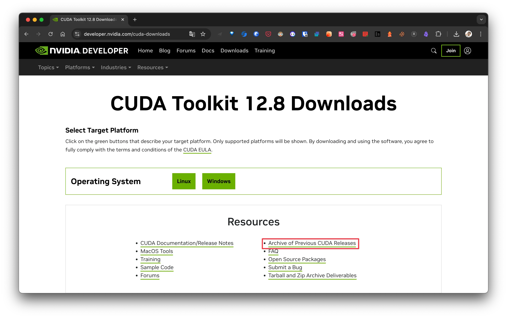

[CUDA Toolkit 12.4.0 Downloads](https://developer.nvidia.com/cuda-12-4-0-download-archive?target_os=Linux&target_arch=x86_64&Distribution=Ubuntu&target_version=22.04&target_type=deb_local):

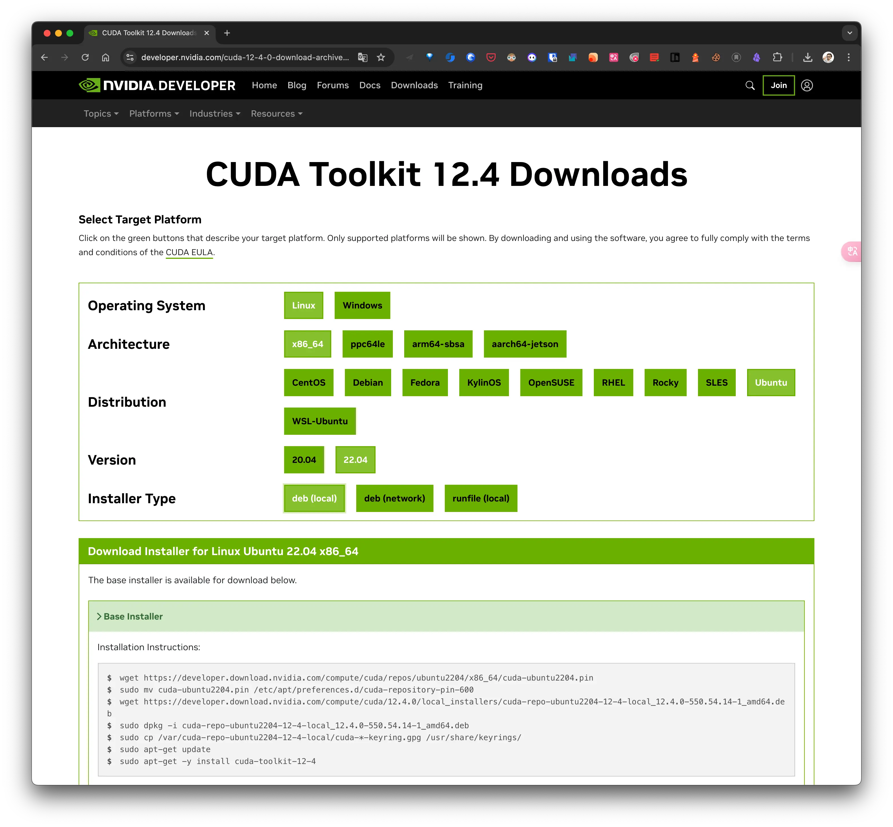

依次选择操作系统及其版本, 然后按照安装步骤复制粘贴回车即可.

CUDA 12.4.0 支持的 Ubuntu 最高版本为 22.04，如果系统为 24.04，则在安装时可能会遇到问题。

### 问题

```
$ sudo apt-get -y install cuda-toolkit-12-4
Reading package lists... Done
Building dependency tree... Done
Reading state information... Done
Some packages could not be installed. This may mean that you have
requested an impossible situation or if you are using the unstable
distribution that some required packages have not yet been created
or been moved out of Incoming.
The following information may help to resolve the situation:

The following packages have unmet dependencies:
 nsight-systems-2023.4.4 : Depends: libtinfo5 but it is not installable
E: Unable to correct problems, you have held broken packages.
```

这是因为 Ubuntu 24.04 默认使用 `libtinfo6`，而某些软件包仍依赖于旧版本的 `libtinfo5`。 为了解决这个问题，可以手动安装 `libtinfo5`。 以下是具体步骤：

1. **下载 `libtinfo5` 包**： 打开终端，使用 `wget` 命令下载适用于 Ubuntu 24.04 的 `libtinfo5` 包：

   ```bash
   wget http://security.ubuntu.com/ubuntu/pool/universe/n/ncurses/libtinfo5_6.3-2ubuntu0.1_amd64.deb
   ```

   请注意，`libtinfo5` 包的版本可能会随着时间更新，建议访问 [Ubuntu 官方软件包存档](http://security.ubuntu.com/ubuntu/pool/universe/n/ncurses/) 获取最新版本的下载链接。

2. **安装 `libtinfo5` 包**： 下载完成后，使用 `dpkg` 命令安装该包：

   ```bash
   sudo dpkg -i libtinfo5_6.3-2ubuntu0.1_amd64.deb
   ```

   如果在安装过程中遇到依赖问题，可以使用以下命令修复：

   ```bash
   sudo apt --fix-broken install
   ```

3. **安装 CUDA Toolkit 12.4**： 安装 `libtinfo5` 后，您可以继续安装 CUDA Toolkit 12.4：

   ```bash
   sudo apt-get -y install cuda-toolkit-12-4
   ```

### 验证

安装完成后, 执行 `nvcc -V`:

```bash
Command 'nvcc' not found, but can be installed with:
sudo apt install nvidia-cuda-toolkit
```

这是因为 cuda 的路径没有配置到环境变量中, 我们可以先通过 `dpkg -l | grep cuda` 验证 cuda 是否安装成功:

```bash
ii  cuda-cccl-12-4                       12.4.99-1                               amd64        CUDA CCCL
ii  cuda-command-line-tools-12-4         12.4.0-1                                amd64        CUDA command-line tools
ii  cuda-compiler-12-4                   12.4.0-1                                amd64        CUDA compiler
ii  cuda-crt-12-4                        12.4.99-1                               amd64        CUDA crt
ii  cuda-cudart-12-4                     12.4.99-1                               amd64        CUDA Runtime native Libraries
ii  cuda-cudart-dev-12-4                 12.4.99-1                               amd64        CUDA Runtime native dev links, headers
ii  cuda-cuobjdump-12-4                  12.4.99-1                               amd64        CUDA cuobjdump
ii  cuda-cupti-12-4                      12.4.99-1                               amd64        CUDA profiling tools runtime libs.
ii  cuda-cupti-dev-12-4                  12.4.99-1                               amd64        CUDA profiling tools interface.
ii  cuda-cuxxfilt-12-4                   12.4.99-1                               amd64        CUDA cuxxfilt
ii  cuda-documentation-12-4              12.4.99-1                               amd64        CUDA documentation
ii  cuda-driver-dev-12-4                 12.4.99-1                               amd64        CUDA Driver native dev stub library
ii  cuda-gdb-12-4                        12.4.99-1                               amd64        CUDA-GDB
ii  cuda-libraries-12-4                  12.4.0-1                                amd64        CUDA Libraries 12.4 meta-package
ii  cuda-libraries-dev-12-4              12.4.0-1                                amd64        CUDA Libraries 12.4 development meta-package
ii  cuda-nsight-12-4                     12.4.99-1                               amd64        CUDA nsight
ii  cuda-nsight-compute-12-4             12.4.0-1                                amd64        NVIDIA Nsight Compute
ii  cuda-nsight-systems-12-4             12.4.0-1                                amd64        NVIDIA Nsight Systems
ii  cuda-nvcc-12-4                       12.4.99-1                               amd64        CUDA nvcc
ii  cuda-nvdisasm-12-4                   12.4.99-1                               amd64        CUDA disassembler
ii  cuda-nvml-dev-12-4                   12.4.99-1                               amd64        NVML native dev links, headers
ii  cuda-nvprof-12-4                     12.4.99-1                               amd64        CUDA Profiler tools
ii  cuda-nvprune-12-4                    12.4.99-1                               amd64        CUDA nvprune
ii  cuda-nvrtc-12-4                      12.4.99-1                               amd64        NVRTC native runtime libraries
ii  cuda-nvrtc-dev-12-4                  12.4.99-1                               amd64        NVRTC native dev links, headers
ii  cuda-nvtx-12-4                       12.4.99-1                               amd64        NVIDIA Tools Extension
ii  cuda-nvvm-12-4                       12.4.99-1                               amd64        CUDA nvvm
ii  cuda-nvvp-12-4                       12.4.99-1                               amd64        CUDA Profiler tools
ii  cuda-opencl-12-4                     12.4.99-1                               amd64        CUDA OpenCL native Libraries
ii  cuda-opencl-dev-12-4                 12.4.99-1                               amd64        CUDA OpenCL native dev links, headers
ii  cuda-profiler-api-12-4               12.4.99-1                               amd64        CUDA Profiler API
ii  cuda-repo-ubuntu2204-12-4-local      12.4.0-550.54.14-1                      amd64        cuda repository configuration files
ii  cuda-sanitizer-12-4                  12.4.99-1                               amd64        CUDA Sanitizer
ii  cuda-toolkit-12-4                    12.4.0-1                                amd64        CUDA Toolkit 12.4 meta-package
ii  cuda-toolkit-12-4-config-common      12.4.99-1                               all          Common config package for CUDA Toolkit 12.4.
ii  cuda-toolkit-12-config-common        12.4.99-1                               all          Common config package for CUDA Toolkit 12.
ii  cuda-toolkit-config-common           12.4.99-1                               all          Common config package for CUDA Toolkit.
ii  cuda-tools-12-4                      12.4.0-1                                amd64        CUDA Tools meta-package
ii  cuda-visual-tools-12-4               12.4.0-1                                amd64        CUDA visual tools
```

看样子是安装成功了, 所以我们可以设置一下环境变量:

```bash
$ vim ~/.bashrc

export PATH=/usr/local/cuda-12.4/bin:$PATH
export LD_LIBRARY_PATH=/usr/local/cuda-12.4/lib64:$LD_LIBRARY_PATH

$ source ~/.bashrc
```

现在执行 `nvcc -V` 就没问题了:

```bash
$ nvcc -V
nvcc: NVIDIA (R) Cuda compiler driver
Copyright (c) 2005-2024 NVIDIA Corporation
Built on Tue_Feb_27_16:19:38_PST_2024
Cuda compilation tools, release 12.4, V12.4.99
Build cuda_12.4.r12.4/compiler.33961263_0
```

## 安装 CuDNN

CuDNN（CUDA Deep Neural Network library）是由 NVIDIA 提供的高性能深度学习库，它专门为深度学习应用程序（如卷积神经网络、递归神经网络等）优化了 GPU 加速的计算操作。CuDNN 是基于 CUDA（NVIDIA 的并行计算平台）构建的，旨在加速深度学习框架中的神经网络计算，提供高效的计算性能。

### CuDNN 的主要功能

CuDNN 主要提供以下几种功能：

1. **卷积操作（Convolutional Operations）**：CuDNN 针对卷积神经网络（CNN）的核心操作进行了优化，支持常见的卷积计算、反卷积（转置卷积）等操作。它优化了在 GPU 上执行这些操作的速度，适合用于图像处理和计算机视觉等任务。
2. **池化操作（Pooling Operations）**：CuDNN 提供了优化的池化操作，特别是在 max-pooling 和 average-pooling 计算方面，提高了执行效率。
3. **归一化操作（Normalization Operations）**：如批归一化（Batch Normalization）等，CuDNN 提供了高效的实现。
4. **激活函数（Activation Functions）**：CuDNN 提供了多种激活函数（如 ReLU、Sigmoid、Tanh 等）以及它们的反向传播计算，所有这些都进行了 GPU 优化。
5. **RNN 操作（Recurrent Neural Network Operations）**：CuDNN 还提供了对 RNN（递归神经网络）操作的支持，包括 LSTM（长短期记忆）和 GRU（门控递归单元）的高效实现。
6. **张量计算（Tensor Operations）**：CuDNN 提供对张量运算的高效支持，帮助深度学习框架在 GPU 上执行复杂的矩阵运算。

### 为什么使用 CuDNN？

1. **性能优化**：CuDNN 对深度学习框架中的许多常见操作（如卷积、池化、激活等）进行了专门优化，利用 GPU 并行计算的优势显著提高了计算速度，尤其在大规模训练中能够大幅缩短训练时间。
2. **与深度学习框架兼容**：CuDNN 与大多数主流深度学习框架兼容，如 TensorFlow、PyTorch、Caffe 等。这些框架都利用 CuDNN 来加速计算，从而大大提高了训练和推理的效率。
3. **GPU 加速**：由于 CuDNN 基于 NVIDIA 的 CUDA 构建，它能够充分发挥 NVIDIA GPU 的计算能力，极大提升深度学习应用的性能。
4. **易于集成**：对于开发人员来说，CuDNN 提供了简单的 API，可以方便地集成到现有的深度学习项目中，极大减少了优化和调试的工作量。

### CuDNN 与 CUDA 的关系

CuDNN 是构建在 CUDA 上的库，它利用 CUDA 提供的并行计算能力来加速深度学习计算。CUDA 提供了底层的硬件加速接口，而 CuDNN 则在此基础上实现了针对深度学习操作的优化。因此，CuDNN 需要与 CUDA 一起使用。

### 如何安装 CuDNN

> 更新安装方式: https://docs.nvidia.com/deeplearning/cudnn/installation/latest/linux.html#
>
> ```bash
> sudo apt-get install zlib1g
> sudo apt-get -y install cudnn9-cuda-12
> ```

访问 [CuDNN 网站](https://developer.nvidia.com/rdp/cudnn-archive)。需要注册一个 NVIDIA 开发者账号才可以下载。

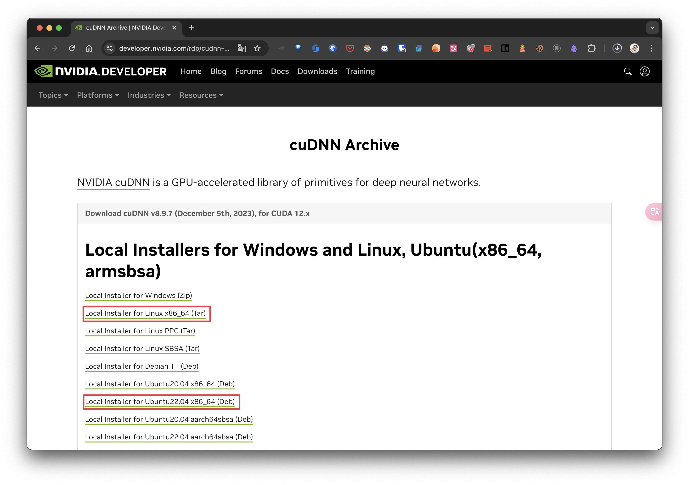

> deb 文件仅提供本地源，安装时仍需从网络下载相应的包文件。需要先安装本地源： `sudo dpkg -i cudnn-local-repo-ubuntu2204-8.9.7.29_1.0-1_amd64.deb`，根据输出中的提示安装 GPG key，再使用 apt 工具更新和安装依赖包。

Tar 包是完整的安装文件, 为了避免网络安装的不稳定性, 这里选择下载全部文件到本地安装.

```bash
tar -xvJf cudnn-linux-x86_64-8.9.7.29_cuda12-archive.tar.xz \
	&& sudo cp cudnn-linux-x86_64-8.9.7.29_cuda12-archive/include/cudnn.h /usr/local/cuda/include \
	&& sudo cp -P cudnn-linux-x86_64-8.9.7.29_cuda12-archive/lib/libcudnn* /usr/local/cuda-12.4/lib64 \
	&& sudo chmod a+r /usr/local/cuda/include/cudnn.h \
	&& sudo chmod a+r /usr/local/cuda/lib64/libcudnn* \
  && sudo dpkg -i cudnn-local-repo-ubuntu2204-8.9.7.29_1.0-1_amd64.deb \
	&& sudo apt-get install libcudnn8 \
	&& sudo apt-get install libcudnn8-dev \
	&& sudo apt-get install libcudnn8-samples
```

#### 验证

```bash
$ sudo ldconfig

$ sudo ldconfig -p | grep cudnn
	libcudnn_ops_train.so.8 (libc6,x86-64) => /usr/local/cuda/targets/x86_64-linux/lib/libcudnn_ops_train.so.8
	libcudnn_ops_train.so.8 (libc6,x86-64) => /lib/x86_64-linux-gnu/libcudnn_ops_train.so.8
	libcudnn_ops_train.so (libc6,x86-64) => /usr/local/cuda/targets/x86_64-linux/lib/libcudnn_ops_train.so
	libcudnn_ops_train.so (libc6,x86-64) => /lib/x86_64-linux-gnu/libcudnn_ops_train.so
	libcudnn_ops_infer.so.8 (libc6,x86-64) => /usr/local/cuda/targets/x86_64-linux/lib/libcudnn_ops_infer.so.8
	libcudnn_ops_infer.so.8 (libc6,x86-64) => /lib/x86_64-linux-gnu/libcudnn_ops_infer.so.8
	libcudnn_ops_infer.so (libc6,x86-64) => /usr/local/cuda/targets/x86_64-linux/lib/libcudnn_ops_infer.so
	libcudnn_ops_infer.so (libc6,x86-64) => /lib/x86_64-linux-gnu/libcudnn_ops_infer.so
	libcudnn_cnn_train.so.8 (libc6,x86-64) => /usr/local/cuda/targets/x86_64-linux/lib/libcudnn_cnn_train.so.8
	libcudnn_cnn_train.so.8 (libc6,x86-64) => /lib/x86_64-linux-gnu/libcudnn_cnn_train.so.8
	libcudnn_cnn_train.so (libc6,x86-64) => /usr/local/cuda/targets/x86_64-linux/lib/libcudnn_cnn_train.so
	libcudnn_cnn_train.so (libc6,x86-64) => /lib/x86_64-linux-gnu/libcudnn_cnn_train.so
	libcudnn_cnn_infer.so.8 (libc6,x86-64) => /usr/local/cuda/targets/x86_64-linux/lib/libcudnn_cnn_infer.so.8
	libcudnn_cnn_infer.so.8 (libc6,x86-64) => /lib/x86_64-linux-gnu/libcudnn_cnn_infer.so.8
	libcudnn_cnn_infer.so (libc6,x86-64) => /usr/local/cuda/targets/x86_64-linux/lib/libcudnn_cnn_infer.so
	libcudnn_cnn_infer.so (libc6,x86-64) => /lib/x86_64-linux-gnu/libcudnn_cnn_infer.so
	libcudnn_adv_train.so.8 (libc6,x86-64) => /usr/local/cuda/targets/x86_64-linux/lib/libcudnn_adv_train.so.8
	libcudnn_adv_train.so.8 (libc6,x86-64) => /lib/x86_64-linux-gnu/libcudnn_adv_train.so.8
	libcudnn_adv_train.so (libc6,x86-64) => /usr/local/cuda/targets/x86_64-linux/lib/libcudnn_adv_train.so
	libcudnn_adv_train.so (libc6,x86-64) => /lib/x86_64-linux-gnu/libcudnn_adv_train.so
	libcudnn_adv_infer.so.8 (libc6,x86-64) => /usr/local/cuda/targets/x86_64-linux/lib/libcudnn_adv_infer.so.8
	libcudnn_adv_infer.so.8 (libc6,x86-64) => /lib/x86_64-linux-gnu/libcudnn_adv_infer.so.8
	libcudnn_adv_infer.so (libc6,x86-64) => /usr/local/cuda/targets/x86_64-linux/lib/libcudnn_adv_infer.so
	libcudnn_adv_infer.so (libc6,x86-64) => /lib/x86_64-linux-gnu/libcudnn_adv_infer.so
	libcudnn.so.8 (libc6,x86-64) => /usr/local/cuda/targets/x86_64-linux/lib/libcudnn.so.8
	libcudnn.so.8 (libc6,x86-64) => /lib/x86_64-linux-gnu/libcudnn.so.8
	libcudnn.so (libc6,x86-64) => /usr/local/cuda/targets/x86_64-linux/lib/libcudnn.so
	libcudnn.so (libc6,x86-64) => /lib/x86_64-linux-gnu/libcudnn.so
```

## 安装 Conda

```bash
mkdir -p ~/miniconda3 \
	&& wget https://repo.anaconda.com/miniconda/Miniconda3-latest-Linux-x86_64.sh -O ~/miniconda3/miniconda.sh \
	&& bash ~/miniconda3/miniconda.sh -b -u -p ~/miniconda3 \
	&& rm ~/miniconda3/miniconda.sh \
	&& source ~/miniconda3/bin/activate \
	&& conda init --all
```

### 验证

```bash
conda create -n ai_base python=3.12
conda activate ai_base
pip install torch torchvision
```

python 脚本:

```python
import torch
# 生成一个5x3的随机矩阵
print(torch.rand(5, 3))
# 检查CUDA是否可用
print(torch.cuda.is_available())
# 如果CUDA可用，获取更多显卡信息
if torch.cuda.is_available():
    # 获取CUDA设备数量
    print('CUDA device count:', torch.cuda.device_count())
    # 获取当前设备的名称
    print('Device name:', torch.cuda.get_device_name(0))
    # 获取当前设备的总内存
    print('Device total memory (GB):', torch.cuda.get_device_properties(0).total_memory / 1e9)
    # 获取当前设备的CUDA版本
    print('CUDA version:', torch.version.cuda)
    # 获取当前设备的计算能力
    print('Compute capability:', torch.cuda.get_device_properties(0).major, '.', torch.cuda.get_device_properties(0).minor)
    # 检查是否有可用的GPU
    print('GPU available:', torch.cuda.is_available())
    # 获取当前设备的索引
    print('Current device index:', torch.cuda.current_device())
```

```
$ python gpu.py
tensor([[0.7034, 0.4482, 0.1233],
        [0.2208, 0.0810, 0.9165],
        [0.9785, 0.3103, 0.5675],
        [0.1876, 0.9308, 0.2961],
        [0.6886, 0.5146, 0.2812]])
True
CUDA device count: 1
Device name: Tesla P40
Device total memory (GB): 25.62588672
CUDA version: 12.4
Compute capability: 6 . 1
GPU available: True
Current device index: 0
```

## 添加到监控面板

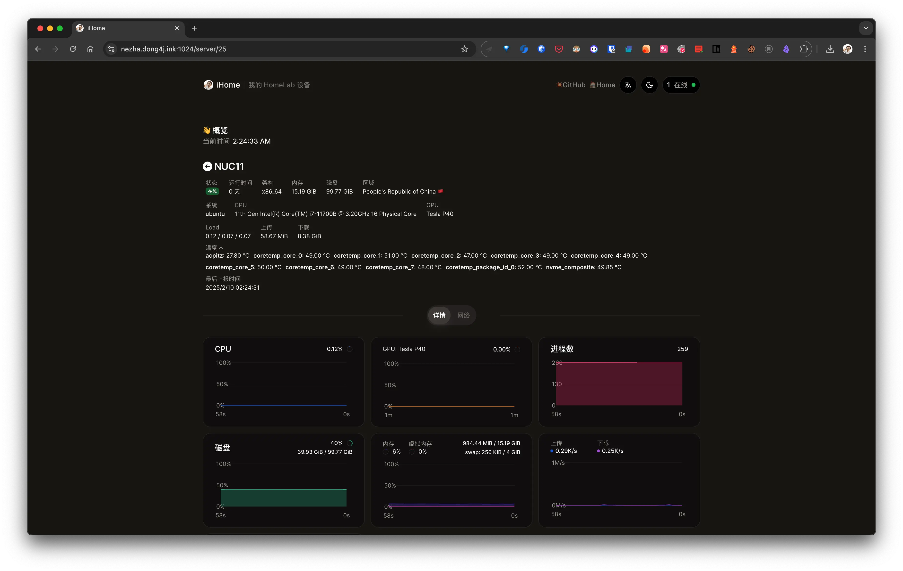

1. 开启 GPU 监控
2. 开启温度监控

## 通过雷雳接口于 macOS 连接

NUC11 自带2个雷雳4接口, 所以玩一下 Linux 如何通过雷雳接口于 macOS 建立连接.

### macOS 配置

> 在 [HomeLab 网络续集：升级 10G 网络-再战 10 年](/posts/homelab-upgrade-to-10g/) 中的 「多台 Mac 互联」一节中详细讲解了如何通过雷雳接口连接多台 macOS.

首先需要确定连接的哪个雷雳接口:

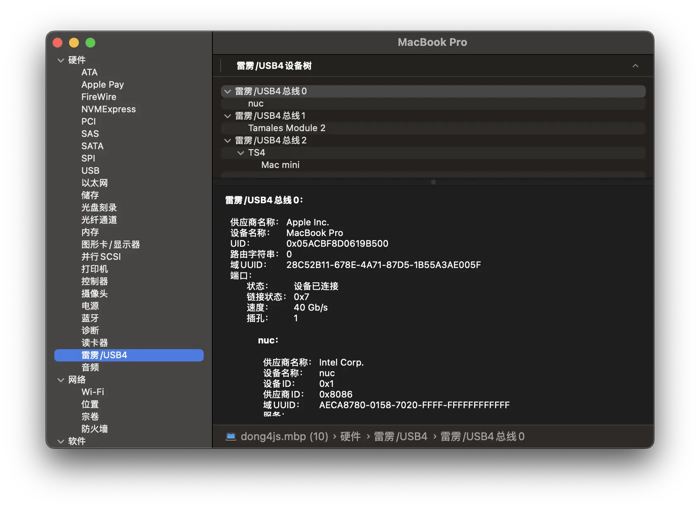

macOS 于 NUC 连接后, 直接识别到对端为 **nuc(我设置的 hostname)**, 插孔显示为 **1**.

然后需要新建一个雷雳网桥, 选择雷雳 1 接口:

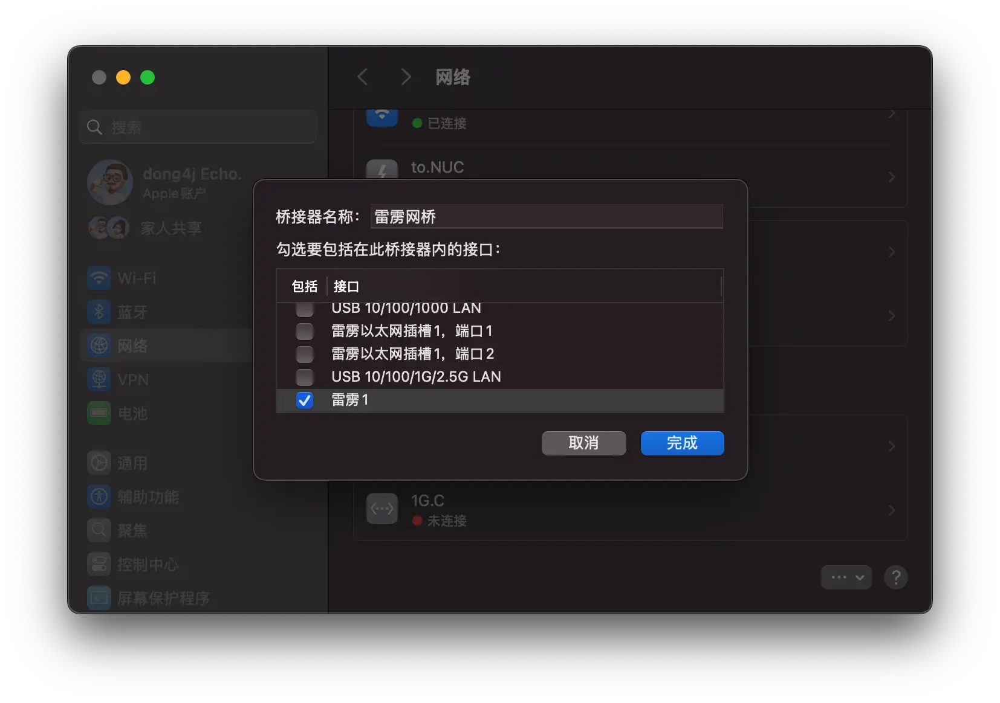

最后就是 **添加服务**:

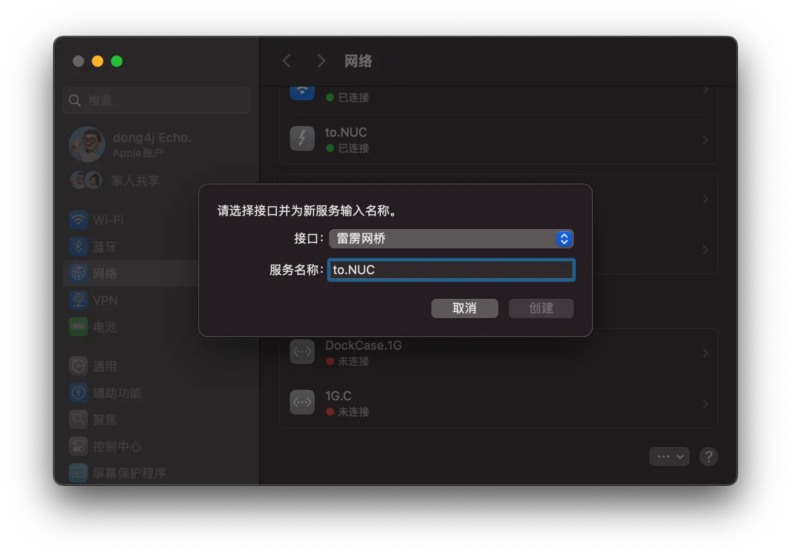

手动修改 IP:

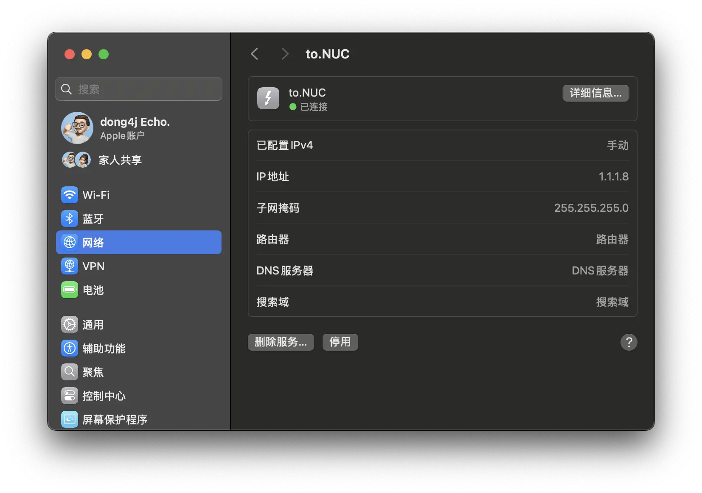

### NUC 配置

```bash
sudo nmcli connection add type ethernet ifname thunderbolt0 con-name to.mbp ipv4.method manual ipv4.addresses 1.1.1.9/24
```

NUC 的 IP 设置为 `1.1.1.9`, 然后是喜闻乐见的测速环节:

```bash
$ iperf3 -c 1.1.1.9
Connecting to host 1.1.1.9, port 5201
[  5] local 1.1.1.8 port 61027 connected to 1.1.1.9 port 5201
[ ID] Interval           Transfer     Bitrate
[  5]   0.00-1.00   sec  1.62 GBytes  13.8 Gbits/sec
[  5]   1.00-2.00   sec  1.72 GBytes  14.8 Gbits/sec
[  5]   2.00-3.00   sec  1.72 GBytes  14.8 Gbits/sec
[  5]   3.00-4.01   sec  1.73 GBytes  14.8 Gbits/sec
[  5]   4.01-5.00   sec  1.72 GBytes  14.8 Gbits/sec
[  5]   5.00-6.00   sec  1.73 GBytes  14.8 Gbits/sec
[  5]   6.00-7.01   sec  1.73 GBytes  14.8 Gbits/sec
[  5]   7.01-8.00   sec  1.72 GBytes  14.8 Gbits/sec
[  5]   8.00-9.00   sec  1.73 GBytes  14.8 Gbits/sec
[  5]   9.00-10.00  sec  1.73 GBytes  14.8 Gbits/sec
- - - - - - - - - - - - - - - - - - - - - - - - -
[ ID] Interval           Transfer     Bitrate
[  5]   0.00-10.00  sec  17.1 GBytes  14.7 Gbits/sec                  sender
[  5]   0.00-10.01  sec  17.1 GBytes  14.7 Gbits/sec                  receiver

iperf Done.
```

理论上应该有 20Gbit/sec, 没有我 macOS 于 macOS 连接快:

```bash
$ iperf3 -c 1.0.0.4
Connecting to host 1.0.0.4, port 5201
[  5] local 1.0.0.5 port 65277 connected to 1.0.0.4 port 5201
[ ID] Interval           Transfer     Bitrate
[  5]   0.00-1.00   sec  2.30 GBytes  19.8 Gbits/sec
[  5]   1.00-2.00   sec  2.17 GBytes  18.7 Gbits/sec
[  5]   2.00-3.00   sec  2.22 GBytes  19.1 Gbits/sec
[  5]   3.00-4.00   sec  2.17 GBytes  18.6 Gbits/sec
[  5]   4.00-5.00   sec  2.24 GBytes  19.2 Gbits/sec
[  5]   5.00-6.00   sec  2.20 GBytes  18.9 Gbits/sec
[  5]   6.00-7.00   sec  2.20 GBytes  18.9 Gbits/sec
[  5]   7.00-8.00   sec  2.23 GBytes  19.1 Gbits/sec
[  5]   8.00-9.00   sec  2.11 GBytes  18.1 Gbits/sec
[  5]   9.00-10.00  sec  2.21 GBytes  19.0 Gbits/sec
- - - - - - - - - - - - - - - - - - - - - - - - -
[ ID] Interval           Transfer     Bitrate
[  5]   0.00-10.00  sec  22.0 GBytes  18.9 Gbits/sec                  sender
[  5]   0.00-10.00  sec  22.0 GBytes  18.9 Gbits/sec                  receiver

iperf Done.
```

#### 参考

- [Linux网络管理工具-netplan](https://zoe.red/2024/254.html)
- [雷电局域网搭建](https://zoe.red/2024/169.html/comment-page-1)

## 测试

### CPU 测试

在 Ubuntu 系统中，我们可以使用 apt-get 命令来安装 Stress 工具。首先，打开终端并运行以下命令更新软件包列表：

```
sudo apt-get update
sudo apt-get install stress
```

安装完成后，我们就可以在终端中直接运行 Stress 工具了。

1. 模拟 CPU 压力

   使用 Stress 工具模拟 CPU 压力非常简单。以下命令将在 8 个工作线程上模拟 CPU 压力：

   ```bash
   # 这将使CPU保持高负载状态，以测试系统的稳定性和性能。
   stress --cpu 8
   ```

2. 模拟内存压力

   为了模拟内存压力，我们可以使用以下命令：

   ```bash
   # 这将使系统分配128MB的内存，并持续进行读写操作，以模拟内存压力。
   stress --vm 1 --vm-bytes 128M
   ```

3. 模拟 I/O 压力

   要模拟 I/O 压力，我们可以使用以下命令：

   ```bash
   # 这将使系统同时执行4个I/O操作，以模拟磁盘读写压力。
   stress --io 4
   ```

以上仅是 Stress 工具的部分示例，它还支持模拟磁盘空间压力等多种场景。具体用法和参数可以参考 Stress 工具的官方[文档](https://cloud.baidu.com/product/doc.html)。

### GPU 测试

这里使用 **[gpu-burn](https://github.com/wilicc/gpu-burn)** 来测试:

```bash
git clone https://github.com/wilicc/gpu-burn \
	&& cd gpu-burn \
	&& make && make clean
```

```bash
$ ./gpu_burn -h
GPU Burn
Usage: gpu-burn [OPTIONS] [TIME]

-m X	Use X MB of memory.
-m N%	Use N% of the available GPU memory.  Default is 90%
-d	Use doubles
-tc	Try to use Tensor cores
-l	Lists all GPUs in the system
-i N	Execute only on GPU N
-c FILE	Use FILE as compare kernel.  Default is compare.ptx
-stts T	Set timeout threshold to T seconds for using SIGTERM to abort child processes before using SIGKILL.  Default is 30
-h	Show this help message

Examples:
  gpu-burn -d 3600 # burns all GPUs with doubles for an hour
  gpu-burn -m 50% # burns using 50% of the available GPU memory
  gpu-burn -l # list GPUs
  gpu-burn -i 2 # burns only GPU of index 2
```

我们使用 `gpu-burn -d 600` 来跑 10 分钟测试:

```bash
$ ./gpu_burn -d 600
Using compare file: compare.ptx
Burning for 600 seconds.
GPU 0: Tesla P40 (UUID: GPU-14413e65-6006-ecbe-19fb-de88575d8a3e)
Initialized device 0 with 24438 MB of memory (24278 MB available, using 21850 MB of it), using DOUBLES
Results are 536870912 bytes each, thus performing 40 iterations
```

因为我的涡轮风扇使用温度传感器检测显卡背板温度, 如果高于 30 度就开始工作, 刚跑了 30 秒钟就开始全功率运行了, 使用 `watch nvidia-smi` 观察显卡的数据变化:

```bash
+-----------------------------------------------------------------------------------------+
| NVIDIA-SMI 550.120                Driver Version: 550.120        CUDA Version: 12.4     |
|-----------------------------------------+------------------------+----------------------+
| GPU  Name                 Persistence-M | Bus-Id          Disp.A | Volatile Uncorr. ECC |
| Fan  Temp   Perf          Pwr:Usage/Cap |           Memory-Usage | GPU-Util  Compute M. |
|                                         |                        |               MIG M. |
|=========================================+========================+======================|
|   0  Tesla P40                      Off |   00000000:01:00.0 Off |                  Off |
| N/A   28C    P0             53W /  250W |   21665MiB /  24576MiB |    100%      Default |
|                                         |                        |                  N/A |
+-----------------------------------------+------------------------+----------------------+

+-----------------------------------------------------------------------------------------+
| Processes:                                                                              |
|  GPU   GI   CI        PID   Type   Process name                              GPU Memory |
|        ID   ID                                                               Usage      |
|=========================================================================================|
|    0   N/A  N/A     13338      C   ./gpu_burn                                  21662MiB |
+-----------------------------------------------------------------------------------------+
```

基本上没有超过 30 度, 这就尴尬了, 不晓得 GPU 会不会感冒 🙉.

### AI 推理

这里使用最简单的 Ollama 进行快速测试:

```bash
curl https://ollama.ai/install.sh | sh
```

```bash
>>> Creating ollama user...
>>> Adding ollama user to render group...
>>> Adding ollama user to video group...
>>> Adding current user to ollama group...
>>> Creating ollama systemd service...
>>> Enabling and starting ollama service...
Created symlink /etc/systemd/system/default.target.wants/ollama.service → /etc/systemd/system/ollama.service.
>>> NVIDIA GPU installed.
```

Ollama 直接添加自启动, 但是我不需要, 所以禁用了:

```bash
sudo systemctl disable ollama
```

如何需要开放局域网访问, 需要修改 `/etc/systemd/system/ollama.service`

```bash
...
Environment="OLLAMA_HOST=0.0.0.0:11434"
...
```

```bash
sudo systemctl daemon-reload \
	&& sudo systemctl restart ollama
```

使用 `llama3.2` 来测试:

```bash
ollama run llama3.2
```

```bash
./llava-v1.5-7b-q4.llamafile --server --gpu NVIDIA --host 0.0.0.0
```

### Stable Diffusion WebUI

```bash
mkdir -p ~/miniconda3
wget https://repo.anaconda.com/miniconda/Miniconda3-latest-Linux-x86_64.sh -O ~/miniconda3/miniconda.sh
bash ~/miniconda3/miniconda.sh -b -u -p ~/miniconda3
conda init --all
conda create -n sdwebui python=3.10
conda activate sdwebui
pip install torch torchvision torchaudio
```


```bash
git clone https://github.com/AUTOMATIC1111/stable-diffusion-webui.git
cd stable-diffusion-webui

vim webui.sh
```

```bash
#!/bin/bash
#########################################################
# Uncomment and change the variables below to your need:#
#########################################################

# Install directory without trailing slash
#install_dir="/home/$(whoami)"

# Name of the subdirectory
#clone_dir="stable-diffusion-webui"

# Commandline arguments for webui.py, for example: export COMMANDLINE_ARGS="--medvram --opt-split-attention"
export COMMANDLINE_ARGS="--api --listen --port 7860 --gradio-auth user:password --enable-insecure-extension-access"

# python3 executable
python_cmd="/home/dong4j/miniconda3/envs/sdwebui/bin/python3.10"

# git executable
#export GIT="git"

# python3 venv without trailing slash (defaults to ${install_dir}/${clone_dir}/venv)
venv_dir="-"

# script to launch to start the app
#export LAUNCH_SCRIPT="launch.py"

# install command for torch
#export TORCH_COMMAND="pip install torch==1.12.1+cu113 --extra-index-url https://download.pytorch.org/whl/cu113"

# Requirements file to use for stable-diffusion-webui
#export REQS_FILE="requirements_versions.txt"

# Fixed git repos
#export K_DIFFUSION_PACKAGE=""
#export GFPGAN_PACKAGE=""

# Fixed git commits
#export STABLE_DIFFUSION_COMMIT_HASH=""
#export CODEFORMER_COMMIT_HASH=""
#export BLIP_COMMIT_HASH=""

# Uncomment to enable accelerated launch
#export ACCELERATE="True"

# Uncomment to disable TCMalloc
#export NO_TCMALLOC="True"

###########################################
```

```bash
bash webui.sh
```

#### 问题

```
  × Building wheel for tokenizers (pyproject.toml) did not run successfully.
  │ exit code: 1
  ╰─> [49 lines of output]
      running bdist_wheel
      running build
      running build_py
      creating build/lib.linux-x86_64-cpython-312/tokenizers
      copying py_src/tokenizers/__init__.py -> build/lib.linux-x86_64-cpython-312/tokenizers
      creating build/lib.linux-x86_64-cpython-312/tokenizers/models
      copying py_src/tokenizers/models/__init__.py -> build/lib.linux-x86_64-cpython-312/tokenizers/models
      creating build/lib.linux-x86_64-cpython-312/tokenizers/decoders
      copying py_src/tokenizers/decoders/__init__.py -> build/lib.linux-x86_64-cpython-312/tokenizers/decoders
      creating build/lib.linux-x86_64-cpython-312/tokenizers/normalizers
      copying py_src/tokenizers/normalizers/__init__.py -> build/lib.linux-x86_64-cpython-312/tokenizers/normalizers
      creating build/lib.linux-x86_64-cpython-312/tokenizers/pre_tokenizers
      copying py_src/tokenizers/pre_tokenizers/__init__.py -> build/lib.linux-x86_64-cpython-312/tokenizers/pre_tokenizers
      creating build/lib.linux-x86_64-cpython-312/tokenizers/processors
      copying py_src/tokenizers/processors/__init__.py -> build/lib.linux-x86_64-cpython-312/tokenizers/processors
      creating build/lib.linux-x86_64-cpython-312/tokenizers/trainers
      copying py_src/tokenizers/trainers/__init__.py -> build/lib.linux-x86_64-cpython-312/tokenizers/trainers
      creating build/lib.linux-x86_64-cpython-312/tokenizers/implementations
      copying py_src/tokenizers/implementations/sentencepiece_unigram.py -> build/lib.linux-x86_64-cpython-312/tokenizers/implementations
      copying py_src/tokenizers/implementations/sentencepiece_bpe.py -> build/lib.linux-x86_64-cpython-312/tokenizers/implementations
      copying py_src/tokenizers/implementations/base_tokenizer.py -> build/lib.linux-x86_64-cpython-312/tokenizers/implementations
      copying py_src/tokenizers/implementations/char_level_bpe.py -> build/lib.linux-x86_64-cpython-312/tokenizers/implementations
      copying py_src/tokenizers/implementations/byte_level_bpe.py -> build/lib.linux-x86_64-cpython-312/tokenizers/implementations
      copying py_src/tokenizers/implementations/bert_wordpiece.py -> build/lib.linux-x86_64-cpython-312/tokenizers/implementations
      copying py_src/tokenizers/implementations/__init__.py -> build/lib.linux-x86_64-cpython-312/tokenizers/implementations
      creating build/lib.linux-x86_64-cpython-312/tokenizers/tools
      copying py_src/tokenizers/tools/__init__.py -> build/lib.linux-x86_64-cpython-312/tokenizers/tools
      copying py_src/tokenizers/tools/visualizer.py -> build/lib.linux-x86_64-cpython-312/tokenizers/tools
      copying py_src/tokenizers/__init__.pyi -> build/lib.linux-x86_64-cpython-312/tokenizers
      copying py_src/tokenizers/models/__init__.pyi -> build/lib.linux-x86_64-cpython-312/tokenizers/models
      copying py_src/tokenizers/decoders/__init__.pyi -> build/lib.linux-x86_64-cpython-312/tokenizers/decoders
      copying py_src/tokenizers/normalizers/__init__.pyi -> build/lib.linux-x86_64-cpython-312/tokenizers/normalizers
      copying py_src/tokenizers/pre_tokenizers/__init__.pyi -> build/lib.linux-x86_64-cpython-312/tokenizers/pre_tokenizers
      copying py_src/tokenizers/processors/__init__.pyi -> build/lib.linux-x86_64-cpython-312/tokenizers/processors
      copying py_src/tokenizers/trainers/__init__.pyi -> build/lib.linux-x86_64-cpython-312/tokenizers/trainers
      copying py_src/tokenizers/tools/visualizer-styles.css -> build/lib.linux-x86_64-cpython-312/tokenizers/tools
      running build_ext
      running build_rust
      error: can't find Rust compiler
      
      If you are using an outdated pip version, it is possible a prebuilt wheel is available for this package but pip is not able to install from it. Installing from the wheel would avoid the need for a Rust compiler.
      
      To update pip, run:
      
          pip install --upgrade pip
      
      and then retry package installation.
      
      If you did intend to build this package from source, try installing a Rust compiler from your system package manager and ensure it is on the PATH during installation. Alternatively, rustup (available at https://rustup.rs) is the recommended way to download and update the Rust compiler toolchain.
      [end of output]
  
  note: This error originates from a subprocess, and is likely not a problem with pip.
  ERROR: Failed building wheel for tokenizers
ERROR: Failed to build installable wheels for some pyproject.toml based projects (Pillow, tokenizers)
```

**问题处理**

```bash
curl --proto '=https' --tlsv1.2 -sSf https://sh.rustup.rs | sh
source $HOME/.cargo/env
pip install --no-cache-dir tokenizers
```


```
        Could not find openssl via pkg-config:
      
        pkg-config exited with status code 1
        > PKG_CONFIG_ALLOW_SYSTEM_CFLAGS=1 pkg-config --libs --cflags openssl
      
        The system library openssl required by crate openssl-sys was not found.
        The file openssl.pc needs to be installed and the PKG_CONFIG_PATH environment variable must contain its parent directory.
        The PKG_CONFIG_PATH environment variable is not set.
      
        HINT: if you have installed the library, try setting PKG_CONFIG_PATH to the directory containing openssl.pc.
      
      
        cargo:warning=Could not find directory of OpenSSL installation, and this -sys crate cannot proceed without this knowledge. If OpenSSL is installed and this crate had trouble finding it,  you can set the OPENSSL_DIR environment variable for the compilation process. See stderr section below for further information.
      
        --- stderr
      
      
        Could not find directory of OpenSSL installation, and this -sys crate cannot
        proceed without this knowledge. If OpenSSL is installed and this crate had
        trouble finding it,  you can set the OPENSSL_DIR environment variable for the
        compilation process.
      
        Make sure you also have the development packages of openssl installed.
        For example, libssl-dev on Ubuntu or openssl-devel on Fedora.
      
        If you're in a situation where you think the directory *should* be found
        automatically, please open a bug at https://github.com/sfackler/rust-openssl
        and include information about your system as well as this message.
      
        $HOST = x86_64-unknown-linux-gnu
        $TARGET = x86_64-unknown-linux-gnu
        openssl-sys = 0.9.106
      
      
      warning: build failed, waiting for other jobs to finish...
      error: cargo rustc --lib --message-format=json-render-diagnostics --manifest-path Cargo.toml --release -v --features pyo3/extension-module --crate-type cdylib -- failed with code 101
      [end of output]
  
  note: This error originates from a subprocess, and is likely not a problem with pip.
  ERROR: Failed building wheel for tokenizers
ERROR: Failed to build installable wheels for some pyproject.toml based projects (Pillow, tokenizers)
```

**问题处理**

```bash
sudo apt install -y libssl-dev pkg-config
```


```
      error: could not compile tokenizers (lib) due to 1 previous error; 3 warnings emitted
      
      Caused by:
        process didn't exit successfully: /home/dong4j/.rustup/toolchains/stable-x86_64-unknown-linux-gnu/bin/rustc --crate-name tokenizers --edition=2018 tokenizers-lib/src/lib.rs --error-format=json --json=diagnostic-rendered-ansi,artifacts,future-incompat --crate-type lib --emit=dep-info,metadata,link -C opt-level=3 -C embed-bitcode=no --cfg 'feature="cached-path"' --cfg 'feature="clap"' --cfg 'feature="cli"' --cfg 'feature="default"' --cfg 'feature="dirs"' --cfg 'feature="esaxx_fast"' --cfg 'feature="http"' --cfg 'feature="indicatif"' --cfg 'feature="onig"' --cfg 'feature="progressbar"' --cfg 'feature="reqwest"' --check-cfg 'cfg(docsrs,test)' --check-cfg 'cfg(feature, values("cached-path", "clap", "cli", "default", "dirs", "esaxx_fast", "fancy-regex", "http", "indicatif", "onig", "progressbar", "reqwest", "unstable_wasm"))' -C metadata=dcfeed9efd370df2 -C extra-filename=-6d0cff9823c410a3 --out-dir /tmp/pip-install-dnunfm0j/tokenizers_40edca6a2fef4b23bfab7d044c44a2a3/target/release/deps -C strip=debuginfo -L dependency=/tmp/pip-install-dnunfm0j/tokenizers_40edca6a2fef4b23bfab7d044c44a2a3/target/release/deps --extern aho_corasick=/tmp/pip-install-dnunfm0j/tokenizers_40edca6a2fef4b23bfab7d044c44a2a3/target/release/deps/libaho_corasick-806902cb00c4532e.rmeta --extern cached_path=/tmp/pip-install-dnunfm0j/tokenizers_40edca6a2fef4b23bfab7d044c44a2a3/target/release/deps/libcached_path-140c0420b639fee2.rmeta --extern clap=/tmp/pip-install-dnunfm0j/tokenizers_40edca6a2fef4b23bfab7d044c44a2a3/target/release/deps/libclap-f0a196de7c2c2d55.rmeta --extern derive_builder=/tmp/pip-install-dnunfm0j/tokenizers_40edca6a2fef4b23bfab7d044c44a2a3/target/release/deps/libderive_builder-2c35d20c5dcdd1b2.rmeta --extern dirs=/tmp/pip-install-dnunfm0j/tokenizers_40edca6a2fef4b23bfab7d044c44a2a3/target/release/deps/libdirs-2a450a96233c46e8.rmeta --extern esaxx_rs=/tmp/pip-install-dnunfm0j/tokenizers_40edca6a2fef4b23bfab7d044c44a2a3/target/release/deps/libesaxx_rs-14b460a83d36cffb.rmeta --extern getrandom=/tmp/pip-install-dnunfm0j/tokenizers_40edca6a2fef4b23bfab7d044c44a2a3/target/release/deps/libgetrandom-e4e984aab09fca54.rmeta --extern indicatif=/tmp/pip-install-dnunfm0j/tokenizers_40edca6a2fef4b23bfab7d044c44a2a3/target/release/deps/libindicatif-4bd79d992ed7623e.rmeta --extern itertools=/tmp/pip-install-dnunfm0j/tokenizers_40edca6a2fef4b23bfab7d044c44a2a3/target/release/deps/libitertools-d3748b68b90d39fc.rmeta --extern lazy_static=/tmp/pip-install-dnunfm0j/tokenizers_40edca6a2fef4b23bfab7d044c44a2a3/target/release/deps/liblazy_static-293673978ef0d67b.rmeta --extern log=/tmp/pip-install-dnunfm0j/tokenizers_40edca6a2fef4b23bfab7d044c44a2a3/target/release/deps/liblog-eeeeba1bbfa2ffb1.rmeta --extern macro_rules_attribute=/tmp/pip-install-dnunfm0j/tokenizers_40edca6a2fef4b23bfab7d044c44a2a3/target/release/deps/libmacro_rules_attribute-d837ae137eb1c6b5.rmeta --extern monostate=/tmp/pip-install-dnunfm0j/tokenizers_40edca6a2fef4b23bfab7d044c44a2a3/target/release/deps/libmonostate-ee413b2bc414638b.rmeta --extern onig=/tmp/pip-install-dnunfm0j/tokenizers_40edca6a2fef4b23bfab7d044c44a2a3/target/release/deps/libonig-fdcb261852f9dd25.rmeta --extern paste=/tmp/pip-install-dnunfm0j/tokenizers_40edca6a2fef4b23bfab7d044c44a2a3/target/release/deps/libpaste-e8c11b814c73abf8.so --extern rand=/tmp/pip-install-dnunfm0j/tokenizers_40edca6a2fef4b23bfab7d044c44a2a3/target/release/deps/librand-1a565600c8701f83.rmeta --extern rayon=/tmp/pip-install-dnunfm0j/tokenizers_40edca6a2fef4b23bfab7d044c44a2a3/target/release/deps/librayon-327814f00a0af0eb.rmeta --extern rayon_cond=/tmp/pip-install-dnunfm0j/tokenizers_40edca6a2fef4b23bfab7d044c44a2a3/target/release/deps/librayon_cond-4c94b6c4149cf439.rmeta --extern regex=/tmp/pip-install-dnunfm0j/tokenizers_40edca6a2fef4b23bfab7d044c44a2a3/target/release/deps/libregex-b19fe03f86732b4c.rmeta --extern regex_syntax=/tmp/pip-install-dnunfm0j/tokenizers_40edca6a2fef4b23bfab7d044c44a2a3/target/release/deps/libregex_syntax-2d5a08e62adc8bc5.rmeta --extern reqwest=/tmp/pip-install-dnunfm0j/tokenizers_40edca6a2fef4b23bfab7d044c44a2a3/target/release/deps/libreqwest-2e0f1b3d46ba2d8c.rmeta --extern serde=/tmp/pip-install-dnunfm0j/tokenizers_40edca6a2fef4b23bfab7d044c44a2a3/target/release/deps/libserde-09bbdc6f8d206673.rmeta --extern serde_json=/tmp/pip-install-dnunfm0j/tokenizers_40edca6a2fef4b23bfab7d044c44a2a3/target/release/deps/libserde_json-f9dd1e99e29af66a.rmeta --extern spm_precompiled=/tmp/pip-install-dnunfm0j/tokenizers_40edca6a2fef4b23bfab7d044c44a2a3/target/release/deps/libspm_precompiled-b00102097bfa2810.rmeta --extern thiserror=/tmp/pip-install-dnunfm0j/tokenizers_40edca6a2fef4b23bfab7d044c44a2a3/target/release/deps/libthiserror-533f4e0aa82c3f92.rmeta --extern unicode_normalization_alignments=/tmp/pip-install-dnunfm0j/tokenizers_40edca6a2fef4b23bfab7d044c44a2a3/target/release/deps/libunicode_normalization_alignments-9913c65b13ec4f88.rmeta --extern unicode_segmentation=/tmp/pip-install-dnunfm0j/tokenizers_40edca6a2fef4b23bfab7d044c44a2a3/target/release/deps/libunicode_segmentation-175194bc41713dcf.rmeta --extern unicode_categories=/tmp/pip-install-dnunfm0j/tokenizers_40edca6a2fef4b23bfab7d044c44a2a3/target/release/deps/libunicode_categories-fb12b97a420ed313.rmeta -L native=/tmp/pip-install-dnunfm0j/tokenizers_40edca6a2fef4b23bfab7d044c44a2a3/target/release/build/bzip2-sys-1373a3f19d1e511d/out/lib -L native=/tmp/pip-install-dnunfm0j/tokenizers_40edca6a2fef4b23bfab7d044c44a2a3/target/release/build/zstd-sys-6d5eafba8c9430e7/out -L native=/tmp/pip-install-dnunfm0j/tokenizers_40edca6a2fef4b23bfab7d044c44a2a3/target/release/build/esaxx-rs-9028bfd7929bddde/out -L native=/tmp/pip-install-dnunfm0j/tokenizers_40edca6a2fef4b23bfab7d044c44a2a3/target/release/build/onig_sys-9ef1a52efbdf7afc/out (exit status: 1)
      warning: build failed, waiting for other jobs to finish...
      error: cargo rustc --lib --message-format=json-render-diagnostics --manifest-path Cargo.toml --release -v --features pyo3/extension-module --crate-type cdylib -- failed with code 101
      [end of output]
  
  note: This error originates from a subprocess, and is likely not a problem with pip.
  ERROR: Failed building wheel for tokenizers
ERROR: Failed to build installable wheels for some pyproject.toml based projects (Pillow, tokenizers)
```

**问题处理**

```bash
sudo apt update && sudo apt install -y build-essential cmake
sudo apt install -y python3-dev
```

最终问题是我使用了 python3.12, 切换到 3.10 即可.

```
OSError: Can't load tokenizer for 'openai/clip-vit-large-patch14'. If you were trying to load it from 'https://huggingface.co/models', make sure you don't have a local directory with the same name. Otherwise, make sure 'openai/clip-vit-large-patch14' is the correct path to a directory containing all relevant files for a CLIPTokenizer tokenizer.
```


**参考**

- [玩转 AIGC：Ubuntu 24.04 LTS 安装配置 Stable Diffusion WebUI](https://cloud.tencent.com/developer/article/2416536)


<!--

#### Mac mini M2

硬件配置:

#### AI.Station

硬件配置:

#### NUC11

硬件配置:

-->

## 参考资料

- [Tesla P40 技术规格]([GeForce GTX 1080 Ti 与 P40 比较？](https://www.zhihu.com/question/267786456))
- [Tesla P40 发布资料]([NVIDIA 发布 AI 计算卡 Tesla P40：完整版 GP102 大核心，24GB 显存](https://www.expreview.com/49499.html))
- [Tesla P40 与 GTX 1080TI 对比]([GeForce GTX 1080 Ti 与 P40 比较？](https://www.zhihu.com/question/267786456))
- [NVIDIA CUDA 列表]([CUDA Toolkit Archive](https://link.zhihu.com/?target=https%3A//developer.nvidia.com/cuda-toolkit-archive))
