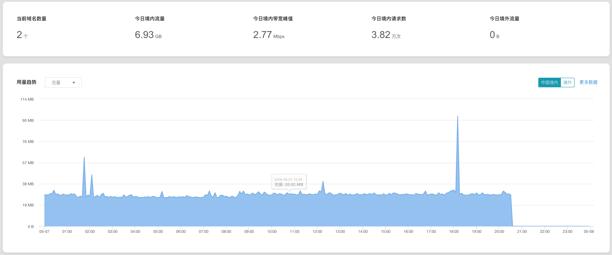
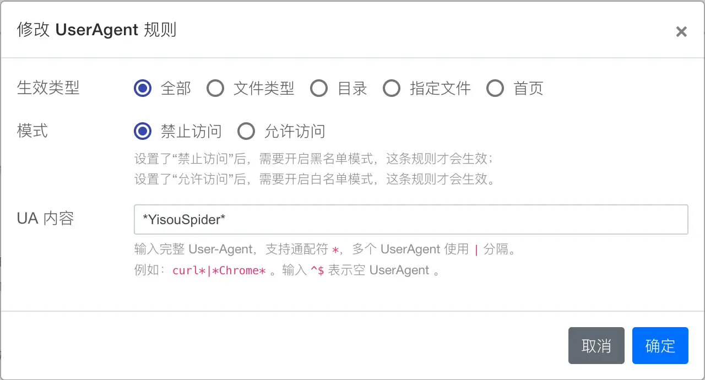

## 背景

最近我在看博客 CDN 访问日志时，发现静态资源的访问量异常增多。

一开始只是觉得有点不对劲：博客本身访问量没有明显上涨，但 CDN 流量消耗却比平时快了不少。继续往日志里翻，发现大量请求都来自一个叫 `YisouSpider` 的爬虫，而且请求的还不是文章页面，而是博客里那些 JS、CSS 静态资源。

这篇文章记录一下完整的排查过程、问题原因，以及最后为什么我把拦截规则放到了 CDN 层，而不是只在源站 Nginx 里处理。

---

## 问题现象

在 Nginx / CDN 访问日志里，可以看到大量类似下面的请求：

```text
20260507164510 124.239.12.111 cdn.dong4j.site /source/static/index-imgloaded.css 1379 1069 2 200 https://blog.dong4j.site/ 215 "YisouSpider" "(null)" GET HTTPS miss 58335
20260507164510 116.132.218.241 cdn.dong4j.site /source/static/card-widget-welcome.js 10141 1069 26 200 https://blog.dong4j.site/ 286 "YisouSpider" "(null)" GET HTTPS miss 35027
20260507164510 116.132.136.184 cdn.dong4j.site /source/static/echarts.min.js 786157 1069 26 200 https://blog.dong4j.site/ 404 "YisouSpider" "(null)" GET HTTPS miss 59105
```

里面几个字段很关键：

- `User-Agent`: `YisouSpider`
- `Host`: `cdn.dong4j.site`
- `Path`: `/source/static/*.js`、`/source/static/*.css`
- `Status`: `200`
- `Cache`: `miss`

也就是说，这个爬虫正在频繁请求博客 CDN 上的静态资源，而且部分请求还是 `miss`，会同时消耗 CDN 边缘流量和回源流量。

如果只是偶尔抓取页面，我一般不会太在意。但这次的问题是：它在持续请求静态资源，CDN 流量被异常消耗，这就不能只当成普通爬虫访问来看了。



CDN 的付费流量已经被耗尽, COS 也已经收到流量耗尽短信, 所以现在不得不处理这个问题.

---

## 为什么不能只在 Nginx 层拦截

一开始我的直觉很简单：直接在源站 Nginx 里按 User-Agent 拦截就行。

```nginx
if ($http_user_agent ~* "YisouSpider") {
    return 403;
}
```

这个配置本身没有问题，但它只能解决一个问题：**源站被访问**。

如果请求已经命中了 CDN 边缘节点，或者 CDN 在边缘节点就直接返回了缓存资源，那么请求根本不会到源站 Nginx。源站 Nginx 写得再严，也拦不到这部分边缘流量。

所以只在源站 Nginx 里屏蔽，会得到一个不完整的结果：

- 可以减少回源压力；
- 不能有效减少 CDN 边缘流量消耗。

而我这次真正要解决的是：**CDN 流量快被爬虫消耗完了**。

所以正确的拦截位置应该前移到 CDN：

```text
爬虫请求 -> CDN 边缘节点 -> UA 黑名单拦截 -> 直接 403
```

而不是等它穿过 CDN 之后，再让源站 Nginx 做最后一道判断。

---

## 第一层：源站 Nginx 兜底拦截

虽然核心拦截应该放在 CDN 层，但源站 Nginx 我仍然建议加一层兜底。

原因很简单：如果爬虫绕过 CDN，直接访问源站 IP，Nginx 这层还能挡一下。

在对应的 `server` 配置里增加：

```nginx
if ($http_user_agent ~* "YisouSpider") {
    return 403;
}
```

完整示例：

```nginx
server {
    listen 80;
    listen 443 ssl http2;
    server_name cdn.dong4j.site;

    if ($http_user_agent ~* "YisouSpider") {
        return 403;
    }

    location / {
        proxy_pass http://127.0.0.1:8080;
    }
}
```

修改后测试配置并重载：

```bash
nginx -t && systemctl reload nginx
```

这一步的定位很明确：它是兜底，不是主战场。

---

## 第二层：robots.txt 声明禁止抓取

博客根目录也可以增加 `robots.txt` 声明：

```text
User-agent: YisouSpider
Disallow: /
```

但这里要注意，`robots.txt` 只是一个约定。

它是在告诉爬虫“请不要抓取”，不是在技术上强制拦截。对于遵守规则的搜索引擎爬虫可能有效，但对于已经大量消耗流量的场景，不能只依赖它。

所以我的理解是：

- `robots.txt` 适合表达站点抓取策略；
- Nginx 适合做源站兜底；
- 真正节省 CDN 流量，还是要靠 CDN 边缘层拦截。

---

## 第三层：CDN 层屏蔽 User-Agent

真正能节省 CDN 流量的配置，是在 CDN 层拦截。

这次我用的是 CDN 控制台里的 UA 黑白名单 / User-Agent 黑名单功能。配置思路很简单：

```text
匹配 User-Agent 中包含 YisouSpider 的请求，直接拒绝访问。
```



推荐配置如下：

| 配置项 | 推荐值 |
| :--- | :--- |
| 名单类型 | 黑名单 |
| 匹配字段 | User-Agent |
| 匹配内容 | `*YisouSpider*` |
| 动作 | 拒绝 / 403 |
| 生效范围 | 全部文件 |

这里最容易踩坑的是“匹配内容”。

我一开始写的是：

```text
(?i).*YisouSpider.*
```

然后用 curl 测试：

```bash
curl -I -A "YisouSpider" https://cdn.dong4j.site/source/static/echarts.min.js
```

结果返回依旧是：

```http
HTTP/2 200
```

也就是说，规则没生效。

后来排查才发现，CDN 的 UA 黑名单规则不一定支持正则表达式。有些 CDN 控制台这里使用的是简单通配符匹配，而不是完整正则。

所以应该写成：

```text
*YisouSpider*
```

而不是：

```text
(?i).*YisouSpider.*
```

---

## 为什么正则写法没有生效

`(?i).*YisouSpider.*` 是正则表达式写法：

- `(?i)` 表示忽略大小写；
- `.*` 表示匹配任意字符；
- `YisouSpider` 是目标 User-Agent 关键字。

如果规则引擎支持正则，这个写法当然可以匹配 `YisouSpider`。

但问题在于，很多 CDN 的 User-Agent 黑名单配置并不支持完整正则，而是使用简单通配符规则，例如：

```text
*YisouSpider*
```

这种情况下，`(?i).*YisouSpider.*` 可能会被当成普通字符串处理。

也就是说，CDN 实际在匹配的是：

```text
User-Agent 是否包含字面量字符串 (?i).*YisouSpider.*
```

而真实请求头只有：

```text
YisouSpider
```

自然就匹配不到。

所以配置 CDN 黑名单时，一定要先确认规则类型：

| 写法 | 类型 | 是否推荐 |
| :--- | :--- | :--- |
| `YisouSpider` | 完全匹配 | 一般可用 |
| `*YisouSpider*` | 通配符包含匹配 | 推荐 |
| `(?i).*YisouSpider.*` | 正则表达式 | 不一定支持 |

最终我这里选择的是：

```text
*YisouSpider*
```

---

## 配置后的测试方式

配置完成后，可以用 `curl` 模拟爬虫 User-Agent 测试。

测试 `YisouSpider`：

```bash
curl -I -A "YisouSpider" "https://cdn.dong4j.site/source/static/echarts.min.js?t=$(date +%s)"
```

预期结果应该是：

```http
HTTP/2 403
```

或者返回 CDN 平台自己的拦截状态码。

这里加上：

```bash
?t=$(date +%s)
```

是为了避免测试时受到旧缓存影响。

然后再测试正常浏览器 UA：

```bash
curl -I -A "Mozilla/5.0" "https://cdn.dong4j.site/source/static/echarts.min.js?t=$(date +%s)"
```

正常情况下应该仍然返回：

```http
HTTP/2 200
```

这一步很重要。拦截爬虫不是目的，准确拦截才是目的。正常浏览器 UA 仍然能访问，才能说明规则没有误伤普通访问。

---

## 通过响应头判断请求链路

测试过程中，还可以通过响应头判断请求实际走到了哪里。

例如：

```bash
curl -I -A "YisouSpider" https://cdn.dong4j.site/source/static/echarts.min.js
```

如果返回里还能看到这些信息：

```http
server: tencent-cos
x-cache-lookup: Cache Miss
x-nws-log-uuid: ...
```

基本可以判断，请求实际还在 CDN / COS 链路里走，没有被 UA 黑名单提前拦住。

如果规则生效，通常应该直接返回：

```http
HTTP/2 403
```

或者返回 CDN 平台自己的拦截页面、拦截响应头。

这个判断方式比只看“页面能不能打开”更可靠，因为它能帮我确认请求到底是被 CDN 边缘层拦了，还是继续穿透到了后面的资源链路。

---

## 最终推荐配置组合

最后采用的是三层处理：

1. CDN 层：UA 黑名单拦截 `YisouSpider`；
2. 源站 Nginx 层：按 User-Agent 返回 `403`，防止绕过 CDN；
3. `robots.txt`：声明禁止 `YisouSpider` 抓取。

其中最关键的是第一层。

**只有 CDN 层拦截，才能真正减少 CDN 流量消耗。**

Nginx 配置只是源站兜底，`robots.txt` 只是补充声明。三者不是互相替代关系，而是各自解决不同层面的事情。

---

## 后续可以扩展屏蔽的爬虫

如果后续发现还有其他爬虫持续消耗流量，也可以一起加入 CDN UA 黑名单，比如：

```text
*YisouSpider*|*Bytespider*|*PetalBot*|*AhrefsBot*|*SemrushBot*
```

不过这里要看 CDN 平台是否支持 `|` 分隔多个规则。

如果不支持，就分别添加多条规则。不要想当然把正则语法、通配符语法和控制台规则语法混在一起，否则很容易出现“看起来写对了，实际完全没生效”的情况。
