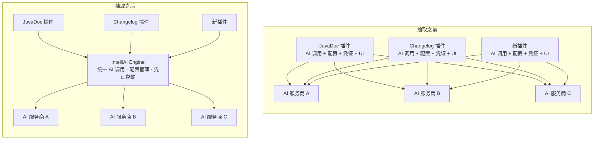
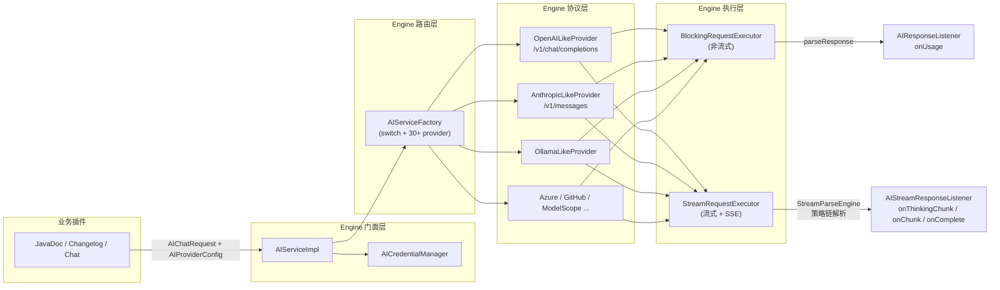
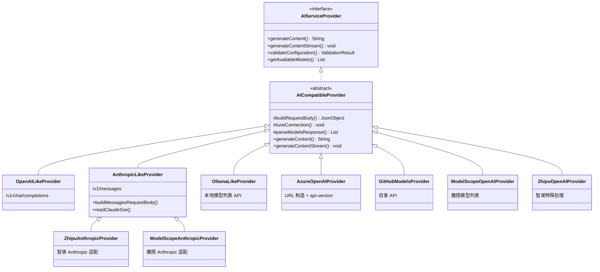
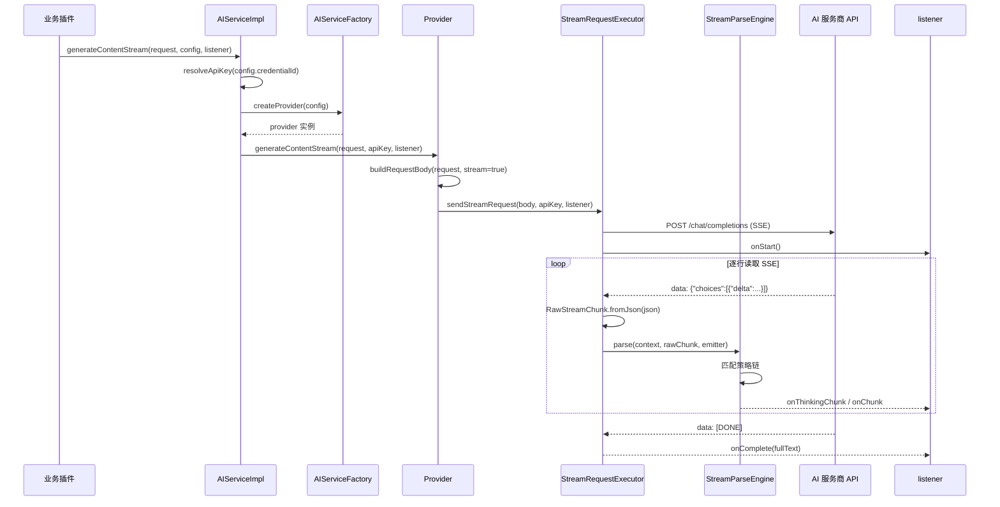
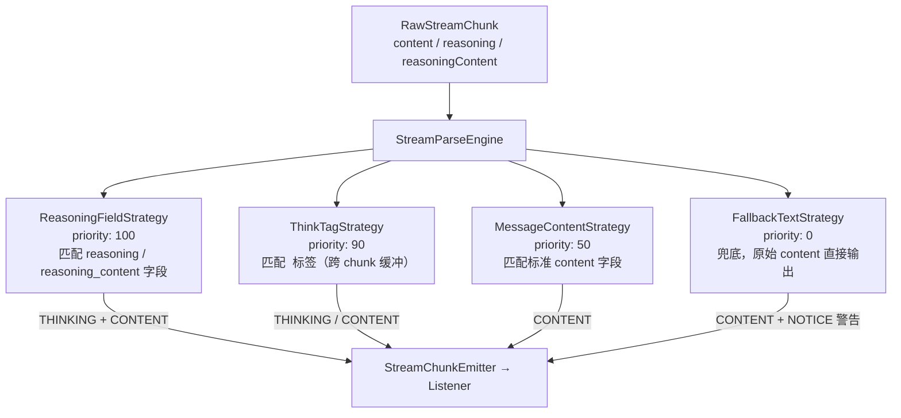
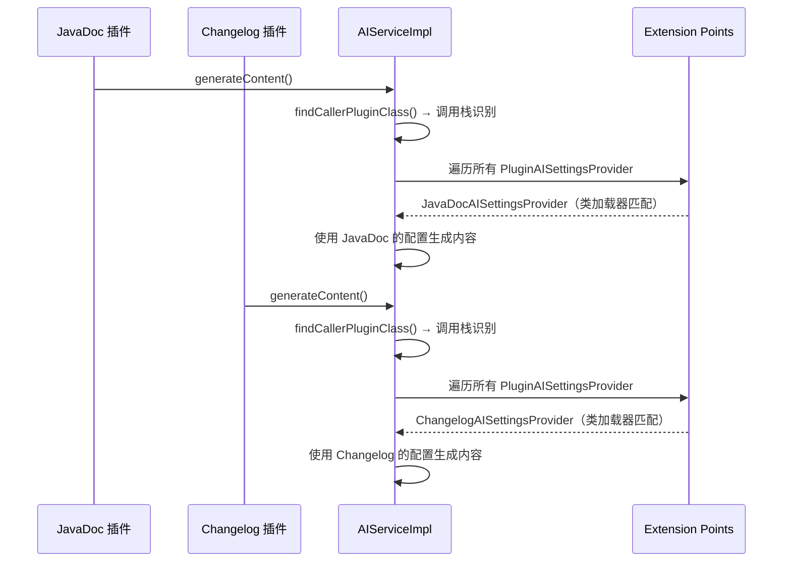
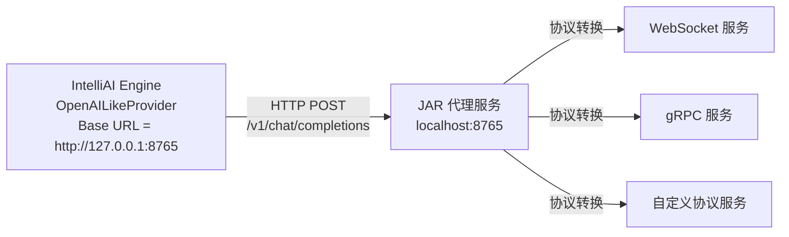
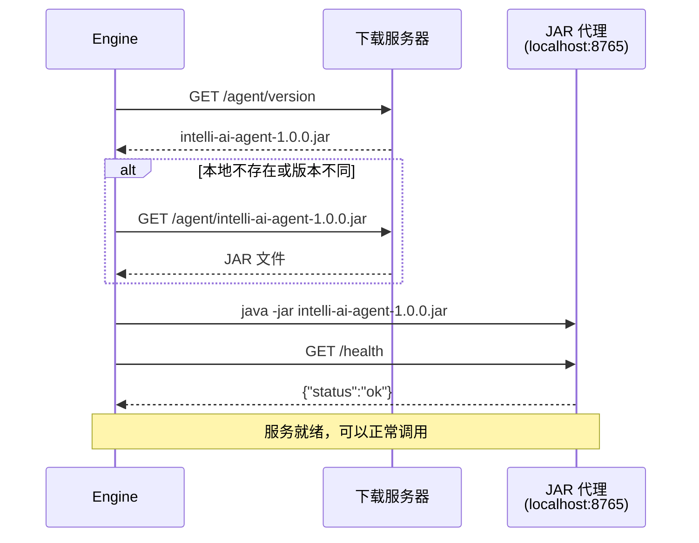

## 为什么需要一个独立的 AI 引擎插件

做 JavaDoc 插件的时候碰到一个问题：代码里的 AI 调用逻辑、配置管理、凭证存储、UI 组件全部耦合在一个插件里。后来做 Changelog 插件，发现同样的代码要复制一遍。如果再做一个新功能的 AI 插件，又得复制一遍。

每新增一个 AI 服务商，要在每个插件里都适配一次。插件越多，维护成本越高，而且各插件的配置互相独立，用户要反复配 API Key。

把 AI 能力抽成一个独立的底层插件，所有业务插件（JavaDoc、Changelog 等）通过依赖调用，配置统一管理，用户配一次全部生效——这就是 IntelliAI Engine 要解决的问题。



## 支持的 AI 服务商

Engine 内置了 30+ 个 AI 服务商的预配置，按协议分组：

**OpenAI 兼容协议**（共用同一个 Provider 实现）：

| 服务商 | 默认模型 | 说明 |
|--------|----------|------|
| FreeAI | studio/ollama/glm-4.7 | 自建免费代理 |
| OpenAI | gpt-3.5-turbo | GPT 系列 |
| DeepSeek | deepseek-chat | 含 deepseek-reasoner |
| 豆包 | doubao-seed-1-8-251228 | 字节跳动 |
| Grok | grok-3-latest | xAI |
| 混元 | hunyuan-2.0-instruct | 腾讯 |
| Moonshot | kimi-k2-thinking-turbo | Kimi |
| 通义千问 | qwen3-8b | 阿里云 |
| 硅基流动 | Qwen/Qwen3-8B | 国内代理 |
| IFlow | kimi-k2-0905 | 聚合平台 |
| 智谱AI | glm-4.7 | GLM 系列 |
| Z.AI | glm-4.7 | 智谱海外版 |
| ModelScope | ZhipuAI/GLM-4.7 | 阿里魔搭 |
| Nvidia | minimaxai/minimax-m2 | NVIDIA API |
| HuggingFace | zai-org/GLM-4.7:novita | HF 推理 |
| OpenRouter | z-ai/glm-4.5-air:free | 路由聚合 |
| Mistral AI | mistral-small-latest | Mistral |
| LM Studio | qwen3-8b | 本地部署 |
| Ollama | gpt-oss:20b-cloud | 本地部署 |
| Quotio | - | 本地部署 |
| Cloudflare Workers AI | @cf/meta/llama-3.1-8b-instruct | CF AI |
| Amazon Bedrock | openai.gpt-oss-120b | AWS |
| Azure OpenAI | gpt-4o-mini | 微软 Azure |
| GitHub Models | openai/gpt-4.1 | GitHub |

**Anthropic 兼容协议**（单独实现，使用 Messages API）：

| 服务商 | 默认模型 |
|--------|----------|
| Anthropic | claude-3-5-sonnet-20241022 |
| DeepSeek (Anthropic) | deepseek-chat |
| 豆包 (Anthropic) | doubao-seed-1-8-251228 |
| 混元 (Anthropic) | hunyuan-2.0-instruct |
| Moonshot (Anthropic) | kimi-k2-thinking-turbo |
| ModelScope (Anthropic) | ZhipuAI/GLM-4.7 |
| 智谱AI (Anthropic) | glm-4.7 |
| Z.AI (Anthropic) | glm-4.7 |

大部分服务商走 OpenAI 兼容协议（`/v1/chat/completions`），共用同一个 `OpenAILikeProvider` 实现。少数不兼容的（Anthropic 系列、Azure、GitHub Models、Ollama 等）有独立的 Provider 子类。

## AI 接入架构

整个 AI 接入的调用链路如下。业务插件只需关心左边两层，右边三层全部由 Engine 封装：



### 请求入口：AIServiceImpl

业务插件不直接创建 Provider，而是通过 `AIServiceImpl` 这个门面类统一调用。它负责三件事：创建 Provider、解析凭证、分发请求。

```java
// AIServiceImpl.java
public String generateContent(Project project, AIChatRequest request,
                              AIProviderConfig config, AIResponseListener listener) {
    AIServiceProvider provider = AIServiceFactory.createProvider(project, config);
    String apiKey = resolveApiKey(project, config);
    return provider.generateContent(request, apiKey, listener);
}

public void generateContentStream(Project project, AIChatRequest request,
                                  AIProviderConfig config, AIStreamResponseListener listener) {
    ApplicationManager.getApplication().executeOnPooledThread(() -> {
        AIServiceProvider provider = AIServiceFactory.createProvider(project, config);
        String apiKey = resolveApiKey(project, config);
        listener.onStart();
        provider.generateContentStream(request, apiKey, listener);
    });
}
```

流式调用会在 IDE 线程池里异步执行，不阻塞 UI。`resolveApiKey` 通过全局凭证管理器 `AICredentialManager` 按 `config.credentialId` 查找加密存储的 API Key。

业务插件只需要构造一个 `AIChatRequest`（systemPrompt + userPrompt），传入一个 `AIProviderConfig`（服务商类型 + 模型名 + baseUrl + credentialId），调用 `generateContent` 或 `generateContentStream` 就行。至于用哪个协议、怎么构建请求体、怎么解析响应——全部由 Engine 处理。

### 请求模型：AIChatRequest

```java
// AIChatRequest.java
public record AIChatRequest(@NotNull String systemPrompt,
                            @NotNull String userPrompt,
                            int promptTokenEstimate) {}
```

就是一个 system prompt + user prompt 的容器。`promptTokenEstimate` 是可选的 token 预估值，用于统计。

### 回调接口：AIResponseListener / AIStreamResponseListener

非流式和流式分别有不同的回调接口：

```java
// AIResponseListener.java — 非流式
public interface AIResponseListener {
    default void onRequest(String providerName, String modelName, String requestBody, boolean validation) {}
    default void onResponse(String providerName, String modelName, String responseBody, boolean validation) {}
    default void onUsage(String providerName, String modelName,
                         int promptTokens, int completionTokens, int totalTokens) {}
}

// AIStreamResponseListener.java — 流式，继承 AIResponseListener
public interface AIStreamResponseListener extends AIResponseListener {
    default void onStart() {}
    default void onChunk(String chunk) {}          // 正文增量
    default void onThinkingChunk(String chunk) {}  // 思考过程增量
    default void onNotice(String message) {}       // 通知（如 finish_reason=length）
    default void onComplete(String fullText) {}    // 流结束，返回完整文本
    default void onError(String error, Throwable exception) {}
    default StreamCancellationToken cancellationToken() { return null; }  // 支持取消
}
```

`AIStreamResponseListener` 区分了正文（`onChunk`）和思考过程（`onThinkingChunk`），业务插件可以在 UI 上用不同样式展示。`onNotice` 用于通知非致命信息（比如响应被 length 截断时的提示）。`cancellationToken()` 支持中途取消流式请求。

### 工厂模式：一个 switch 搞定 30+ 服务商

所有服务商的创建走 `AIServiceFactory`，核心就是一个 switch 表达式：

```java
// AIServiceFactory.java
public static AIServiceProvider createProvider(Project project, AIProviderConfig config) {
    AIProviderType providerType = config.providerType != null ? config.providerType : AIProviderType.QIANWEN;
    AIModelParameters modelParameters = config.modelParameters != null ? config.modelParameters : new AIModelParameters();
    AIRuntimeSettings runtimeSettings = config.runtimeSettings != null ? config.runtimeSettings : new AIRuntimeSettings();

    return switch (providerType) {
        // OpenAI 兼容系列 —— 全部用同一个实现
        case FREEAI, OPENAI, DEEPSEEK, DOUBAO, GROK, HUNYUAN, QIANWEN,
             SILICONFLOW, OPENROUTER, BEDROCK, CLOUDFLARE, HUGGINGFACE,
             NVIDIA, MISTRAL, LM_STUDIO, MOONSHOT, QUOTIO
            -> new OpenAILikeProvider(project, config, modelParameters, runtimeSettings);

        // 需要特殊处理的 OpenAI 兼容变体
        case AZURE -> new AzureOpenAIProvider(...);
        case GITHUB_MODELS -> new GitHubModelsProvider(...);
        case MODELSCOPE -> new ModelScopeOpenAIProvider(...);
        case IFLOW -> new IflowProvider(...);
        case ZHIPU -> new ZhipuOpenAIProvider(...);
        case ZAI -> new ZaiOpenAIProvider(...);

        // Anthropic 兼容系列
        case ANTHROPIC, MOONSHOT_ANTHROPIC, DEEPSEEK_ANTHROPIC,
             DOUBAO_ANTHROPIC, HUNYUAN_ANTHROPIC
            -> new AnthropicLikeProvider(...);
        case ZHIPU_ANTHROPIC -> new ZhipuAnthropicProvider(...);
        case MODELSCOPE_ANTHROPIC -> new ModelScopeAnthropicProvider(...);
        case ZAI_ANTHROPIC -> new ZaiAnthropicProvider(...);

        // 本地模型
        case OLLAMA -> new OllamaLikeProvider(...);
    };
}
```

新增一个 OpenAI 兼容的服务商，只需要在 `AIProviderType` 枚举里加一行配置（providerId、displayName、defaultBaseUrl、defaultModel、supportedModels），然后在 switch 里把它加到 `OpenAILikeProvider` 那一行就行。不需要写任何新的 Provider 类。

### Provider 接口

每个服务商实现都必须实现 `AIServiceProvider` 接口：

```java
// AIServiceProvider.java
public interface AIServiceProvider {
    AIProviderType getProviderType();
    String getModelName();
    String getBaseUrl();

    // 非流式：阻塞等待完整响应
    String generateContent(AIChatRequest request, String apiKey, AIResponseListener listener);

    // 流式：逐 chunk 回调
    void generateContentStream(AIChatRequest request, String apiKey, AIStreamResponseListener listener);

    // 测试连接
    ValidationResult validateConfiguration(String apiKey);

    // 刷新模型列表
    List<String> getAvailableModels(String apiKey);
}
```

### 继承体系



`AICompatibleProvider` 封装了所有公共逻辑：HTTP 客户端、重试、超时、请求体构建、模型列表解析。子类只需要覆盖差异部分。

## 请求构建

### OpenAI 兼容协议请求体

`AICompatibleProvider.buildRequestBody()` 构建标准的 OpenAI 兼容 JSON 请求体：

```java
// AICompatibleProvider.java — buildRequestBody()
JsonObject body = new JsonObject();
body.addProperty("model", config.modelName);
body.addProperty("stream", stream);
body.addProperty("think", enableThinking);         // 控制思考模式开关
body.addProperty("enable_thinking", enableThinking); // 兼容不同服务商

// 消息数组：system + user
JsonArray messages = new JsonArray();
messages.add(systemMessage);
messages.add(userMessage);
body.add("messages", messages);

// 模型参数：只有非 "auto" 时才添加
if (!"auto".equals(params.temperature)) {
    body.addProperty("temperature", Double.parseDouble(params.temperature));
}
// maxTokens 支持 K 单位：4K → 4000
if (maxTokensStr.endsWith("K") || maxTokensStr.endsWith("k")) {
    body.addProperty("max_tokens", (int) Math.max(100, Math.round(inK * 1000)));
}
// topP、topK、presencePenalty 同理
```

自动检测模型名是否包含 `think`，如果是则强制开启思考模式——避免某些思考模型在关闭思考时报错。

### Anthropic 协议请求体

Anthropic 的请求格式完全不同，`AnthropicLikeProvider` 有自己的 `buildMessagesRequestBody()`：

```java
// AnthropicLikeProvider.java — buildMessagesRequestBody()
JsonObject body = new JsonObject();
body.addProperty("model", config.modelName);
body.addProperty("stream", stream);
body.addProperty("system", systemPrompt);  // Anthropic 用顶级 "system" 字段，不在 messages 里

JsonArray messages = new JsonArray();
messages.add(userMsg);  // Anthropic 只有 user 消息，system 独立传
body.add("messages", messages);

// max_tokens 必须传，Anthropic 要求必填，默认 10240
body.addProperty("max_tokens", Objects.requireNonNullElse(maxTokens, 10240));
// temperature、top_p、top_k 按 Anthropic 格式映射
```

关键差异：
- **系统提示词**：OpenAI 放在 messages 数组的 system role 里；Anthropic 用顶级 `system` 字段
- **max_tokens**：OpenAI 可以不传（用模型默认值）；Anthropic 必填，不传会报错
- **认证头**：OpenAI 用 `Authorization: Bearer <key>`；Anthropic 用 `x-api-key: <key>` + `anthropic-version: 2023-06-01`
- **API 端点**：OpenAI 是 `/v1/chat/completions`；Anthropic 是 `/v1/messages`

这些差异全部在各自的 Provider 子类中处理，业务插件无感知。

### 连接调优

`AICompatibleProvider.tuneConnection()` 统一配置 HTTP 连接参数：

```java
// AICompatibleProvider.java
private void tuneConnection(HttpURLConnection connection, String apiKey) {
    int timeoutMillis = runtimeSettings.getTimeoutInMillis();
    connection.setConnectTimeout(timeoutMillis);     // 连接超时
    connection.setReadTimeout(timeoutMillis * 2);    // 读取超时 = 连接超时 × 2
    if (apiKey != null && !apiKey.isEmpty()) {
        connection.setRequestProperty("Authorization", "Bearer " + apiKey);
    }
    if (config.providerType == AIProviderType.FREEAI) {
        connection.setRequestProperty("User-Agent", FREEAI_USER_AGENT);  // 带插件版本号
    }
}
```

读取超时设为连接超时的 2 倍，因为 AI 生成内容通常需要几秒到几十秒。

## 非流式请求执行

`BlockingRequestExecutor` 负责非流式请求的完整生命周期：

```java
// BlockingRequestExecutor.java
public String sendRequest(JsonObject body, String apiKey,
                          AIResponseListener listener, boolean validation) {
    String url = config.baseUrl + "/chat/completions";
    // 1. 检查 API Key
    // 2. 序列化请求体为 UTF-8 bytes
    // 3. 通过 IntelliJ HttpRequests 发送 POST
    // 4. 设置 Content-Length、Authorization 等头
    // 5. 写入请求体，读取完整响应
    // 6. 解析响应 JSON，提取 choices[0].message.content
    // 7. 如果有 usage 字段，回调 listener.onUsage()
    // 8. 过滤 </think> 标签（thinking 模型的思考过程）
}
```

响应解析流程：

```java
// BlockingRequestExecutor.java — parseResponse()
JsonObject json = JsonParser.parseString(responseBody).getAsJsonObject();
String content = json.getAsJsonArray("choices")
    .get(0).getAsJsonObject()
    .getAsJsonObject("message")
    .get("content").getAsString().trim();

// 提取 token 统计
if (json.has("usage")) {
    int promptTokens = usage.get("prompt_tokens").getAsInt();
    int completionTokens = usage.get("completion_tokens").getAsInt();
    listener.onUsage(...);
}

// 过滤思考标签（非流式下 thinking 模型会把思考过程放在 content 里）
return filterThinkingContent(content);
```

`filterThinkingContent()` 处理非流式下 thinking 模型返回的 `</think>...正文` 格式：截取 `</think>` 之后的内容作为最终结果。如果只看到 `<think>` 没有 `</think>`，说明思考过程不完整，返回空字符串。

## 流式请求执行

`StreamRequestExecutor` 负责流式请求。核心区别在于不是读取完整响应，而是逐行读取 SSE 事件流。

### 发送请求

```java
// StreamRequestExecutor.java
public void sendStreamRequest(JsonObject body, String apiKey,
                              AIStreamResponseListener listener) {
    String url = config.baseUrl + "/chat/completions";
    // 1. 检查 API Key
    // 2. listener.onStart()
    // 3. 发送 POST 请求
    // 4. 绑定 StreamCancellationToken（支持取消）
    // 5. 调用 readStreamResponse() 逐行读取 SSE
}
```

### 逐行读取 SSE 事件流

```java
// StreamRequestExecutor.java — readStreamResponse()
StreamParseEngine parseEngine = StreamParseEngine.createDefault();
ParseContext parseContext = new ParseContext();

BufferedReader reader = new BufferedReader(
    new InputStreamReader(connection.getInputStream(), StandardCharsets.UTF_8));

String line;
while ((line = reader.readLine()) != null) {
    // 1. 检查线程中断和取消令牌
    if (line.isBlank()) continue;
    if (line.startsWith("data: ")) {
        String data = line.substring(6).trim();
        if ("[DONE]".equals(data)) break;        // 流结束标记

        JsonObject json = parseSseJson(data);
        UsageStats usageStats = parseUsage(json); // 提取 token 统计

        RawStreamChunk rawChunk = RawStreamChunk.fromJson(json);

        // 2. 检测 finish_reason=length，发送截断通知
        if ("length".equalsIgnoreCase(rawChunk.finishReason())) {
            listener.onNotice("响应被截断...");
        }

        // 3. 通过 StreamParseEngine 解析
        parseEngine.parse(parseContext, rawChunk, chunk -> {
            if (chunk.type() == StreamChunkType.THINKING) {
                listener.onThinkingChunk(chunk.text());
            } else if (chunk.type() == StreamChunkType.CONTENT) {
                fullText.append(chunk.text());
                listener.onChunk(chunk.text());
            } else if (chunk.type() == StreamChunkType.NOTICE) {
                listener.onNotice(chunk.text());
            }
        });

        if (rawChunk.isDone()) break;  // finish_reason=stop
    }
}
listener.onComplete(fullText.toString());
```

### 流式取消支持

`StreamCancellationToken` 可以绑定到 `HttpURLConnection`，调用 `cancel()` 时会断开连接，中断 SSE 读取：

```java
if (cancellationToken != null) {
    cancellationToken.bindConnection(connection);
    if (cancellationToken.isCancelled()) {
        connection.disconnect();
        return null;
    }
}
```

读取循环中每次迭代都检查取消状态，支持用户中途停止生成。

## 流式响应解析：StreamParseEngine

一次完整的流式调用时序：



### StreamParseEngine 策略链

不同服务商的 thinking 模型返回格式不一样。DeepSeek 用 `reasoning_content` 字段，Qwen 用 `<think>` 标签，标准模型只有 `content` 字段。Engine 用策略链模式统一处理。



### 策略链实现

```java
// StreamParseEngine.java
public final class StreamParseEngine {
    private final List<StreamParseStrategy> strategies;

    public StreamParseEngine(List<StreamParseStrategy> strategies) {
        this.strategies = new ArrayList<>(strategies);
        this.strategies.sort(Comparator.comparingInt(StreamParseStrategy::priority).reversed());
    }

    public void parse(ParseContext context, RawStreamChunk chunk, StreamChunkEmitter emitter) {
        for (StreamParseStrategy strategy : strategies) {
            if (strategy.supports(context, chunk)) {
                strategy.parse(context, chunk, emitter);
                break;  // 只用第一个匹配的策略
            }
        }
    }

    public static StreamParseEngine createDefault() {
        return new StreamParseEngine(List.of(
            new ReasoningFieldStrategy(),   // priority: 100
            new ThinkTagStrategy(),         // priority: 90
            new MessageContentStrategy(),   // priority: 50
            new FallbackTextStrategy()      // priority: 0
        ));
    }
}
```

每个策略实现 `StreamParseStrategy` 接口：

```java
public interface StreamParseStrategy {
    int priority();                                          // 优先级，越高越先匹配
    boolean supports(ParseContext ctx, RawStreamChunk chunk); // 是否能处理这个 chunk
    void parse(ParseContext ctx, RawStreamChunk chunk, StreamChunkEmitter emitter);  // 解析
}
```

### RawStreamChunk：原始数据解析

SSE 的每个 JSON 块先解析为 `RawStreamChunk`，它从 `choices[0].delta` 中提取所有可能的字段：

```java
// RawStreamChunk.java — fromJson()
String content = readStringValue(delta, "content");            // 标准内容
String reasoning = readStringValue(delta, "reasoning");        // 某些模型的思考字段
if (reasoning == null) reasoning = readStringValue(delta, "thinking");  // 兼容另一种命名
String reasoningContent = readStringValue(delta, "reasoning_content");  // DeepSeek
String finishReason = readStringValue(choice, "finish_reason");         // stop / length
```

一个 chunk 可能同时包含 `reasoning_content` 和 `content`，也可能只有 `<think>` 标签包裹的文本。

### 四个策略

**ReasoningFieldStrategy**（priority 100）：匹配 `reasoning` 或 `reasoning_content` 字段。

```java
// ReasoningFieldStrategy.java
public boolean supports(ParseContext ctx, RawStreamChunk chunk) {
    return hasText(chunk.reasoning()) || hasText(chunk.reasoningContent());
}

public void parse(ParseContext ctx, RawStreamChunk chunk, StreamChunkEmitter emitter) {
    emitIfPresent(emitter, StreamChunkType.THINKING, chunk.reasoningContent());  // DeepSeek
    emitIfPresent(emitter, StreamChunkType.THINKING, chunk.reasoning());          // 其他
    emitIfPresent(emitter, StreamChunkType.CONTENT, chunk.content());             // 正文
}
```

DeepSeek 的 `reasoning_content` 字段优先级最高，因为它专门用于传输思考过程。

**ThinkTagStrategy**（priority 90）：匹配 `<think>...</think>` 标签。这个策略最复杂，因为 `<think>` 标签可能跨 chunk 分割（一个 chunk 收到 `<thi`，下一个收到 `nk>`）。

```java
// ThinkTagStrategy.java
public boolean supports(ParseContext ctx, RawStreamChunk chunk) {
    return ctx.hasTagBuffer()        // 已经在缓冲标签字符
           || ctx.isInThinking()     // 已经进入思考状态
           || content.contains("<")  // 包含标签起始字符
           || content.contains(">");
}

public void parse(ParseContext ctx, RawStreamChunk chunk, StreamChunkEmitter emitter) {
    for (int i = 0; i < content.length(); i++) {
        char ch = content.charAt(i);
        if (ctx.hasTagBuffer() || ch == '<') {
            ctx.appendTagChar(ch);
            if (ctx.isOpenTagComplete()) {       // 完整匹配 "<think>"
                flushText(ctx, textBuffer, emitter);
                ctx.enterThinking();
                continue;
            }
            if (ctx.isCloseTagComplete()) {      // 完整匹配 "</think>"
                flushText(ctx, textBuffer, emitter);
                ctx.exitThinking();
                continue;
            }
            if (!ctx.isTagPrefix()) {            // 不是标签前缀，是普通文本
                textBuffer.append(ctx.consumeTagBuffer());
            }
        } else {
            textBuffer.append(ch);
        }
    }
}
```

`ParseContext` 维护一个 `tagBuffer`（StringBuilder），逐字符累积。每次收到字符后检查：是不是 `<think>` 或 `</think>` 的前缀？是的话继续累积。完整匹配后切换思考状态。不是前缀的话把缓冲区内容刷到文本流。这样即使标签被拆到不同 chunk 也能正确识别。

`flushText()` 根据当前状态决定 emit 什么类型：

```java
private void flushText(ParseContext ctx, StringBuilder textBuffer, StreamChunkEmitter emitter) {
    StreamChunkType type = ctx.isInThinking() ? StreamChunkType.THINKING : StreamChunkType.CONTENT;
    emitter.emit(new StreamChunk(type, textBuffer.toString()));
}
```

**MessageContentStrategy**（priority 50）：匹配标准 `content` 字段。如果前面两个策略都不匹配，但 chunk 有 content，就走这个策略，直接 emit 为 CONTENT 类型。

**FallbackTextStrategy**（priority 0）：兜底策略，永远返回 true。如果前三个策略都不匹配（比如某个服务商返回了不在预期范围内的字段格式），就直接把原始 content 当正文输出。同时标记 `fallbackUsed`，在流结束时追加一条 NOTICE 警告，提示用户这种格式没有被覆盖到，可以到 GitHub Discussions 反馈。

```java
// FallbackTextStrategy.java
public void parse(ParseContext ctx, RawStreamChunk chunk, StreamChunkEmitter emitter) {
    if (content != null && !content.isEmpty()) {
        ctx.markFallbackUsed();
        emitter.emit(new StreamChunk(StreamChunkType.CONTENT, content));
    }
    if (chunk.isDone() && ctx.isFallbackUsed() && !ctx.isFallbackWarningEmitted()) {
        ctx.markFallbackWarningEmitted();
        emitter.emit(new StreamChunk(StreamChunkType.NOTICE, FALLBACK_WARNING));
    }
}
```

### 流式输出的状态管理

`StreamRequestExecutor.readStreamResponse()` 维护了多个状态标志来处理流式输出的细节：

- `inThinking` / `thinkPrefixPrinted`：控制思考内容的前缀输出（第一次输出时加 `[🤔 thinking]` 标记）
- `hasThinking`：标记是否出现过思考内容，在切换到正文时输出分隔线
- `contentStarted`：首次输出正文时去掉前导换行
- `thinkingNewlineStreak`：压缩思考内容中的连续空行（最多保留 1 个空行）
- `lengthNoticeSent`：`finish_reason=length` 截断通知只发一次

## Anthropic 流式处理

Anthropic 的 SSE 格式和 OpenAI 不同，`AnthropicLikeProvider` 有自己的流式处理方法 `readClaudeSse()`：

```java
// AnthropicLikeProvider.java — readClaudeSse()
while ((line = reader.readLine()) != null) {
    if (!line.startsWith("data: ")) continue;
    JsonObject json = safeParseJson(data);

    String type = json.get("type").getAsString();
    if ("message_stop".equals(type)) break;
    if ("error".equals(type)) {
        listener.onError(json.get("error").toString(), null);
        break;
    }
    if ("content_block_delta".equals(type)) {
        JsonObject delta = json.getAsJsonObject("delta");
        if (delta.has("text")) {
            listener.onChunk(delta.get("text").getAsString());       // 正文
        } else if (delta.has("thinking")) {
            listener.onThinkingChunk(delta.get("thinking").getAsString()); // 思考
        }
    }
}
```

Anthropic 用事件类型（`content_block_delta`、`message_stop`）区分数据块，不用 `choices[0].delta` 结构。思考内容通过 `delta.thinking` 字段传递，正文通过 `delta.text` 字段传递。

Anthropic 的流式没有走 `StreamParseEngine` 策略链——因为它的事件类型已经明确区分了思考和正文，不需要策略匹配。这是两种协议的架构差异。

## 重试机制与错误处理

```mermaid
flowchart TD
    A["发送请求"] --> B{"响应状态?"}
    B -->|"200 成功"| C["解析响应 → 返回结果"]
    B -->|"401/403"| D["INVALID_API_KEY<br/>不可重试"]
    B -->|"429 限流"| E["RATE_LIMIT"]
    B -->|"408 超时"| F["TIMEOUT"]
    B -->|"5xx 服务错误"| G["SERVICE_UNAVAILABLE"]
    B -->|"网络异常"| H["NETWORK_ERROR"]
    B -->|"响应格式异常"| I["INVALID_RESPONSE<br/>不可重试"]
    D --> ERR["抛出异常"]
    I --> ERR
    E & F & G & H --> J{"isRetryable?<br/>且 attempts < maxRetries"}
    J -->|"是"| K["等待 waitDuration × 2^(n-1)<br/>指数退避"]
    K --> A
    J -->|"否"| ERR
```



`AICompatibleProvider.generateContent()` 实现了指数退避重试：

```java
// AICompatibleProvider.java
while (attempts < Math.max(1, runtime.maxRetries)) {
    try {
        return executor.sendRequest(buildRequestBody(request), apiKey, listener, false);
    } catch (AIServiceException e) {
        attempts++;
        if (!e.isRetryable() || attempts >= maxRetries) break;
        long waitTime = (long) (runtime.waitDuration * Math.pow(2, attempts - 1));
        TimeUnit.MILLISECONDS.sleep(waitTime);
    }
}
```

等待时间 = `waitDuration × 2^(attempts-1)`。默认 waitDuration=5000ms，第一次重试等 5 秒，第二次等 10 秒。

只有可重试的错误才会触发重试。`AIServiceException.isRetryable()` 的判断逻辑：

```java
public boolean isRetryable() {
    return errorCode == ErrorCode.NETWORK_ERROR
           || errorCode == ErrorCode.TIMEOUT
           || errorCode == ErrorCode.RATE_LIMIT
           || errorCode == ErrorCode.SERVICE_UNAVAILABLE;
}
```

API Key 无效、配置错误、响应格式错误这些不会重试——重试也没用。

HTTP 状态码到错误码的映射：

```java
public static ErrorCode mapHttpError(int statusCode) {
    return switch (statusCode) {
        case 401, 403 -> ErrorCode.INVALID_API_KEY;
        case 408 -> ErrorCode.TIMEOUT;
        case 429 -> ErrorCode.RATE_LIMIT;
        case 500, 502, 503, 504 -> ErrorCode.SERVICE_UNAVAILABLE;
        default -> ErrorCode.INVALID_RESPONSE;
    };
}
```

`BlockingRequestExecutor` 还对 `IOException` 的错误信息做了二次解析——有些 HTTP 客户端会把状态码放在异常消息里而不是状态码里（比如 `HttpURLConnection` 直接抛 IOException 时）：

```java
// BlockingRequestExecutor.java — getErrorString()
if (message.contains("HTTP response code: 429"))
    throw new AIServiceException("...", ErrorCode.RATE_LIMIT, e);
if (message.contains("HTTP response code: 401"))
    throw new AIServiceException("...", ErrorCode.INVALID_API_KEY, e);
```

## 模型参数处理

`AIModelParameters` 包含 5 个参数，全部用字符串存储，支持 "auto" 和手动值：

```java
public class AIModelParameters {
    public String temperature = "auto";      // 0.0-2.0
    public String maxTokens = "auto";        // 数字或 K 单位（4K = 4000）
    public String topP = "auto";             // 0.0-1.0
    public String topK = "auto";             // 0-100
    public String presencePenalty = "auto";  // -2.0-2.0
}
```

"auto" 表示不发送该参数，让服务商使用模型默认值。这避免了不同模型对参数支持不一致导致的报错——比如某些模型不支持 `presence_penalty`，你传了就 400 报错。

`maxTokens` 有一个兼容迁移逻辑：旧配置存储的是实际 token 数（如 4096），新配置用 K 单位（如 4）。`AIModelParameters.migrateMaxTokens()` 会自动把 >= 1000 的旧值除以 1000 转为 K 单位。

构建请求体时的参数注入逻辑：

```java
// temperature
if (!"auto".equals(params.temperature)) {
    body.addProperty("temperature", Double.parseDouble(params.temperature));
}

// maxTokens：支持 K 单位
if (maxTokensStr.endsWith("K") || maxTokensStr.endsWith("k")) {
    body.addProperty("max_tokens", (int) Math.max(100, Math.round(inK * 1000)));
} else {
    body.addProperty("max_tokens", Integer.parseInt(maxTokensStr));
}
```

所有参数解析都有 `try-catch NumberFormatException`，无效输入直接忽略，不会导致请求失败。

## 连接测试与模型刷新

### 测试连接

`validateConfiguration()` 发送一个最小化请求（"i say ping, you say pong"）验证配置：

```java
// AICompatibleProvider.java
AIChatRequest request = new AIChatRequest("i say ping, you say pong", "ping", 0);
String response = executor.sendRequest(buildRequestBody(request), apiKey, null, true);
// validation=true → parseValidationResponse() 只检查 choices 是否非空
```

验证成功后自动加入可用服务商列表。验证失败返回 `ValidationResult.failure()`，UI 上显示错误信息。

### 刷新模型列表

`getAvailableModels()` 向服务商的 `/v1/models` 端点发 GET 请求：

```java
// AICompatibleProvider.java
String url = config.baseUrl + "/models";
String responseBody = HttpRequests.request(url)
    .tuner(connection -> tuneConnection((HttpURLConnection) connection, apiKey))
    .connect(HttpRequests.Request::readString);
List<String> models = parseModelsResponse(responseBody);
```

解析 `data[].id` 字段提取模型 ID。UI 层会自动过滤掉视觉模型（`vl`）和语音模型（`tts`）。

Anthropic 的模型列表接口可能因权限/版本差异不可用，会兜底使用枚举内置列表：

```java
// AnthropicLikeProvider.java
try {
    List<String> models = parseClaudeModelsResponse(responseBody);
    if (!models.isEmpty()) return models;
} catch (Exception e) { ... }
return new ArrayList<>(getProviderType().getSupportedModels());  // 兜底
```

## 凭证管理

API Key 通过 IntelliJ 内置的 `PasswordSafe` 加密存储，不写入配置文件：

```java
// AICredentialManager.java
public void setApiKey(String credentialId, String apiKey) {
    CredentialAttributes attrs = new CredentialAttributes(serviceName, keyPrefix + credentialId);
    PasswordSafe.getInstance().setPassword(attrs, apiKey);
}
```

每个服务商配置有一个唯一的 `credentialId`，由 providerId + modelName + apiKey + baseUrl 的哈希生成。切换服务商时通过 `loadApiKeyAsync` 异步加载对应的 API Key，不阻塞 UI 线程。

`AIServiceImpl.resolveApiKey()` 在发起请求前解析凭证：

```java
// AIServiceImpl.java
private static String resolveApiKey(Project project, AIProviderConfig config) {
    if (config.providerType == AIProviderType.FREEAI) {
        // FREEAI 需要先开启统计功能
        if (!StatisticsSettings.getInstance().isEnableStatistics()) {
            notifyFreeAiStatisticsRequired(project);
            throw new AIServiceException("...");
        }
    }
    return GLOBAL_CREDENTIAL_MANAGER.getApiKey(config.credentialId);
}
```

FREEAI 是自建的免费代理，使用前需要用户同意隐私协议并开启统计功能。

## 响应语言

`ResponseLanguage` 枚举支持 11 种语言：

| 语言 | ISO 代码 | UI 显示 |
|------|----------|---------|
| 简体中文 | zh | 🇨🇳 简体中文 |
| 繁体中文 | zh-TW | 🇹🇼 繁體中文 |
| 英文 | en | 🇺🇸 English |
| 日文 | ja | 🇯🇵 日本語 |
| 韩文 | ko | 🇰🇷 한국어 |
| 法文 | fr | 🇫🇷 Français |
| 德文 | de | 🇩🇪 Deutsch |
| 西班牙文 | es | 🇪🇸 Español |
| 俄文 | ru | 🇷🇺 Русский |
| 葡萄牙文 | pt | 🇧🇷 Português |
| 意大利文 | it | 🇮🇹 Italiano |

设置后，所有 prompt 模板中会注入语言指令，AI 按指定语言生成内容。

## 设置页面配置

设置页面分七个区域，下面是所有可配置项。

### 一、基础连接配置

| 配置项 | 说明 |
|--------|------|
| AI 服务商 | 下拉选择，按组分类（OpenAI 系列 / Anthropic 系列 / 其他），每组有图标和名称 |
| Base URL | 服务商 API 地址，大部分自动填充，部分可编辑 |
| API Key | 密码框输入，通过 IntelliJ Password Safe 加密存储 |
| 模型 | 可编辑的下拉框，支持键盘快速搜索（SpeedSearch），支持从服务商刷新模型列表 |
| 获取 API Key | 超链接，点击跳转到对应服务商的 API Key 管理页面 |
| 测试连接 | 验证当前配置是否可用，成功后自动加入可用服务商列表 |
| 刷新模型 | 从服务商拉取最新模型列表，自动过滤掉视觉（vl）和语音（tts）模型 |

### 二、可用服务商管理

| 配置项 | 说明 |
|--------|------|
| 显示可用服务商 | 展开/收起服务商列表 |
| 服务商表格 | 列：服务商图标+名称、模型名、超时(s)、最大 Token、备注 |
| 超时列 | 可直接编辑，范围 1-600 秒 |
| 最大 Token 列 | 可直接编辑，支持 "auto" 或数字（K 单位） |
| 备注列 | 可直接编辑，默认填充添加时间 |
| 删除 | 工具栏删除按钮，带确认对话框 |
| 清空全部 | 垃圾桶按钮，带确认对话框 |

测试连接成功的配置自动加入此列表。可用服务商列表会通知所有注册的 `AIProviderSettingsListener`，其他插件（如 Javadoc 的多服务商并行生成）通过监听此列表获取可用服务商。

### 三、Autocomplete 服务商选择

| 配置项 | 说明 |
|--------|------|
| Autocomplete 默认服务商 | 从可用服务商列表中选择一个用于代码自动补全 |

### 四、基础配置

| 配置项 | 说明 |
|--------|------|
| 响应语言 | 下拉选择，支持 11 种语言（见上表） |
| 详细日志 | 开启后记录完整的 AI 请求和响应日志 |
| 自动更新检查 | 是否检查插件更新 |
| 显示更新通知 | 是否弹出新版本通知 |
| 启用 NextEdit | 开启 AI 代码智能补全功能 |

### 五、高级配置

| 配置项 | 默认值 | 范围 | 说明 |
|--------|--------|------|------|
| 最大重试次数 | 2 | 0-10（整数） | 请求失败后的重试次数 |
| 请求超时 | 10s | 1-999999999999（整数） | 单次请求超时时间 |
| 最大 Token 数 | auto | 1-999999999999 或 auto | 单次请求的最大输出 token（K 单位） |
| 温度 (Temperature) | auto | 0.0-2.0（小数）或 auto | 控制生成随机性 |
| Top P | auto | 0.0-1.0（小数）或 auto | 核采样概率 |
| Top K | auto | 0-100（整数）或 auto | 前 K 个候选 |
| 存在惩罚 (Presence Penalty) | auto | -2.0-2.0（小数）或 auto | 重复内容惩罚 |

所有参数都支持 "auto"（使用模型默认值）和手动指定。输入框有实时验证，不合法的输入会被拦截。这些参数存储在 `AIModelParameters` 中，每个服务商可以有独立的参数配置。

### 六、IntelliAgent 本地代理

| 配置项 | 说明 |
|--------|------|
| 自动启动 | IDE 启动时自动运行本地代理 JAR |
| 自动更新 | 自动检查并更新代理 JAR |
| 下载地址 | JAR 文件下载 URL |
| 下载 / 启动按钮 | 手动下载 JAR 或启动/停止代理 |

### 七、统计与反馈

| 配置项 | 说明 |
|--------|------|
| 启用统计 | 开启使用量统计 |
| 允许上传 | 将匿名统计数据上传到服务端 |
| 隐私协议 | 需要先同意隐私协议才能开启统计 |
| 设备 ID | 跨平台设备指纹（Linux machine-id / macOS IOPlatformUUID / Windows MachineGuid），用于匿名标识 |

统计系统记录每次 AI 调用的详细信息：事件类型、服务商、模型、token 消耗、响应延迟、结果状态。数据以加密二进制格式持久化到本地文件（`INTELLAI` 魔数 + 版本号 + 记录数 + CRC32 校验，记录内容 XOR 加密）。

## 扩展能力

### NextEdit 智能补全

基于 AI 的代码智能补全功能，在编辑器中根据上下文预测下一步编辑位置和内容。通过设置中的"启用 NextEdit"开关控制。

### AI Chat 对话

内置 AI Chat 面板，支持与 AI 进行多轮对话。通过 Tool Window 集成在 IDE 侧边栏。

## 第三方插件接入

Engine 通过 IntelliJ Platform 的扩展点（Extension Points）机制，让第三方插件接入 AI 能力。不需要直接调用 `AIServiceImpl` 的内部实现，只要实现一个接口、在 `plugin.xml` 里注册就行。

### PluginAISettingsProvider 接口

每个使用 Engine 的插件实现 `PluginAISettingsProvider` 接口，提供自己的默认供应商和参数配置：

```java
@Service(Service.Level.PROJECT)
public final class MyPluginAISettingsProvider implements PluginAISettingsProvider {

    @Override
    public AIProviderType getDefaultProviderType() {
        // 返回这个插件偏好的 AI 服务商
        return AIProviderType.QIANWEN;
    }

    @Override
    public AIModelParameters getModelParameters() {
        // 返回这个插件的模型参数（temperature、maxTokens 等）
        return new AIModelParameters();
    }

    @Override
    public AIRuntimeSettings getRuntimeSettings() {
        // 返回这个插件的运行时设置（超时、重试等）
        return new AIRuntimeSettings();
    }
}
```

### 注册扩展点

在插件的 `plugin.xml` 中声明对 Engine 的依赖，并注册实现：

```xml
<!-- 声明依赖 -->
<depends>dev.dong4j.zeka.stack.idea.plugin.common.ai</depends>

<!-- 注册到 Engine 的扩展点 -->
<extensions defaultExtensionNs="dev.dong4j.zeka.stack.idea.plugin.common.ai">
    <pluginAISettingsProvider
        implementation="com.example.plugin.MyPluginAISettingsProvider"/>
</extensions>
```

### 调用方式

业务插件发起 AI 请求只需要三行代码：

```java
AIService aiService = AIService.getInstance();
String result = aiService.generateContent(project, request, config, listener);
// 或流式
aiService.generateContentStream(project, request, config, streamListener);
```

Engine 会通过调用栈自动识别是哪个插件在调用（通过类加载器匹配），找到对应的 `PluginAISettingsProvider` 实现，使用该插件的配置。



每个插件的配置完全隔离——JavaDoc 用通义千问，Changelog 用 Ollama，互不干扰。如果插件没有注册扩展点，Engine 会使用全局默认配置。

## 非标准协议接入

内置的 Provider 覆盖了 OpenAI 兼容和 Anthropic 协议，但有些 AI 服务用的是 WebSocket、gRPC 或者自定义协议，直接改 Engine 代码不现实。Engine 的解决方案是：**写一个独立的 JAR 包做协议转换**。

### 工作原理

JAR 包作为一个本地代理服务，监听固定端口 8765，对外暴露标准的 OpenAI API。Engine 把它当作一个普通的 OpenAI 兼容服务商来调用：



对 Engine 来说，JAR 就是一个普通的 OpenAI 兼容服务商。所有协议差异全部在 JAR 内部处理。

### 必须实现的三个端点

JAR 包需要提供三个 HTTP 端点：

| 端点 | 方法 | 说明 |
|------|------|------|
| `/health` | GET | 健康检查，返回 `{"status":"ok"}` |
| `/v1/models` | GET | 模型列表，返回 OpenAI 标准格式 |
| `/v1/chat/completions` | POST | 聊天请求，支持流式和非流式 |

聊天端点需要同时支持非流式（返回完整 JSON）和流式（返回 SSE，以 `data: [DONE]` 结束）两种模式。

### 协议转换示例（WebSocket）

以 WebSocket 为例，核心流程：

```java
// 1. 接收 OpenAI 格式请求
public void handleChatCompletions(HttpExchange exchange) {
    JSONObject request = parseRequest(exchange);
    String question = extractUserMessage(request);
    boolean stream = request.getBoolean("stream");

    if (stream) {
        handleStreamRequest(question, exchange);
    } else {
        handleStandardRequest(question, exchange);
    }
}

// 2. 转换为原始协议并发送
websocketClient.send(new OriginalRequest(question));

// 3. 接收原始响应，转换为 OpenAI 格式返回
public JSONObject convertToOpenAiFormat(OriginalResponse original) {
    JSONObject response = new JSONObject();
    response.put("id", generateId());
    response.put("object", "chat.completion");
    response.put("model", "your-model-id");
    // ... 构建 choices 数组
    return response;
}
```

### 版本管理与自动更新

Engine 内置了 JAR 的版本管理和自动更新机制。在设置页面配置 JAR 的下载地址（Base URL）后，Engine 会自动完成：

1. 向 `{baseUrl}/agent/version` 发请求，获取最新 JAR 文件名
2. 检查本地是否存在该版本，不存在则下载
3. 用 `java -jar` 启动 JAR 服务
4. 通过 `http://127.0.0.1:8765/health` 检查是否启动成功



设置页面的"IntelliAgent 本地代理"区域提供下载地址配置、自动启动开关和手动下载/启动按钮。

### 开发模板

Engine 仓库提供了完整的模板项目 `intelli-ai-agent-template`，包含 Maven 配置、OpenAI API 服务器实现、原始协议客户端接口示例。基于模板开发只需要实现原始协议的连接、请求、响应转换逻辑，其余框架代码不需要重写。

**相关文章**:

1. [IntelliAI Terminal](/posts/2026/build-idea-plugin-ai-terminal/) - 终端自然语言生成 Shell 命令
2. [IntelliAI JavaDoc](/posts/2026/build-idea-plugin-ai-javadoc/) - AI 驱动的 JavaDoc 自动生成插件
3. [IntelliAI Changelog](/posts/2026/build-idea-plugin-ai-changelog/) - AI 一键生成 Changelog、日报、周报

## 相关链接

- **IntelliJ 插件市场**: [https://plugins.jetbrains.com/plugin/intelliai-engine](https://plugins.jetbrains.com/plugin/intelliai-engine)
- **GitHub**: [https://github.com/dong4j/zeka-stack](https://github.com/dong4j/zeka-stack)
- **IntelliAI Engine**: [https://github.com/dong4j/zeka-stack/tree/main/intelli-ai-engine](https://github.com/dong4j/zeka-stack/tree/main/intelli-ai-engine)
- **Engine 开发文档**: [https://ideaplugin.dong4j.site/engine/docs.html](https://ideaplugin.dong4j.site/engine/docs.html)
