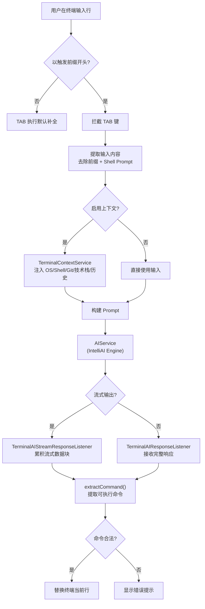
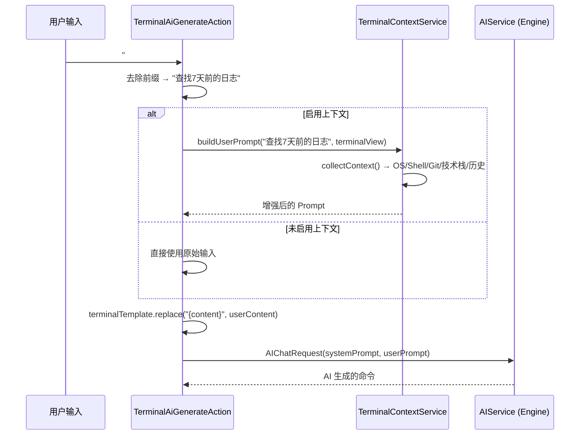

## 现有方案的痛点

终端里的大量操作有一个共同特征：**高频、临时、简单**。查个端口、扫个日志、打包个镜像，难的不是算法，是「这条 one-liner 参数怎么拼」。市面上的解决方案各有各的问题：

**通用 AI 工具**（ChatGPT、Cursor 等）：你得切换窗口、描述需求、从一大段解释里抠出那一行命令。而且通用 AI 工具加载了大量 Agent、MCP、Skill 上下文，你只是想生成一行 `find`，也要消耗大量 token。

**重型 AI CLI**（Claude Code、Codex CLI 等）：非常适合复杂任务和多步推理，但为了「删七天前的日志」这种小事进入一整套交互会话，心智与路径都偏重。

**查文档 / 搜索引擎**：每次都要离开终端、搜索、复制、粘贴，打断心流。

这个场景的 AI 调用其实非常简单：**输入是自然语言描述，输出是可执行的 Shell 命令**，一轮问答就够了。把这种极简的 AI 调用直接嵌到 IDE 内置终端里，不需要离开编辑器，不多消耗一个 token。

## 功能一览


| 功能 | 入口 | 说明 |
|------|------|------|
| TAB 生成命令 | 终端输入行 + TAB | 以触发前缀（默认 `#`）开头时拦截 TAB，用 AI 生成命令替换当前行 |
| Quick Prompt 弹窗 | Ctrl+I | 弹出输入框，输入自然语言后生成命令，支持插入/运行/复制/新文件/编辑器插入 |
| 上下文感知 | 可选开启 | 自动注入 OS、Shell、当前目录、Git 仓库、Docker/K8s、技术栈、AI 历史 |
| 流式输出 | 可选开启 | 开启后 AI 响应以流式方式返回，延迟更低 |
| 历史记录 | Quick Prompt 弹窗 | 保存最近的提问和生成结果，支持查看和复制 |
| Tab 标题装饰 | 自动 | 终端 Tab 标题前加 🤖 标识，表明启用了 Terminal AI |
| 状态栏快捷设置 | 状态栏弹窗 | 快速切换 AI 服务商、触发前缀、开关 Terminal AI/流式输出/上下文 |

支持 UNIX（bash/zsh/fish）和 Windows（PowerShell/cmd），通过 [IntelliAI Engine](https://github.com/dong4j/zeka-stack/tree/main/intelli-ai-engine) 统一调用 OpenAI、Anthropic、Ollama 等多种 AI 后端。

## 核心架构

插件的完整数据流：



## 双终端视图兼容

IntelliJ 的 Terminal 栈在迭代过程中存在两种实现：**TerminalView**（新终端前端）和 **JBTerminalWidget**（旧终端组件）。同一套「取当前行 / 写回当前行」的逻辑，必须在两种 API 上都能跑通。

```java
// TerminalAiGenerateAction.java - getTerminalView()
public static TerminalView getTerminalView(@NotNull AnActionEvent e) {
    DataKey<TerminalView> key = DataKey.create("TerminalView");
    TerminalView view = e.getData(key);
    if (view != null) return view;
    // 降级到小写 key
    DataKey<TerminalView> keyLower = DataKey.create("terminalView");
    return e.getData(keyLower);
}
```

获取到终端实例后，根据是 TerminalView 还是 JBTerminalWidget 走不同的输入提取和行替换路径：

```java
// TerminalAiGenerateAction.java - actionPerformed()
TerminalView terminalView = getTerminalView(e);
JBTerminalWidget jbWidget = e.getData(JBTerminalWidget.TERMINAL_DATA_KEY);
if (terminalView == null && jbWidget == null) {
    // 没找到终端，提示错误
    return;
}
// 根据类型走不同路径
InputInfo inputInfo = terminalView != null
    ? getInputInfo(terminalView, settings, shellType)
    : getInputInfo(jbWidget, settings, shellType);
```

## TAB 触发机制

TAB 键是全世界最忙的键——默认绑定着终端补全。插件通过 `TerminalAllowedActionsProvider` 扩展点，把 TAB 的 AI 生成动作约束在「满足前缀条件时才认领」，不抢走默认行为。

```java
// TerminalAiAllowedActionsProvider.java
public class TerminalAiAllowedActionsProvider implements TerminalAllowedActionsProvider {
    @Override
    public @NotNull List<String> getActionIds() {
        return List.of(
            "dev.dong4j.zeka.stack.idea.plugin.terminal.action.TerminalAiGenerateAction",
            "dev.dong4j.zeka.stack.idea.plugin.terminal.action.TerminalAiQuickPromptAction"
        );
    }
}
```

触发条件：当前输入行以 `triggerPrefix`（默认 `#`）开头时，TAB 才进入 AI 生成语义：

```java
// TerminalAiGenerateAction.java - extractPrompt()
private static String extractPrompt(@NotNull String currentLine,
                                    @NotNull String prefix,
                                    @NotNull TerminalShellType shellType) {
    String trimmed = currentLine.stripLeading();
    int index = trimmed.indexOf(prefix);
    if (index < 0) return null;  // 不匹配前缀，不拦截
    String content = trimmed.substring(index + prefix.length());
    return content.strip();
}
```

前缀可以从状态栏快速切换，预设选项：`#`、`::`、`??`，也支持自定义输入。

## 输入提取逻辑

从终端提取用户输入比想象中复杂。终端输出包含 Shell Prompt（`$`、`>`、`PS ...>`），还可能有多行续行（以 `\` 结尾）。插件做了多层处理：

### 去除 Shell Prompt 前缀

```java
// TerminalAiGenerateAction.java - stripPromptPrefix()
private static String stripPromptPrefix(@NotNull String line, @NotNull TerminalShellType shellType) {
    String trimmed = line.stripLeading();
    if (shellType == TerminalShellType.WINDOWS) {
        // PowerShell: "PS C:\Users> " → 提取 ">" 后面的内容
        if (trimmed.startsWith("PS ") && trimmed.contains(">")) {
            int separator = trimmed.indexOf('>');
            return trimmed.substring(separator + 1).stripLeading();
        }
        return trimmed;
    }
    // Unix: "$ " / "$" / "> " / ">" → 去掉前缀
    if (trimmed.startsWith("$ ")) return trimmed.substring(2);
    if (trimmed.startsWith("> ")) return trimmed.substring(2);
    return trimmed;
}
```

### 续行合并

当用户输入了以 `\` 结尾的多行命令时，插件会向前遍历终端输出，将多行合并为一条逻辑行：

```java
// TerminalAiGenerateAction.java - getLastLogicalLine()
// 从最后一行开始向上遍历
while (true) {
    int prevIndex = findPreviousNonBlankIndex(lines, index - 1);
    if (prevIndex < 0) break;
    String prevRaw = lines.get(prevIndex).stripTrailing();
    if (!prevRaw.endsWith("\\")) break;  // 没有续行符，停止合并
    parts.addFirst(normalizeInputLine(prevRaw, shellType));
    multiLine = true;
    index = prevIndex;
}
return new LogicalLine(String.join(" ", parts).strip(), multiLine);
```

## AI 请求构建与上下文注入

提取到用户输入后，插件会根据是否启用了上下文检测来构建请求。



### 终端上下文服务

`TerminalContextService` 是一个 Project 级别的服务，负责收集当前终端的环境信息。这些信息会以结构化格式注入到 prompt 中，让 AI 理解当前环境：

```java
// TerminalContextService.java - buildPrompt()
sb.append("【当前目录上下文】:\n");
sb.append("- os: ").append(context.shellEnv.os).append("\n");
sb.append("- shell: ").append(context.shellEnv.shell).append("\n");
sb.append("- current-directory: ").append(context.currentDirectory).append("\n");
sb.append("- git: ").append(context.projectInfo.isGit).append("\n");
// Dockerfile、docker-compose、kubernetes、build-tool、language...
// AI 交互历史（最近 5 条）
```

上下文检测的具体范围：

| 检测项 | 来源 | 说明 |
|--------|------|------|
| OS | `System.getProperty("os.name")` | linux / mac os x / windows |
| Shell | `System.getenv("SHELL")` | zsh / bash / fish |
| 当前目录 | `terminalView.getCurrentDirectory()` | 终端实际所在目录 |
| Git 仓库 | 向上查找 `.git` 目录 | 读取 `.git/config`（截断 600 字符） |
| Dockerfile | 检查当前目录下 `Dockerfile` | boolean |
| Docker Compose | 检查 `docker-compose.yml` / `.yaml` | boolean |
| Kubernetes | 检查 `k8s/`、`manifests/`、`.kube/`、`.helm/` | boolean |
| 构建工具 | `pom.xml` → maven，`build.gradle` → gradle，`package.json` → npm，`go.mod` → go，`pyproject.toml` → pip | 优先级按顺序匹配 |
| 语言 | 由构建工具推断 | java / javascript / go / python |
| AI 历史 | 内存队列，最多 5 条 | 格式化为 Q/A 对注入 |

上下文结果会按当前目录路径缓存，避免重复扫描文件系统。

## 流式与非流式响应

插件支持两种响应模式，在设置中切换：

### 非流式（默认）

直接调用 `aiService.generateContent()`，等待完整响应返回后一次性处理：

```java
// TerminalAiGenerateAction.java
TerminalAIResponseListener listener = new TerminalAIResponseListener(project);
String result = aiService.generateContent(project, request, providerConfig, listener);
handleAiResult(project, terminalView, jbWidget, inputInfo, result, ...);
```

### 流式

使用 `CountDownLatch` 等待流式完成，最大超时 2 分钟。`TerminalAIStreamResponseListener` 在 `onChunk` 中累积数据，`onComplete` 中统一处理：

```java
// TerminalAIStreamResponseListener.java
@Override
public void onChunk(@NotNull String chunk) {
    if (chunk.isEmpty()) return;
    streamBuffer.append(chunk);  // 累积流式数据
}

@Override
public void onComplete(@NotNull String fullText) {
    try {
        String result = fullText.isBlank() ? streamBuffer.toString() : fullText;
        TerminalAiGenerateAction.applyAiResult(project, terminalView, jbWidget,
                                                inputInfo, result, ...);
    } finally {
        streamLatch.countDown();  // 释放锁，允许主流程继续
    }
}
```

流式模式下，发送请求、接收数据、处理完成等每个阶段都会通过 `ProgressIndicator` 更新进度状态。

## 响应清理与命令提取

AI 返回的文本不能直接插入终端。插件在写回终端前做了多层清洗：

```java
// TerminalAiGenerateAction.java - extractCommand()
private static String extractCommand(@NotNull String result) {
    String[] lines = result.replace("\r", "").split("\n");
    String candidate = null;
    boolean inFence = false;
    for (String line : lines) {
        String trimmed = line.trim();
        if (trimmed.startsWith("```")) {   // 跳过代码块
            inFence = !inFence;
            continue;
        }
        if (inFence) continue;             // 代码块内不处理
        if (trimmed.isEmpty()) continue;   // 跳过空行
        candidate = trimmed;               // 第一个非空行就是命令
        break;
    }
    return candidate == null ? result.trim() : candidate;
}
```

提取到命令后，还会做合法性校验：

```java
// TerminalAiGenerateAction.java - isValidShellOutput()
private static boolean isValidShellOutput(@NotNull String output, @NotNull TerminalShellType shellType) {
    // UNIX: 必须以字母、数字、/、.、$ 开头
    // Windows: 必须以字母、数字、\、.、& 开头
    // 不包含 ```（代码块标记）
    // 不包含连续换行 \n\n
}
```

通过校验的命令才会替换到终端当前行。

## Shell 类型感知

通过 `TerminalShellDetector` 检测当前操作系统，区分 UNIX 和 Windows 两种行为分支：

```java
// TerminalShellDetector.java
public static TerminalShellType detect(@Nullable TerminalView terminalView,
                                       @Nullable JBTerminalWidget widget) {
    String osName = System.getProperty("os.name", "unknown").toLowerCase(Locale.ROOT);
    return osName.contains("win") ? TerminalShellType.WINDOWS : TerminalShellType.UNIX;
}
```

Shell 类型影响三个行为：
- **Prompt 前缀去除**：UNIX 去除 `$` / `>`，Windows 去除 `PS xxx>` 或 `>`
- **命令合法性校验**：Windows 允许 `\` 和 `&` 开头
- **当前行替换**：Windows 额外发送 ``（Ctrl+C）取消当前输入

## 当前行替换

命令通过校验后，替换终端当前行。核心思路是先清行、再写入：

```java
// TerminalAiGenerateAction.java - replaceCurrentLine() [TerminalView]
private static void replaceCurrentLine(@NotNull TerminalView terminalView,
                                       @NotNull String newText,
                                       boolean multiLine,
                                       @NotNull TerminalShellType shellType) {
    if (shellType == TerminalShellType.WINDOWS) {
        sendText(terminalView, "");  // Ctrl+C，取消当前输入
        sendText(terminalView, "");  // Ctrl+U，清空行
        sendText(terminalView, newText);
        return;
    }
    if (multiLine) {
        sendText(terminalView, "");  // 多行输入先 Ctrl+C
        sendText(terminalView, newText);
        return;
    }
    sendText(terminalView, "");  // Ctrl+U，清空当前行
    sendText(terminalView, newText);
}
```

`JBTerminalWidget` 的替换通过 `widget.getTtyConnector().write()` 实现，逻辑一致。

替换完成后，用户看到的是 AI 生成的命令出现在当前行，可以审阅后回车执行。同时命令和原始问题会被记录到 AI 历史（最多 5 条），供后续上下文注入使用。

## Quick Prompt 弹窗

除了 TAB 触发，插件还提供了 Ctrl+I 快捷键打开的 Quick Prompt 弹窗，适用于不想修改当前输入行内容的场景。弹窗包含：

- **输入框**：输入自然语言需求
- **生成按钮**：调用 AI 生成命令
- **插入按钮**：将命令插入到终端当前行（不执行）
- **运行按钮**：将命令插入到终端并立即执行（追加 `\n`）
- **更多菜单**：复制到剪贴板、在新编辑器中打开、插入到当前编辑器、查看历史记录

Quick Prompt 弹窗内部调用的是同一个 AI 生成链路，但因为弹窗本身可以展示生成结果，用户可以先看到命令再决定是否应用。

## Tab 标题装饰

插件通过 `ProjectActivity` 在项目启动时监听终端 Tab 的创建事件，自动在标题前添加 🤖 标识：

```java
// TerminalTabTitleDecorator.java
private static boolean tryDecorate(@NotNull Content content) {
    String displayName = content.getDisplayName();
    if (baseName.startsWith(AI_MARK)) return true;  // 已装饰
    content.setDisplayName(AI_MARK + baseName);       // 🤖 + 原标题
    content.setTabName(AI_MARK + baseName);
    content.putUserData(DECORATED_KEY, Boolean.TRUE);
    return true;
}
```

装饰只在 `enableTerminalAI` 开启时生效，关闭后不再装饰新 Tab。使用 `WeakHashMap` 和 `Key<Boolean>` 避免内存泄漏和重复装饰。

## 设置页面配置

设置面板位于 **Settings → Tools → IntelliAI Engine → IntelliAI Terminal**，包含以下配置项：

### AI 服务商选择

从全局已配置的 AI 服务商列表中选择 Terminal 插件使用的默认服务商。配置在 Engine 的全局设置中管理，Terminal 插件只做选择。

### 基础设置

| 配置项 | 类型 | 默认值 | 说明 |
|--------|------|--------|------|
| 启用 Terminal AI | 复选框 | ✅ 开启 | 总开关，控制是否在终端中拦截触发前缀并执行 AI 生成 |
| 启用流式输出 | 复选框 | ❌ 关闭 | 开启后 AI 响应以流式方式返回 |
| 启用上下文检测 | 复选框 | ❌ 关闭 | 注入 OS/Shell/Git/技术栈等上下文信息，可能增加延迟 |
| 触发前缀 | 下拉框（可编辑） | `#` | 只有输入行以此前缀开头时才触发 AI 生成。预设选项：`#`、`::`、`??` |

### 高级设置（Prompt 模板）

点击「显示高级设置」后展开，包含两个 Tab：

- **系统提示词**：设定 AI 的角色和行为准则。默认提示词严格约束 AI「只输出可执行的 shell 命令，不允许输出解释、注释、Markdown、代码块标记、占位符」
- **用户提示词模板**：使用 `{content}` 占位符拼接用户输入。默认模板为「根据下面的描述，生成最合适的一条 shell 命令」

两个模板都有「重置为默认值」按钮。如果用户修改后又改回默认值，会自动同步提示词模板版本号。

### 提示词模板版本管理

内置提示词更新时，`PROMPT_TEMPLATE_VERSION` 会递增。插件在启动时检测版本差异，通过 `PromptTemplateVersionNotifier` 提示用户关注模板变更，避免用户使用过时的默认提示词。

### 状态栏快捷设置

除了设置面板，插件还在状态栏提供了快捷操作菜单：

- **AI 服务商切换**：快速切换 Terminal 使用的 AI 服务商
- **触发前缀切换**：快速切换 `#`、`::`、`??`
- **Terminal AI 开关**：一键启用/禁用
- **流式输出开关**：一键启用/禁用
- **上下文检测开关**：一键启用/禁用
- **打开设置**：跳转到完整设置面板

## 模块结构

```
intelli-ai-terminal/src/main/java/
├── action/
│   ├── TerminalAiGenerateAction.java    # TAB 触发主逻辑（1167行）
│   └── TerminalAiQuickPromptAction.java # Ctrl+I 弹窗（645行）
├── ai/
│   ├── TerminalAIResponseListener.java  # 非流式响应监听
│   └── TerminalAIStreamResponseListener.java # 流式响应监听
├── context/
│   └── TerminalContextService.java      # 终端上下文采集（519行）
├── shell/
│   ├── TerminalShellDetector.java       # Shell 类型检测
│   └── TerminalShellType.java           # UNIX / WINDOWS 枚举
├── settings/
│   ├── SettingsState.java               # 配置持久化
│   ├── TerminalSettingsConfigurable.java # 设置面板入口
│   ├── PromptTemplateVersionNotifier.java # 模板版本变更通知
│   └── ui/
│       └── TerminalSettingsPanel.java   # 设置面板 UI
├── terminal/
│   ├── TerminalAiAllowedActionsProvider.java # TAB 动作约束
│   └── TerminalTabTitleDecorator.java   # Tab 标题装饰
├── statusbar/
│   └── TerminalStatusBarPopupProvider.java # 状态栏弹窗
├── statistics/
│   └── TerminalStatisticsReporter.java  # 统计上报
└── history/
    └── TerminalHistoryState.java        # 历史记录持久化
```

**相关文章**:

1. [IntelliAI Engine](/posts/2026/build-idea-plugin-ai-engine/) - 统一接入 30+ AI 服务商的底层平台
2. [IntelliAI JavaDoc](/posts/2026/build-idea-plugin-ai-javadoc/) - AI 驱动的 JavaDoc 自动生成插件
3. [IntelliAI Changelog](/posts/2026/build-idea-plugin-ai-changelog/) - AI 一键生成 Changelog、日报、周报

## 相关链接

- **IntelliJ 插件市场**: [https://plugins.jetbrains.com/plugin/intelliai-terminal](https://plugins.jetbrains.com/plugin/intelliai-terminal)
- **GitHub**: [https://github.com/dong4j/zeka-stack](https://github.com/dong4j/zeka-stack)
- **IntelliAI Engine**: [https://github.com/dong4j/zeka-stack/tree/main/intelli-ai-engine](https://github.com/dong4j/zeka-stack/tree/main/intelli-ai-engine)
- **插件文档**: [https://ideaplugin.dong4j.site/terminal/docs.html](https://ideaplugin.dong4j.site/terminal/docs.html)
