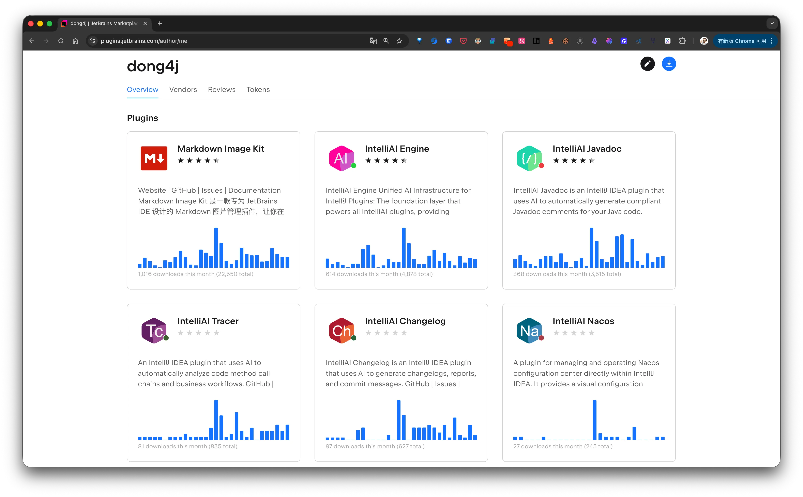

## 写在前面

最近我一直在反复回答一个问题：为什么我没有去做一个 Claude Code、Codex 那种大而全的 AI 工具，而是先做了几个看起来很"小"的 IDEA 插件？

这个问题背后，其实是同一个选择题：**工具到底要不要把所有事情都做掉。**

我现在的答案很明确：

> 我不想做一个"替你做完所有事"的工具，我只想做一个在关键一刻能帮你省掉重复劳动的工具。

这篇文章我把两部分内容合并到一起讲：一部分是我的真实动机（为什么要做），另一部分是架构上的取舍（为什么要拆 Engine）。

---

## 我最早的痛点，不是没有 AI，而是 AI 太重了

AI 还没这么普及的时候，我做过一段时间 Javadoc 自动生成。那时候主要靠 PSI 拿代码结构，再套模板拼注释。流程是能跑通，但有两个问题一直很明显：

- 对方法命名质量依赖很高
- 生成出来的描述经常"结构正确、语义不对"

说白了就是格式没问题，但意思不一定对，最后还得人工二次修改。

后来 AI 出来后，这件事理论上应该更容易了，但我自己实际用下来又遇到了另一个坑：很多大模型工具太"全能"了，带了很多 MCP、Skill、Agent 能力，做复杂任务很强，但放到 Javadoc 这种高频小任务上，反而不够顺手。

比如我想给整个项目批量补注释，本来目标很简单：给我符合规范、语义准确的注释。结果经常变成：

1. 多轮交互
2. 上下文超长
3. 反复缩小范围重试
4. Token 开销越来越高

最后你会发现，真正慢的不是模型，而是整个交互链路。

---

## 我真正想要的，其实是最原始的"一问一答"

回到我自己的场景，需求其实非常朴素：

- 输入：当前代码片段 + 系统提示词/用户提示词
- 输出：可直接落库的 Javadoc 文本
- 后处理：由 IDEA 插件完成插入/替换

就一轮问答，不做额外剧情。

这也是我做 IntelliAI Javadoc 的起点。它没有追求"万能助手"，只专注一件事：把 Javadoc 生成这条链路做到足够短、足够快、足够稳定。

因为边界足够清楚，我就可以把性能优化做得更激进，比如并发处理、提示词压缩、批量生成流程优化、CodeView 一键替换等。最后的结果很直接：单个生成快，批量生成更快，而且质量可控。

插件上线后，同事给了不少正向反馈，这让我更确信一件事：**小而专注，不是功能弱，而是更贴近真实工作流。**

---

## 第二个插件让我确认：这条路是可复用的

做完 Javadoc 后，我又做了 IntelliAI Changelog。思路几乎一样：把提交上下文喂给 AI，返回规范提交信息，再由插件承接后续操作。

这时候我开始意识到一个很关键的事实：我前两个插件虽然业务目标不同，但 AI 链路几乎一模一样：

- 配置服务商
- 组装提示词
- 调用模型
- 处理返回结果

也就是说，真正重复的不是业务，而是 AI 基础能力。

---

## 为什么一定要拆出 IntelliAI Engine

到这里其实就是程序员基本功了：抽象。  
我不想每个插件都维护一套 AI 接入逻辑，所以把共性能力抽成了第三个插件：IntelliAI Engine。

Engine 的定位很克制：它只负责"怎么调 AI"，不负责"业务上要做什么"。

Engine 这层主要处理：

- 模型与服务商接入
- Prompt 请求编排
- Token 与请求生命周期管理
- 超时、重试、错误处理
- 对外的统一扩展接口

而业务插件只关心一件事：把自己的输入输出定义清楚，然后调用 Engine。

这套分层带来的价值很实在，不是什么花哨架构：

- 修 bug 只修一处
- 行为在多个插件里保持一致
- 新插件开发速度显著提升
- 职责边界清晰，问题定位不扯皮

比如我要再做 IntelliAI Terminal、IntelliAI Tracer，核心能力不需要重写，重点放在场景本身就行。

---

## 为什么我依然不做大而全

这里我不是说大而全工具不好。它们解决的是另一类问题：复杂工程、长链路任务、跨文件和跨步骤协作。  
我做的，是另一个方向：高频、短链路、可预测、低干扰。

我给自己的约束一直没变：

- 不接管用户工作流
- 不强迫用户进入"AI 模式"
- 不把简单问题复杂化
- 失败时保证"安全失败"

在我的理解里，一个工程工具的上限不只是能力，还有信任。  
你知道它只做这一件事，而且大概率不会帮倒忙，你才会在每天几十次操作里放心按下去。

---

## 我的理解

把这一路串起来，我的思路其实很简单：

- 先从真实痛点出发，而不是从"我要做个 AI 产品"出发
- 先把一个小场景打穿，再谈扩展
- 把共性能力沉到 Engine，把业务复杂度留在插件外层
- 用组合替代堆叠，用边界换稳定

所以如果你问我这套设计哲学到底是什么，我现在会用一句话回答：

**不替你思考一切，只在你需要的那一刻，帮你快一步。**

---

## 系列文章导航

这篇算是 IntelliAI 插件系列的引导篇。如果你想看具体实现，可以按下面这条线继续看：

1. [从重复劳动到智能助手：我为什么要开发一个 JavaDoc 插件](/posts/2026/build-idea-plugin-ai-javadoc/)
2. [我写了一个 IntelliJ IDEA 插件，用 AI 一键生成 Changelog](/posts/2026/build-idea-plugin-ai-changelog/)
3. [从单体插件到 AI 平台：IntelliAI Engine 的设计与实现](/posts/2026/build-idea-plugin-ai-engine/)
4. [让终端「听懂人话」：在 IntelliJ IDEA 内置终端用自然语言生成 Shell 命令](/posts/2026/build-idea-plugin-ai-terminal/)

---

## 我的插件

你也可以访问 [Zeka Stack](https://zekastack.dong4j.site/) 站点获取在 IntelliAI Engine 中免费使用的 OpenAI API Key, [集成方式](/posts/2026/intelliai-engine-freeai-quickstart/) 也非常简单, 期待你的 [反馈](https://zekastack.dong4j.site/#/feedback)
