## 背景

随着业务不断扩展，系统服务数量和访问压力持续增长，当前整体架构已逐步暴露出性能瓶颈与资源竞争等问题，影响了核心业务的稳定性和扩展性。系统采用微服务架构，目前共计 17 个微服务，分布在多个业务域中，运行一段时间后主要暴露出以下典型问题：

- 部分核心服务资源占用高，影响其他服务的稳定运行；
- 统计类服务存在大量复杂查询，导致数据库压力集中，查询响应缓慢；
- 存在分布式事务、大事务与表锁并发问题，在高峰期容易造成请求阻塞或死锁；
- 缺乏读写分离、异步化、缓存等优化手段，导致部分非关键路径也占用大量系统资源；
- 系统在监控、限流、容灾等方面存在不足，缺乏针对高并发场景的应对策略。

为全面提升系统性能与稳定性，我们计划从**架构优化、数据库治理、慢 SQL 缓解、中间件调优、Spring Boot 优化、连接池/线程池、异步请求等多个方面**，逐步推进整改工作，以提高系统稳定性与高并发要求。

---

## 项目基础情况

**技术架构**: Spring Cloud Alibaba 微服务架构
**基础框架**: **RuoYi** 微服务框架
**核心业务**: 用工需求发布、派工管理、支付结算、数据统计

---

## 技术架构

### 技术栈

- **后端**: Spring Boot 2.7.13 + Spring Cloud 2021.0.8 + Spring Cloud Alibaba 2021.0.5.0
- **前端**: Vue.js + Element UI
- **数据库**: MySQL + MyBatis Plus + Druid 连接池
- **开发语言**: Java 1.8/17

### 核心中间件

- **Nacos**: 服务注册发现 + 配置中心
- **Sentinel**: 限流熔断
- **Seata**: 分布式事务
- **RocketMQ**: 消息队列 
- **Redis**: 分布式缓存
- **MySQL**: 数据存储

### 系统架构图

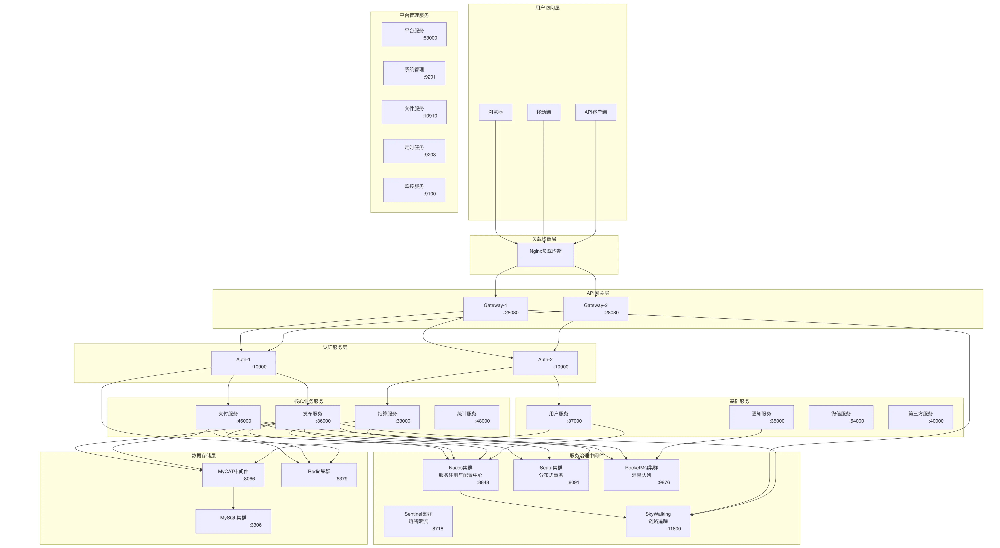

---

## 现状分析

### 调用链路

当前系统采用微服务架构，包含 17 个微服务:

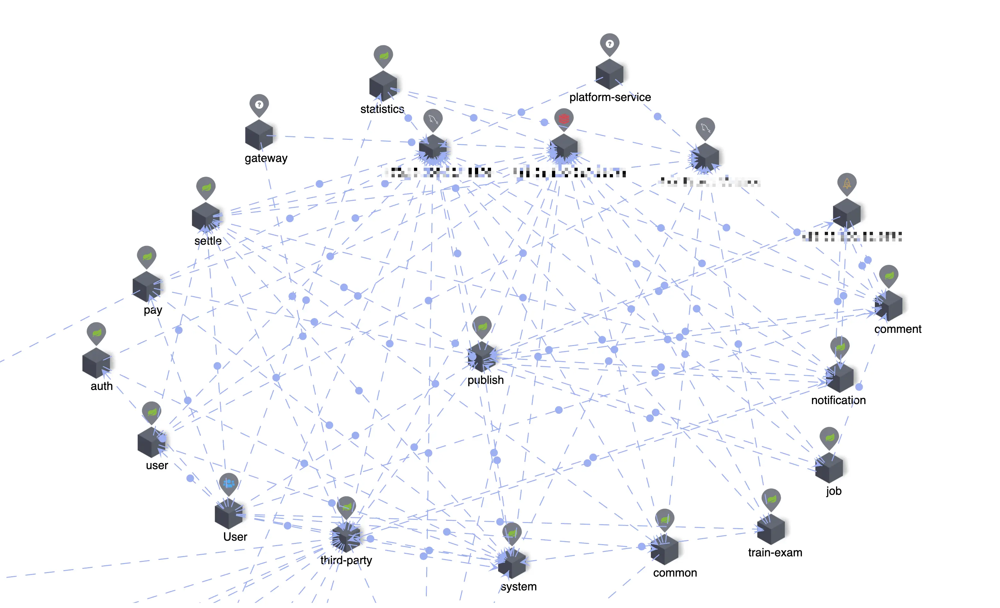

- 微服务间同步调用过多，链路过长，单点慢服务拖慢整体响应。
- 建议：梳理调用链，必要时用异步、消息队列解耦。

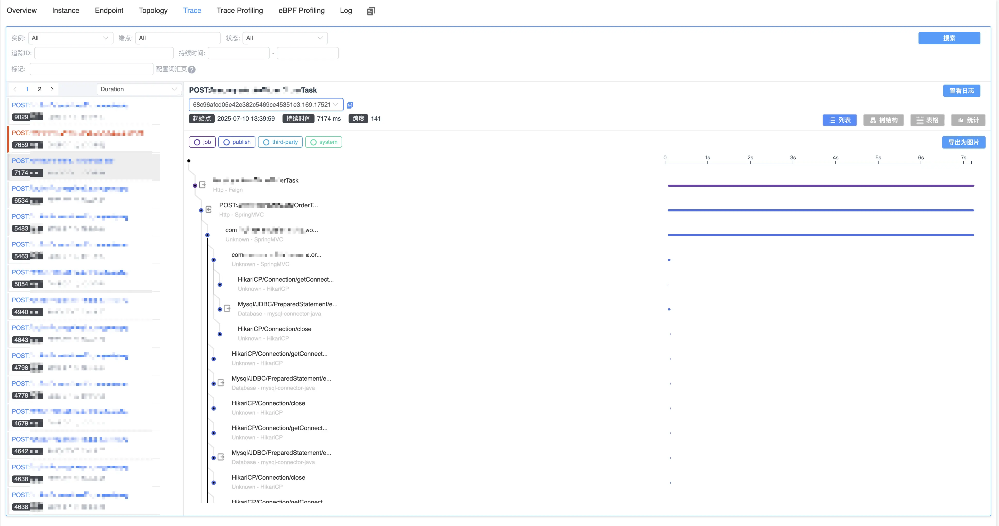

> 常见问题:
>
> 1. 同步执行大量耗时操作, 比如同步批量发送短信
> 2. SQL 没有走索引, 比如高频接口:`communityProcess/freeEmployee/query`

---

### 服务延迟

**服务延迟情况:**

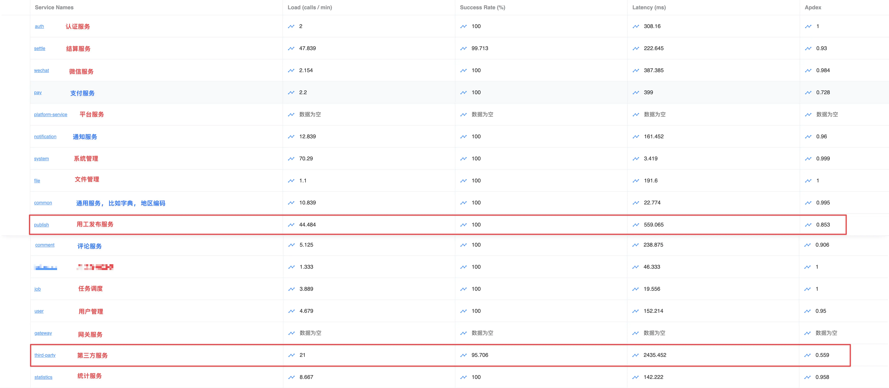

- 第三方服务延迟最高, 因为部分三方服务存在限流;
- 核心的 public 服务延迟较高, 负载最高;

---

### 数据库

#### 慢 SQL

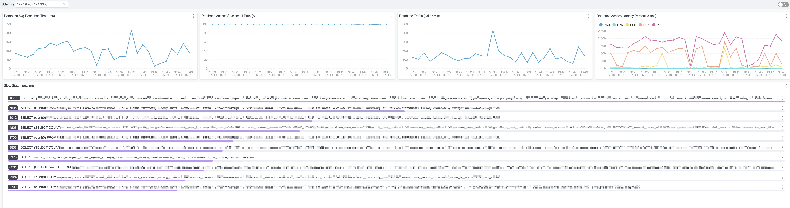

- 存在大量慢 SQL, 大部分来自统计服务;

---

#### 资源占用情况

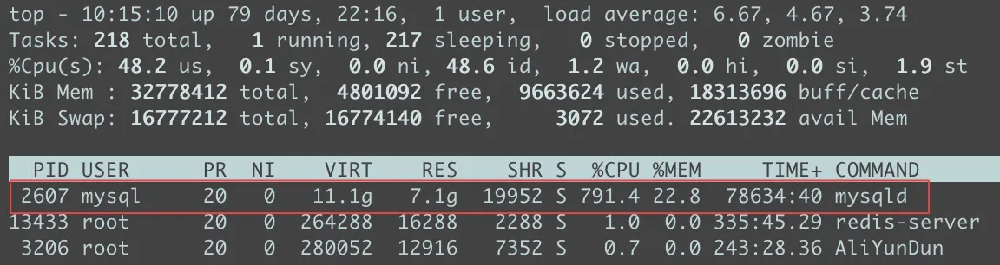

1. **MySQL 的 CPU 占用率 791.4%** (某个时刻, 不是常态)
   - 在 16 核服务器上，单进程 CPU 占用率上限为 1600%（16 核 * 100%）
   - 791.4% ≈ 占用近 8 个物理核（占总量 50%），说明：
     - 存在大量高负载 SQL（如未优化的全表扫描）
     - 频繁的锁竞争（如行锁升级为表锁）
     - 连接池过载或缓存失效

2. 7GB 物理内存已用于 MySQL，17 个服务使用的话, `InnoDB buffer pool` 设置的较低;

---

#### 数据量


1. employee: 214.17 W+
2. user: 55.19 W+
3. sys_job: 35.81 W+

> oper_log 的数据停止在 2025-06-11.

---

#### 数据库状态

1. 存在明显的死锁: employee 表大批量 UPDATE + JOIN，锁范围大、事务重

   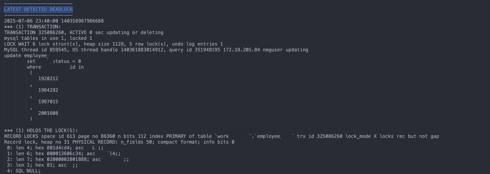

2. `LOCK WAIT 318 lock struct(s), heap size 57464, 10565 row lock(s)`: 一次性锁了大量记录

---

### 压测结果

#### 压测口径说明

为避免“优化前后数据不可比”，建议统一压测口径：

- 压测前预热 5~10 分钟，避免 JVM 冷启动影响；
- 混合场景按读写 7:3 配置，并单独保留核心交易场景；
- 每轮压测不少于 30 分钟，记录稳态区间数据；
- 第三方依赖分别测“真实调用”与“Mock 调用”两组结果；
- 固定数据量级（如百万级主表）后再对比优化收益。

#### 并发100混合场景

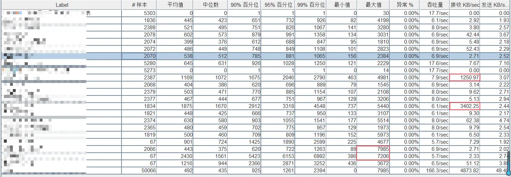

1. **数据库查询优化不足**
   - 工单类接口（雇主/专合社工单列表）**95%响应时间 >2s**，存在：
     -  缺失关键索引（尤其关联查询字段）
     -  未做分页处理（`LIMIT`缺失导致全量加载）
     -  复杂统计未预计算
2. **事务设计缺陷**
   - `工单审核` 接口最大延迟7.2s，**中位数(1,561ms) vs 95%(6,153ms)差异巨大**
     高并发下出现**事务锁竞争**​（检查 `SELECT FOR UPDATE` 使用）
3. **资源消耗失衡**
   - 高频接口 `待审核工单列表查询` 吞吐量17.6/sec（占总量10.6%）
   - 但其最大响应时间 2.2s → 可能成为 **大流量崩溃点**
4. **数据传输冗余**
   - `雇主工单列表` 单请求 550KB 数据传输 → **带宽浪费+反序列化压力**

#### 200并发混合场景

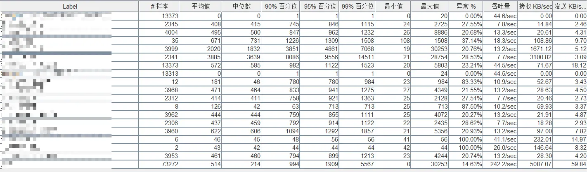

整体健康度差

- **异常率**：14.63%（超出可接受范围，通常要求<1%）
- **吞吐量**：242.2次/秒（200并发下效率偏低）
- **中位数响应时间**：214ms（尚可），但**平均响应时间**达514ms（表明存在严重长尾延迟）

---

## 核心问题

1. 微服务调用链路长;
2. 所有微服务共用同一个数据库;
3. 统计服务存在大量慢查询;
4. 第三方服务限流;
5. Seata 性能瓶颈;
6. 部分接口返回大量数据;
7. 没有充分利用缓存;
8. 没有充分利用连接池, 线程池;
9. 没有充分利用异步化;

---

## 架构优化

### 存储层优化

1. **数据库资源高度集中，服务间相互影响严重**

   所有服务连接同一数据库实例，查询与写入操作混杂，资源争抢严重，单个服务的性能问题（如频繁查询、慢 SQL）会波及整体系统，影响主业务稳定性。

2. **统计服务存在大量复杂查询，导致慢 SQL 问题突出**

   统计类服务需处理大量历史数据、聚合查询，SQL 复杂、执行时间长，对数据库 I/O 与 CPU 资源消耗大，已成为性能瓶颈的重要来源。

3. **使用了分布式事务中间件 Seata，引入额外性能风险**

   为保持分布式事务一致性，引入 Seata 作为全局事务协调器。Seata 使用全局锁机制，若业务中存在大事务或表锁冲突，可能导致数据库长时间等待或锁竞争，进一步加剧系统负载。

4. **数据库无法快速扩展，资源瓶颈明显**

   受限于当前服务器资源，数据库尚未进行物理拆分或集群化，难以通过横向扩展快速缓解性能问题。

数据库的集中式架构与高耦合连接方式已经难以支撑现有业务的发展需求，亟需分阶段进行系统性优化，逐步实现资源隔离、读写分离与高可用能力的提升。

#### 核心问题归类

| **问题**       | **描述**                           | **危害**            |
| -------------- | ---------------------------------- | ------------------- |
| 单库连接压力大 | 多服务共享一个 DB，连接数占满      | 拒绝连接 / 请求阻塞 |
| 慢 SQL         | 统计服务等复杂查询影响 InnoDB 行锁 | 阻塞主业务 SQL 执行 |
| 表锁 + 大事务  | Seata 全局事务未拆分，表锁时间长   | 连锁阻塞，吞吐下降  |
| 无读写隔离     | 所有 SQL 都走主库，主库压力爆炸    | 写入延迟，CPU 飙升  |
| 扩展能力弱     | 单点 MySQL 架构无法扩容            | 发展受限            |

---

#### 第一阶段：数据库逻辑拆分

**目标**：服务数据库逻辑隔离，避免单服务拖垮全局。

**方案**：

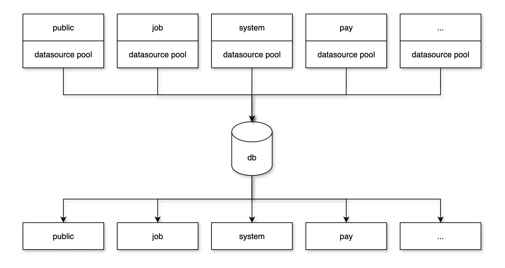

- 将原有「单库」按服务维度拆分为多个逻辑数据库（schema）；
- 所有数据库仍部署在**同一个 MySQL 实例**；
- 每个服务仅访问自己的数据库；
- Seata 用于解决跨库事务问题（推荐优先消除分布式事务）；
- 结合连接池（如 Hikari）优化连接数上限分配。

> **收益**：服务间隔离，控制粒度更细，降低全局风险。

#### 第二阶段：引入读写分离，从库承接统计查询

**目标**：慢查询与业务查询隔离，减轻主库压力。

**方案**：

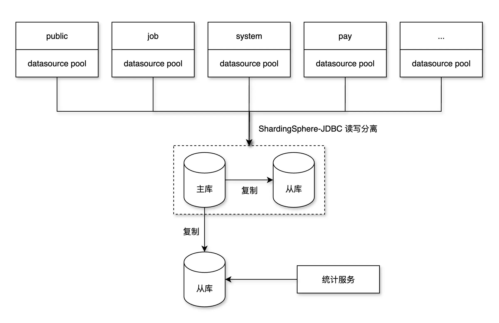

- 为 MySQL 实例配置 **1 个或多个从库**（MySQL Replication）；
- 将统计类服务路由到从库；
- 采用 **ShardingSphere-JDBC** 实现读写分离，服务内自动路由 SQL（SELECT → 从库）；
- 对关键查询（写后立即查）使用 Hint 强制主库，保障数据一致性；
- 配置 Seata 不影响从库，避免锁表；

按照计划采用 1 主 2 从的话, 建议核心服务连接 1 主 1 从(使用 **ShardingSphere-JDBC** 实现读写分离), 剩下的一台读库单独分给 **统计服务**.

> **推荐工具**：ShardingSphere-JDBC（对比见下方）

#### 第三阶段：统计数据预处理

**目标**：消除慢 SQL 根源。

**方案**：

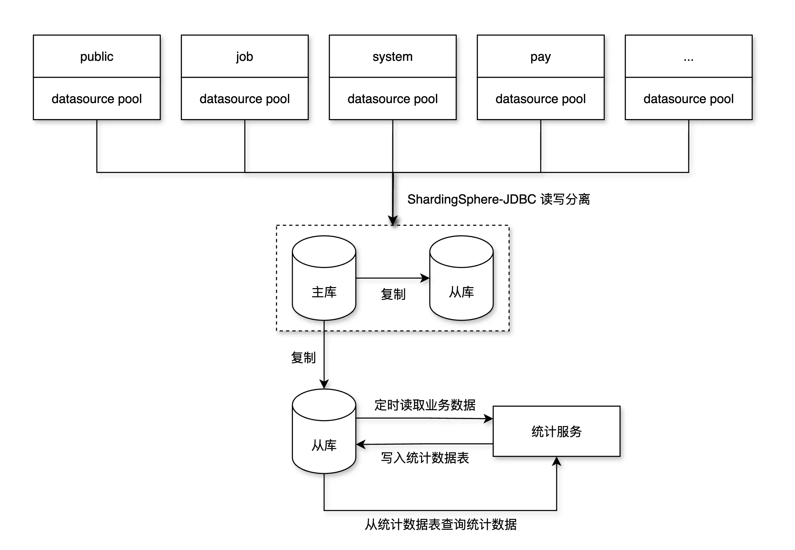

- 将统计 SQL 拆解为**异步定时任务**，定期汇总写入统计表；
- 通过缓存（Redis）或 OLAP 存储（ClickHouse、Doris）加速查询；
- 将统计服务转为「读缓存 + 数据仓库」模式；
- 引入数据更新链路（binlog → Kafka → 统计表）可选。

> **收益**：读写高并发彻底隔离，慢查询压力被清除。

#### 第四阶段：数据库实例物理拆分

**目标**：突破单实例资源瓶颈，实现数据库横向扩容。

**方案**：

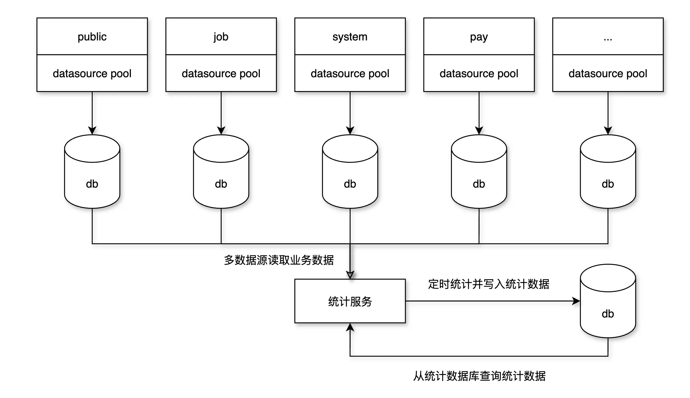

- 根据服务资源使用和数据量，将数据库从一个实例拆分成多个物理实例；
- 支持分布式部署（主库与从库分服务器）；

> **收益**：架构弹性更强，资源调度粒度更细，瓶颈彻底解除。

---

#### 读写分离选型建议

按照原来的优化方案, 计划使用 Mycat 作为读写分离 proxy 使用, 目的是做透明代理, 不过个人推荐使用 **ShardingSphere-JDBC**:

| **对比维度**     | **Mycat**              | **ShardingSphere-JDBC** |
| ---------------- | ---------------------- | ----------------------- |
| 架构模式         | 代理中间件（独立部署） | 应用内嵌，轻量          |
| 运维成本         | 较高（单独运维中间件） | 低（与应用共部署）      |
| 主从路由控制     | SQL 注释               | 自动路由 + Hint 控制    |
| 事务兼容性       | 弱                     | 强（可与 Seata 协作）   |
| 微服务适配       | 一般                   | 非常好                |
| 数据同步延迟感知 | 无（需手动控制）       | 自动识别事务内读写顺序  |
| 推荐程度         | 不推荐                 | 推荐                    |

> Mycat 目前已经停止维护 5 年之久, 且处理 **写后立即查** 的问题比较麻烦, 比如需要修改 SQL:
>
> ```sql
> /*!mycat:db_type=master*/ SELECT * FROM user WHERE id = 123;
> ```
>
> 而 ShardingSphere-JDBC 就比较简单, 通过配置即可实现, 同时支持代码指定. 所以选择 **ShardingSphere-JDBC** 实现读写分离，简洁、高效、低侵入，适配 Spring Boot 微服务生态，未来还可扩展为分库分表。

---

#### 实施建议与里程碑规划

| **阶段** | **目标**   | **核心任务**                       | **工具选型**             |
| -------- | ---------- | ---------------------------------- | ------------------------ |
| P1       | 拆库隔离   | 拆分 schema，修改数据源配置        | 无需新工具               |
| P2       | 读写分离   | 部署从库，接入 ShardingSphere-JDBC | 推荐                     |
| P3       | 消除慢 SQL | 引入预计算任务、缓存、OLAP 引擎    | Redis / ClickHouse       |
| P4       | 物理拆分   | 多实例部署 + 弹性调度              | 分布式数据库或多实例管理 |

---

---

### 连接池

项目中按照逻辑应该是使用 druid 来管理数据源连接, **遗憾的是并没有生效**, 还是使用的 `HikariDataSource`, 可以运行 `应用启动类#printDatasource` 看看. 

原因在与错误的引入了 `druid` 依赖(来自于 work_center-commin-seata), 所以并没有装配 druid 相关的 bean. 可参考 `work_center-system` 与其他模块的区别( `work_center-system` 引入的是 `druid-spring-boot-starter`)

那么按照现在的配置的话, `HikariDataSource` 默认连接最大为 10, 建议设置到 20. 目前共计 17 个微服务, 一共 340 个连接, 所以需要确认一下 MySQL 的连接数量.

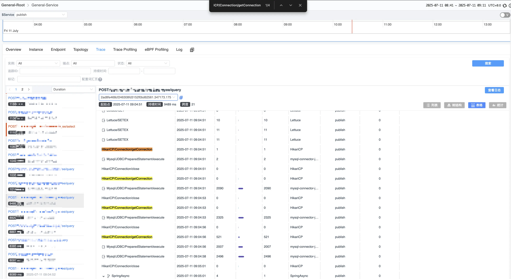

上图是高频接口: `/api/core/query` 一个流程中操作了 4 次数据库, 单个耗时在 2s 左右, 如果按照连接池默认 10 个连接的来算, 超过 10 个并发就得排队 2 秒.

---

### 配置优化

#### 基本资源情况

| **项目** | **数值**              |
| -------- | --------------------- |
| CPU      | 16 核（无超线程）     |
| 内存     | 31G（可用约 21G）     |
| Swap     | 15G，几乎没用（空闲） |

**生产环境核心配置如下**:

```ini
[mysqld]
innodb_buffer_pool_size = 2G
innodb_buffer_pool_instances = 8

innodb_log_file_size = 256M
innodb_log_buffer_size = 64M

max_connections = 500
thread_cache_size = 8
table_open_cache = 1000
```

#### 调优目标

- 提高 MySQL **缓存命中率**、减少磁盘 IO；
- 合理利用 31G 内存，给 MySQL 分配更多内存缓存；
- 基于 16 核 CPU，提升并发处理能力；
- 适用于 **高并发业务系统** 查询场景；

```ini
# MySQL 核心配置（建议替换或追加到 my.cnf）
[mysqld]
# -- 内存相关 --
innodb_buffer_pool_size = 20G               # 占内存约 65%，主要缓存表数据与索引页
innodb_buffer_pool_instances = 8            # 建议为 8～16，根据并发数拆分 buffer pool
innodb_log_file_size = 1G                   # 日志文件加大，减少 checkpoint 频率（需重启生效）
innodb_log_buffer_size = 256M               # 减少频繁刷 log，适合大事务（一般 64M~512M）

# -- 并发相关 --
max_connections = 500                       # 建议先按容量模型落到 500，再按峰值逐步调优
thread_cache_size = 64                      # 增加线程缓存，减少线程创建开销
table_open_cache = 4096                     # 打开更多表缓存（默认 2000 太低）
table_definition_cache = 2048               # 防止频繁打开表定义
```

> 建议让运维进行数据库专项优化, 包括数据库配置调优与服务器配置优化.

#### 容量估算方法

连接数和线程池建议不要“固定抄参数”，建议按下面公式估算后再压测校准：

```text
目标并发连接数 ≈ 峰值QPS × 数据库平均响应时间(秒) × 安全系数
```

例如：峰值 250 QPS、DB 平均 40ms、安全系数 2，则连接数约 `250 * 0.04 * 2 = 20`。  
然后按服务分组做总量配额，避免少数服务抢占全部连接。

### 索引优化

这个需要根据自身业务专题优化. 重点解决主要业务流程的 SQL 优化.

---

### 调用链优化

在当前的微服务架构中，共部署了 17 个独立服务。由于业务切分粒度较细，部分接口在一次用户请求过程中需经过多个服务调用，形成较长的调用链，带来 **高网络开销**、**高整体延迟** 和 **链路不稳定风险放大** 等问题。

#### 合并请求

在前端或聚合服务层面，存在多个请求分别调用多个微服务的情况，建议进行接口层的合并与组合，特别是在：

- 同一页面初始化需多次接口调用；
- 多个服务返回的数据可一并获取或缓存。

**优化效果：**

- 减少前端与服务端交互轮数；
- 降低整体延迟；
- 后端可做缓存、合并、降级处理，增强鲁棒性。

#### 合并非核心服务

部分非核心业务服务，如 通知服务、微信服务、通用服务、评论服务等功能简单，响应时间对业务无重大影响。建议将此类服务合并为一个“**基础服务中心**”，减少远程调用次数和维护成本。

**优化效果：**

- 减少 RPC 网络调用数，提高整体响应速度；
- 降低服务间耦合复杂度，优化服务治理负担；
- 降低部署资源和节点数，节省运维成本。

#### 异步调用

对于非强一致性要求的调用（如日志收集、短信通知、推送、部分审计操作），应从同步链路中拆分出来，使用异步方式处理：

**可选实现方式：**

- **消息队列**（如 Kafka、RocketMQ）进行消息解耦；
- **异步线程池** 配合 @Async 注解；
- 使用分布式任务调度框架处理重试/失败补偿（如 XXL-Job）。

**优化效果：**

- 减少同步调用数量，缩短主链路响应时间；
- 提高服务可用性与容错性；
- 提供削峰填谷能力，避免高峰时因同步链路雪崩。

#### 使用聚合服务

对于调用链长、跨多个服务的业务流程，应引入上层 **聚合服务** 进行统一编排、聚合与降级处理。

**核心原则：**

- **避免服务相互调用形成复杂网状结构**；
- 将“业务流程逻辑”从下游服务中抽离到聚合层，职责更清晰；
- 聚合服务可复用异步机制、缓存策略、兜底策略等。

**优势：**

- 降低系统复杂性；
- 更好地统一控制调用链路、错误处理、日志采集；
- 聚合服务作为服务网关内部逻辑中台，具备良好扩展性。

---

## 服务优化

### 统计服务

统计服务部分接口使用了缓存, 但是仍然存在以下问题:

- 所有缓存过期时间统一为 **300 秒**, 非常容易出现缓存雪崩的问题(比如一个页面大概率会同时调用多个统计接口, 如果全部设置为 300 秒, 过期后全部回去查数据库).

​	**优化建议**: 根据业务场景设置不同的过期时间, 比如按天统计的数据, 过期时间设置为 1 天;

其他问题:

- 使用 info 级别直接输出了查询到的实体信息. 一般不建议直接输出这类信息, 因为无法预估实体大小, 一旦数据量较大时会影响系统. 建议 **使用 debug 级别**, 仅输出查询到的数据量.

---

### 任务调度

### 其他服务

在部分服务中仍然有少量的统计接口, 建议迁移到 **统计服务** 中进行集中管理.

---

## Spring Boot 优化

### 日志配置优化

目前的日志配置存在性能问题:

`%F,%L,%C,%M`:

1. %F: 文件名
2. %L: 行号
3. %C: 类名
4. %M: 方法名

每次日志调用需生成完整的堆栈跟踪（Stack Trace）以定位代码位置, 在高并发场景下，频繁生成堆栈跟踪可能导致：

1. CPU 占用率飙升（计算密集型操作）;
2. 线程阻塞（Logback 的同步日志输出默认加锁）;
3. 日志吞吐量下降 50% 以上（实测对比）;

---

在实际生产环境或基准测试中，**Log4j2 的性能通常优于 Logback**，特别是在高并发、高吞吐日志场景下。下面从多个角度对比两者性能与特性：

#### 性能对比结论

| **方面**     | **Logback**                               | **Log4j2**                                   |
| ------------ | ----------------------------------------- | -------------------------------------------- |
| **异步性能** | 中等，基于 AsyncAppender 实现，单线程写入 | **优秀**，基于 LMAX Disruptor 高性能异步队列 |
| **吞吐量**   | 低于 Log4j2                               | 更高（Logback 的 2~10 倍）                   |
| **延迟**     | 较高                                      | 更低                                         |
| **GC 压力**  | 一般                                      | 更低，内存复用机制更好                       |
| **可扩展性** | 支持但不如 Log4j2 灵活                    | 插件体系更强大、配置更灵活                   |

#### 异步机制核心差异

| **特性**     | **Logback（1.2.x）**                 | **Log4j2**                           |
| ------------ | ------------------------------------ | ------------------------------------ |
| 异步机制     | AsyncAppender（LinkedBlockingQueue） | AsyncAppender（Disruptor）           |
| 异步线程数   | 单个工作线程                         | 多生产者单消费者（MPSC）             |
| 丢日志控制   | discardingThreshold 简单丢弃策略     | 支持 AsyncWaitStrategy，更智能       |
| 实际吞吐差异 | 在 10k+ TPS 时可能瓶颈明显           | Disruptor 可支持 100k+ TPS，性能极优 |

基于上面的对比, 推荐使用 log4j2 代替 logback.

下面是与原 logback-spring.xml 相同功能的 log4j2 日志配置, 包含 Skywalking 日志收集:

```xml
<?xml version="1.0" encoding="UTF-8"?>
<Configuration status="WARN">
    <Properties>
        <Property name="logPath">logs</Property>
        <Property name="appName">core-service</Property>
        <Property name="LOG_EXCEPTION_CONVERSION_WORD">%xwEx</Property>
        <Property name="LOG_LEVEL_PATTERN">%5p</Property>
        <Property name="MARKER_PATTERN">%m%n</Property>
        <Property name="ROLLING_FILE_NAME_PATTERN">%d{yyyyMMdd.HH}.%i.log.gz</Property>
        <Property name="LOG_DATEFORMAT_PATTERN">yyyy-MM-dd HH:mm:ss.SSS</Property>
        <!--@formatter:off-->
        <Property name="log.pattern">%d{${sys:LOG_DATEFORMAT_PATTERN}} ${sys:LOG_LEVEL_PATTERN} - [%15.15t] %c{1.} :: ${MARKER_PATTERN}${sys:LOG_EXCEPTION_CONVERSION_WORD}</Property>
        <!--@formatter:on-->
    </Properties>

    <Appenders>
        <!-- 控制台输出 -->
        <Console name="STDOUT" target="SYSTEM_OUT">
            <PatternLayout pattern="${log.pattern}"/>
        </Console>

        <!-- 按时间+大小滚动的文件输出 -->
        <RollingFile name="File" fileName="${logPath}/${appName}.log"
                     filePattern="${logPath}/bak/%d{yyyy-MM-dd}/${appName}-%d{yyyy-MM-dd}.%i.log.gz">
            <PatternLayout pattern="${log.pattern}" charset="UTF-8"/>
            <Policies>
                <TimeBasedTriggeringPolicy/>
                <SizeBasedTriggeringPolicy size="20MB"/>
            </Policies>
            <DefaultRolloverStrategy max="20"/>
        </RollingFile>

        <!-- SkyWalking APM 日志输出 -->
        <GRPCLogClientAppender name="grpc-log">
            <PatternLayout pattern="${log.pattern}"/>
        </GRPCLogClientAppender>
    </Appenders>

    <Loggers>
        <Root level="info">
            <AppenderRef ref="STDOUT"/>
            <AppenderRef ref="File"/>
            <AppenderRef ref="grpc-log"/>
        </Root>
    </Loggers>
</Configuration>
```

---

#### 实施步骤

1. 依赖调整（`pom.xml`）

   ```xml
   <!-- 全局排除 logging 依赖 -->
   <dependency>
       <groupId>org.springframework.boot</groupId>
       <artifactId>spring-boot-starter</artifactId>
       <version>${spring-boot.version}</version>
       <exclusions>
           <exclusion>
               <groupId>org.springframework.boot</groupId>
               <artifactId>spring-boot-starter-logging</artifactId>
           </exclusion>
       </exclusions>
   </dependency>
   ```

   在模块中引入 log4j2 依赖:

   ```xml
   <dependency>
       <groupId>org.springframework.boot</groupId>
       <artifactId>spring-boot-starter-log4j2</artifactId>
   </dependency>
   ```

2. 使用 log4j2.xml 替换 logback-spring.xml;

3. 替换 Skywalking 依赖:

   ```xml
   <dependency>
       <groupId>org.apache.skywalking</groupId>
       <artifactId>apm-toolkit-log4j-2.x</artifactId>
       <version>9.0.0</version>
   </dependency>
   ```

---

### 容器配置优化

#### 核心性能对比

|    **特性**     |                **Tomcat**                |                 **Undertow**                 |           **高并发场景优势**            |
| :-------------: | :--------------------------------------: | :------------------------------------------: | :-------------------------------------: |
|  **线程模型**   | 默认 NIO，多线程请求处理模型             | 基于 XNIO 的事件驱动模型                      | 降低线程切换开销，提升高并发稳定性      |
|  **内存占用**   |         较高（默认堆内内存管理）         | **低 30%~40%**（默认堆外内存，减少 GC 压力） |      降低内存溢出风险，提升稳定性       |
|   **吞吐量**    |    约 12,000 QPS（实测 4 核 8G 环境）    |     **约 16,000~25,000 QPS**（相同硬件）     |           提升 30% 以上吞吐量           |
| **HTTP/2 支持** |              支持但配置复杂              |             **原生支持且零配置**             |       提升多路复用效率，降低延迟        |
|  **启动速度**   |            较慢（加载组件多）            |          **快 50%+**（轻量级设计）           |          加速服务迭代与扩缩容           |

> Undertow 在**高并发、低延迟、资源受限**场景下优势显著，适合微服务、API 网关等架构；Tomcat 更适合需**完整 Servlet 规范支持**的传统应用。

#### 实施步骤

1. 依赖调整（`pom.xml`）

   ```xml
   <dependency>
       <groupId>org.springframework.boot</groupId>
       <artifactId>spring-boot-starter-web</artifactId>
       <exclusions>
           <exclusion>
               <groupId>org.springframework.boot</groupId>
               <artifactId>spring-boot-starter-tomcat</artifactId>
           </exclusion>
       </exclusions>
   </dependency>
   <dependency>
       <groupId>org.springframework.boot</groupId>
       <artifactId>spring-boot-starter-undertow</artifactId>
   </dependency>
   ```

2. 配置优化:

   ```yaml
   server:
     port: 10900
     undertow:
       # 线程池配置
       threads:
         # IO线程数 = CPU核数×2（如8核设16）
         io: 16
         # 工作线程数 = IO线程数×16（建议200~500）
         worker: 256
       # 内存优化
       # 缓冲区大小（KB），根据请求体调整（1KB~2MB）
       buffer-size: 16384
       # 启用堆外内存，减少GC压力
       direct-buffers: true
       # 请求限制
       # 防止大文件上传导致OOM
       max-http-post-size: 10MB
       # 空闲连接多久后关闭
       no-request-timeout: 60s
   ```

---

### 异步任务优化

代码中使用 `@Async` 实现异步调用, Spring 中使用 `@Async` 默认的线程池只有一个线程，来自于 `SimpleAsyncTaskExecutor`，它每次调用都会新建线程，不是线程复用（所以是“并发但不是真正的线程池”），这对性能和资源管理是有问题的。

而在项目中没有看到相关的配置逻辑, 从测试代码来看:

```java
@Async
public void asyncMethod() {
    System.out.println("当前线程：" + Thread.currentThread().getName());
}

当前线程：task-1
```

说明是 Spring 默认的异步线程。

#### 线程池配置

##### 方法一：通过配置类注册线程池

```java
@Configuration
@EnableAsync
public class AsyncConfig implements AsyncConfigurer {

    @Override
    public Executor getAsyncExecutor() {
        ThreadPoolTaskExecutor executor = new ThreadPoolTaskExecutor();
        executor.setCorePoolSize(8);       // 核心线程数
        executor.setMaxPoolSize(16);       // 最大线程数
        executor.setQueueCapacity(100);    // 队列容量
        executor.setThreadNamePrefix("async-exec-");
        executor.initialize();
        return executor;
    }
}
```

然后在使用 @Async 的方法上就会看到如下线程名：

```
当前线程：async-exec-1
```

可以通过设置的 corePoolSize、maxPoolSize 来控制线程数。

##### 方法二：定义多个线程池

也可以定义多个 Executor Bean，并指定 `@Async("beanName")`：

```java
@Bean(name = "logExecutor")
public Executor logExecutor() {
    ThreadPoolTaskExecutor executor = new ThreadPoolTaskExecutor();
    executor.setCorePoolSize(2);
    executor.setMaxPoolSize(4);
    executor.setQueueCapacity(50);
    executor.setThreadNamePrefix("log-task-");
    executor.initialize();
    return executor;
}
```

然后：

```java
@Async("logExecutor")
public void logAsyncTask() {
    ...
}
```

>推荐做法: 为每类异步任务新增一个线程池, 隔离不同业务的线程资源、避免互相阻塞，缺点是增加线程池管理复杂度和资源占用。可以业务情况自行评估, 但是一定不要使用默认的配置, 因为默认的 @Async 配置每次提交任务都会创建新线程，**高并发下会疯狂创建线程，导致系统资源耗尽、频繁 GC，甚至 OOM 和系统崩溃。**

---

#### 异步失效

这跟事务失效是一个道理, **@Async 是基于 Spring 的代理机制实现的，类内部自调用绕过了代理，导致异步执行失效，方法仍然在原线程中同步执行。** 比如:

```java
@Service
public class MyService {
    public void entry() {
        this.doAsyncTask(); // 直接调用，@Async 不生效
    }
    @Async
    public void doAsyncTask() {
        log.info("线程名: {}", Thread.currentThread().getName());
    }
}
```

> **目前项目中存在 `@Async` 失效的逻辑, 需要统一优化.**
>
> **推荐方案**: 将 `@Async` 方法抽到另一个 `@Component ` 类中调用:
>
> ```java
> @Component
> public class AsyncWorker {
>  @Async
>  public void doAsyncTask() { ... }
> }
> @Service
> public class MyService {
>  @Autowired
>  private AsyncWorker asyncWorker;
>  public void entry() {
>      asyncWorker.doAsyncTask();
>  }
> }
> ```
>
> **非常不推荐注入自身代理** 的方式来规避 @Async 失效的问题, 因为:
>
> | **歧义**   | this.xxx() 与 self.xxx() 同为类内调用，看起来一样，行为却完全不同，容易让新同事或维护者误解 |
> | ---------- | ------------------------------------------------------------ |
> | **易遗漏** | 在一个类中新增 @Async 方法时，如果忘了用 self 调用，异步就会悄悄失效，且**无编译错误、无运行异常，只是静默同步执行**，这是最危险的陷阱之一 |

---

### 连接池优化

各微服务之间使用 feign 交互, feign 的配置如下:

```yaml
feign:
  sentinel:
    enabled: true
  okhttp:
    enabled: true
  httpclient:
    enabled: false
  client:
    config:
      default:
        connectTimeout: 10000
        readTimeout: 20000
```

可见已经将 httpclient 替换为有连接池的 okhttp, **但非常遗憾的是: 仅仅修改配置并不能使用 okhttp**, 现在仍然使用无连接池的 **HttpURLConnection**, 如果需要调试可在下面的代码打上断点:

```java
public FeignBlockingLoadBalancerClient(Client delegate, LoadBalancerClient loadBalancerClient,
    LoadBalancerClientFactory loadBalancerClientFactory) {
  this.delegate = delegate;
  this.loadBalancerClient = loadBalancerClient;
  this.loadBalancerClientFactory = loadBalancerClientFactory;
}
```

如果要正确使用上 okhttp, 还需要做如下工作:

1. 引入 feign-okhttp 依赖:

   ```xml
   <dependency>
       <groupId>io.github.openfeign</groupId>
       <artifactId>feign-okhttp</artifactId>
   </dependency>
   ```

装配逻辑在: `org.springframework.cloud.openfeign.loadbalancer.OkHttpFeignLoadBalancerConfiguration`

```java
@Bean
public okhttp3.OkHttpClient client(OkHttpClientFactory httpClientFactory, ConnectionPool connectionPool,
    FeignHttpClientProperties httpClientProperties) {
  boolean followRedirects = httpClientProperties.isFollowRedirects();
  int connectTimeout = httpClientProperties.getConnectionTimeout();
  Duration reaTimeout = httpClientProperties.getOkHttp().getReadTimeout();
  this.okHttpClient = httpClientFactory.createBuilder(httpClientProperties.isDisableSslValidation())
      .connectTimeout(connectTimeout, TimeUnit.MILLISECONDS).followRedirects(followRedirects)
      .readTimeout(reaTimeout).connectionPool(connectionPool).build();
  return this.okHttpClient;
}
```

正确的配置可能有点奇怪, 可以看上面的代码:

```yaml
# feign 配置
feign:
  sentinel:
    enabled: true
  okhttp:
    enabled: true
  httpclient:
    # 连接池配置
    max-connections: 222
    time-to-live: 900
    # okhttp 配置
    ok-http:
      read-timeout: 20s
    connection-timeout: 10000
  compression:
    request:
      enabled: true
    response:
      enabled: true
```

> 注意：OpenFeign 在不同 Spring Cloud 版本下配置键可能存在差异。  
> 建议在文档中补充“以当前项目 BOM 版本文档为准”，并在启动日志中确认 `OkHttpFeignLoadBalancerConfiguration` 已实际装配，避免“配置写了但没生效”。

---

## 第三方服务优化

`third-party-module` 是延迟最高的微服务, 原因在于调用第三方 API 时因限流或网络问题导致的.

### HTTP 客户端优化

#### OkHttp

```
third.party.client.SocialClientUtil#getUnsafeOkHttpClient
third.party.client.ContentAuditUtil
```

使用了 OkHttp 的默认连接池, 建议根据业务场景定制连接池.

| executorService        | 内部执行http请求的实际线程池                                 | 默认没有常驻线程，性能低，线程没有限制上限。                 |
| ---------------------- | ------------------------------------------------------------ | ------------------------------------------------------------ |
| maxIdleConnections     | 连接池大小，指单个okhttpclient实例所有连接的连接池。         | 默认：5，值的设置与业务请求量有关                            |
| keepAliveDurationMills | 连接池中连接的最大时长                                       | 默认 5 分钟，依据业务场景来确定有效时间，如果不确定，那就保持5分钟 |
| connectTimeoutMills    | 连接的最大超时时间                                           | 默认 10 秒                                                   |
| readTimeoutMills       | 读超时                                                       | 默认 10 秒，如果是流式读，那建议设置长一点时间               |
| writeTimeoutMills      | 写超时                                                       | 默认10秒，如果是流式写，那建议设置长一点时间                 |
| maxRequests            | 当前okhttpclient实例最大的并发请求数                         | 默认：64，默认的 64一般满足不了业务需要。这个值一般要大于maxRequestPerHost，如果这个值小于 maxRequestPerHost 会导致，请求单个主机的并发不可能超过 maxRequest. |
| maxRequestPerHost      | 单个主机最大请求并发数，这里的主机指被请求方主机，一般可以理解对调用方有限流作用。注意：websocket请求不受这个限制。 | 默认：4，一般建议与 maxRequest 保持一致。这个值设置，有如下几个场景考虑：（1）如果被调用方的并发能力只能支持200，那这个值最好不要超过200，否则对调用方有压力；（2）如果当前 okhttpclient 实例只对一个调用方发起调用，那这个值与maxRequests保持一致；（3）如果当前okhttpclient实例在一个事务中对 n 个调用方发起调用，n * maxReuestPerHos t要接近maxRequest |

#### RestTemplate 优化

RestTemplate 如何不配置的话, 注入使用时默认使用 `SimpleClientHttpRequestFactory` , 底层使用的 **`HttpURLConnection`**, 也就是没有连接池. 在大量请求时会存在性能问题.

建议: 自定义连接池, 使用 OkHttp 替换 **HttpURLConnection**.

#### Forest 优化

同 OkHttp

---

## JVM 优化

### 1. 选择合适的垃圾回收器

不同的垃圾回收器适用于不同的场景。对于 Seata 这样的高并发应用，推荐使用 G1 GC（Garbage-First Garbage Collector），因为它能够在保证低停顿时间的同时，处理大量的并发线程。

```bash
java -XX:+UseG1GC -jar seata-server.jar
```

### 2. 调整堆内存大小

堆内存的大小直接影响 GC 的频率和停顿时间。如果堆内存过小，GC 会频繁发生；如果堆内存过大，GC 停顿时间会变长。建议根据实际应用场景调整堆内存大小。

```bash
java -Xms512m -Xmx2g -XX:+UseG1GC -jar seata-server.jar
```

### 3. 调整新生代和老年代的比例

新生代和老年代的比例也会影响 GC 的性能。对于 Seata 这样的应用，建议将新生代的比例设置为堆内存的 40%-50%。

```bash
java -Xms512m -Xmx2g -XX:NewRatio=2 -XX:+UseG1GC -jar seata-server.jar
```

### 4. 启用 GC 日志

启用 GC 日志可以帮助我们分析 GC 的行为，找出性能瓶颈。

```bash
java -Xms512m -Xmx2g -XX:+UseG1GC -Xloggc:gc.log -XX:+PrintGCDetails -XX:+PrintGCDateStamps -jar seata-server.jar
```

### 5. 监控和分析 GC 行为

使用工具如 `jstat` 或 `VisualVM` 监控 GC 行为，分析 GC 停顿时间和频率，进一步优化 GC 参数。

```bash
jstat -gc <pid> 1000
```

## Seata 优化

### Skywalking 集成

Seata 融合 SkyWalking 应用性能监控的操作步骤非常简单，大致步骤可分为 " 编译&配置 " 以及 " 接入监控 " 这两个步骤。

#### 编译&配置

首先需要下载 Seata 源码，并在源码根目录执行:

```
mvn clean package -Dmaven.test.skip=true
```

将 `seata/ext/apm-skywalking/target/seata-skywalking-{version}.jar` 放入 SkyWalking 探针插件文件夹中

**强烈地推荐使用 Seata 最新版**

#### 接入监控

Seata 的客户端和服务端接入 SkyWalking 与其他应用服务并无二致，可参考 [SkyWalking 探针配置](https://github.com/apache/skywalking/blob/f3b567160ce61675cb692c3417101162d67093de/docs/en/setup/service-agent/java-agent/Setting-override.md)。

Seata 涉及的重要参数有：

| 参数                                        | 备注                                                       |
| ------------------------------------------- | ---------------------------------------------------------- |
| skywalking.plugin.seata.server              | 布尔属性，当值为 `true`，标识本应用服务是否为 Seata server |
| skywalking.plugin.jdbc.trace_sql_parameters | 布尔属性，当值为 `true`，本应用服务记录 sql 参数           |
| skywalking.agent.service_name               | 字符串属性，标识本应用服务在 SkyWalking 的唯一标识         |

Seata 客户端探针参数可参考

```text
java -javaagent:{path}/skywalking-agent.jar -Dskywalking.agent.service_name=seata_biz -Dskywalking.plugin.jdbc.trace_sql_parameters=true -jar seata_biz.jar
```

Seata 服务端探针参数可参考

```text
java -javaagent:{path}/skywalking-agent.jar -Dskywalking.agent.service_name=seata_tc -Dskywalking.plugin.jdbc.trace_sql_parameters=true -Dskywalking.plugin.seata.server=true -jar seata_tc.jar
```

### 数据库连接池状态监控

建议加上 druid 监控连接

### 连接池优化

现在没有使用连接池, 建议加上:

```yml
seata:
  datasource:
    type: com.zaxxer.hikari.HikariDataSource
    hikari:
      maximum-pool-size: 20
      minimum-idle: 5
      idle-timeout: 30000
      max-lifetime: 1800000
      connection-timeout: 30000
```

### 网络优化

```yaml
seata:
  # 使用 Kryo 序列化
  serializer: kryo
  transport:
  	# 使用长链接
    keep-alive: true
    # 使用压缩
    compress: gzip
```

### 异步提交

对于不需要立即返回结果的事务，可以使用异步提交来减少事务处理的等待时间。

```java
// 配置 Seata 的异步提交模式
GlobalTransactionScanner scanner = new GlobalTransactionScanner("my-app-group", "my-tx-service-group");
scanner.setAsyncCommit(true);

// 开启一个全局事务
GlobalTransaction tx = GlobalTransactionContext.getCurrentOrCreate();
tx.begin();

try {
    // 执行业务逻辑
    businessService.doSomething();

    // 提交事务
    tx.commit();
} catch (Exception e) {
    // 回滚事务
    tx.rollback();
}
```

### 线程池优化

```yaml
seata:
  thread:
    pool:
      core-size: 20
      max-size: 50
  timeout:
    global: 60000
    branch: 30000
```

---

## 代码优化

### 异步调用

一些旁路逻辑应该使用异步调用的方式降低延迟, 比如:

1. 记录登录日志: `remote.log.api#saveLoginInfo`

上述逻辑本身的错误不应该影响主流程, 最好使用异步的方式调用, 最好直接使用 MQ 解耦.

### 循环远程调用

这种情况普遍存在于发送短信, 比如 `/api/order/startClose`, 原设计循环异步发送(异步存在问题), 导致大量网络开销. 

比如下面的代码:


在某短信发送方法中执行了 2 个远程调用：
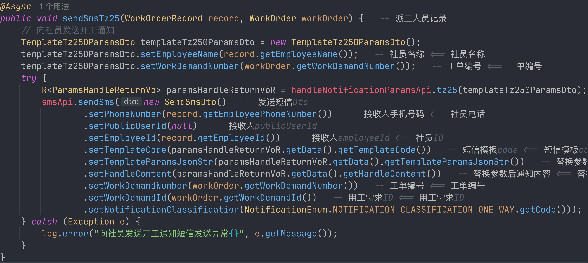

优化建议:

1. 将循环合并成一个远程调用, 在短信服务端循环处理发送短信;
2. 模板服务添加缓存;

---

### 事务问题

1. 不应该被回滚的数据被回滚了:

   ```java
   @GlobalTransactional
   public LoginUser login(String phoneNumber, String smsCode) {
   // 查询用户信息
   R<LoginUser> userResult = remoteUserService.getUserInfo(phoneNumber, SecurityConstants.INTERNAL);
       if (R.isError(userResult)) {
           log.info("登录用户查询异常，phoneNumber:{}，错误信息：{}", phoneNumber, userResult.getMsg());
           recordLogService.recordLogininfor(phoneNumber, Constants.LOGIN_FAIL, userResult.getMsg());
           throw new ServiceException(userResult.getMsg());
       }
       ...
   }
   ```

   因为使用 Seata 接管了事务, 在抛出异常后错误日志记录会被回滚. 类似日志记录这种旁路逻辑, 建议使用异步调用来降低延迟, 且即使错误也不要影响主流程.

### 分布式锁问题

`labor.service.impl.BrokerServiceImpl#selectEmployee`

```java
try {
    // 根据员工ID上锁 todo-dong4j : (2025.07.10 15:13) [存在错误释放锁的问题]
    for (Integer employeeId : employeeIdList) {
        if (!redisService.setNx(keyPrefix + employeeId, token, LOCK_EXPIRE_TIME)) {
            return R.fail("所选人员已被其他工作人员选中,请稍后重试!");
        }
    }
    final R<ResultEnum> EMPLOYEE_STATUS_ERROR = porcessor(userId, userType, supplyFlag, employeeIdList, orderEntity, demandEntity);
    if (EMPLOYEE_STATUS_ERROR != null) return EMPLOYEE_STATUS_ERROR;
} finally {
    //解锁
    for (Integer employeeId : employeeIdList) {
        redisService.releaseLock(keyPrefix + employeeId, token);
    }
}
```

在 finally 块中，**无差别释放所有员工 ID 的锁**，但实际上，并不是所有的锁都加成功了。如果有某个员工 ID 加锁失败，前面的某些锁可能加成功了，后面的根本没加。这种情况下 releaseLock 仍会尝试释放所有锁，可能导致：

- **多次释放无效资源**
- **性能浪费、语义不清晰**

另一个问题是: 多个线程并发执行这段代码时，**先锁一部分，再失败退出**，期间容易发生竞争条件，例如：

- 线程 A 锁了 A1、A2，线程 B 锁了 A3、A4；
- 线程 A 尝试锁 A3 失败，退出并释放 A1、A2(还是释放完成)；
- 线程 B 尝试锁 A1 失败，退出并释放 A3、A4；
- 所有人都失败，形成 **活锁**。

解决方法:

```java
List<Integer> lockedEmployeeIds = new ArrayList<>();
try {
    for (Integer employeeId : employeeIdList) {
        if (!redisService.setNx(keyPrefix + employeeId, token, LOCK_EXPIRE_TIME)) {
            return R.fail("部分人员已被其他工作人员选中，请稍后重试！");
        }
        lockedEmployeeIds.add(employeeId); // 只记录成功加锁的
    }
    // do something
} finally {
    for (Integer employeeId : lockedEmployeeIds) {
        redisService.releaseLock(keyPrefix + employeeId, token);
    }
}
```

**记录已加锁的 ID，仅释放这些**,  但是不能解决 **活锁** 的问题.

且最大的问题是锁过期时间是一个固定值: 30s, 业务处理逻辑中有 2 个 feign 调用(有一个异步调用未生效, 原因可见 [异步失效] 一节) 根据 feign 的配置:

```yaml
feign:
  client:
    config:
      default:
        connectTimeout: 10000
        readTimeout: 20000
```

如果远程服务出现问题, feign 消耗大量时间 (比如连接耗时 9 秒, 等待响应耗时 19 秒), 业务处理也比较耗时的话, 会导致锁超时释放, 引发一些业务问题, 关键是不好评估业务处理完成的耗时.

所以更加推荐直接使用 **Redisson**, 功能全面：

- 可重入锁（ReentrantLock）
- 读写锁
- 公平锁
- 联锁、红锁、信号量、CountDownLatch
- 支持自动续期（WatchDog）
- 支持单点、哨兵、集群、主从
- 支持 Lua 脚本原子性操作

```java
@Autowired
private RedissonClient redissonClient;

public R<Void> batchLockAndProcess(List<Integer> employeeIdList) {
    String keyPrefix = "lock:employee:";
    long waitTime = 5;    // 最多等待时间
    long leaseTime = 10;  // 锁自动过期时间（防死锁）

    List<RLock> lockedList = new ArrayList<>();
    try {
        for (Integer employeeId : employeeIdList) {
            RLock lock = redissonClient.getLock(keyPrefix + employeeId);
          	// 不指定 leaseTime, 让 Redisson 自动续期
            boolean success = lock.tryLock(waitTime);
            if (!success) {
                return R.fail("部分人员已被其他工作人员选中，请稍后重试！");
            }
            lockedList.add(lock); // 记录加锁成功的
        }

        // 所有锁加成功，执行你的业务逻辑
        doSomething(employeeIdList);

        return R.ok();
    } catch (Exception e) {
        // 异常处理
        return R.fail("操作失败，请稍后重试！");
    } finally {
        // 释放所有成功加的锁
        for (RLock lock : lockedList) {
            if (lock.isHeldByCurrentThread()) {
                lock.unlock();
            }
        }
    }
}
```

---

## 实施计划

------

### **核心问题归纳**

| **类别**       | **具体问题**                                                 |
| -------------- | ------------------------------------------------------------ |
| **架构耦合**   | 1. 所有微服务共享单数据库（资源竞争/雪崩风险） 2. 服务调用链路过长（同步阻塞） |
| **数据库瓶颈** | 3. 统计服务慢SQL拖垮主库（CPU峰值791%） 4. 大事务锁表（单事务锁超1万行） 5. 无读写分离（主库读写压力叠加） |
| **中间件缺陷** | 6. Seata全局锁加剧锁竞争 7. 连接池/线程池配置失效（Hikari默认10连接） 8. Redis缓存策略不当（固定300s过期致雪崩） |
| **代码隐患**   | 9. 异步调用失效（@Async自调用/无线程池） 10. 分布式锁设计缺陷（错误释放/活锁风险） 11. 循环远程调用（短信批量发送性能差） |
| **资源浪费**   | 12. 接口返回数据冗余（单响应550KB） 13. 日志配置低效（%L/%M引发堆栈跟踪） |

------

### **系统性优化方案**

#### 统一验收指标

| 维度     | 核心指标                              | 建议目标          |
| -------- | ------------------------------------- | ----------------- |
| 稳定性   | 错误率、超时率                        | < 1%              |
| 性能     | P95/P99、吞吐量                        | P95 降低 30%+     |
| 数据库   | 慢 SQL 占比、锁等待时长、连接池等待时间 | 持续下降          |
| 中间件   | 线程池拒绝数、队列堆积、缓存命中率      | 拒绝数接近 0      |
| 可观测性 | 告警恢复时长（MTTR）                   | 阶段性下降        |

#### 架构解耦

1. **数据库垂直拆分**

   - 立即实施：按服务拆分Schema（隔离核心业务与统计服务）
   - 中期方案：部署1主2从（ShardingSphere-JDBC自动路由）
   - 长期方案：统计服务迁移ClickHouse+Redis预计算

   ```yaml
   # ShardingSphere读写分离配置示例
   spring:
     shardingsphere:
       datasource:
         names: master,slave1,slave2
         master: # 主库配置
         slave1: # 统计服务专用从库
         slave2: # 业务读从库
       rules:
         replica-query:
           data-sources:
             pr_ds:
               primary-data-source-name: master
               replica-data-source-names: slave1,slave2
               load-balancer-name: round_robin
   ```

2. **服务链路精简**

   - 合并通知/微信/评论等轻量服务为**基础服务模块**
   - 非核心操作异步化（日志记录→RocketMQ）
   - 引入聚合层服务（避免服务网状调用）

**前置条件**：梳理主链路与旁路链路，完成接口依赖图。  
**主要风险**：异步改造后出现最终一致性延迟。  
**回滚策略**：保留同步开关（配置中心动态切换），异常期快速回退同步模式。  
**验收指标**：核心链路 P95 下降，错误率不升高。

------

#### 数据库深度治理

| **优化点**     | **实施动作**                                                 |
| -------------- | ------------------------------------------------------------ |
| **慢SQL根治**  | 1. 建立SQL审核机制（禁止无索引查询） 2. 统计类SQL转定时任务（离线计算） |
| **连接池调优** | 微服务连接池上限设为20（避免排队阻塞） MySQL最大连接数调至500（需内存配合） |
| **InnoDB优化** | `innodb_buffer_pool_size=20G`（内存65%） `innodb_log_file_size=1G`（减少刷盘） |
| **锁冲突预防** | 事务拆解为<100ms小事务 禁止`SELECT FOR UPDATE`全表锁         |

**前置条件**：完成慢 SQL 清单、索引影响评估、DDL 变更窗口审批。  
**主要风险**：索引变更导致写放大与回归。  
**回滚策略**：索引变更分批灰度，保留回退脚本与旧执行计划基线。  
**验收指标**：慢 SQL 数量、锁等待总时长显著下降。

------

#### 中间件优化

1. **Seata调优**

   - 启用异步提交模式 + Kryo序列化
   - 事务超时设梯度值（全局60s/分支30s）

   ```yaml
   seata:
     transport:
       compression: gzip
     thread:
       pool: 
         core-size: 20
         max-size: 50
   ```

2. **连接池修正**

   - 移除Druid无效依赖，显式配置HikariCP
   - HTTP客户端统一为OkHttp（Feign+自定义连接池）

   ```java
   // OkHttp连接池最佳配置
   new OkHttpClient.Builder()
     .connectionPool(new ConnectionPool(200, 5, TimeUnit.MINUTES)) // 200连接/5分钟存活
     .connectTimeout(10, TimeUnit.SECONDS)
   ```

3. **缓存策略重构**

   - 按数据类型设分级过期时间（统计数据：1天 / 配置数据：永久）
   - 增加随机抖动避免雪崩：`expire = baseTime + random(0, 120)s`

**前置条件**：明确缓存键规范与缓存一致性等级。  
**主要风险**：缓存污染或击穿导致瞬时回源。  
**回滚策略**：关键接口保留“强制回源”与“只读缓存”双开关。  
**验收指标**：缓存命中率提升，回源峰值下降。

------

#### 代码层改造

1. **异步调用重构**

   - 修复@Async自调用问题（抽离AsyncWorker类）
   - 定制业务线程池（避免SimpleAsyncTaskExecutor）

   ```java
   @Bean("smsExecutor") 
   public Executor smsThreadPool() {
     return new ThreadPoolTaskExecutor() {{
       setCorePoolSize(8); // 按CPU核数×2设置
       setQueueCapacity(100);
       setThreadNamePrefix("sms-async-");
     }};
   }
   ```

2. **分布式锁升级**

   - 采用Redisson实现锁自动续期
   - 锁粒度细化到员工ID+操作类型

   ```java
   RLock lock = redissonClient.getLock("lock:employee:"+employeeId+":UPDATE");
   lock.tryLock(5, 30, TimeUnit.SECONDS); // 等待5s/持有30s
   ```

3. **批量操作优化**

   - 短信批量发送改为单次MQ消息（在Consumer端循环）
   - 模板数据预加载到本地缓存

**前置条件**：消息幂等策略与重试死信策略先落地。  
**主要风险**：重复消费导致业务重复执行。  
**回滚策略**：保留原批处理接口，按流量分批切换。  
**验收指标**：批量操作耗时下降，重试失败率可控。

------

#### 基础设施升级

1. 日志组件替换

   - Logback → Log4j2（吞吐量提升5倍+）
   - 移除`%L/%M`等性能杀手

2. Web容器更换

   - Tomcat → Undertow（内存降30%+，吞吐量升50%+）

   ```yaml
   server:
     undertow:
       threads:
         io: 16      # CPU核数×2
         worker: 256 # 16×16
   ```

**前置条件**：完成线程模型与连接参数压测基线。  
**主要风险**：容器替换引发兼容性问题（过滤器/连接管理）。  
**回滚策略**：保留 Tomcat 构建分支与启动参数模板，支持一键切回。  
**验收指标**：吞吐提升且错误率不升高，GC 与 CPU 使用更平稳。

#### 读写一致性规则

建议把“哪些请求必须主库读取”写成白名单规则，避免上线后凭经验判断：

1. 写后立即查（下单后详情、状态流转确认）→ 强制主库；
2. 对账、统计、报表类读取 → 优先从库；
3. 复制延迟超过阈值（如 2s）→ 自动降级主库；
4. 事务内查询默认主库，避免读到旧数据；
5. 所有强制主库路由记录审计日志，便于回溯。

#### SQL 治理落地清单

为了避免“只靠经验优化 SQL”，建议建立一套可自动检查的 SQL 治理清单：

1. **上线前门禁**
   - 禁止无索引条件的高频查询进入生产；
   - 禁止未分页列表查询（必须有 `LIMIT`）；
   - 禁止隐式类型转换导致索引失效（如字符串列用数字比较）；
   - 禁止在核心链路执行大范围 `JOIN + UPDATE`。

2. **执行计划审查**
   - 核心 SQL 固化 `EXPLAIN` 基线（type/key/rows/extra）；
   - 对比优化前后 `rows` 下降幅度，避免“看起来优化、实际没变”；
   - 重点关注 `Using filesort`、`Using temporary`、`ALL` 扫描。

3. **慢 SQL 运维机制**
   - 固定慢 SQL 阈值（如 500ms）并按接口归因；
   - 每周做 TopN 慢 SQL 清理；
   - 建立“SQL 责任人 + 截止时间 + 回归结果”台账。

#### 缓存策略模板

建议把缓存按“数据波动频率”分层，而不是统一 TTL：

| 数据类型 | 建议 TTL | 一致性策略 | 兜底策略 |
| --- | --- | --- | --- |
| 字典/配置类 | 12h~24h | 变更后主动失效 | 本地缓存 + 远程缓存双层 |
| 统计汇总类 | 5min~1h | 定时刷新 | 缓存失效时返回最近一次快照 |
| 会话状态类 | 15min~2h | 续期机制 | 失效后引导重建 |
| 热点详情类 | 1min~10min | 写后删缓存 | 互斥重建防击穿 |

同时建议固定三条工程规则：

- TTL 加随机抖动，避免同刻雪崩；
- 空值也缓存短 TTL，避免穿透；
- 热点 Key 增加本地 L1 缓存，降低远程缓存压力。

#### 线程池与连接池参数化方法

线程池不要只给一个数字，建议按任务类型拆分：

1. **CPU 密集任务池**
   - `core ≈ CPU 核数`
   - 队列小（防止排队拉长延迟）
2. **IO 密集任务池**
   - `core ≈ CPU 核数 * 2~4`
   - 队列中等，必须配拒绝策略
3. **旁路任务池（日志/通知）**
   - 独立线程池，避免挤占主链路资源

连接池建议同步定义 4 个告警阈值：

- 活跃连接占比；
- 获取连接等待时长；
- 连接超时次数；
- 连接泄漏检测次数。

有了这 4 个指标，连接池问题能在“慢”之前被发现。

#### MQ 异步化的最小安全模型

把同步调用改 MQ 时，至少补齐这 5 个细节：

1. 消息唯一键（业务主键 + 操作类型）；
2. 消费端幂等（去重表/幂等键）；
3. 重试上限与退避策略；
4. 死信队列和人工补偿流程；
5. 业务监控（堆积、失败率、处理时延）。

否则“异步化”会从性能优化变成数据一致性风险。

#### 变更上线与回滚模板

建议每一类优化按同一发布节奏执行：

1. 小流量灰度（5%）；
2. 观察 30~60 分钟核心指标；
3. 分批放量到 30% / 60% / 100%；
4. 任一阶段触发阈值立即回滚；
5. 回滚后保留现场数据并做复盘。

回滚触发阈值可统一为：

- 错误率连续 5 分钟超过基线 2 倍；
- P95 连续 10 分钟超过基线 50%；
- DB 锁等待明显上升且持续不回落。

------

### **关键收益预测**

| **优化项**        | **预期提升**                     | **实施周期** |
| ----------------- | -------------------------------- | ------------ |
| 数据库拆分        | 主库QPS提升3倍+，CPU峰值下降60%  | 2周          |
| 统计服务异步化    | 复杂查询响应从>5s降至<200ms      | 1周          |
| 连接池/线程池修正 | 并发承载能力从100→500+           | 3天          |
| 日志/容器优化     | 单机吞吐量提升40%，GC次数减少70% | 1周          |

> **实施原则**：先解决数据库单点瓶颈和同步阻塞问题（P0），再治理中间件配置（P1），最后优化代码细节（P2）。建议每阶段优化后通过JMeter压测验证，重点监控MySQL锁等待、GC停顿、线程池队列堆积等指标。

> **测量口径说明**：以上收益需基于同一压测脚本、同一数据规模、同一时间窗口（建议 30 分钟稳态区间）对比得出。若第三方依赖波动较大，应单独标记并剔除干扰样本。

---

## 思考

在整体项目架构和实施过程中，我个人的直观感受是：项目存在一定程度的“为技术而技术”的倾向，而非以业务驱动为核心进行设计和演进。尤其在架构层面，采用了微服务架构，但从项目规模、团队资源以及实际业务场景来看，并没有充分论证微服务是否真正适合当前的业务形态。

项目在架构初期就引入了较为复杂的微服务体系，但并未体现出“服务解耦带来更高开发效率或更强业务灵活性”的预期价值。反而由于技术选型偏重，导致技术栈繁杂、各类基础组件（如服务注册中心、配置中心、链路追踪、中间件、容器化部署等）增多，而这些服务本身又需要额外维护，进一步拉高了项目的开发、部署和运维成本。

此外，团队规模偏小，但却承担了较大范围的系统职责。在这种人力资源与系统复杂度不匹配的背景下，不仅导致团队成员工作压力大，也使得系统维护、故障排查、版本迭代的成本不断攀升，效率低下，风险上升。

总的来说，项目在架构设计上的出发点更偏向于技术理想主义，而缺乏对“业务价值与技术复杂度之间的平衡”的把控，导致最终系统的整体性价比较低。更适合的方式可能是以业务目标为导向，从实际场景出发，稳步演进架构，而不是一次性引入过多高门槛技术方案。

---

从项目整体来看，似乎**缺乏一套完善的技术决策机制**。比如在关键技术选型和架构演进上，如果能建立“**技术小组评审机制**”，让每项技术引入和架构变更都经过充分论证与团队讨论，评估其对业务价值、团队能力、运维复杂度等多维度的影响，再形成决策并推进实施，可能能有效避免“为了技术而技术”的问题，提升技术落地的合理性与可控性。

另一方面，我的一个直接体会是：虽然团队整体对各种中间件、组件和框架“**会用**”，但仍存在“**用得不精**”的问题。这在中间件的调优层面表现得尤为明显。

这些问题表面看似是系统性能问题，本质上则反映出**对技术的理解还停留在“能跑起来”的层面，而非“用得高效、用得合理”的层面**。中间件的调优、架构的弹性设计，本应服务于业务的稳定性与增长速度，但现实中反而成了系统瓶颈甚至事故诱因。

因此，构建“评审机制”只是第一步，更关键的是在团队内部**形成技术沉淀与知识共享的闭环**，持续提升团队对技术的掌控力，而不是一味堆叠新技术、扩展新组件。