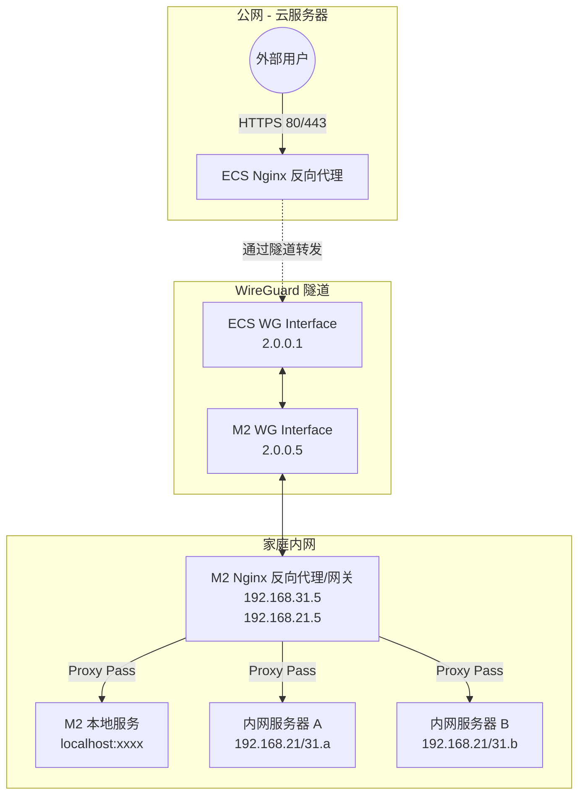
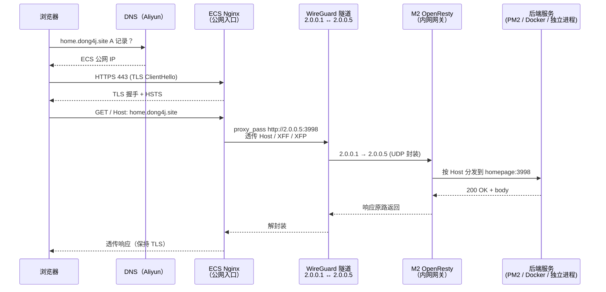

## 背景：运维账到了该清的时候

这个博客我折腾着折腾着，已经变成一个"小站点、大后台"的状态了。

主站是 Hexo 静态页面，听上去很轻，但后面挂了一堆支撑服务：评论、搜索、统计、访问计数、AI 摘要、TTS、GitHub 贡献热力图、朋友圈聚合、短链、API 聚合……一数吓一跳，加起来有三四十个大大小小的进程。

这些服务过去分散在 **好几台 PVE 节点**上跑，分工大概是这样：

- A 节点跑数据库一类的基础设施
- B 节点跑博客主系统和反向代理
- C 节点跑一些 Node.js 的小微服务
- D 节点跑监控、AI 平台之类的东西

听起来挺合理——按职责拆机器。但实际用下来，运维账越算越难看：

- 一次例行升级要 SSH 四五台机器，每台的 Docker Compose 文件风格都不一样
- 备份脚本有四五套，谁新增了服务我都得同步去改
- 服务之间的依赖关系横跨节点，数据库在 A，应用在 B，出问题排查要跨机器看日志
- 任何一台 PVE 节点挂了，我都得跑去柜子前面插显示器排障
- 功耗也不低，四台机器常年 7×24 开着，电费肉眼可见

同期我新上了一台 Mac Studio M2 Ultra 给 AI 推理用（另一篇文章里聊过），结果家里那台 Mac mini M2 反而落得很闲。我盯着它看了两天，越看越觉得："这不就是天生的博客主机吗？"

于是有了这次架构升级。目标很朴素：

> **把博客相关的所有服务收到一台 Mac mini M2 上集中管理，公网入口仍然由云上 ECS 负责，中间用 WireGuard 打通。**

这篇文章就把新架构的来龙去脉、服务清单和一些设计取舍写下来。

### 顺便聊聊"部署方式的演进"

这套架构其实是博客部署演进到第四代的产物。简单回顾一下：

- **第一代：GitHub Pages** — 最早就是 `hexo deploy` 推到 `gh-pages` 分支，免费、够用，但国内访问时好时坏，图片加载慢得像 2010 年
- **第二代：Vercel** — 用了一段时间，速度比 GP 好一些，但国内某些地区会间歇性解析异常，CI 每月免费额度也有限
- **第三代：阿里云 ECS 直部署** — 自己搭 Nginx，用 `hexo-deployer-git` 推到私仓，然后 ECS 上 `git pull`。稳定了，但后端服务还是散在各处
- **第四代（现在）：Rsync + 集中式 Homelab** — 本地 `hexo generate` 产物直接 rsync 到 ECS `/var/www/blog`，同时把后端全部收回到 M2，用 WireGuard 打通

这四代的演进其实就是在不断回答同一个问题：**这个博客的哪一部分要放在云上，哪一部分放在家里？**到第四代才算回答清楚——静态产物放 ECS 离用户最近，动态后端放 M2 离数据最近，中间用隧道串起来。

## 旧架构的痛点

先把旧架构摆出来，方便后面做对比。

旧的做法是：云上 ECS 跑 Nginx 直接暴露公网，后端通过 frp/公网端口映射回家里 PVE 节点上的具体服务。几个比较硬的问题：

- **端口映射满天飞**：每新增一个服务就要在路由器和 ECS 开洞，久了自己都记不清哪个端口通向哪里
- **公网暴露面广**：不止一台机器出现在公网上，哪怕只是 frp 客户端侧，也多了一层攻击面
- **服务位置漂移**：这台机器重启一下，那台机器升级一下，IP 或端口偶尔就变，ECS 上的反代配置要跟着改
- **缺少统一反代**：每台节点都自己跑一套 Nginx/Caddy，证书、日志、WAF 规则各搞各的

这些问题单拎出来每个都不致命，但加起来就是一个"每次动都要想半天会不会炸"的状态。

## 新架构：一张图讲清楚

先上拓扑：



几个关键点：

- **公网只有一个入口**，就是 ECS 上的 Nginx，负责 TLS 卸载和最外层的限流
- **ECS 和 M2 之间靠 WireGuard 组成虚拟内网**，双方在 `2.0.0.0/24` 里能互相 ping 通，就像一根直连网线
- **家里的 M2 是真正的"网关"**：既是 WireGuard 的对端，又是内部服务的反代入口
- **M2 可选回代到其他节点**：如果某些重服务还留在 PVE 上，M2 Nginx 走内网 IP 转发即可，公网完全不需要感知它们的存在

用一句话讲清楚数据流：

> **请求从公网打到 ECS Nginx，Nginx 要么在本地直接响应静态资源，要么通过 WireGuard 把流量 proxy 到 M2 Nginx，由 M2 Nginx 再就近分发到 localhost 或者内网的其它机器上。**

## 流量路径：一次请求到底经过了什么

上面那张图是"拓扑",下面这张是"时序"。以读者打开 `home.dong4j.site` 为例，整条链路其实比一眼看上去要长：



几个容易被忽略但很关键的点：

- **TLS 只在 ECS 侧终止一次**，隧道里走的是明文 HTTP。因为隧道本身是 WireGuard 加密的，不重复加解密能省 CPU，也省 M2 一整套证书分发的事
- **Host 头必须原样透传**，ECS 和 M2 都是按 Host 分发站点的，丢了就找不到站
- **WireGuard 是 UDP 协议**，不会因为运营商干扰 TCP 连接而中断长连接，对 LLM 流式、Socket.IO 长轮询这类场景格外友好
- **隧道里的 IP `2.0.0.5` 是虚拟 IP**，不是 M2 的任何一张物理网卡，M2 哪怕同时换了 Wi-Fi 和有线也不影响 ECS 一侧的配置

## ECS Nginx 侧：两类分流策略

真正在用之后我发现，ECS 这一侧的站点并不是清一色"转发回家"，可以明确分成两类。分清楚这两类对性能和稳定性都有好处。

### 策略 A：静态站点 ECS 本地托管

Hexo 生成出来的 `blog.dong4j.site`、一些纯落地页（如 `chl.dong4j.site`、`mik.dong4j.site`）、还有 Zeka Stack 的前端 WebUI，都属于这类。它们的特点是：

- 产物就是一堆 HTML / CSS / JS，没有后端依赖
- 对延迟敏感，希望离用户越近越好
- 变动频率低，用 rsync 推上去就行

这种站点没必要再拐一次 WireGuard 回家，**直接挂在 ECS 的 `root` 目录下**响应。一个典型的 `location` 块长这样（域名已脱敏）：

```nginx
server {
    listen 443 ssl http2;
    server_name blog.example.site;

    root  /var/www/blog;
    index index.html;

    # Hexo 路由兜底
    location / {
        try_files $uri $uri/ /index.html;
    }

    # 静态资源长缓存
    location ~* \.(?:ico|gif|jpe?g|png|svg|woff2?|ttf|eot|webp|webm|mp4)$ {
        expires 6M;
        add_header Cache-Control "public";
        access_log off;
    }

    # CSS/JS 不缓存，方便随时发版
    location ~* \.(?:css|js)$ {
        expires -1;
        add_header Cache-Control "no-cache, no-store, must-revalidate";
        access_log off;
    }

    # 基础安全头
    add_header X-Frame-Options            "DENY";
    add_header X-Content-Type-Options     "nosniff";
    add_header Strict-Transport-Security  "max-age=31536000; includeSubDomains" always;
}
```

这类站点的部署流程极其朴素：本地 `hexo generate` → rsync 到 ECS `/var/www/blog` → 结束。没有任何热数据依赖，挂了也只要一条命令就能恢复。

### 策略 B：整站通过 WireGuard 回源到 M2

另一类是需要后端的服务：博客 CMS（Halo）、评论（Twikoo / Waline）、访问统计（Umami）、服务器监控（Nezha）、AI Chat（Lobe / Chat）、短链（YOURLS）、IDE 插件后端（zeka-stack-api）等等。这些都是完整的后端应用，所有状态都在 M2 侧，ECS 没必要也不应该保有副本。

标准做法是给每个应用定义一个 upstream，然后整站 `proxy_pass` 过去。**upstream 里的 `2.0.0.5` 是 WireGuard 对端，不是公网 IP，也不是 M2 的物理网卡地址。**

```nginx
upstream umami_upstream {
    server 2.0.0.5:7774;
    keepalive         128;
    keepalive_timeout 75;
}

server {
    listen 443 ssl http2;
    server_name umami.example.site;

    location / {
        proxy_pass         http://umami_upstream;
        proxy_http_version 1.1;

        proxy_set_header Host              $http_host;
        proxy_set_header X-Real-IP         $remote_addr;
        proxy_set_header X-Forwarded-For   $proxy_add_x_forwarded_for;
        proxy_set_header X-Forwarded-Proto $scheme;
    }
}
```

两个关于 upstream 的小经验：

- **一定开 `keepalive`**：隧道里的 TCP 建连成本不低，没有长连接复用的话高并发时每次都要握手，延迟会上一个量级
- **`proxy_http_version 1.1` 必开**：keepalive 依赖 HTTP/1.1，不写默认 1.0，长连接形同虚设

### 策略 C：单域名多后端的 API 聚合

博客里有很多小 API 其实属于同一类（都是"给前端 JS 调的第三方能力"），没必要每个都给一个子域名。我把这类全部收到 `api.example.site` 一个域名下，用 `location` 按 path 分发到不同 upstream：

```nginx
upstream llm_upstream        { server 2.0.0.5:11434; keepalive 128; }
upstream audio_upstream      { server 2.0.0.5:16668; keepalive 128; }
upstream summary_upstream    { server 2.0.0.5:16667; keepalive 128; }
upstream geoip2_upstream     { server 2.0.0.5:16669; keepalive 128; }
upstream pic_upstream        { server 2.0.0.5:7772;  keepalive 128; }
upstream img2color_upstream  { server 2.0.0.5:7771;  keepalive 128; }
upstream github_calendar     { server 2.0.0.5:7779;  keepalive 128; }
upstream hitokoto_upstream   { server 2.0.0.5:7776;  keepalive 128; }
upstream busuanzi_upstream   { server 2.0.0.5:7775;  keepalive 128; }
upstream friend_upstream     { server 2.0.0.5:7773;  keepalive 128; }

server {
    listen 443 ssl http2;
    server_name api.example.site;

    # 静态资源取色
    location = /img2color { proxy_pass http://img2color_upstream/api; }
    # GitHub 贡献热力图
    location = /github    { proxy_pass http://github_calendar/cache; }
    # 一言
    location = /hitokoto  { proxy_pass http://hitokoto_upstream/; }
    # 随机封面图
    location = /cover     { proxy_pass http://pic_upstream/cover; }
    # 文章摘要
    location = /summary   { proxy_pass http://summary_upstream/; }
    # IP 地理位置
    location = /location  { proxy_pass http://geoip2_upstream; }
    # 友链朋友圈
    location /friends/    { proxy_pass http://friend_upstream/; }
    # 不蒜子计数
    location /busuanzi/   { proxy_pass http://busuanzi_upstream/; }

    # 带 WebSocket / 流式的特殊处理见下一节
    # ...
}
```

单域名多 location 的好处：

- **前端只要记一个域名**，想调哪个小 API 换 path 就行，不用到处配 CORS 白名单
- **证书、限流、WAF 规则都只写一套**
- **所有小 API 的访问日志汇总成一份**，做监控和分析更方便

### 策略 D：WebSocket / 流式传输 / Socket.IO

博客的几个 API 有"长连接 + 流式输出"的诉求：

- **Ollama LLM**（`/llm/`）：chat completion 的 SSE 流
- **Socket.IO 聊天**（`/npx/socket.io/`）：支持 WebSocket 和长轮询两种 transport

这两类对 Nginx 的默认配置很敏感，直接用标准 `proxy_pass` 会被 buffering 卡住，体验就是"等了半天才一下子蹦出一大段"。真正可用的配置大概长这样：

```nginx
location /llm/ {
    proxy_pass         http://llm_upstream/;
    proxy_http_version 1.1;

    # WebSocket / SSE 升级
    proxy_set_header Upgrade    $http_upgrade;
    proxy_set_header Connection "upgrade";

    # 基础代理头
    proxy_set_header Host              $http_host;
    proxy_set_header X-Forwarded-For   $proxy_add_x_forwarded_for;
    proxy_set_header X-Forwarded-Proto $scheme;
    proxy_set_header X-Real-IP         $remote_addr;

    # LLM 响应可能要等很久
    proxy_connect_timeout 60s;
    proxy_send_timeout    300s;
    proxy_read_timeout    300s;

    # 关键：关闭 buffering 才有"边想边吐字"的效果
    proxy_buffering off;
    proxy_cache off;
    chunked_transfer_encoding on;
    tcp_nopush on;
    tcp_nodelay on;

    client_max_body_size 50m;
}
```

- `proxy_buffering off` 是核心，不关它前端永远是"卡 → 一坨"而不是"逐 token 流出"
- `proxy_read_timeout` 要拉长，SSE 常见 2–3 分钟生成时间，默认 60s 会被中途砍断
- `Upgrade` / `Connection` 两个头给 WebSocket 握手用，不加 Socket.IO 就会退化成长轮询模式

## ECS 侧的站点与后端对照表

我把实际在用的 ECS 站点分流策略简化匿名后整理成一张表，方便一眼看全：

| 公网域名 | 分流策略 | 后端落点 |
| :----: | :----: | :----: |
| `blog.example.site` | 本地静态 | ECS `/var/www/blog` |
| `chl / mik / ...` | 本地静态 | ECS 对应子目录 |
| `zekastack.example.site` | 本地静态 + API 回源 | WebUI 静态文件 + `/api/** → 2.0.0.5:8080` |
| `home.example.site` | 整站回源 | `2.0.0.5:3998` |
| `umami.example.site` | 整站回源 | `2.0.0.5:7774` |
| `twikoo.example.site` | 整站回源 | `2.0.0.5:7777` |
| `waline.example.site` | 整站回源 | `2.0.0.5:7778` |
| `nezha.example.site` | 整站回源 | 哪吒面板 |
| `memos / chat / dify / lobe` | 整站回源 | 对应容器端口 |
| `api.example.site` | 单域多 upstream | 见策略 C 的 location 清单 |

一目了然之后才真正意识到：**这套架构只在 ECS 一侧维护一份配置，家里机器怎么搬、端口怎么挪，对公网完全透明。**

## AI 能力怎么嵌进博客

博客里关于 AI 的部分其实走了三条独立的链路，放在这里一起讲清楚，方便理解为什么 M2 上会同时有 `one-api`、`summary-server`、`next-mini-chat`、`audio-server` 这些服务。

### 链路一：文章摘要（summary）

这条链路是给每篇文章顶部的那个"一句话摘要"用的：

```text
读者浏览器 → api.dong4j.site/summary
         → ECS Nginx → WireGuard
         → M2 summary-server
             ├─ 先查 Redis 缓存（命中则直接返回）
             └─ 未命中 → one-api → 智谱 / DeepSeek 等 → 写回 Redis
```

几个点值得单独说：

- **Redis 缓存是核心**：文章内容变化频率低，缓存 key 用文章的 `abbrlink`，命中率几乎 100%
- **one-api 做协议兼容**：我用哪家模型都不会让 summary-server 知道，换供应商的成本是 0
- **原本用的是 TianliGPT**，后来迁到自建链路，既省了订阅费也避免了第三方限流

### 链路二：PostChat（评论区 AI 对话）

PostChat 是一个第三方集成，但摘要和对话都可以走自建。接入 PostChat 时主要就是在 `_config.yml` 里配置 `enableSummary` / `enableAI`，把摘要数据源指向 `api.dong4j.site/summary`。

### 链路三：llms.txt 和 AI 友好

`hexo-plugin-llmstxt` 是一个 Hexo 插件，构建时会自动生成一份 `llms.txt` 放在站点根目录。作用是告诉爬虫（特别是各种 LLM 的爬虫）哪些内容允许抓取。这个文件不走任何动态链路，就是 Hexo 构建产物的一部分，和博客静态页同步发布到 ECS 的 `/var/www/blog` 下。

### 链路四：文章朗读（audio）

```text
读者点击"朗读" → api.dong4j.site/audio
              → ECS Nginx → WireGuard
              → M2 audio-server（Kokoro-82M ONNX）
              → 流式返回 mp3 / wav
```

audio-server 是一个 Python FastAPI 服务，加载 Kokoro-82M 的 ONNX 权重后常驻内存。每次请求按段落切分，流式返回音频。响应是 chunked 的，所以 `proxy_buffering off` 必开，否则会"点了等半天一下吐一整段"。

### 为什么这些都自建

一句话说：**不想被别人掐脖子。**摘要服务第三方收过订阅费，TTS 服务用过月度 quota，都不想再被这些"每天都会调几千次"的小 API 卡住。自己搞一套之后，成本摊下来其实比第三方订阅便宜，还能根据博客的特殊需求随时调 prompt。

## 为什么把 M2 选成"博客主机"

这台 Mac mini M2 并不是顶配，但对博客这种负载来说是很合适的选择：

- **常年低功耗**：整机待机 3W 左右，全力跑也很少超过 15W，比任何一台 x86 节点省电
- **散热安静**：扔在柜子里常年不转风扇，不怕它因为散热不良挂掉
- **算力充足**：跑几十个 Node/Python/Docker 进程毫无压力
- **SSD 快**：macOS 原生的 APFS + 快速 SSD，对频繁读写的数据库和缓存友好
- **生态顺手**：Homebrew、PM2、Docker Desktop 原生支持，我写脚本的时候不用切心智

更关键的是，新买 Mac Studio 那台主力给 AI 用之后，这台 M2 处于"24 小时开机、大部分时间闲着"的状态，与其让它浪费算力，不如让它当博客的主力。

## Hexo 端：博客本体的插件矩阵

在讲后端服务之前，先把博客"前端"这一层摆出来，因为后面提到的很多 M2 服务都是为了配合这一层而存在的。

博客本身用的是 Hexo + AnZhiYu 主题，看上去就是一堆静态文件，但光 Hexo 生态这一层就塞了十几个插件：

| 插件 | 作用 |
| :----: | :----: |
| `hexo-renderer-marked` | Markdown 渲染 |
| `hexo-abbrlink` | 文章永久链接生成（CRC32 hash） |
| `hexo-generator-feed` | RSS / Atom 订阅 |
| `hexo-generator-sitemap` | 站点地图，给搜索引擎看 |
| `hexo-blog-encrypt` | 文章加密，少数隐私内容用 |
| `hexo-tag-aplayer` | 文章内嵌音乐播放器 |
| `hexo-filter-nofollow` | 外链加 `rel=nofollow` |
| `hexo-baidu-url-submit` | 百度站长链接推送 |
| `hexo-algoliasearch` | Algolia 搜索索引自动同步 |
| `hexo-safego` | 外链安全跳转（避免直接跳到第三方） |
| `hexo-plugin-llmstxt` | 自动生成 `llms.txt`，给 AI 爬虫看 |
| `hexo-circle-of-friends-front` | 友链朋友圈前端 |
| `hexo-anzhiyu-static-source` | AnZhiYu 主题静态资源管理 |
| `hexo-generator-readme-file` | 生成项目 README |

每个插件背后还会依赖一堆 npm 包，数下来 `package.json` 里的一级依赖就有小一百个。这就是 Node 生态的现实，习惯就好。

### 这些插件和后端服务是怎么串起来的

Hexo 插件处理的是"构建时"的事情，真正"运行时"的动态能力要靠后端服务来补。两边的对应关系大概是这样的：

| 前端/插件诉求 | 对应后端（M2 侧） |
| :----: | :----: |
| 文章搜索 | Algolia（第三方托管，免费额度够用） |
| 评论 | Twikoo（主）/ Waline（备用） |
| 访问统计 | Umami + 不蒜子 |
| 页面封面主色调 | img2color |
| 文章摘要 | summary-server + one-api |
| 文章朗读 | audio-server（Kokoro TTS） |
| GitHub 贡献热力图 | github-calendar-api |
| 友链朋友圈 | friend-circle |
| IP 地理位置 | geoip2-server |
| 一言 / 随机句子 | hitokoto |
| 随机封面图 | pic-server |
| AI 对话 | PostChat + next-mini-chat + one-api |
| 文章运行时长 | time-counter |

这张表也是为什么我把 M2 上那些看似零散的小服务当成一等公民来规划端口段——**它们其实是博客这个"前端"的延伸**，而不是独立的业务系统。

### 踩过一些又放弃的方案

一路上试过不少方案，最终没留下来的也有不少，简单记录几个：

- **评论系统**：Twikoo / Waline / Artalk 三家都部署过，最后主力留 Twikoo（界面最简洁、数据自带 SQLite），Waline 当备用应急
- **搜索**：试过本地 MeiliSearch、再到 Algolia，最后选 Algolia 是因为它的中文分词对免费用户够用，免维护成本最低
- **统计**：Google Analytics → Plausible → Umami，越换越"自托管 + 隐私友好"，最终停在 Umami
- **CDN**：七牛 / 又拍云 / 多吉云都试过，最后静态资源分成两路：图片走 MinIO + 自建 CDN 边缘，脚本类资源主要还是直连 ECS

选型没有银弹，这几个都不是因为"不好用"被换掉的，只是需求在演进，每次换的时候都做过权衡。

## 部署在 M2 上的服务清单

梳一下我最后落到这台 Mac mini M2 上的所有服务，按职责分层列。这不是 showoff，是为了后面讲架构细节的时候有具体上下文。

### 基础设施层

| 组件 | 作用 |
| :----: | :----: |
| OpenResty | 所有 HTTP 流量的统一入口，反代、SSL、WAF 都压在这里 |
| MySQL 8.2 | Halo、Zeka API、Umami 的主库 |
| PostgreSQL | 少数应用用作备用库 |
| MongoDB 7.0 | 文档型场景，主要是日志和一些 AI 工具 |
| Redis 7.2 | 缓存层，给 Busuanzi、summary-server、会话存储等共用 |

这一层是整个 M2 的"地基"，所有其它服务都直接或间接依赖它们。

### 博客核心

| 组件 | 作用 |
| :----: | :----: |
| Halo | 博客内容管理系统，主站点 |
| 静态站点文件 | Hexo 生成产物，挂在 OpenResty 的 www 目录里 |
| Twikoo | 主用评论系统，自带 SQLite |
| Waline | 备用评论系统 |
| Umami | 隐私友好的访问统计 |
| Busuanzi（不蒜子） | 页面访问计数，走 Redis |

博客的"脸"基本上全在这一层。

### PM2 托管的小微服务

这些都是自己写或者自己魔改的，用 PM2 起进程。很多是 Node/Python/Go 单文件级别的小服务：

- **audio-server**：基于 Kokoro-82M（ONNX）的 TTS，把文章转成语音，给博客顶部的"听文章"按钮用
- **summary-server**：调 LLM API 生成文章摘要，结果写进 Redis 缓存，替代了 TianliGPT 这类第三方接口
- **geoip2-server**：IP 地理位置查询，评论区显示城市就是它的功劳
- **github-calendar-api**：GitHub 贡献热力图的数据 API，挂在首页
- **friend-circle**：友链朋友圈聚合，每天去抓友链博客的 RSS 汇总一下
- **hitokoto**：随机一句话 / 格言 API，页脚显示的那条"今天宜摸鱼"就是它
- **img2color-go**：图片主色调提取，用 Go 写的，几十 ms 返回主题色，用来给文章卡片做自适应配色
- **pic-server**：随机封面图 / 随机头图 API，给 `api.dong4j.site/cover` 那种随机图请求兜底
- **next-mini-chat**：博客里嵌的那个小 AI 对话框，走 one-api 出去
- **npx-server / npx-card-landing**：`npx dong4j-card` 这种命令的后端接口 + Socket.IO 联机聊天
- **summary / time-counter**：time-counter 是 Go 写的，统计文章运行时长、本站运行天数
- **online-user-stats**：粗糙的在线用户数统计
- **url-switcher-tool**：把外链转成安全跳转链接的辅助服务
- **self-star-list**：自 Star 仓库列表生成器，用于个人"我的开源"页
- **overseas-ban**：针对某些海外高流量爬虫的黑名单服务
- **vs-context-runner**：VS Code 上下文快捷生成，一个给自己用的小工具

按 PM2 起进程的好处是 `pm2 list` 一把就能看到全家桶，挂了一个也是局部影响，彼此之间互不拖累。对这种十几个单文件小服务的场景，PM2 比 Docker 轻太多——省内存、日志集中、启停快、`pm2 monit` 还能看到 CPU/内存实时图。

### 独立的后端服务

有两个体量稍大的服务我没塞进 Docker，直接以独立进程跑：

- **happy-server**（Node.js）：Claude Code 客户端的 E2E 加密同步，WebSocket + 推送
- **zeka-stack-api**（Java / Spring Boot）：IntelliAI Engine 的后端，管 GitHub OAuth、节点监控、智谱 AI 代理等

这两个都有明确的生命周期要求，不想跟博客相关服务混着容器网络，独立进程反而干净。

### 外围支撑服务

这一层是那种"不是博客本身但缺了很难受"的东西：

- **Uptime Kuma**：每 30 秒扫一次所有服务端点，出问题直接飞书通知，我的第一告警源
- **哪吒探针（Nezha）**：主机级指标监控，看各台机器的 CPU / 内存 / 网络 / 磁盘
- **maintenance-pages**：维护页静态站点，紧急情况下 ECS 一条 `proxy_pass` 切过去就是全站维护通知
- **minio**：S3 兼容对象存储，图片 / 附件兜底
- **image-uploader-extension**：浏览器插件的后端，用于一键上传图片
- **github-og-image-node**：自动生成 OG 图，社交分享卡片更好看
- **one-api / new-api**：AI API 聚合层，把 OpenAI、Claude、DeepSeek、智谱等协议统一成 OpenAI 格式，summary-server / next-mini-chat / PostChat 都走它
- **yourls**：短链接服务
- **emqx**：MQTT broker，给家里一些小 IoT 设备用
- **kafka + redpanda-console**：偶尔跑一些事件流 demo
- **lobe-chat**：自用的 AI 聊天前端
- **flarum**：一个小论坛
- **waf**：挂在 OpenResty 前面的规则层

数一下 M2 上各类进程大概 30+ 个，加上 Hexo 插件生态里那堆 npm 包，对外看就是"50+ 服务支撑一个博客"的状态。

写到这里自己数了一遍，竟然真的凑满 50+，不得不说这就是程序员的天性——总想"再优化一下""再加个小功能"，不知不觉就成了这个样子。

### 服务关系一眼图

```text
用户
 └─► ECS Nginx（公网入口）
       └─(WireGuard)─► M2 OpenResty（内网网关）
                          ├─► Halo / 静态博客
                          ├─► Twikoo / Waline / Umami / Busuanzi
                          ├─► PM2 微服务矩阵
                          ├─► happy-server / zeka-stack-api
                          └─► MinIO / YOURLS / lobe-chat / ...
 数据库层（1panel-network）
   ├─► MySQL / PostgreSQL / MongoDB
   └─► Redis
```

## WireGuard 是怎么把两边串起来的

这一步是整个升级的核心。大白话讲：让 ECS 和 M2 之间像拉了一根直连网线，地址各自固定，路由稳定。

### 地址规划

- `2.0.0.1`：ECS 端的 WireGuard 接口
- `2.0.0.5`：M2 端的 WireGuard 接口
- 双方都加一条 `2.0.0.0/24 dev wg0` 的路由
- ECS 上 `AllowedIPs = 2.0.0.5/32`，严格只允许 M2 这一个对端走这条隧道

我没有把 WireGuard 当"全量 VPN"用，只当点对点通道，所以路由保持最小够用，不动内网其它流量。

### ECS 端 Nginx 的做法

ECS 上的 Nginx 是公网唯一入口，它主要做三件事：

- 证书和 TLS 卸载（Let's Encrypt 自动续签）
- 最外层限流和基础 WAF
- 把所有业务流量 `proxy_pass http://2.0.0.5:xxxx;`，转进隧道

典型的 `location` 块长这样：

```nginx
location / {
    proxy_pass         http://2.0.0.5:80;
    proxy_http_version 1.1;
    proxy_set_header   Host              $host;
    proxy_set_header   X-Real-IP         $remote_addr;
    proxy_set_header   X-Forwarded-For   $proxy_add_x_forwarded_for;
    proxy_set_header   X-Forwarded-Proto $scheme;
}
```

注意几个细节：

- **`Host` 透传很关键**：M2 上的 OpenResty 是按域名区分站点的，`Host` 不透传回家里会找不到站
- **X-Forwarded-For 要加**：否则所有访问日志的 IP 都是 ECS 自己的内网 IP，统计全废
- **不在 ECS 做业务逻辑**：ECS 只做"搬运工"，业务判断都下沉到 M2 的 OpenResty

### M2 端 OpenResty 的做法

M2 这一端要解决的是"从 WireGuard 收到的请求，到底应该打给哪个本地进程"。由于 ECS 上的 `proxy_pass` 指定的是 `2.0.0.5:<port>`，WireGuard 把流量送到 M2 之后，OpenResty 实际上承担两种角色：

1. **端口级分发**：每个后端进程绑一个固定端口，外部进来的 TCP 直接打到那个端口
2. **域名级反代**：OpenResty 再按 `Host` 把一些共享同一端口的站点分开，或者补一些 CORS / 缓存 / 重写

为了后期维护方便，我给 PM2 托管的小微服务规划了一段比较整齐的端口区间：

| 服务 | M2 端口 | 用途 |
| :----: | :----: | :----: |
| time-counter | 7770 | 文章运行时长 |
| img2color | 7771 | 图片主色调 |
| pic-server | 7772 | 随机封面 / 头图 |
| friend-circle | 7773 | 友链朋友圈 |
| umami | 7774 | 访问统计 |
| busuanzi | 7775 | 页面计数 |
| hitokoto | 7776 | 一言 |
| twikoo | 7777 | 评论（Twikoo） |
| waline | 7778 | 评论（Waline，备用） |
| github-calendar | 7779 | GitHub 贡献图 |
| npx-server | 16666 | npx 卡片 / Socket.IO |
| summary-server | 16667 | 文章摘要 |
| audio-server | 16668 | TTS（Kokoro） |
| geoip2-server | 16669 | IP 地理位置 |
| ollama | 11434 | 本地 LLM |
| zeka-stack-api | 8080 | IntelliAI Engine 后端 |
| home / homepage | 3998 | 个人首页站点 |

规划端口段的好处是：以后不管是看日志、做防火墙规则，还是写监控告警，一段段地处理起来心智负担很低。看到 `77xx` 就知道是博客域的小工具，`1666x` 是稍大的 Node / Python 服务，`11434` 就是 Ollama 的默认端口。

再举几个 M2 OpenResty 具体 server 块的典型形态：

```nginx
# 1. M2 本地静态站点（Hexo 的另一份镜像产物，用于局域网直连）
server {
    listen 3222;
    server_name blog.example.local;
    root /opt/openresty/www/sites/blog/index;
    index index.html;
    location / { try_files $uri $uri/ /index.html; }
}

# 2. M2 上按 Host 分发到容器
server {
    listen 80;
    server_name halo.example.local;
    location / {
        proxy_pass http://127.0.0.1:8090;
        proxy_set_header Host $host;
        proxy_set_header X-Real-IP $remote_addr;
        proxy_set_header X-Forwarded-For $proxy_add_x_forwarded_for;
    }
}

# 3. M2 上把没迁走的服务转到 PVE 节点
server {
    listen 80;
    server_name legacy.example.local;
    location / {
        proxy_pass http://192.168.31.20:8000;
        proxy_set_header Host $host;
        proxy_set_header X-Real-IP $remote_addr;
    }
}
```

最值得强调的一点：**即使某些服务我暂时还没完全搬离 PVE，对外依然是"网关统一、URL 不变、用户无感"的。**迁移节奏完全由我自己把控，上线当天改一条 M2 侧的 `proxy_pass` 就行，ECS 不需要动，公网用户更没感觉。

这也是我为什么这次要坚持把"公网入口"和"内网分发"分成两层 Nginx——**一层负责让公网看到的东西保持稳定，另一层负责让内部拓扑可以随时折腾。**

## 迁移过程踩到的几个坑

这里挑几个比较有代表性的坑写下来。

### 1. Docker Desktop 的网络模式坑

Mac 上的 Docker 不支持严格意义上的 `network_mode: host`，所以我原本在 Linux 上写的 OpenResty compose 文件直接拿过来跑不起来。后来的做法是：

- OpenResty 用具体 `ports` 映射
- 数据库一类需要被多个容器共享的，挂到同一个 user-defined bridge 网络里（也就是那个 `1panel-network`）

一开始想偷懒直接 host 模式，最后还是老实换成了 bridge 网络，后续迁移起来反而更干净。

### 2. PM2 开机自启

macOS 上的 PM2 开机自启有点 tricky，`pm2 startup` 默认生成的是 launchd plist，但权限和用户上下文要手动调。走了几次弯路之后的结论是：

- 用登录用户执行 `pm2 startup launchd -u <user> --hp /Users/<user>`
- `pm2 save` 把进程列表固化
- 在系统偏好里允许这个 Terminal / LaunchAgent 在后台运行

然后每次重启 M2，所有微服务都能自动回来。

### 3. WireGuard MTU

家宽链路 + ECS 链路之间最佳 MTU 不是 1500，踩了几次 TCP 偶发断连之后才把 `wg0` 的 MTU 改成了 1360。这个值没有普适答案，得按你家的线路慢慢试。

### 4. 时间同步

M2 作为全日 24 小时服务主机，时间漂移对 Umami、日志关联影响很大。我把它设成跟 ECS 走同一个 NTP 源，避免"看日志发现两台机器相差十几秒"的迷惑瞬间。

## 收益

迁移完成之后感受最明显的几个变化：

- **运维集中**：过去在四台机器之间跳，现在所有日志、容器、进程基本都在 M2 上看，排障时间骤降
- **公网更窄**：公网只露 ECS，其它机器彻底对外隐身，攻击面收敛到一个点
- **备份统一**：所有重要数据都在 M2 上，备份脚本写一套就够，rclone 每晚同步到 MinIO 和一个冷盘
- **功耗下降**：关掉两台常年开着的 PVE 节点，功耗省了一大截，电费账单实测下来每月能少两位数
- **心理负担减轻**：最大的变化其实是这个。过去每次动服务都要预演一遍"如果 X 节点不在了我要怎么办"，现在只要保证 M2 和 ECS 这两个点就够了

## 未来打算

这套架构还没到终点，后面打算继续做几件事：

- **双 M2 冷备**：手头还有另一台 M2 mini，考虑做成温备，WireGuard 双 Peer 模式，主 M2 挂掉能在几分钟内切换
- **迁移剩余 PVE 节点**：把 Docker 服务全部拉到 M2 上，PVE 节点改回单纯跑 VM
- **更细的监控面板**：现在 Uptime Kuma 只看 HTTP 存活，后续接一下 Prometheus + Grafana，看细粒度指标
- **内部 DNS**：在 M2 上跑 Pi-hole / AdGuard Home，家里设备走内部域名解析，不再记 IP
- **站点分域隔离**：把不同类的服务拆到不同子域，方便做独立限流、独立证书

## 写在最后

这次升级没有什么"高大上"的技术，全是一些老到不能再老的组件：Nginx、WireGuard、PM2、Docker。但它们拼起来解决了一个我长期被困扰的问题——**服务散落是运维成本的真正来源**。

一台 Mac mini M2 + 一条 WireGuard 隧道 + 一台 ECS 做门面，就把三四十个博客相关服务收得服服帖帖。

如果你的 Homelab 也是从"东拼西凑"的状态成长起来的，不妨试试把入口先收到一个点上，光是心理负担就能降一半。

## 附录：50+ 服务清单一览

这一堆东西加起来到底是多少，自己也好奇，干脆数一遍做个收尾：

| 类别 | 数量 | 代表项 |
| :----: | :----: | :----: |
| Hexo 核心 / 插件 | 14 | `hexo-renderer-marked` / `hexo-abbrlink` / `hexo-generator-feed` / `hexo-algoliasearch` / `hexo-plugin-llmstxt` / ... |
| 评论 / 搜索 / 统计 | 5 | Twikoo / Waline / Algolia / Umami / 不蒜子 |
| AI 相关 | 6 | one-api / new-api / summary-server / audio-server / next-mini-chat / lobe-chat |
| 图片 / 资源 | 5 | img2color / pic-server / image-uploader / github-og-image / MinIO |
| 小工具类 | 10+ | hitokoto / friend-circle / geoip2 / github-calendar / npx-server / time-counter / url-switcher / self-star-list / online-user-stats / overseas-ban |
| 基础设施 | 5 | OpenResty / MySQL / PostgreSQL / MongoDB / Redis |
| 博客与 CMS | 3 | Halo / Hexo 静态站点 / Flarum |
| 监控 / 运维 | 3 | Uptime Kuma / 哪吒探针 / maintenance-pages |
| 独立后端 | 2 | happy-server / zeka-stack-api |
| 其他支撑 | 5 | YOURLS / EMQX / Kafka / Redpanda / WAF |

合计：**58 个**。

如果你以前以为"搞个博客就是写写 Markdown 推上去"，那这篇文章大概给了你一个反面教材。但反过来想，正是因为这些零零碎碎的服务拼在一起，博客才有了搜索、评论、统计、摘要、朗读、随机图、朋友圈、AI 对话这些体验。每一个都是自己当时真的觉得"要有"才去加的，不是为了凑数量。

折腾到最后发现，**真正决定体验上限的，不是博客本身有多花哨，而是背后这堆不起眼的小服务有没有稳稳地在跑。**把它们统一收到一台 M2 上之后，第一次有种"整个博客终于不再是一个摊子，而是一个系统"的感觉。

这大概就是这次架构升级最大的收获。
