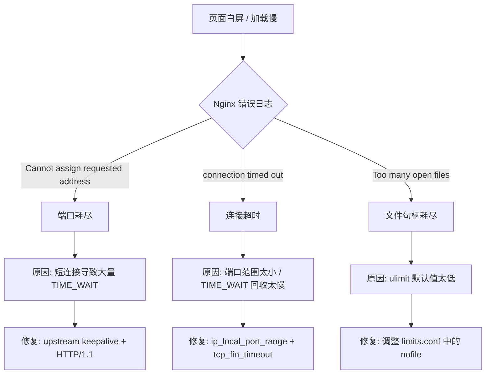

## 从一个错误日志说起

某天下午，前端同事反馈"页面加载很慢，偶尔直接白屏"。切到服务器上看 Nginx 日志，刷屏的是：

```
2025/09/15 17:57:48 [crit] 24950#24950: *4354733 connect() to 127.0.0.1:9090 failed 
(99: Cannot assign requested address) while connecting to upstream, 
client: 192.168.0.184, server: _, 
request: "GET /api/user/api/resource/list/tree HTTP/1.1", 
upstream: "http://127.0.0.1:9090/user/api/resource/list/tree", host: "192.168.0.10:3000"
```

`Cannot assign requested address`。这个错误的意思是——没有可用的本地端口了。

当时的 Nginx 配置是这样的：

```nginx
server {
    listen 3000;
    server_name _;

    location /xxx-manage-ui/ {
        root /usr/share/nginx/html;
        index index.html;
        try_files $uri $uri/ /xxx-manage-ui/index.html;
    }

    location /api/ {
        proxy_pass http://127.0.0.1:9090/;
        proxy_set_header Host $host;
        proxy_set_header X-Real-IP $remote_addr;
        proxy_set_header X-Forwarded-For $proxy_add_x_forwarded_for;
    }
}
```

看不出来问题对吧？我一开始也没看出来。这个配置按理说应该工作得好好的——前段请求 `/api/xxx`，Nginx 代理到 `127.0.0.1:9090`。简单直白。

但问题出在一个你没配置的东西上——默认的连接行为。

## 短连接的代价

Nginx 默认使用 HTTP/1.0 协议和 upstream 通信，每次请求都是一个全新的 TCP 连接。建立连接 → 发送请求 → 收到响应 → 断开连接。三次握手，四次挥手，一个都不能少。

在正常流量下这完全不是问题。但压测场景或者高峰时段，每秒几百个请求，每个请求都走一遍完整的 TCP 生命周期。一个 TCP 连接断开后，端口进入 `TIME_WAIT` 状态，默认要等 60 秒才能回收。

Linux 的本地端口范围默认是 `32768 - 60999`，大约 28000 个可用端口。如果每秒处理 500 个请求，每个连接在 TIME_WAIT 里待 60 秒，那稳态下你就会有 30000 个端口处于 TIME_WAIT。超过了可用范围——这就是 `Cannot assign requested address` 的原因。你根本没有足够的端口来创建新连接了。

修复的第一步，也是最关键的一步——**启用 Nginx 与 upstream 之间的长连接**：

```nginx
upstream backend_api {
    server 127.0.0.1:9090;
    keepalive 200;                  # 长连接池大小
}

server {
    listen 3000;
    server_name _;

    location /api/ {
        proxy_http_version 1.1;     # 关键：升级到 HTTP/1.1
        proxy_set_header Connection "";  # 关键：清除 "close" 头，启用长连接
        proxy_pass http://backend_api;

        proxy_set_header Host $host;
        proxy_set_header X-Real-IP $remote_addr;
        proxy_set_header X-Forwarded-For $proxy_add_x_forwarded_for;
    }
}
```

这三行的作用：

**`proxy_http_version 1.1`**：告诉 Nginx 对 upstream 用 HTTP/1.1 协议。HTTP/1.1 默认支持连接复用，不像 1.0 那样每次请求发一个 `Connection: close`。

**`proxy_set_header Connection ""`**：清除客户端传过来的 `Connection` 头。如果不清除，客户端的 `Connection: close` 会被透传到 upstream，每个请求又变成了短连接。这个配置经常被漏掉，但没有它，前面两行等于没配。

**`keepalive 200`**：Nginx 和后端之间最多同时保持 200 个空闲的长连接。这个数字要大于高峰期每秒的请求数除以每个请求的处理时间——说人话，就是确保有空闲连接可用，不用临时建新连接。

改完这三行，应用到 Nginx，`Cannot assign requested address` 的错误从之前的每分钟几十条直接变成了零。

## 第二步：内核参数不够用

长连接修好后，高峰期打开页面偶尔还是卡。再看日志，没有 `Cannot assign requested address` 了，但多了 `connection timed out`。查了发现问题是本地端口范围还是不够大，只是没有之前那样立刻耗尽。

调内核参数：

```bash
sysctl -w net.ipv4.ip_local_port_range="1024 65535"
sysctl -w net.ipv4.tcp_tw_reuse=1
sysctl -w net.ipv4.tcp_fin_timeout=10
```

这三行做的事情：

`ip_local_port_range = 1024 65535`：把可用端口从 28000 个扩到 64000 个。注意 1024 以下被系统保留，所以不要设成 0。

`tcp_tw_reuse = 1`：允许 TIME_WAIT 状态的端口被复用。不是删除 TIME_WAIT，而是在某些条件下（比如 SYN 包带时间戳）允许重用。这个配置对客户端模式（Nginx 相对于后端服务就是客户端）有用。

`tcp_fin_timeout = 10`：把 TIME_WAIT 的持续时间从默认的 60 秒降到 10 秒。TIME_WAIT 的存在是为了保证对端确实收到了你的 FIN 确认包（防止延迟的 FIN 重传产生混乱）。在内网环境（低延迟、低丢包），10 秒足够了。

## 第三步：文件句柄也不够

上面改了之后，高峰期还是偶尔出问题。一个新错误出现了：`Too many open files`。

Linux 默认的 `ulimit -n` 是 1024。在高并发下，Nginx 需要维护的不仅是和后端的连接，还包括客户端的连接、日志文件、配置文件。1024 很容易不够。

```bash
ulimit -n 65535
```

持久化这个修改：

```bash
# /etc/security/limits.conf
nginx soft nofile 65535
nginx hard nofile 65535
```

改完之后重启 Nginx，`Too many open files` 没了。

## 四步调优后的完整配置

最终版本：

```nginx
upstream backend_api {
    server 127.0.0.1:9090;
    keepalive 200;
}

server {
    listen 3000;
    server_name _;

    location /xxx-manage-ui/ {
        root /usr/share/nginx/html;
        index index.html;
        try_files $uri $uri/ /xxx-manage-ui/index.html;
    }

    location /api/ {
        proxy_http_version 1.1;
        proxy_set_header Connection "";
        proxy_pass http://backend_api;

        proxy_set_header Host $host;
        proxy_set_header X-Real-IP $remote_addr;
        proxy_set_header X-Forwarded-For $proxy_add_x_forwarded_for;

        # 超时配置
        proxy_connect_timeout 30s;
        proxy_send_timeout 60s;
        proxy_read_timeout 60s;

        # 缓冲配置
        proxy_buffering on;
        proxy_buffer_size 4k;
        proxy_buffers 8 4k;
    }
}
```

内核参数（持久化到 `/etc/sysctl.conf`）：

```bash
net.ipv4.ip_local_port_range = 1024 65535
net.ipv4.tcp_tw_reuse = 1
net.ipv4.tcp_fin_timeout = 10
```

文件句柄（持久化到 `/etc/security/limits.conf`）：

```bash
nginx soft nofile 65535
nginx hard nofile 65535
```

## 总结这个排查链条



其实这四步的流程让我想起一个更通用的问题。**为什么这些问题在上线之前没发现？**

答案是：我们没有做压测。或者说，做了压测但只验证了功能，没有压到真实的高并发场景。`ab -n 1000 -c 10` 这种轻量级测试根本暴露不了端口耗尽的问题。真正的压测应该模拟高峰流量，持续足够长的时间——让 TIME_WAIT 积累到稳态——才能看到这些底层资源的瓶颈。

这也是我在第一篇中就提到的"可观测性缺失"的一个侧面。如果当时有 Grafana 面板展示 TIME_WAIT 连接数、端口使用率、文件句柄使用率，这些问题在压测阶段就能被发现——甚至在正式上线前就能被预判出来。但当时我们什么都没有，全靠用户反馈。

## 系列终章：回头看

这篇文章是这个系列的最后一篇。八篇文章，从架构全景写到工程规范，从 Response 设计写到缓存重构，从配置管理写到代码质量，从 MyBatis 组件化写到网关性能调优。它们之间的关系不是线性的，而是网状交织的——配置管理的优化会影响到缓存组件的设计（ConfigurationProperties），工程规范的约束会影响到 MyBatis 组件的体验（自动配置），代码质量的推行会影响到所有模块。

但如果你只有时间读两篇，我建议读第一篇和这一篇。第一篇告诉你"为什么要想这些事"，这一篇告诉你"线上出事的时候怎么排查"。前者是方向，后者是生存。

如果这个系列对你有一点帮助，或者你有不同意见——比如你觉得某个方案不适用于你所在的项目——欢迎留言讨论。架构设计没有标准答案，只有适合和不适合。
