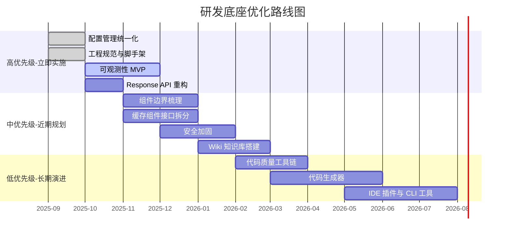

## 这个框架，到底哪里不对劲

去年下半年我开始接手一个研发底座的优化工作。什么叫研发底座？说白了就是公司内部那套脚手架和通用组件——鉴权、日志、异常处理、缓存、加解密，这些每个项目都要用的东西，抽象出来形成框架，避免每个团队重复造轮子。

这套底座已经迭代了两年多，支撑着十几个微服务的正常运行。按理说，经过这么长时间的打磨，应该比较成熟了。但当我真正开始读代码的时候，总感觉哪里不太对。不是说它不能用，能用，而且一直在用。而是说，**如果你让我从零开始设计一个同样功能的东西，我不会这样做。**

这其实是一个挺微妙的位置。作为后来者，你不能一上来就指指点点说这个不行那个要改——每个设计决策背后都有当时的上下文，也许那时候只有两个人，业务急着上线，架构师做了一个在当时最合理的取舍。但问题是，当时的上下文现在可能已经不存在了。团队从三五个人变成了几十个人，服务从两三个膨胀到了十几个，当初那个"先这么写着，后面再说"的设计选择，现在已经变成了后来者的认知负担。

打个比方。我在看网关路由配置的时候，发现一个现象：每个微服务都定义了自己的 `context-path`：

```yaml
# user-service
server:
  port: 9003
  servlet:
    contextPath: /user/api
```

网关里也做了对应的路由：

```yaml
spring:
  cloud:
    gateway:
      routes:
        - id: user-service
          uri: lb://user-service
          predicates:
            - Path=/user/api/**
```

这样设计的好处很明显：前端不管走不走网关，请求路径都是统一的。从 `/user/api/ping` 进来，网关识别前缀 `/user/api`，路由到 user-service，user-service 匹配 `/ping` 接口。如果直接访问 user-service，也是同样的路径 `/user/api/ping`，然后是同一个 `/ping` 接口。

这在当时是一个合理的、务实的决策——减少前端的适配成本。

但几个月后，当我在排查一个路径匹配不一致的 bug 时，才发现在这个看似简单的设计之下隐藏着更多问题。

问题出在白名单配置上。框架里有两个地方在做白名单校验：

网关层用 `Pattern.compile(patterItem).matcher(requestPath).matches()` 做正则匹配：

```java
// 网关过滤器中的白名单检查
for (String patterItem : whitePatternList) {
    Pattern pattern = Pattern.compile(patterItem, Pattern.CASE_INSENSITIVE);
    Matcher matcher = pattern.matcher(requestPath);
    if (matcher.matches()) {
        return true;
    }
}
```

安全组件里用 `AntPathMatcher` 做路径匹配：

```java
// BearerTokenExtractor 中的 URL 忽略检查
boolean match = this.urlProperties.getIgnoreUrls().stream()
    .anyMatch(url -> PathMatcherUtil.match(url, request.getRequestURI()));
```

它们读取的是**同一份白名单配置**：

```yaml
security:
  oauth2:
    client:
      ignoreUrls: .*(/token/logout).*,.*(/login).*,.*(/ping).*,...
```

但两者的匹配结果不一致。对于一个请求路径 `/token/logout`，正则的方式能匹配上，`AntPathMatcher` 匹配不上。这不是 bug，代码都按自己的逻辑正确执行了。但两个地方用了不同的匹配策略来解析同一份配置，这就埋下了安全隐患——你到底信哪个？

更麻烦的是，Spring Security 在启动时还会打印警告，说这些正则模式的路径缺少前导斜杠，未来版本会直接抛异常。

这只是一个缩影。类似的问题散落在整个框架的各个角落——单独看每个设计决策都有道理，但拼在一起就出现了不一致性。

## 研发底座到底要解决什么问题

在动手优化之前，我问了自己一个问题：**这个底座，到底是在解决什么问题？**

这不是一个形而上的问题。如果一个框架的定位不清晰，它就会什么功能都想往里塞，最后变成一个谁都不敢动、谁也说不清边界在哪的庞然大物。

我把它拆成四个层次来看：

```mermaid
graph LR
    subgraph 战略层["战略层"]
        S1["技术沉淀：最佳实践固化"]
        S2["人才梯队：抽象设计能力培养"]
        S3["差异化：行业场景深度适配"]
    end

    subgraph 成本层["成本层"]
        C1["人力成本：降低培训与上手门槛"]
        C2["维护成本：统一工具链与升级路径"]
        C3["运维成本：内置监控与部署规范"]
    end

    subgraph 质量层["质量层"]
        Q1["统一规范：代码、日志、接口一致性"]
        Q2["安全合规：加解密、审计、脱敏内置"]
        Q3["降低差错：通用能力已充分验证"]
    end

    subgraph 效率层["效率层"]
        E1["减少重复造轮子"]
        E2["脚手架快速搭建"]
        E3["聚焦业务而非基础设施"]
    end

    战略层 --> 成本层
    成本层 --> 质量层
    质量层 --> 效率层
```



效率层是最直观的，也是大多数框架一开始的出发点。但如果你把研发底座只当成一个"减少重复代码"的工具，那做到一定程度就会发现边际收益递减——再往后走，剩下的代码都是业务特有的，没法进一步抽象了。

往上三层才是研发底座的护城河。质量层解决一致性和安全性的问题——为什么框架要内置加解密和审计日志？因为让每个业务团队自己去搞，搞出来的方案一定不一致，而不一致就意味着安全风险。成本层解决组织的规模效应——新人来了，看了文档就知道怎么搭项目，不需要老员工口口相传。战略层则是更长远的竞争力——你沉淀下来的不是几个 jar 包，而是整个团队对技术问题的理解和应对能力。

但这四层投入的成本也是递增的。效率层最容易出成果，但价值上限也低。战略层的价值最高，但投入最大、见效最慢。很多团队做框架做到一半放弃了，原因就是**只在效率层努力，做到了瓶颈就以为框架没价值了**。

## 真正困扰我的几个问题

说回实际代码。下面这些问题，每一个单独看都不致命，但它们合在一起，就成了团队的认知负担。

### 配置管理到底应该怎么做

框架里大量使用 `@Value` 来注入配置。举个例子，缓存组件中散落着这样的代码：

```java
@Value("${spring.data.redis.enable:true}")
private boolean enable;

@Value("${spring.data.redis.impl:redisson}")
private String implementation;
```

这样写有什么问题？第一个问题是 IDE 无法自动补全——你不知道有哪些可配置项，只能翻文档，而文档又常常滞后于代码。第二个问题是配置验证缺失——如果有人把 `maxActive` 写成 `-1`，要到运行时才发现连接池创建失败。

更让我难受的是配置开关的命名不统一。一部分配置用 `enable`，另一部分用 `enabled`：

```yaml
# 这里用 enable
secret:
  mybatis:
    enable: false

# 这里用 enabled  
gateway:
  log:
    access:
      enabled: false
```

你说这是多大的事吗？一个字母之差。但当一个框架里有几十个配置项，使用者在写配置的时候需要反复确认是 `enable` 还是 `enabled`，这本身就是认知负担。而且这种事在 code review 的时候极容易被忽略——reviewer 也记不住这么多命名差异。

更合理的做法是使用 `@ConfigurationProperties` 来统一管理：

```java
@Data
@ConfigurationProperties(prefix = "framework.cache")
public class CacheProperties {
    private boolean enabled = true;
    private String implementation = "redisson";
    private String keyPrefix = "";
    private Duration defaultExpiration = Duration.ofHours(1);
    private Pool pool = new Pool();
    
    @Data
    public static class Pool {
        private int maxActive = 20;
        private int maxIdle = 10;
        private int minIdle = 5;
    }
}
```

这样做的好处是：IDE 能自动提示、类型安全、可以加 `@Validated` 做配置校验。更重要的是，**配置类本身就是文档**——使用者在 IDE 里点进 `CacheProperties`，所有可配置项一目了然。

我知道有人会说，多写一个配置类太麻烦了，不如 `@Value` 方便。这个心态我理解，但那是站在框架开发者角度的想法。站在使用者的角度，他要用你的缓存组件，但他不知道有哪些配置。你是让他翻三份文档、查看五个配置类、最后在一个注释里找到正确的 key？还是让他在 IDE 里输入一个 `.` 就能看到所有选项？研发底座是一个产品，产品就要考虑用户体验。

还有一个问题是配置的枚举化。比如短信服务商类型，框架里用字符串来配置：

```yaml
sms:
  type: ryd  # 有人写 ryd，有人写 RYD，有人写 rongyida
```

这种就应该用枚举：

```java
public enum SmsProviderType {
    RYD("ryd", "融易达"),
    TYFO("tyfo", "天虎云商");
}
```

然后在 `ConfigurationProperties` 中使用这个枚举类型。使用者输入非法值时，启动阶段就直接报错，而不是跑到发短信的时候才发现配置错了。

### 一个拦截器做了两件无关的事

框架的 core 模块里有一个 `MybatisAutoConfiguration`，它自动装配了一个 `MybatisPlusInterceptor`：

```java
@Bean
@ConditionalOnMissingBean(MybatisPlusInterceptor.class)
public MybatisPlusInterceptor paginationInterceptor(
        EncryptService encryptService, 
        MybatisPlusExpandProperties mybatisPlusExpandProperties) {
    MybatisPlusInterceptor interceptor = new MybatisPlusInterceptor();
    // 字段加密
    interceptor.addInnerInterceptor(new EncryptionInterceptor(encryptService));
    // 分页
    PaginationInnerInterceptor paginationInnerInterceptor = 
        new PaginationInnerInterceptor(mybatisPlusExpandProperties.getDbType());
    paginationInnerInterceptor.setMaxLimit(1000L);
    interceptor.addInnerInterceptor(paginationInnerInterceptor);
    return interceptor;
}
```

然后这个自动装配的条件注解是：

```java
@ConditionalOnProperty(prefix = "secret.mybatis", name = "enable", havingValue = "true")
```

看明白了吗？字段加密和分页是两个**完全正交**的功能，但被放在了同一个拦截器里，而且受同一个开关控制。如果业务方不需要字段加密（很多项目确实不需要），那分页也加载不上。

在 `xxx-manage-service` 示例项目中就遇到了这个问题。因为 `secret.mybatis.enable` 默认是 `false`，开发者引了分页插件，写好了分页查询，跑起来却发现分页不生效。排查了半天才定位到——不是因为代码写错了，而是因为分页插件根本没被加载。而分页没被加载的原因，是他没开启字段加密。

站在框架设计的角度，这是一个组件边界问题。字段加密和分页没有必然联系，它们不应该共享同一个条件开关。更合理的方式是分开装配：

```java
// 加密拦截器 - 受 secret.mybatis.enable 控制
@Bean
@ConditionalOnProperty(prefix = "secret.mybatis", name = "enable", havingValue = "true")
public EncryptionInterceptor encryptionInterceptor(EncryptService encryptService) {
    return new EncryptionInterceptor(encryptService);
}

// 分页拦截器 - 独立存在，不受加密开关影响
@Bean
public PaginationInnerInterceptor paginationInnerInterceptor(
        MybatisPlusExpandProperties properties) {
    PaginationInnerInterceptor interceptor = 
        new PaginationInnerInterceptor(properties.getDbType());
    interceptor.setMaxLimit(properties.getMaxLimit());
    return interceptor;
}
```

这个改动不大，但它反映了一个原则：**框架的每个原子功能应该是独立可开关的**。不要让使用者因为不需要 A 功能而被迫放弃 B 功能。

### 一个难以描述的 bug

接下来这个例子是我排查过最抓狂的问题之一。

`xxx-manage-service` 报了一个错：

```
org.apache.ibatis.binding.BindingException: Invalid bound statement (not found): 
com.xxx.user.api.dao.DictDao.getNormalDictMapByDictCodes
```

第一反应是 XML 没扫到。查 `mybatis-plus.mapper-locations` 配置，没问题。查 `@MapperScan`，只在扫 `com.xxx.example.dao`。但 `DictDao` 在 `com.xxx.user.api.dao` 包里，这个包是在另一个依赖 `user-api-starter` 里的。

那为什么之前扫不到？因为 Spring Boot 的默认包扫描范围只包含主应用所在包及其子包。而 `com.xxx.user.api.dao` 和主应用的 `com.xxx.example` 不在同一个包树下。

解决问题很简单，加一行扫描路径就行：

```java
@MapperScan({"com.xxx.example.dao", "com.xxx.user.api.dao"})
```

但这种解决方式让我不太舒服。为什么？因为业务方需要知道组件内部的包路径。今天是 `user-api-starter`，明天可能又引了 `log-starter`，后天再引一个，每次都要在主启动类上加包路径。这和"开箱即用"的体验差太远了。

更好的方案是组件自己提供自动配置。在组件内部写一个配置类：

```java
@Configuration
@MapperScan("com.xxx.user.api.dao")
public class UserApiAutoConfiguration {
}
```

当业务方引入这个依赖时，dao 接口自动被扫描，不需要业务方关心组件里面有哪个 dao、在哪个包里。

这背后是一个更本质的问题：**组件的封装性**。一个好的组件应该做到"引入依赖即可用"，而不是"引入依赖后还要修改主启动类、调整配置、添加注解"。每多一步，就多一个出错的可能。

当然，自动配置也有自己的坑。比如同一个 starter 里有多个自动配置类，它们之间的加载顺序怎么保证？如果业务方自己也配了 `@MapperScan`，会不会冲突？这些都是需要在设计阶段想清楚的问题。

还有一个关联问题——Mapper XML 应该放在哪。在组件里，XML 最初被放在了 `src/main/java/com/xxx/user/api/dao/xml/` 下面，也就是和 dao 接口放在一起。开发阶段没问题，但打包成 jar 给业务方使用的时候，XML 文件没有被 Maven 识别为资源，打包不进去。Maven 默认只把 `src/main/resources` 下的文件打进 jar，`src/main/java` 下的 `.xml` 被忽略了。

把这个当成一个教训：**代码和资源要分离**。把 XML 挪到 `src/main/resources/` 下对应路径就行，不需要改 pom.xml，也不需要额外的插件。

### 为什么失败了还要返回 data

最后说一个看似微小但影响面很广的问题——`Response` 统一返回体的设计。

框架里有一个 `Response` 类，提供了几个静态工厂方法：

```java
public static Response success();
public static <T> Response success(T data);
public static Response success(String message);       // 注意这个重载
public static Response success(T data, String message);
```

乍一看没问题。但看调用方代码：

```java
@GetMapping("/value")
public Response<String> getDictValue() {
    String dictValue = "1111";
    return Response.success(dictValue);
}
```

请问返回的是什么？`success("1111")` 匹配了 `success(String)`，所以 `"1111"` 被当成了 message，`data` 是 null。但调用方的意图显然是把 `"1111"` 当作业务数据返回。这就是**方法重载的二义性陷阱**——当 `T` 恰好是 `String` 的时候，调用方和编译器选择了不同的重载方法。

这个问题在实际项目中真实地出现过。前端拿到 `meta.success = true` 但 `data = null`，一脸茫然。

另一个同样让人困惑的设计是 `failure` 方法：

```java
public static Response failure(String message);
public Response failure(T data, String message);

// 实际调用
public Response getWeChatUserAccessToken(String code, String responseToken) {
    if (responseToken == null || !token.equals(responseToken)) {
        return new Response().failure("验证失败!", responseToken);
    }
}
```

这里调用方本意是想把错误信息传进去，但因为 `failure(T data, String message)` 把 data 放在了第一个参数，实际上是把 `"验证失败!"` 当成了 data，把 `responseToken` 当成了 message。又是一个参数错位。

还有一个更纠结的场景——参数校验失败时：

```java
private Response buildArgumentValidMsg(BindingResult b) {
    List<Map<String, Object>> invalidArguments = new ArrayList<>();
    StringBuilder sb = new StringBuilder("【");
    for (FieldError error : b.getFieldErrors()) {
        Map<String, Object> errorMap = new HashMap<>(3);
        errorMap.put("field", error.getField());
        errorMap.put("defaultMessage", error.getDefaultMessage());
        errorMap.put("rejectedValue", error.getRejectedValue());
        invalidArguments.add(errorMap);
        sb.append(error.getDefaultMessage()).append(";");
    }
    sb.append("】");
    return new Response().failure(invalidArguments, "参数校验未通过！" + sb.toString());
}
```

错误信息同时放在了 `data` 和 `message` 两处。前端要展示错误详情，应该取 `data` 里的结构化数据，还是取 `message` 里的人读字符串？如果不同的开发者有不同的理解，那同一个错误场景在前端会呈现出不同的处理方式——有的取 data，有的拼 message，然后两端互相不理解为什么对方那样做。

这些问题的根源在于 **Response 类的 API 设计不够精确**。一个好的返回体应该满足：调用方怎么理解，结果就是什么。不存在"你以为是这样，但实际是那样"的模糊地带。

修复的方向其实很清晰：

1. 去掉容易产生歧义的重载方法，让每个方法的语义明确；
2. 失败的 data 要么去掉，要么明确定义它的用途（比如用于存放结构化的校验错误详情）；
3. 异常信息独立出来，不要混在 data 里。

具体的重构方案在后续文章里详细展开。

## 优化路线：从哪下手

面对这些问题，最容易犯的错误是"全部重构一遍"。但现实是业务团队在等需求交付，没人会有耐心等你花三个月把框架打磨到完美。

我的策略是分层推进：



高优先级的原则是**投入小、影响大、风险低**。配置管理用 `@ConfigurationProperties` 替代 `@Value`，对运行时行为几乎零影响，但立竿见影地提升了开发体验。可观测性用 Prometheus + SkyWalking 先搭起来，解决"服务挂了不知道"的问题——这不要求完美，先有就行。

中优先级涉及组件边界的调整和接口的重构，需要更多时间设计兼容方案，但基本上是在框架内部做手术，对业务方影响可控。

低优先级是工具链层面的长期建设，它们的前提是框架本身已经足够稳定。框架还在变的时候去做代码生成器，生成出来的代码马上又要跟着改，纯粹浪费。

还有一件事我在推进的过程中心里一直有数：**在一个项目型组织中，推动技术改进最重要的是让别人看到价值**。你把配置统一管理好了，新同事从原来两天上手变成两个小时上手——这就是讲得清楚的价值。你把 Prometheus 加上去了，服务挂了五分钟就收到告警而不是等客户来投诉——这比你写十篇架构文档更能建立信任。小的胜利积累够了，才能为更大的改变争取到空间。

## 下一篇写什么

这篇文章里压了很多东西没展开。配置管理具体怎么重构？`@ConfigurationProperties` 如何做嵌套验证？共享配置怎么分层？`Response` 类重构成什么样才是好设计？缓存组件接口拆分后的代码是什么样的？

这些都会在后续文章里一一展开。下一篇从工程规范与项目脚手架开始——Maven 的 `scope` 和 `optional` 到底怎么选？为什么更推荐 `spring-boot-dependencies` 而不是 `spring-boot-starter-parent`？项目骨架如何用 Maven Archetype 一键生成？回头见。
