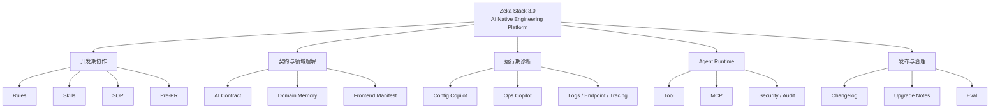
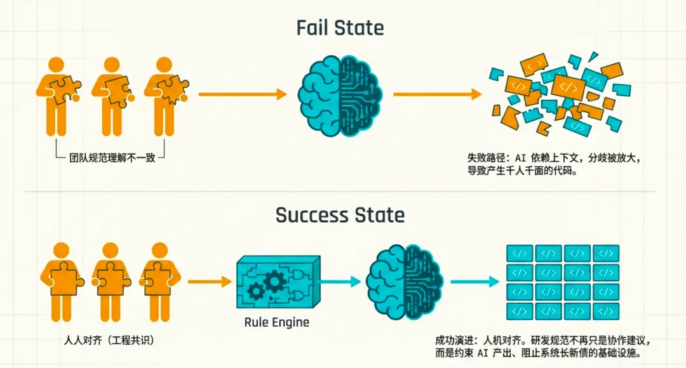
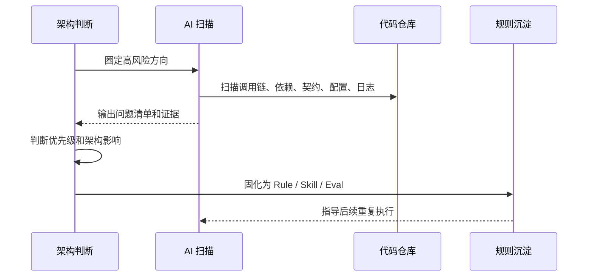
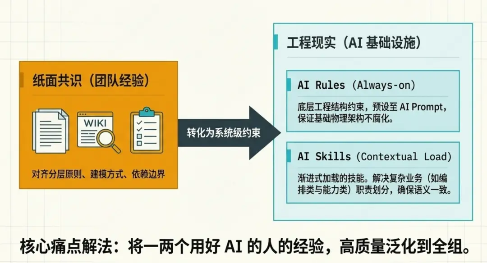
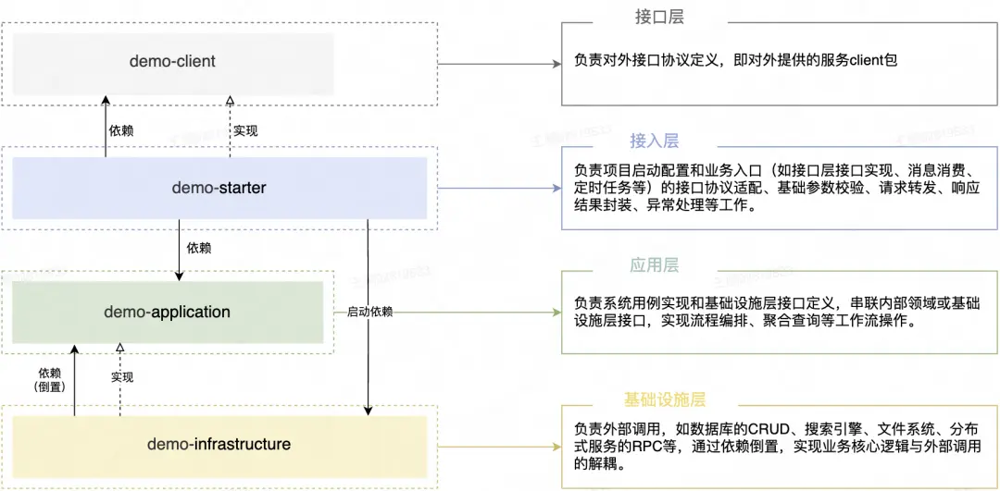
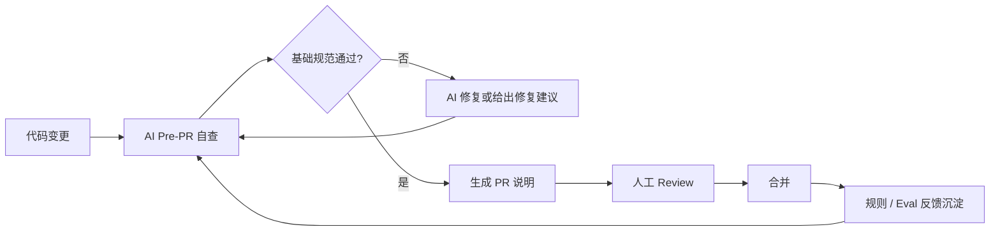
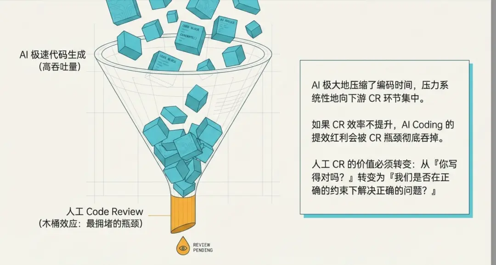
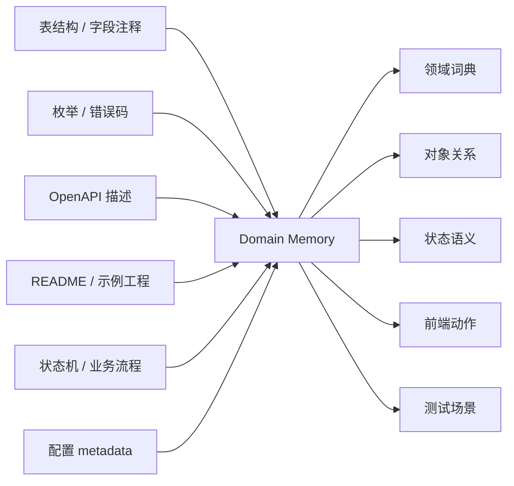
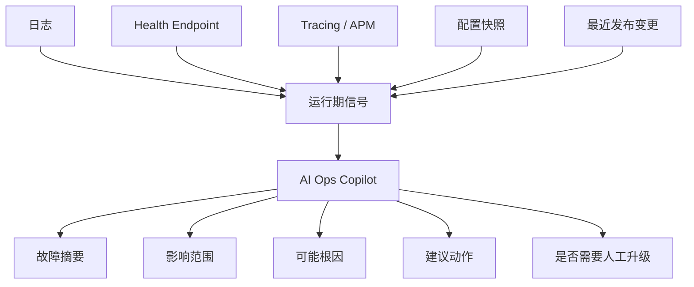

## 背景：脚手架的价值边界变了

<!-- https://mp.weixin.qq.com/s/CTY5mdgKh6TmPrO6xsKhWQ -->

最近我一直在想一个问题：当 AI 已经可以稳定生成 Controller、Service、DTO、Mapper、测试、文档和脚本时，一套 Spring Boot 脚手架还剩下什么价值？

如果脚手架的价值只剩“少写几行样板代码”，那它确实会越来越弱。过去开发者需要模板、生成器和 Starter 来节省重复劳动，现在这些工作大模型几分钟就能完成，而且还能顺手补一份 README 和测试样例。

但这个判断只说对了一半。

AI 让“写代码”变便宜了，却让“约束代码”变重要了。代码生成速度越快，架构边界、模块职责、异常语义、接口契约、配置规范、日志标准、测试策略、发布纪律这些东西就越关键。没有这些约束，AI 不是提高工程质量，而是更快地放大混乱。

这也是我现在重新看 Zeka Stack 3.0 的核心出发点：它不应该是一次普通升级，也不应该只是给框架加几个 AI 功能，而应该是一次定位变化。

Zeka Stack 过去主要是一套面向开发者的底层框架。3.0 之后，它应该成为一套面向开发者和 AI 的工程底座。

## 当前状态：不是从零开始接 AI

Zeka Stack 现在并不是一个空白项目。它已经有很多工程资产，只是这些资产过去主要服务“人类开发者”，还没有被统一整理成“AI 也能理解和执行”的形态。

如果把现有模块摊开看，会发现它已经具备向 AI Native 演进的基础。

| 现有能力 | 当前价值 | 3.0 可以放大的方向 |
| --- | --- | --- |
| `cubo-rest-spring-boot` | 统一响应、异常、校验、REST 基础约束 | 统一错误语义、分页语义、幂等语义、状态语义 |
| `cubo-openapi-spring-boot` | 面向开发者的接口文档 | 面向 AI 的业务契约和前端 Manifest |
| `cubo-launcher-spring-boot` | 启动、配置、扩展点 | 配置解释、环境差异分析、启动诊断 |
| `cubo-logsystem-spring-boot` | 日志记录、日志治理 | 日志摘要、故障归因、运行期诊断上下文 |
| `cubo-endpoint-spring-boot` | 健康、监控、管理端点 | AI Ops 的状态入口和诊断入口 |
| `cubo-spring-boot-templates` | 模块模板和代码生成 | AI First Scaffold |
| `blen-kernel-generator` | 模板变量、元数据注入、生成器基础 | 生成规则、契约、测试、文档和 AI 元数据 |
| `zeka-idea-plugin` | IDE 侧 AI、终端、Swagger、Tracer、Changelog 探索 | 本地研发入口、Pre-PR、AI Review、发布协作 |

所以问题不是“Zeka Stack 要不要接 AI”，而是“这些分散能力如何被重新组织”。

如果继续零散推进，最后很容易变成很多看起来很酷但彼此不连贯的 Demo。真正应该做的是把规则、契约、工作流、运行期上下文和评测体系串起来，让 AI 进入项目以后不是自由发挥，而是沿着 Zeka Stack 的工程轨道工作。

我倾向于把 Zeka Stack 3.0 的整体结构理解成下面这张图。



这张图里最重要的不是某个模块，而是闭环。

AI 可以参与开发，但必须有 Rule；AI 可以执行重复流程，但最好沉淀成 Skill；AI 可以生成代码，但提交前要经过 Pre-PR；AI 可以生成契约、文档和测试，但最终要被 Eval 校验；AI 可以进入运行期，但必须有权限、审计和危险操作边界。

## 核心判断：AI 会放大工程体系的好坏

传统工程里的技术债，很多时候是慢慢积累的。目录乱一点、异常不统一一点、接口描述少一点、日志格式随意一点，短期还能靠人兜住。

AI Coding 让这个节奏变了。

大模型会强依赖上下文和已有模式。如果仓库里有三种异常处理方式、两套分页结构、五种日志写法，它不会天然知道哪一种是 Zeka Stack 想要的标准，反而可能把这些差异混在一起继续生成。一个人这么做还可控，多个人长期这么做，系统会很快长出新债。

所以 Zeka Stack 3.0 的第一性问题不是“怎么让 AI 写得更多”，而是“怎么让 AI 写出来的东西更像 Zeka Stack”。

这里需要一次角色转变。

| 角色 | 过去更关注 | AI 时代更应该关注 |
| --- | --- | --- |
| 开发者 | 写代码、调接口、补文档 | 判断边界、定义规则、验收语义 |
| 框架 | 封装最佳实践、减少样板代码 | 把最佳实践变成 AI 可执行资产 |
| AI | 辅助生成局部代码 | 在规则、Skill、SOP 下执行工程任务 |
| Review | 看实现是否正确 | 看方案、边界、风险和长期一致性 |
| 测试 | 验证功能是否可用 | 验证 AI 产出是否稳定符合规范 |

这也是为什么 Zeka Stack 3.0 必须同时建设规则、流程和评测。只接模型没有意义，只写文档也不够。真正有价值的是把“人已经认可的工程判断”固化成 AI 能反复执行的机制。

## 方法论

### 先统一人的判断，再约束 AI 的执行

AI Rule 不是起点，人的工程共识才是起点。

如果团队内部对分层原则、模块职责、领域建模、依赖边界、异常语义、接口风格都没有统一判断，那么写再多 Rule 也会失效。因为不同人会用不同方式解释同一条规则，AI 也会在不同上下文里生成不同结果。

Zeka Stack 3.0 要先把过去隐含在经验里的判断显性化。比如什么能力应该沉到 `blen-kernel`，什么能力应该放在 `cubo-starter`；一个 Starter 的 `core`、`autoconfigure`、`starter` 各自承担什么职责；REST 层哪些语义必须统一，哪些可以交给业务扩展；Agent 能做什么，哪些操作必须被权限和审计拦住。

这些判断被写清楚以后，才有资格进入 Rule、Skill 和 Eval。



### 让 AI 负责看全，让人负责判断重要性

复杂工程里，人最稀缺的能力不是逐行看代码，而是判断什么问题值得优先解决。

AI 很适合做大范围扫描：查重复模式、找依赖违规、分析调用链、汇总异常处理差异、检查 OpenAPI 注释缺失、定位配置项使用位置、比对日志字段、扫描潜在性能问题。它可以把过去需要大量人工时间才能看全的问题先摊开。

但 AI 不应该替代架构判断。它能指出很多问题，却未必知道哪些问题最值得先处理，哪些只是局部代码味道，哪些会影响 Zeka Stack 的长期结构。

更合理的模式是人先圈定方向，AI 在方向内做穷举扫描，人再判断优先级，最后让 AI 按确认后的规则辅助修复。



### 把重复流程固化成 Skill 和 SOP

AI 自由发挥的空间越大，产出越不稳定。

Zeka Stack 3.0 不应该依赖“每次写一段很长的 Prompt 让 AI 临场理解”。更可靠的方式是把高频、重复、容易出错的流程固化成 Skill 和 SOP。

比如新增 Starter、补齐示例工程、增强 OpenAPI 契约、生成 Pre-PR 自查报告、检查依赖边界、根据日志生成诊断摘要、根据 diff 生成发布说明，这些都不应该每次从零解释。它们应该有固定输入、固定步骤、固定检查项和固定产物。

| 流程 | 不固化时的问题 | 固化后的价值 |
| --- | --- | --- |
| 新增 Starter | AI 临场猜目录和职责边界 | 按 Zeka 标准生成模块骨架、文档、测试、契约 |
| 补 OpenAPI 契约 | 字段描述随意，示例缺失 | 输出字段语义、错误模型、状态流转、接口组合 |
| Pre-PR 自查 | 基础问题进入人工 Review | 提交前先过滤规范、依赖、测试和文档问题 |
| 日志诊断 | 排障上下文散落 | 统一汇总日志、配置、端点和最近变更 |
| 发布说明 | 只写 changelog，缺影响分析 | 同步生成升级风险、迁移说明、AI 变更摘要 |

Skill 的价值不是让 AI 看起来更智能，而是让 AI 少猜。



### 让技术债随日常开发被消化

Zeka Stack 3.0 的改造不适合幻想一次性推倒重来。

这是一个多模块、长期演进、带子模块和插件生态的仓库。如果把 AI Native 理解成一次大规模重构，很容易陷入两个问题：目标太大，迟迟无法落地；改动太散，无法验证真实价值。

更实际的方式是把技术债拆成可以随日常开发消化的动作。

比如后续新增或调整某个 Starter 时，不只是完成当前功能，还顺手补齐模块级 Rule、README 的 AI 协作说明、配置 metadata、最小测试、OpenAPI 契约增强、示例工程和 Pre-PR 检查项。

再比如修改 REST 能力时，不只是修一个接口行为，还顺手沉淀错误码语义、分页和排序契约、批量操作模型、幂等语义、长任务响应模型和 AI 契约字段说明。

这样 Zeka Stack 3.0 的建设不会变成脱离日常维护的专项，而是逐步把已有工程经验转成 AI 可执行资产。



### Pre-PR 会成为 AI Coding 的必要环节

AI 提升编码速度以后，Review 会变成新的瓶颈。

如果 AI 生成代码很快，但每次都把大量基础问题丢给人工 Review，那么整体效率不会真正提升，只是把压力从编码阶段转移到 Review 阶段。

Zeka Stack 3.0 应该把 Pre-PR 作为标准工作流的一部分。提交前，AI 先按项目规则进行自查：模块分层有没有破坏、依赖方向有没有错误、统一异常和响应模型有没有绕过、日志上下文是否完整、配置 metadata 是否缺失、测试和示例是否同步、OpenAPI / AI Contract 是否受影响。

人工 Review 的重点不应该继续消耗在格式、命名、低级一致性这些基础问题上，而应该转向技术方案是否正确、抽象边界是否合理、业务语义是否准确、风险是否被充分识别。





### 测试和评测必须人机协同

AI 可以生成大量测试，但大量不等于有效。

如果完全让 AI 自由生成测试，它很容易漏掉真正高风险的业务链路，同时生成大量低价值边缘用例，增加维护成本。更适合 Zeka Stack 的方式，是人先定义测试边界和风险等级，AI 再负责扫描、组合和生成结构化用例。

| 步骤 | 人负责 | AI 负责 | 产物 |
| --- | --- | --- | --- |
| 范围确认 | 判断变更边界和核心风险 | 根据 diff、接口、配置扫描影响对象 | 影响清单 |
| 风险分级 | 判断哪些路径必须重点测 | 汇总分支、兼容性、依赖变化 | 风险等级 |
| 用例设计 | 审核关键业务语义 | 生成最小组合和覆盖矩阵 | 用例矩阵 |
| 步骤生成 | 校验可执行性和边界条件 | 补齐操作步骤和断言 | 测试步骤 |
| 结果评估 | 判断是否满足发布要求 | 生成缺口报告和建议 | 评测报告 |

这套思路不只适用于业务测试，也适用于 AI 产出评测。

Zeka Stack 3.0 应该逐步建立一批 Eval，用来验证 AI 生成的 Starter 是否符合目录和依赖规范，REST 接口是否符合响应、异常、分页、错误码约定，OpenAPI 契约是否包含字段语义、示例、错误模型和状态流转，Agent 调用是否遵守权限、审计和危险操作确认。

没有 Eval，AI Native 最终会变成演示能力。有了 Eval，它才可能成为稳定工程能力。

## 方向

如果说前面的内容是在回答“为什么 Zeka Stack 要面向 AI 重新定位”，那么这一章要回答的是“这种重新定位应该落到哪些能力上”。

这里讨论的不是功能清单，也不是版本排期。真正重要的是能力重心的变化：Zeka Stack 不能只继续补 Starter、补工具、补插件，而是要把已有工程资产重新组织成 AI 可以理解、可以执行、可以验证的体系。

### AI First Scaffold

Zeka Stack 过去的脚手架更多是在生成代码骨架。这个阶段的价值很清楚：帮开发者把目录、POM、基础类、示例代码准备好，让项目能更快启动。

但 AI 参与开发以后，只生成代码骨架是不够的。因为 AI 接手一个新模块时，它不只需要知道有哪些文件，还需要知道这些文件为什么存在、职责边界在哪里、后续扩展应该遵守什么约束。如果脚手架只生成代码，不生成规则和上下文，AI 很快又会回到临场猜测的状态。

所以 3.0 里的脚手架应该生成“适合 AI 继续协作的工程骨架”。它生成的不只是第一版代码，而是一个后续可以被 AI 持续理解、扩展、校验的工程起点。

| 脚手架产物 | 2.x 更关注 | 3.0 更应该关注 |
| --- | --- | --- |
| 目录结构 | 能编译、能启动 | 职责边界清楚，AI 能判断该改哪里 |
| POM 依赖 | 依赖可用 | 依赖方向可校验，违规可拦截 |
| 示例代码 | 展示基本用法 | 展示标准扩展方式和 AI 可复用模式 |
| README | 人能看懂 | 人和 AI 都能按步骤执行 |
| 测试 | 覆盖基本路径 | 作为 Eval 样例沉淀 |
| 元数据 | 配置提示 | 契约、配置、领域语义一起输出 |

这会改变 `cubo-spring-boot-templates` 和 `blen-kernel-generator` 的定位。它们不再只是代码生成工具，而是 AI First Scaffold 的入口。

### AI Consumable Backend Contract

传统 Swagger / Knife4j 更适合人看。它能帮助开发者浏览接口、调试参数、查看返回结构，也能作为前后端沟通的基础材料。

但这类文档的默认假设仍然是读者具备业务背景。人看到接口路径、字段类型、简单描述，通常可以结合产品上下文和历史经验继续理解。AI 不一样，它更依赖输入材料本身的完整性和结构化程度。

如果 AI 只拿到传统 OpenAPI，它往往只能知道“这个接口有什么字段”，却很难稳定判断字段的业务含义、错误如何恢复、状态如何流转、哪些接口应该组合使用、前端页面应该如何渲染这些更深层的问题。

所以 `cubo-openapi-spring-boot` 后续不应该只做文档增强，而应该升级为双轨契约系统。

| 契约轨道 | 面向对象 | 核心内容 |
| --- | --- | --- |
| Human OpenAPI | 开发者、前端、测试 | 接口路径、字段类型、调试入口、基础说明 |
| AI Contract | AI、生成器、Agent、测试工具 | 字段语义、错误模型、状态流转、任务链路、前端 Manifest |

AI 契约至少应该包含字段级业务语义、参数约束、输入输出示例、统一错误模型、状态流转、枚举渲染语义、接口组合关系和任务链路示例。

这件事如果做成，Zeka Stack 的 OpenAPI 能力就不只是接口文档，而是 AI 理解后端业务的标准契约层。它会直接影响 AI 生成前端页面、生成 API 调用代码、生成测试用例和接口覆盖矩阵的稳定性。

### AI Domain Memory

AI 只看 Controller 和 DTO，只能理解表层结构。它可以推断字段类型，可以猜测接口用途，也可以根据命名生成一些看似合理的代码，但这种理解很浅。

真实业务系统的关键知识往往不在 Controller 里，而是散落在表结构、枚举、错误码、状态机、配置项、文档、示例工程和历史约定中。开发者长期维护一个系统，会自然形成这种领域记忆；AI 如果每次都从零读取局部代码，就很难形成稳定判断。

所以如果想让 AI 真正理解业务，需要把业务语言沉淀为领域记忆。这层能力不是替代接口契约，而是补足接口契约背后的语义上下文。



这层能力对业务系统尤其重要。AI 不应该只知道字段叫 `status`，还应该知道这个状态有哪些取值、分别对应什么业务阶段、影响哪些接口、前端应该展示哪些动作、哪些状态迁移是非法的。

### AI Config Copilot

配置是工程里非常高频也非常高风险的区域。很多线上问题并不是代码逻辑错，而是配置项含义没理解清楚、环境差异没识别出来、默认值被误改、多个配置源优先级冲突。

AI 很适合参与配置解释，但前提是框架能提供足够结构化的配置上下文。配置项不能只是一个 key 和 value，它还应该有来源、默认值、作用范围、影响模块、风险说明和变更建议。

Zeka Stack 已经有配置热更新、启动上下文、环境感知和扩展点能力，这些能力非常适合演进成 AI Config Copilot。它可以把配置从运行参数提升为可解释、可分析、可审计的工程资产。

| AI 需要回答的问题 | 框架需要提供的上下文 |
| --- | --- |
| 这个配置项控制什么能力？ | 配置 metadata、默认值、绑定类 |
| 改动它会影响哪些行为？ | Bean 条件、自动配置、Starter 依赖 |
| 为什么本地和线上表现不同？ | 环境差异、配置源优先级、激活 profile |
| 启动失败是否和配置有关？ | 启动日志、条件装配报告、缺失配置 |
| 这个改动风险高不高？ | 影响模块、历史默认值、兼容性说明 |

这类能力不会像代码生成那么显眼，但对真实团队非常有价值。`cubo-launcher-spring-boot` 可以成为这一层的核心入口。

### AI Ops Copilot

Zeka Stack 不应该只做开发期 AI，也应该覆盖运行期 AI。

系统上线以后，真正消耗团队时间的往往是排障：为什么启动失败、为什么接口变慢、为什么健康检查异常、为什么日志里反复出现某个错误、为什么配置在不同环境表现不一致。

这些问题很适合 AI 参与初步分析。AI 不一定直接给出最终答案，但它可以先把日志、端点、配置、链路和最近变更组织起来，形成一个有结构的诊断摘要，让人更快进入关键问题。



这里要注意边界：AI Ops 不是让 AI 直接替人操作生产环境，而是先做诊断、解释、摘要和建议。涉及危险操作时，必须有权限、审计和人工确认。

如果这一层落地，Zeka Stack 的价值就不只在写代码更快，而是覆盖开发、测试、发布、运行、排障的完整生命周期。

### Agent Ready Runtime

Agent Runtime 不应该直接侵入业务模块。这一点非常重要。

现在各种 Agent Runtime、MCP、Tool、OpenAI Compatible Adapter 都在快速变化，如果 Zeka Stack 把业务模块和某一个 Runtime 强绑定，短期看可能能快速出 Demo，长期看会让框架失去弹性。

更稳的方式是先定义自己的中立抽象：业务系统暴露什么 Tool，Tool 如何鉴权，Session 和 Memory 的边界在哪里，危险操作如何确认，调用过程如何审计，失败如何回滚或降级。只要这些边界清楚，底层接哪一种 Runtime 都只是适配问题。

| 抽象层 | 职责 |
| --- | --- |
| `agent-core` | Tool、Agent、Session、Memory 的核心模型 |
| `agent-mcp` | MCP Server 和 MCP Tool 的发布与接入 |
| `agent-runtime-adapter` | 适配不同 Agent Runtime |
| `agent-security` | 权限、审计、脱敏、危险操作确认 |
| `agent-observability` | Agent 调用链路、成本、日志和效果记录 |

Agent Ready 的真正价值不是能调模型，而是业务系统天然具备被 Agent 安全调用、可观测调用、可审计调用的能力。

### AI Release Copilot

发布协作也是 AI 很适合切入的方向。

Zeka Stack 的多模块结构决定了版本发布不是简单改一个版本号。一次改动可能影响 Starter、示例工程、文档站、IDE 插件、生成器和下游使用方式。

发布阶段最容易出现的问题，是代码已经改了，但文档、示例、契约、迁移说明、版本摘要没有同步。对开源框架来说，这会直接影响使用者的升级体验；对 AI 协作来说，这也会让后续模型读到过时上下文。

所以发布协作不应该只是最后生成一份 changelog，而应该成为变更治理的一部分。AI 可以在版本发布前帮助梳理影响范围、同步检查文档与示例、生成升级风险，并把人类读的发布说明和 AI 读的变更摘要同时产出。

| 发布协作事项 | AI 可以做什么 | 人需要判断什么 |
| --- | --- | --- |
| 变更摘要 | 根据 diff 生成 changelog 草稿 | 哪些变化值得对外说明 |
| 影响范围 | 扫描模块、示例、文档、插件联动 | 是否需要扩大验证范围 |
| 升级风险 | 汇总破坏性变化和迁移点 | 风险级别和发布节奏 |
| 文档同步 | 检查 README、站点、示例是否过期 | 文档表达是否准确 |
| AI 摘要 | 生成给后续 AI 读取的结构化变更 | 是否符合真实语义 |

`zeka-idea-plugin` 里已有 changelog、diff、prompt、版本解析等探索，后续可以继续作为发布协作的前端入口。

## 能力入口建议

到这里，方向已经比较清楚，但还需要一个承载方式。否则这些能力会继续散在脚本、插件、文档和模块里，下一次再接着做时又要重新理解。

我倾向于把入口分成两类：一类是仓库内的长期资产入口，另一类是开发者日常使用的交互入口。

### `supports/ai` 应该成为总入口

`supports/` 不应该只继续承担脚本和资源目录角色。它可以升级成 Zeka Stack AI 工程能力的总入口。

```text
supports/ai/
  rules/
  skills/
  playbooks/
  prompts/
  evals/
  domain-memory/
  contracts/
  release/
```

这个目录的意义不是“放一些提示词”，而是让别人看到一个 Java 开源项目如何系统化使用 AI：规则放在哪里，Skill 怎么组织，Eval 怎么写，契约怎么沉淀，发布协作怎么闭环。

### 核心模块承接稳定能力

| 模块 | 建议承接能力 |
| --- | --- |
| `cubo-openapi-spring-boot` | AI Contract、Frontend Manifest、字段语义、任务链路 |
| `cubo-rest-spring-boot` | 响应、异常、分页、排序、幂等、状态语义 |
| `blen-kernel` | 错误模型、契约元数据、领域词汇、Agent 基础接口 |
| `cubo-launcher-spring-boot` | 配置解释、启动上下文、环境差异 |
| `cubo-logsystem-spring-boot` | 日志摘要、故障上下文、运行期诊断 |
| `cubo-endpoint-spring-boot` | 健康状态、项目状态、诊断入口、安全管理 |
| `cubo-spring-boot-templates` | AI First Scaffold |
| `blen-kernel-generator` | 模板、元数据、契约、测试和文档生成 |
| `zeka-idea-plugin` | 本地研发入口、Pre-PR、AI Review、发布协作 |

IDEA 插件不应该抢框架主线，但它是非常重要的实验场和本地入口。稳定能力先沉淀到仓库规则、Skill、契约和 Eval，再通过插件提供更顺手的开发体验。

## 最终目标

Zeka Stack 3.0 最终应该达到的状态，不是“接入了某个模型”，也不是“能生成一段代码”。这些都太表层。

真正有价值的状态应该是：

| 目标 | 判断标准 |
| --- | --- |
| AI 能参与真实模块开发 | 它知道规则、目录、依赖边界、产物要求 |
| AI 生成代码能被约束 | Pre-PR 和 Eval 能发现基础问题 |
| 后端契约能被 AI 消费 | 不只输出 OpenAPI，还输出业务语义 |
| 项目能沉淀领域记忆 | 错误码、状态、枚举、对象关系可复用 |
| AI 能辅助前端和测试 | 契约能驱动页面、调用代码和覆盖矩阵 |
| AI 能参与运行期诊断 | 日志、配置、端点和链路能形成摘要 |
| Agent 能安全接入系统 | Tool、权限、审计、危险操作边界清楚 |
| 发布协作能闭环 | 文档、示例、契约、升级说明同步治理 |

过去 Zeka Stack 帮助开发者少写重复代码。

未来 Zeka Stack 要帮助开发者和 AI 一起写出长期可维护的系统。

## 结语

AI 没有让脚手架失去意义，而是逼着脚手架升级。

过去脚手架解决的是模板、封装和最佳实践复用问题。未来脚手架要解决的是工程规则沉淀、AI 协作边界、业务契约表达、运行期诊断、Agent 安全接入和质量评测问题。

Zeka Stack 3.0 如果能把这些能力收敛起来，它的定位就会从 Spring Boot Starter 体系，升级为：

- AI 可执行的工程规范平台。
- AI 可消费的业务契约平台。
- AI 可协作的开发工作流平台。
- AI 可参与的运维诊断平台。
- Agent Ready 的 Java 工程底座。

这才是 Zeka Stack 在 AI 时代继续存在并继续演进的核心价值。
