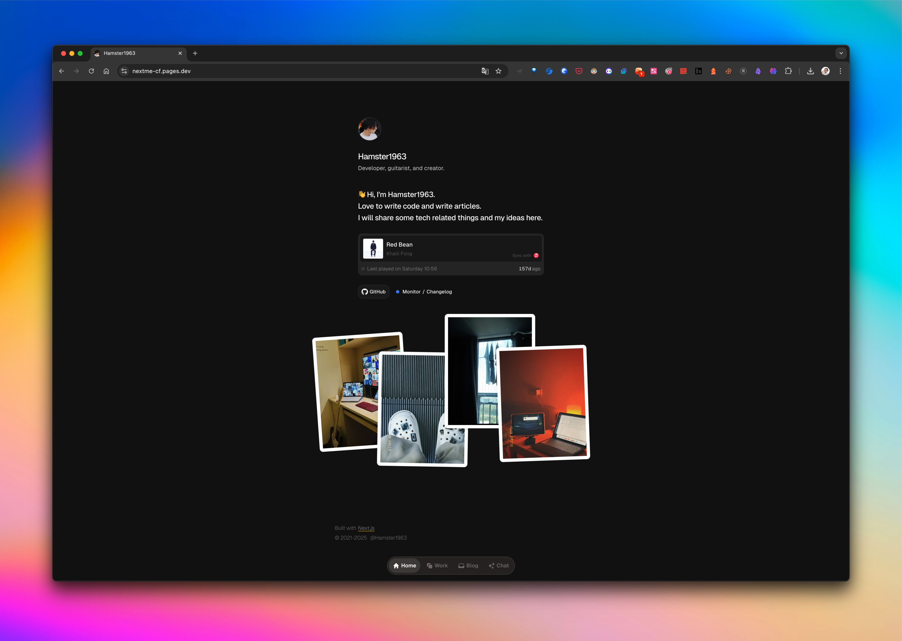
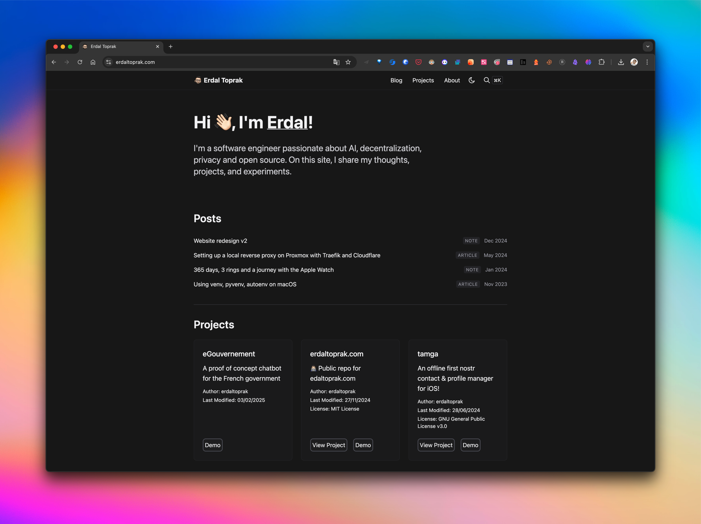
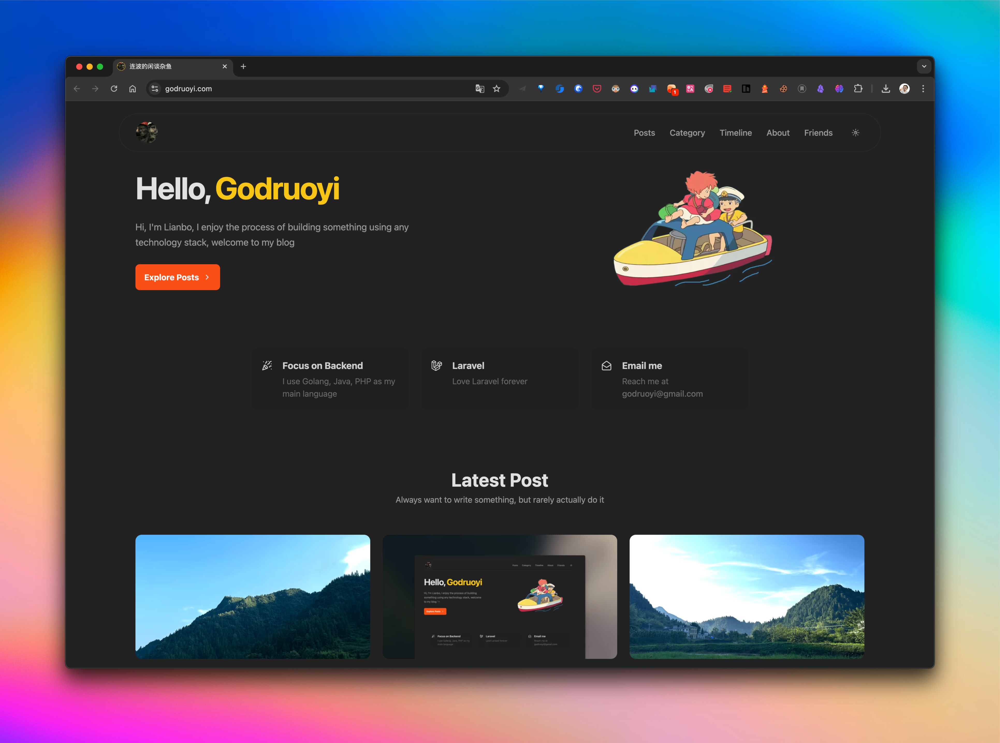
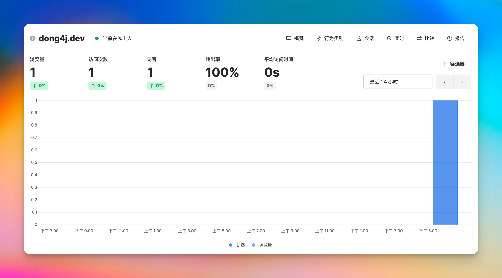
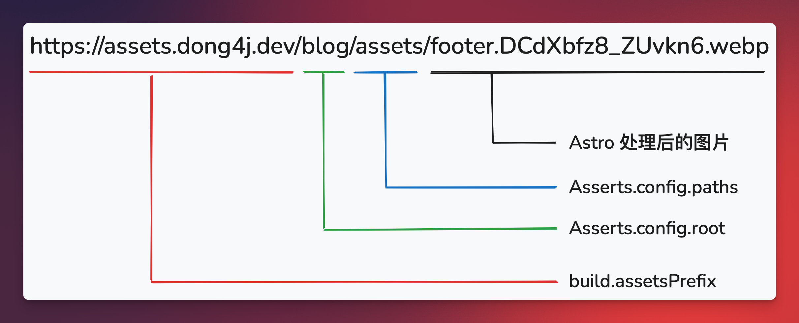
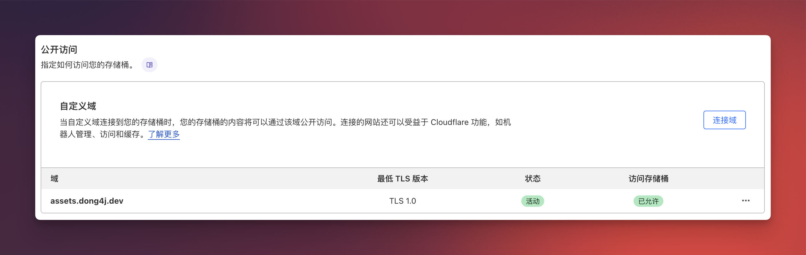
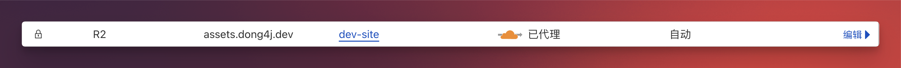

import Collapsible from '@components/ui/Collapsible.astro'

## 简介

Hexo 是一个很强大的博客框架, 第三方插件足够丰富, 即使没有写过代码的人也能借助 AI 开发一款插件来满足自己的需求.

我有一个 [主站](https://blog.dong4j.site) 就运行着 Hexo, 我为它搭建了各种各样的服务, 比如 Twikoo, Umami, img2color, Dify, GeoIP2 等等, 功能已经非常全面了, 而且足够花哨.

所以现在的问题是主站越来越复杂, 打开速度太慢了, 而且大量服务由家里的 HomeLab 提供, 不能保证稳定性.

因此我想找一个足够简单且依赖少的框架来搭建一个全新的博客栏目, 不依赖家中的 HomeLab, 服务全部使用外部托管, 最重要的是免费.

另外一点是如何权衡 2 个博客的输出物.  [主站](https://blog.dong4j.site) 记录了大量我折腾的硬件和服务, 但是作为一个开发者, 专业知识的记录却不多, 所以我想要一个全新的博客来记录专业领域的知识.

为此我购买了 **dong4j.dev** 这个带了 developer 属性的域名, 它将作为我全新博客的主域名, 且也代表我个人, 一个热爱编程, 永远保持着一个开发者对新技术, 新领域持续学习的态度的标签, 持续输出有价值的内容, 也计划将此博客的内容输出到公众号上, 让更多的人了解我, 也去认识更多志同道合的朋友.

## 选择

**dong4j.dev** 域名从 Cloudflare 购入, 为了白嫖到底, 打算也使用 Cloudflare 的 Pages 和 R2 服务, 这样只需要在本地编写并提交到 GitHub, 其他全部又 Cloudflare 接管, 省去了很多额外的服务搭建成本.

带着这个目的去找了几个开源的轻量级博客项目:

- [NextMe](https://github.com/hamster1963/NextMe)
- [erdaltoprak.com](https://github.com/erdaltoprak/erdaltoprak.com)
- [gblog](https://github.com/godruoyi/gblog)

### NextMe

NextMe 是我在自托管哪吒面板时发现的, 他也是哪吒面板 V1 官方主题的作者.



NextMe 的风格我非常喜欢, 所以我浏览了此作者的其他项目, 比如 [Next-Mini-Chat](https://github.com/hamster1963/Next-Mini-Chat) 和 [HomeDash](https://github.com/hamster1963/HomeDash), 都是非常优秀的开源项目, 且我在主站同样部署了一个 [Mini-Chat](https://chat.dong4j.site/), 可以免费 AI 对话.

### erdaltoprak.com

这个是在我开发 [hexo-plugin-llmstxt](https://blog.dong4j.site/posts/b902d8fd.html) 插件时, 翻阅资料看到的一个国外开源的博客, 同样也很简洁:



问题是有点 *太简洁* 了, 很多基础功能还没有, 且作者应该没有维护此项目了.

### gblog

这个开源项目是我在浏览 [Astro 中文网站 Showcase](https://astro-cn.com/) 发现的, 虽然简单, 但是基础功能基本上都有, 且 UI 是我喜欢的类型:



所以本站将基于 [gblog](https://github.com/godruoyi/gblog) 来改造, 并开始我的 2025 年的新征程.

## 如何配置

在 [如何快速搭建自己的博客网站](https://godruoyi.com/posts/how-to-build-your-blog/) 一文中作者详细介绍了如何基于 gblog 来搭建出自己的博客, 我也是基于此来搭建的, 不过期间还是会遇到一些问题, 所以下面会对上文做一个补充, 将原文中没有详细描述的细节展开一下.

### 项目文件结构分析

#### 配置文件
```
├── .editorconfig         # 编辑器配置文件,统一代码风格
├── .env                  # 环境变量配置文件
├── .env.example          # 环境变量示例文件
├── .gitignore            # Git忽略文件配置
├── .npmrc                # NPM配置文件
├── astro.config.mjs      # Astro框架配置文件
├── eslint.config.js      # ESLint代码检查配置
├── package.json          # 项目依赖和脚本配置
├── tailwind.config.js    # Tailwind CSS配置文件
├── tsconfig.json         # TypeScript配置文件
├── vite.config.ts        # Vite构建工具配置文件
└── LICENSE               # 项目许可证文件
```

#### 目录结构

```
├── scripts/
│   └── db_to_md.js       # 数据库内容转换为Markdown的脚本
│
├── src/
│   ├── components/       # 组件目录
│   │   ├── blog/         # 博客相关组件
│   │   ├── support/      # 支持性组件(分析、评论等)
│   │   └── ui/           # UI组件(按钮、图标等)
│   │
│   ├── config.ts         # 站点配置文件
│   └── support/          # 工具函数目录
│
└── public/vendor/        # 第三方库文件
```

<Collapsible title="其他说明">

#### 主要组件说明
- BlogCard: 博客卡片展示组件
- BlogCategory: 博客分类组件
- BlogComments: 评论系统组件(基于Giscus)
- BlogTOC: 文章目录组件
- Header/Footer: 页面头部和底部组件
- GoogleAnalytics: Google分析集成
- UmamiAnalytics: Umami分析集成

#### 技术栈

1. **前端框架**
   - Astro (主框架)
   - React (组件库)

2. **样式解决方案**
   - Tailwind CSS
   - PostCSS

3. **语言**
   - TypeScript
   - JavaScript

4. **构建工具**
   - Vite
   - ESBuild

5. **开发工具**
   - ESLint (代码检查)
   - Prettier (代码格式化)

6. **数据库**
   - MySQL (用于博客内容存储)

7. **内容管理**
   - MDX (Markdown增强)
   - Sharp (图片处理)

8. **分析和监控**
   - Google Analytics
   - Umami Analytics

9. **其他功能**
   - RSS Feed
   - Sitemap
   - SEO优化
   - 评论系统 (Giscus)
   - 图片优化
   - 暗色模式
   - S3存储集成

</Collapsible>


### config.ts

最主要的配置文件为 `src/config.ts`, 这个文件中可以配置:

- 站点的核心配置文件
- 定义网站的基本信息（标题、描述、作者等）
- 配置导航链接、页脚链接
- 设置 SEO 相关参数
- 配置第三方服务（评论系统、分析工具等）

#### Umami

默认只能配置 website-id:

```javascript
UmamiAnalytics: {
    enable: false,
    dataWebsiteID: 'bf63658a-9418-4f39-a6a1-5a0cedb6e429',
}
```

而 Umami 的完整配置为:

```bash
<script defer src="umami.self.js" data-host-url="xxxx" data-website-id="xxxx"></script>
```

所以需要修改 `src/components/support/UmamiAnalytics.astro` 文件:

```javascript
---
import { Settings } from '@/config'

const ID = Settings?.UmamiAnalytics?.dataWebsiteID
+ const JS_SRC = Settings?.UmamiAnalytics?.jsSrc
+ const HOST = Settings?.UmamiAnalytics?.host
const enable = Settings?.UmamiAnalytics?.enable
---

{
    enable && (
				- <script defer src="https://cloud.umami.is/script.js" data-website-id=`${ID}`></script>
        + <script defer src=`${JS_SRC}` data-website-id=`${ID}` data-host-url=`${HOST}`></script>
    )
}
```

然后修改 `config.ts`配置:

```javascript
UmamiAnalytics: {
    - enable: false,
    + enable: !!(import.meta.env.UMAMI_ENABLE) || !!process.env.UMAMI_ENABLE,
    dataWebsiteID: (process.env.UMAMI_ID ?? import.meta.env.UMAMI_ID) as string,
    + jsSrc: (process.env.UMAMI_SRC ?? import.meta.env.UMAMI_SRC) as string,
    + host: (process.env.UMAMI_HOST ?? import.meta.env.UMAMI_HOST) as string,
}
```

添加环境变量(`.env`):

```
UMAMI_ENABLE=true
UMAMI_ID=xxx
UMAMI_SRC=xxxx
UMAMI_HOST=xxx
```




至此我们可以通过 [dong4j.dev 的 umami 统计链接](https://umami.dong4j.dev/share/6ueOKyRmy76LZjZu/dong4j.dev) 匿名查看此站点的访问统计数据(此链接使用了 Cloudflare CDN 代理, 国内访问有点慢).


<Collapsible title="Astro 组件写法说明">

**基本结构**

Astro 组件通常包含三个部分，使用 `---` 分隔：

```astro
---
// 1. 组件脚本部分 (类似 frontmatter)
// 这里可以导入其他组件、定义变量、编写 TypeScript 代码
import { Settings } from '@/config'

// 定义组件的 props 接口
interface Props {
    title: string;
}

// 获取 props
const { title } = Astro.props;
---

<!-- 2. 组件模板部分 -->
<div>
    <!-- 使用变量 -->
    <h1>{title}</h1>
    <!-- 条件渲染 -->
    {condition && <p>Conditional content</p>}
    <!-- 循环渲染 -->
    {items.map(item => <div>{item}</div>)}
</div>

<script>
// 3. 客户端脚本部分（可选）
// 这里的代码会在浏览器中执行
</script>
```

**特殊指令**

1. **客户端脚本类型**:
```astro
<script is:inline>
    // 直接内联到 HTML 中
</script>

<script>
    // 会被打包和处理
</script>
```

2. **定义变量**:
```astro
---
const name = "Astro";
---
<h1>Hello {name}</h1>
```

3. **条件渲染**:
```astro
---
const showTitle = true;
---
{showTitle && <h1>Title</h1>}
```

4. **循环渲染**:
```astro
---
const items = ['A', 'B', 'C'];
---
{items.map(item => <li>{item}</li>)}
```

**常用功能**

1. **Props 定义**:
```astro
---
interface Props {
    title: string;
    description?: string;
}

const { title, description = 'Default' } = Astro.props;
---
```

2. **样式处理**:
```astro
---
// 导入样式
import '../styles/main.css';
---
<div class:list={['base', { active: isActive }]}>
```

3. **插槽使用**:
```astro
---
// 组件定义
---
<div>
    <slot /> <!-- 默认插槽 -->
    <slot name="footer" /> <!-- 具名插槽 -->
</div>
```

4. **动态属性**:
```astro
---
const buttonType = "submit";
---
<button type={buttonType}>Submit</button>
```
</Collapsible>

#### Giscus

这个参考 [官方文档](https://giscus.app/zh-CN) 一步步操作即可, 一次成功, 没有啥难度, 

#### R2 配置

`src/config.ts` 配置如下:

```
Assets: {
    uploadAssetsToS3: !!(import.meta.env.S3_ENABLE) || !!process.env.S3_ENABLE,
    config: {
        paths: ['assets'],
        endpoint: (process.env.S3_ENDPOINT ?? import.meta.env.S3_ENDPOINT) as string,
        bucket: (process.env.S3_BUCKET ?? import.meta.env.S3_BUCKET) as string,
        accessKey: (process.env.S3_ACCESS_KEY ?? import.meta.env.S3_ACCESS_KEY) as string,
        secretAccessKey: (process.env.S3_SECRET_ACCESS_KEY ?? import.meta.env.S3_SECRET_ACCESS_KEY) as string,
        root: 'blog',
    }
}
```

作用是将 `paths` 下的文件全部上传到兼容 S3 的对象存储服务器, 此站点的大部分服务由 Cloudflare 提供, 包括兼容 S3 协议的 R2 对象存储服务.

我的 `astro.config.mjs` 配置如下:

```javascript
  ...  
	build: {
        assets: 'assets',
        assetsPrefix: (!!import.meta.env.S3_ENABLE || !!process.env.S3_ENABLE) ? 'https://assets.dong4j.dev/blog' : '',
    },
})
```

结合 `src/config.ts` 配置解释一下:



所以很好理解了吧:

1. `src/config.ts` 配置 S3 API 的基础信息, 最重要的是 `root` 和 `paths`, 会自动拼接资源路径: `/${root}/${path}`(如果 `paths` 配置多个, 就表示将对应路径下的文件上传到 S3);
2. `astro.config.mjs` 中的 build 配置打包后资源文件的输出路径, 以及生产环境的资源文件的访问路径前缀;

其中 `assets.dong4j.dev` 为自定义域名, 这个需要在 Cloudflare 上创建 R2 存储桶后配置:


原理就是通过 `CNAME` 将域名代理到 R2 的存储服务:



> dev-site 是我存储桶的名称.

**参考**:

- [Astro DOCS: build.assets](https://docs.astro.build/en/reference/configuration-reference/#buildassets)
- [astro-uploader](https://github.com/syhily/astro-uploader)

## 如何部署

在 Cloudflare Pages 上部署 Astro 非常简单, 完成第一部署后, 后面只需要提交到 Github 即可自动部署, 相关教程可以看 [如何快速搭建自己的博客网站](https://godruoyi.com/posts/how-to-build-your-blog/), 已经非常详细. 

唯一不同的是我只有一个 main 分支, 所以直接使用此分支部署即可, 省去了多分支管理的麻烦(KISS 原则要用起来 🙉).

## 待补充


## 参考
- [如何复刻本网站，零氪快速建博客 | Cali Castle](https://cali.so/blog/guide-for-cloning-my-site)
- [Download Node.js](https://nodejs.org/en/download/prebuilt-installer)
* [Download Git](https://git-scm.com/downloads)
* [Markdown 教程](https://www.markdowntutorial.com/zh-cn/)
* [如何在 Windows 10 中打开命令提示符](https://www.freecodecamp.org/chinese/news/how-to-open-the-command-prompt-in-windows-10-how-to-open-command-prompt-as-an-administrator/)
* [在 Mac 上的“终端”中执行命令和运行工具](https://support.apple.com/zh-cn/guide/terminal/apdb66b5242-0d18-49fc-9c47-a2498b7c91d5/mac)
* [Git Guides](https://github.com/git-guides)
* [Preline UI](https://preline.co/)
* [ScrewFast 项目](https://github.com/mearashadowfax/ScrewFast)
* https://github.com/syhily/astro-uploader
