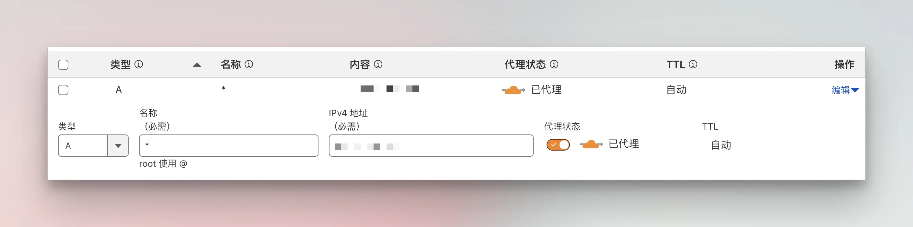
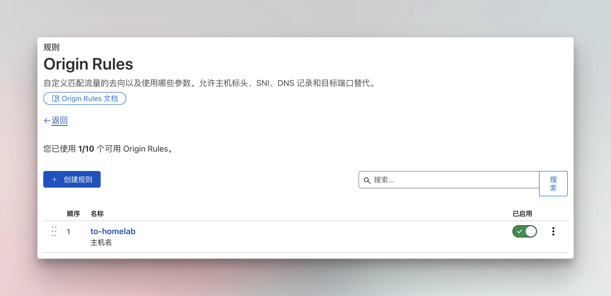
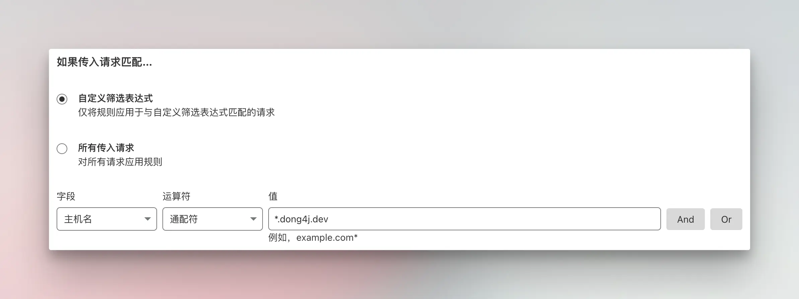
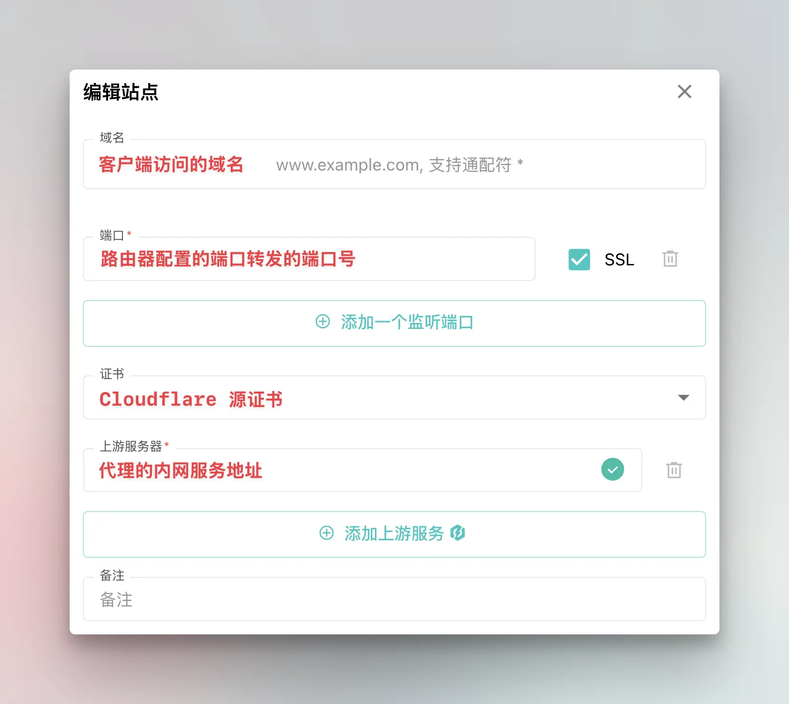
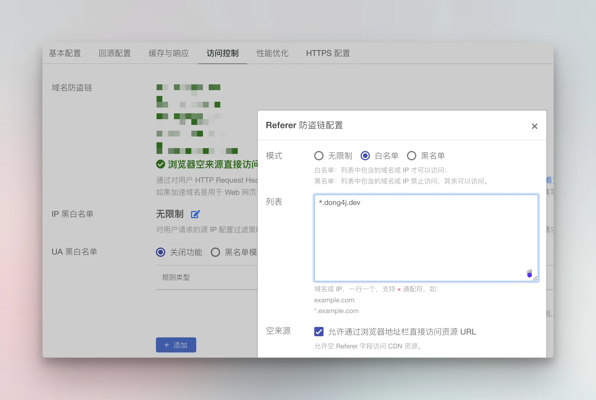

## 前言

上一篇 [使用 Cloudflare 增强公网服务安全性的实践](/posts/cloudflare-proxy/) 里，我只是拿 NAS 当例子跑了一遍 Cloudflare 的代理流程，证明"这条路是通的"。

真正用了一段时间之后，我发现一个尴尬的事实：家里暴露在公网的服务不止 NAS 一个，博客、图床、私有 Git、各种管理面板加起来十来个子域名，每个都"单独配一套"的话，免费账户的规则数量根本不够用 —— **Origin Rules 免费版只有 10 条**。

更重要的是，只要还有一个服务没走 Cloudflare，别人用 `dig` 或者挨个域名试一下就能挖出我真实的公网 IP，那前面那点安全努力基本等于白做。

所以这次干脆一次到位：**把 `*.dong4j.dev` 全部塞进 Cloudflare CDN，入口只留一个，规则也只留一条。**

顺便还踩了两个跨域的小坑，一起记一下。

---

## 目标和思路

先说下我想达成的效果：

- 家里所有对外暴露的服务都走 `*.dong4j.dev` 这一套子域名；
- 所有子域名全部经过 Cloudflare CDN 代理（小云朵是橙色的）；
- 用户用浏览器直接访问 `https://blog.dong4j.dev`、`https://nas.dong4j.dev` 这种"不带端口"的地址就能用；
- **Origin Rules 只占一条**，不要一个子域名消耗一条。

整体路径差不多是这样：

```
用户 → Cloudflare CDN (443) → 家里公网 IP:1000 → 雷池 WAF → 内网真实服务
```

关键点在于：Cloudflare 只代理 [80/443/8443/2053 等固定端口](https://developers.cloudflare.com/fundamentals/reference/network-ports/)，而我家里所有服务是统一收口在雷池 WAF 的 `1000` 端口上的。所以必须让 Cloudflare 在"回源"那一步，把用户访问的 `443` 改写成我的 `1000`，这就要靠 **Origin Rules**。

## Cloudflare 配置

### 第一步：泛域名 DNS 记录

这一步其实是整个方案能省规则的关键。

以前我是每加一个服务就去手动加一条 A 记录。现在直接加一条 `*.dong4j.dev` 的泛解析，以后再新开子域名完全不用动 Cloudflare：



> 注意小云朵必须是**橙色**的（已代理），灰色（仅 DNS）那真实 IP 就裸奔了，等于没做。

### 第二步：一条 Origin Rules 搞定端口改写



免费版只能用 10 条 Origin Rules，看着不少，但我之前每个服务都单独写一条，很快就吃紧了。

这次我换成了基于泛域名的匹配表达式，**一条规则覆盖所有 `*.dong4j.dev`**：



具体含义就一句话：只要访问 `*.dong4j.dev`，回源到我家的真实 IP 时，就把目标端口改写成 `1000`。

这样做最爽的一点是：以后再加子域名，Cloudflare 这边一个字都不用改，直接在家里的雷池 WAF 里加一条反向代理就行了。

### 第三步：雷池 WAF 反向代理

Cloudflare 把流量打到雷池 WAF 的 `1000` 端口，接下来就是雷池根据 `Host` 头判断到底是哪个服务：



每个子域名在这里配一条反代，指向内网真实的服务 IP:PORT。这部分就是纯 Nginx 反代的玩法，没什么特别的。

到这一步，**不带端口**访问 `https://xxx.dong4j.dev` 已经能正常工作，而且 `dig` 出来看到的全是 Cloudflare 的 IP，真实公网 IP 被藏得干干净净。

---

## 跨域踩坑

换到 Cloudflare CDN 之后，浏览器里马上就有几个服务开始报 CORS 错误。想想也正常：请求的域名、Referer、甚至源 IP 都变了，之前基于"内网直连"或者"同域"的那些假设全部不成立。

### 坑 1：雷池 WAF 的 CORS 配置

我想做的事情很简单：**只要 Origin 是 `*.dong4j.dev` 的，都允许跨域**。

但是雷池 WAF 管理的 Nginx 有两个反人类的设计：

1. `nginx.conf` 文件默认被 `chattr +i` 锁住了，直接改会提示 Permission denied；
2. 即使你改了，过一会儿雷池后台会把它"纠正"回来。

所以得先解锁文件：

```bash
chattr -i nginx.conf
```

然后在 `http` 段里加一个 `map`，用来根据 Origin 动态决定返回什么跨域头：

```nginx
http {
    ...
    # 按 Origin 决定是否允许跨域：只信任 *.dong4j.dev
    map $http_origin $cors_header {
        default "";
        ~^https://.*\.dong4j\.dev$ $http_origin;
    }
    ...
}
```

改完**一定记得再锁回去**，不然雷池还会把它改掉：

```bash
chattr +i nginx.conf
```

> ⚠️ 这个 `chattr +i` 是我被雷池静默覆盖配置坑了两次之后才摸到的套路。第一次改完以为搞定了，结果过了半天服务又开始报 CORS，看了下 `nginx.conf` 发现我的 `map` 段被吃掉了……才明白雷池会定期 reconcile 自己的配置。

接下来在需要跨域的那个站点的 `server` 段里，用刚才的 `$cors_header` 变量返回响应头：

```nginx
# 动态返回 CORS 头，只给白名单里的 Origin 授权
add_header 'Access-Control-Allow-Origin'  $cors_header always;
add_header 'Access-Control-Allow-Methods' 'GET, POST, OPTIONS' always;
add_header 'Access-Control-Allow-Headers' 'DNT,X-CustomHeader,Keep-Alive,User-Agent,X-Requested-With,If-Modified-Since,Cache-Control,Content-Type,Authorization' always;
```

为什么不直接写 `Access-Control-Allow-Origin *`？因为我这里有带 Cookie 的接口，带 `*` 的话浏览器会直接拒绝；**必须是具体的 Origin**。用 `map` 动态匹配既安全，又省得每个子域名写一遍。

### 坑 2：多吉云的 Referer 防盗链

博客用的是多吉云做图床，之前配的 Referer 白名单是我的博客直出域名。

走了 CDN 之后，有些资源请求的 Referer 变成了 `https://xxx.dong4j.dev`，图床那边直接 403。

解法很朴素，把多吉云的防盗链白名单补上新域名就好：



这个坑特别隐蔽的地方是：**图片不加载不会报错，就是白板**。我是打开控制台看到一片 403 才反应过来。

---

## 最后聊两句

改完之后最直观的两个收益：

1. **真实公网 IP 藏得彻底**：现在 `dig` 任何子域名出来的都是 Cloudflare 的 IP，我家宽带那个公网 IP 对外基本不可见；
2. **再加服务零成本**：以后新开一个服务，只在雷池 WAF 里加条反代就行，Cloudflare 的 DNS、Origin Rules 都不用动。

有一点小遗憾是：因为所有流量都要经过 Cloudflare，国内访问延迟比直连内网会多一跳，偶尔还会被抽到比较差的节点。不过考虑到这些服务本来也不是给自己用的日常服务（那些都走 WireGuard 走局域网），这点损耗完全可以接受。

如果你也在折腾 HomeLab 把东西往公网丢，强烈建议至少做到两点：

- 真实 IP 不要直接暴露，哪怕不用 Cloudflare，也得用个反代中转一下；
- 出口统一收口到一个 WAF（雷池 / Nginx / Traefik 都行），再往下分流，不然以后维护会很痛苦。

---

**参考**：

- [使用 Cloudflare 增强公网服务安全性的实践](/posts/cloudflare-proxy/)
- [Cloudflare Origin Rules 文档](https://developers.cloudflare.com/rules/origin-rules/)
- [Cloudflare 支持的端口列表](https://developers.cloudflare.com/fundamentals/reference/network-ports/)
