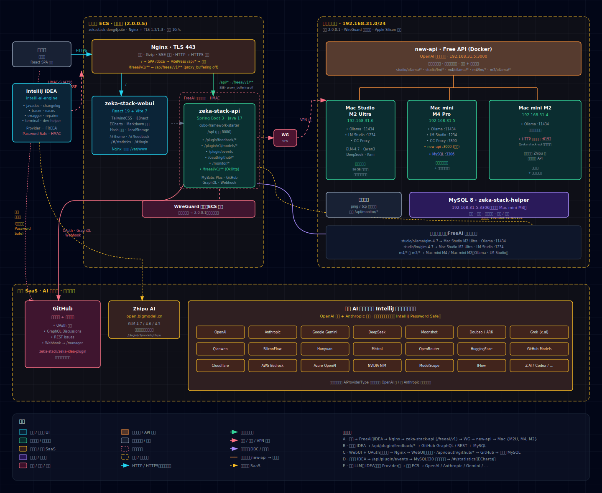
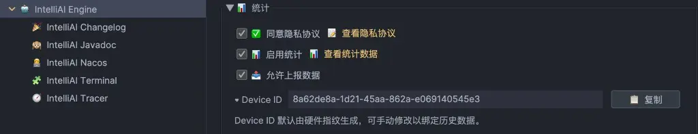
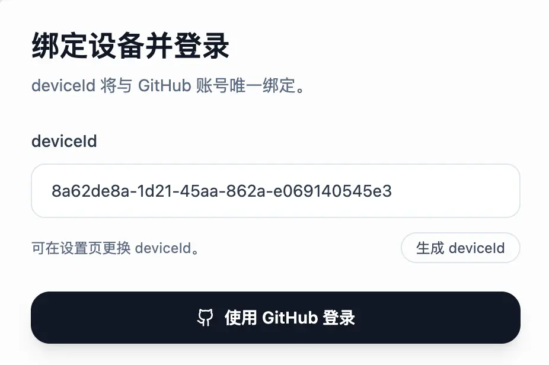
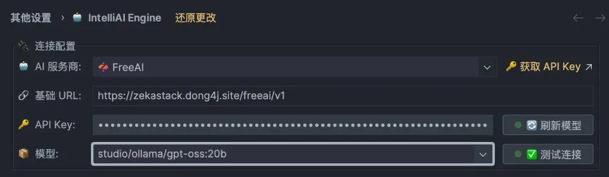

## 缘起：一根涨价的内存条

前段时间 DDR 内存又开始涨价。不是那种温吞吞的 5%、10%，是肉眼可见的"今天不买，明天再贵 15%"的涨法。我盯着家里那台常年挂在客厅角落的 x86 服务器看了一会儿：48G 内存、二手 Intel U、跑着几个不痛不痒的小服务，功耗一天十几度电。

算了下账：

- 这台服务器里的内存、硬盘、平台，按现在的行情出掉正好能贴一台 **Mac Studio M2 Ultra** 的钱；
- 一台 Mac Studio 的待机功耗不到原服务器的三分之一；
- 更关键的是，M2 Ultra 能跑 32B / 70B 的大模型，我那台 x86 不行。

于是冲动下单了。拆机、清灰、寄出、到款、拿新机，全流程一周搞定。

拆完之后盘点了一下现状，家里现在一共有 3 台 Mac：

| 机器 | 用途 | 大致算力 |
| :----: | :----: | :----: |
| Mac Studio M2 Ultra（新到） | 主力推理 | 24 核 GPU，70B 级别量化模型能流畅跑 |
| Mac mini M4 Pro | 常驻开发 + 备用推理 | 7B–32B 小模型毫无压力 |
| Mac mini M2 | 跑各种乱七八糟的小服务 | 3B–7B 够用 |

三台里面总有两台处于闲置状态，24 小时开机又不忙。于是就冒出了这篇文章要讲的事：

> 既然闲着也是闲着，不如把这堆算力串起来，跑点小模型，免费给 IntelliAI 相关插件的用户用。

这就是 **FreeAI** 服务的由来，也是 IntelliAI Engine 里那个默认 Provider 的来历。

---

## 整体架构：Homelab 安全区 + 公网代理 + 插件客户端

先看一张简化版的架构图。实时可视化大屏可以在插件主页点「Engine Monitor」看到，URL 是 `https://zekastack.dong4j.site/#/plugins/engine/monitor`。

```text
┌────────────────┐        ┌─────────────┐        ┌──────────────────────────────────────────┐
│  Zeka Engine   │  →→→   │ Public Cloud│  →→→   │           Homelab :: Secure Zone         │
│ (IDEA Plugin)  │        │   入口节点    │        │                                          │
└────────────────┘        └─────────────┘        │  ┌────────────┐   ┌────────────────────┐  │
                                                 │  │  AI Proxy  │ → │ Mac Studio M2 Ultra│  │
                                                 │  │  (Gateway) │   │  CC / LM / Ollama  │  │
                                                 │  └────────────┘   └────────────────────┘  │
                                                 │        ↓          ┌────────────────────┐  │
                                                 │                   │ Mac mini M4 Pro    │  │
                                                 │                   │  CC / LM / Ollama  │  │
                                                 │                   └────────────────────┘  │
                                                 │                   ┌────────────────────┐  │
                                                 │                   │ Mac mini M2        │  │
                                                 │                   │  Ollama            │  │
                                                 │                   └────────────────────┘  │
                                                 │                   ┌────────────────────┐  │
                                                 │                   │ Free API (Docker)  │  │
                                                 │                   └────────────────────┘  │
                                                 └──────────────────────────────────────────┘
```

拆解一下这几层：

- **插件端（Zeka Engine）**：IDE 里的入口，统一管理 Provider、API Key、上下文、流式响应。上层插件（Javadoc、Changelog、Terminal、Tracer、Repairer、Swagger、Nacos）都经由它调用模型。
- **公网入口（Public Cloud）**：只暴露一个域名，做 TLS 卸载、基础鉴权、限流。API Key 绑定到 deviceId，防止被批量盗刷。
- **家里的代理（AI Proxy / Gateway）**：路由、负载均衡、模型路径映射。它知道 `studio/ollama/glm-4.7` 应该打到 Mac Studio 上的 Ollama，而 `studio/lm/glm-4.7` 要打到 LM Studio。
- **算力层（Compute）**：三台 Mac 一台容器。每台机器上都装了 Ollama 和 LM Studio，部分机器还挂了 CC Proxy，用来做 Claude Code 相关的转发。

这样拆的好处有三个：

1. 公网只暴露一个入口，家里 NAT 后面的机器完全不对外，安全边界清晰；
2. 单机出问题可以按机器级别摘除，不影响整体可用性；
3. 对外 API 始终是一个稳定的 OpenAI 兼容协议，模型路径只是 string，可以随时切换后端。

实时运行状态可以在监控大屏看到，每 5 秒刷新一次，每个节点都有一条 40 点的可用性时间轴。一眼就能看出某台机器是不是又卡死了（你懂的，Ollama 偶尔会）。

---

**完整架构图**



---

## 能做什么：插件矩阵与默认 Provider

### 消费侧：Zeka Engine 生态插件

IntelliAI Engine 本身是基础设施，真正好玩的是跑在它上面的这几个插件：

- **IntelliAI Javadoc**：选中类/方法，一键生成符合项目规范的 Javadoc
- **IntelliAI Changelog**：分析 git 提交差异，自动生成 commit / release note
- **IntelliAI Terminal**：终端 AI 助手，自然语言生成命令
- **IntelliAI Tracer**：调用链 / 数据流分析可视化
- **IntelliAI Repairer**：按 Checkstyle / SonarLint 规则自动修 Bug
- **IntelliAI Swagger**：基于接口定义自动补 Swagger 注解
- **IntelliAI Nacos**：在 IDEA 里操作 Nacos 配置，支持 AI 解释配置项含义

它们共用 Engine 里的同一份 Provider 配置，配一次，全线打通。

### 提供侧：FreeAI 默认配置

懒得配 Key 的话，直接选 FreeAI 就可以用：

| 配置项 | 值 |
| :----: | :----: |
| AI 服务商 | `FreeAI` |
| Base URL | `https://zekastack.dong4j.site/freeai/v1` |
| 协议 | OpenAI 兼容 |
| 默认模型 | `studio/ollama/glm-4.7`、`studio/lm/glm-4.7` |
| Key 来源 | 本站登录后自动分配 |

目前跑的主力是 GLM-4.7 的量化版，后续会按机器负载和反馈调整模型清单。

### 自备 Key 也完全没问题

FreeAI 不是唯一选项，IntelliAI Engine 同时支持：

- **OpenAI 兼容阵营**：OpenAI、DeepSeek、Moonshot、Qwen、SiliconFlow、OpenRouter、HuggingFace、NVIDIA
- **Anthropic 阵营**：Claude 3.5 Sonnet / 3 Opus / 3 Haiku、Bedrock、Vertex AI
- **本地 & 私有**：Ollama、LM Studio、LocalAI、vLLM、GPT4All

插件里会按分组展示，选谁看心情和钱包。

---

## 快速接入：4 步走

下面是最关键的部分，怎么把 FreeAI 跑起来。全程 4 步，一两分钟就好。

### Step 1. 从插件拿到你的 deviceId

打开 IDEA 设置，进入 `Tools → IntelliAI Engine`，展开「统计」区块：



这里的 `Device ID` 默认由硬件指纹生成，点「复制」按钮拷到剪贴板。

> 小贴士：换机器后想继承历史数据，可以手动把 deviceId 改成旧机器的，老账号的配额会跟着过来。

### Step 2. 在本站用 deviceId 登录

浏览器打开 [`https://zekastack.dong4j.site/#/login`](https://zekastack.dong4j.site/#/login)：



把刚才复制的 deviceId 粘进输入框，点「使用 GitHub 登录」。第一次登录会走一遍 GitHub OAuth 授权，只申请 `read:user` 权限，读你的昵称和邮箱，不动你的仓库。

授权完成后会自动跳到账号设置页。

### Step 3. 复制分配给你的 API Key

账号设置页会显示一串 `FREEAI API Key`：


点右侧小按钮复制。Key 有有效期，当前是 1 个月，过期后回这个页面重新取就行。

### Step 4. 回插件填 Key，开始用

回到 IDEA 的 `IntelliAI Engine` 设置：



- **AI 服务商**：下拉选 `FreeAI`
- **基础 URL**：自动填好 `https://zekastack.dong4j.site/freeai/v1`，不用改
- **API Key**：粘贴刚才复制的 Key
- **模型**：先用默认的 `studio/ollama/gpt-oss:20b` 或 `studio/ollama/glm-4.7` 就行
- 点「刷新模型」拉取最新模型列表，再点「测试连接」，绿灯即成功

到这里就完事了。打开任意一份 Java 文件，`Alt+Enter` 或 `Cmd+Shift+D` 试一下 IntelliAI Javadoc，能看到模型返回就说明整条链路通了。

---

## 使用注意与常见问题

### 这个 Key 能不能拿去别的项目用？

**不能。** 为了控制免费算力的流量，`zekastack.dong4j.site/freeai/v1` 只开放给 IntelliAI Engine 插件使用。网关层会校验客户端特征，用 curl 直接打会被拦掉。

如果你想在自己的项目里用 Qwen / GLM：

- 用自己的阿里云 / 智谱 Key
- 或者在本地跑一份 Ollama / LM Studio，插件同样支持

### deviceId 到底是干嘛的？

deviceId 是 Key 的绑定载体。一个 GitHub 账号 + 一个 deviceId 就是一组独立配额。好处有几个：

- 同一个人在两台机器上用，互不影响
- 可以手动指定 deviceId 把配额迁到新机器
- 出问题时，服务端能按 deviceId 精准定位到哪台机器异常

### 限流会限到什么程度？

目前策略偏宽松，基本够日常开发用：

- 每分钟请求数有上限，正常码字碰不到
- 达到上限时返回 429，插件会自动退避重试
- 如果你要跑批量任务（比如一键给整个项目生成 Javadoc），建议切到自备 Key 或本地模型，别把免费额度吃满

### 离线 / 断网怎么办？

直接在插件里切到 Local Ollama 就行。IntelliAI Engine 的 Provider 是热切换的，切完立即生效，不用重启 IDE。

### Mac Studio 顶得住多少并发？

按目前 GLM-4.7 量化版的配置：

- 单轮对话延迟大致在 200ms–1.5s 之间（首 token）
- 并发 10 左右还能正常跑
- 超过之后 AI Proxy 会把多余请求分发到 M4 Pro 作为 fallback

所以你会看到监控大屏上几台机器的流量随时间波动，那就是在做跨机器负载均衡。

---

## 未来规划

这套 Homelab 服务现在已经稳定跑起来了，但能做的还有不少：

- **扩机型**：考虑把早期的 M1 Air 和一台闲置 NAS 塞进来做冷备
- **更多模型**：后续会把 Qwen 2.5、DeepSeek-V3、更大参数的 GLM 加进来，每次变动会在 `#/plugins/engine` 页公示
- **精细限流**：给不同用户等级提供不同配额，赞助过的用户可以有更高优先级
- **可观测面板**：把更多实时指标（QPS、p99、错误率）摆到监控大屏上
- **社区反馈**：插件内的反馈入口欢迎各位提 Bug 和需求

---

## 结语

从被内存条涨价逼着卖服务器，到拆机挣出一台 Mac Studio，再到把闲置算力拼成 IntelliAI Engine 背后的免费大模型服务，整件事推导起来还挺奇妙的。

一台机器会闲，两台机器会闲，三台机器它就得干活。于是这堆 Mac 现在 24 小时都在为一个说不清具体是谁的开发者生成 Javadoc、分析调用链、修 Checkstyle。

如果你也是 IntelliAI 插件的用户，按上面 4 步走一遍就能白嫖这套服务。用得顺手的话来 GitHub 点个 star，踩到 Bug 的话来 issue 区骂我。

- 官网 / 登录入口：<https://zekastack.dong4j.site>
- IntelliAI Engine 插件主页：<https://zekastack.dong4j.site/#/plugins/engine>
- 实时监控：<https://zekastack.dong4j.site/#/plugins/engine/monitor>
- GitHub：<https://github.com/dong4j>

dong4j，写于 Mac Studio M2 Ultra 旁边，风扇几乎听不到。
